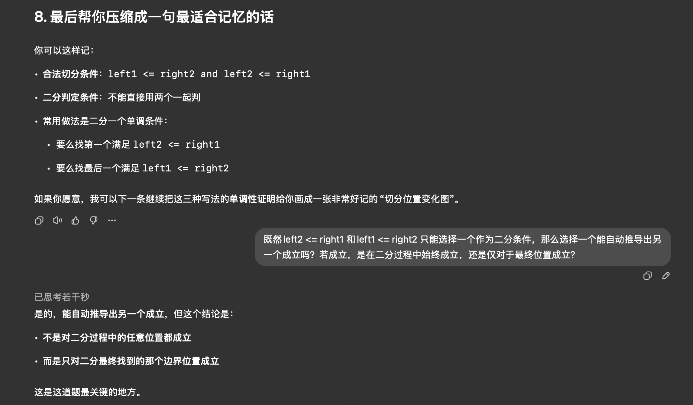
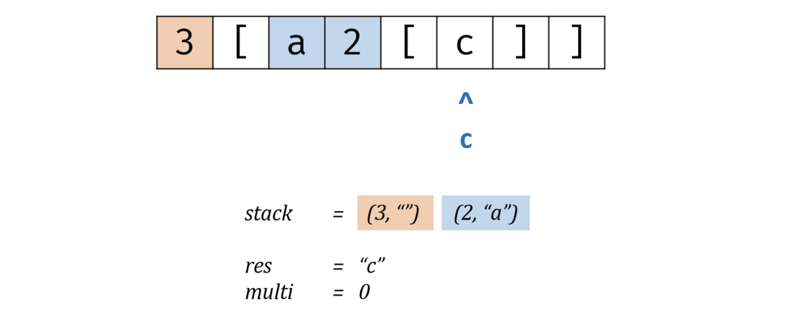

# 哈希

## [两数之和](https://leetcode.cn/problems/two-sum/)(1)

问题：给定一个整数数组 `nums` 和一个整数目标值 `target`，请你在该数组中找出 **和为目标值** *`target`* 的那 **两个** 整数，并返回它们的数组下标。你可以假设每种输入只会对应一个答案，并且你不能使用两次相同的元素。你可以按任意顺序返回答案。

分析：一次遍历 + 哈希表：遍历到 x 时，查找补数 y = target - x 是否已出现；若出现直接返回两者下标，否则记录 x 的下标。

注意：若是有序数组，可以使用相向双指针解决。但排序复杂度为 O(nlogn)，因此只能在三数之和中使用。

复杂度：`O(n)` `O(n)`

```python
class Solution:
    def twoSum(self, nums: List[int], target: int) -> List[int]:
        pos = {}  # value -> index
        for i, x in enumerate(nums):
            y = target - x
            if y in pos:
                return [pos[y], i]
            pos[x] = i
```

## [字母异位词分组](https://leetcode.cn/problems/group-anagrams/)(49)

问题：给你一个字符串数组，请你将 字母异位词 组合在一起。可以按任意顺序返回结果列表。

分析：用哈希表把“同一组异位词”归到同一个 key 下。key 选用 **26 个字母频次向量**（转成 tuple 可哈希），同频次即为同一组异位词。

注意：频次数组必须转成 tuple 才能作为字典 key。比起 ''.join(sorted(s))，频次 key 避免了排序

复杂度：`O(nk)` `O(nk)`

```python
class Solution:
    def groupAnagrams(self, strs: List[str]) -> List[List[str]]:
        groups = defaultdict(list)
        for s in strs:
            cnt = [0] * 26
            for ch in s:
                cnt[ord(ch) - ord('a')] += 1  # ord('a') == 97
            groups[tuple(cnt)].append(s)
        return list(groups.values())
```

## [最长连续序列](https://leetcode.cn/problems/longest-consecutive-sequence/)(128)

问题：给定一个未排序的整数数组 `nums` ，找出数字连续的最长序列（不要求序列元素在原数组中连续）的长度。

分析：用 set 做 O(1) 查找。**只从“连续序列的起点” x-1 不在集合 的元素开始向右扩展**，避免重复扫描每个连续段。

复杂度：`O(n)` `O(n)`

```python
class Solution:
    def longestConsecutive(self, nums: List[int]) -> int:
        s = set(nums)  # 去重
        best = 0
        for x in s:
            if x - 1 not in s:  # 关键剪枝，只从“连续段起点”开始扩展
                y = x
                while y in s:
                    y += 1
                best = max(best, y - x)  # 长度 = 终点(开区间) - 起点
        return best
```

# 双指针

## [验证回文串](https://leetcode.cn/problems/valid-palindrome/)(125)

问题：如果在将所有大写字符转换为小写字符、并移除所有非字母数字字符之后，短语正着读和反着读都一样。则可以认为该短语是一个 **回文串** 。字母和数字都属于字母数字字符。给你一个字符串 `s`，如果它是 **回文串** ，返回 `true` ；否则，返回 `false` 。

分析：用双指针从两端向中间靠拢。遇到非字母数字字符就跳过，遇到有效字符后，转成小写再比较；只要有一对不同，就不是回文串。

复杂度：`O(n)` `O(1)`

```python
class Solution:
    def isPalindrome(self, s: str) -> bool:
        left, right = 0, len(s) - 1
        while left < right:
            while left < right and not s[left].isalnum():  # 遇到非字母数字字符就跳过
                left += 1
            while left < right and not s[right].isalnum():  # 遇到非字母数字字符就跳过
                right -= 1
            if s[left].lower() != s[right].lower():  # 遇到有效字符后，转成小写再比较
                return False
            left += 1
            right -= 1
        return True
```

## [移动零](https://leetcode.cn/problems/move-zeroes/)(283)

问题：给定一个数组 `nums`，编写一个函数将所有 `0` 移动到数组的末尾，同时保持非零元素的相对顺序。**请注意** ，必须在不复制数组的情况下原地对数组进行操作。

分析：双指针：r 扫描数组；l 指向“下一个该放非零”的位置。遇到非零就把它交换到 l，并 l += 1，从而把所有 0 自然挤到后面。

复杂度：`O(n)` `O(1)`

```python
class Solution:
    def moveZeroes(self, nums: List[int]) -> None:
        l = 0  # 下一个非 0 应该放的位置
        for r in range(len(nums)):
            if nums[r] != 0:
                nums[l], nums[r] = nums[r], nums[l]
                l += 1
```

## [盛最多水的容器](https://leetcode.cn/problems/container-with-most-water/)(11)

问题：给定一个长度为 `n` 的整数数组 `height` 。有 `n` 条垂线，第 `i` 条线的两个端点是 `(i, 0)` 和 `(i, height[i])` 。找出其中的两条线，使得它们与 `x` 轴共同构成的容器可以容纳最多的水。返回容器可以储存的最大水量。

分析：双指针分别指向两端，每次移动 `height` 较小的指针，变大时说明有可能增大面积，记出现过的最大面积为 `res`

复杂度：`O(n)` `O(1)`

```python
class Solution:
    def maxArea(self, height: List[int]) -> int:
        l, r, res = 0, len(height) - 1, 0
        while l < r:  # 每次移动高度较小的指针，直至变大，因为这样才有可能增大面积
            if height[l] < height[r]:
                res = max(res, (r - l) * height[l])  # 更新当前最大面积
                l += 1
            else:
                res = max(res, (r - l) * height[r])
                r -= 1
        return res
```

## [两数之和 II - 输入有序数组](https://leetcode.cn/problems/two-sum-ii-input-array-is-sorted/)(167)

问题：给你一个下标从 **1** 开始的整数数组 `numbers` ，该数组已按 **非递减顺序排列** ，请你从数组中找出满足相加之和等于目标数 `target` 的两个数。如果设这两个数分别是 `numbers[index1]` 和 `numbers[index2]` ，则 `1 <= index1 < index2 <= numbers.length` 。以长度为 2 的整数数组 `[index1, index2]` 的形式返回这两个整数的下标 `index1` 和 `index2`。你可以假设每个输入 **只对应唯一的答案** ，而且你 **不可以** 重复使用相同的元素。你所设计的解决方案必须只使用常量级的额外空间。

分析：数组有序，使用相向双指针：如果两数之和小于 target，说明需要更大，左指针右移；大于 target，说明需要更小，右指针左移

复杂度：`O(n)` `O(1)`

```python
class Solution:
    def twoSum(self, numbers: List[int], target: int) -> List[int]:
        left, right = 0, len(numbers) - 1
        while left < right:
            s = numbers[left] + numbers[right]
            if s == target:
                return [left + 1, right + 1]
            if s < target:  # 如果两数之和小于 target，说明需要更大，左指针右移
                left += 1
            else:           # 如果两数之和大于 target，说明需要更小，右指针左移
                right -= 1
```

## [三数之和](https://leetcode.cn/problems/3sum/)(15)

问题：给你一个整数数组 `nums` ，判断是否存在三元组 `[nums[i], nums[j], nums[k]]` 满足 `i != j`、`i != k` 且 `j != k` ，同时还满足 `nums[i] + nums[j] + nums[k] == 0` 。请你返回所有和为 `0` 且不重复的三元组。**注意：**答案中不可以包含重复的三元组。

分析：枚举 `i`，将问题转化为两数之和为 `nums[i]`，为了使用相向双指针，需要先对 `nums` 排序

* **顺序不重要，那么就规定一个顺序 `i < j < k`，保证不重复**（否则有 `6` 种顺序）
* 不包含重复三元组：如果当前 `nums[i]` 和上一个数 `nums[i - 1]` 相同，直接跳过 `continue`（每找到一个三元组，需要对 `j` 和 `k` 做同样的检查与跳过操作）
* 优化1：若 `nums[i] + nums[i + 1] + nums[i + 2] > 0`，表明当前 `nums[i]` 和后续最小的两个值加起来都大于目标值 `0`，那么后续 `i, j, k` 的枚举只会越来越大，故已不存在满足要求的三元组，直接退出循环返回答案
* 优化2：若 `nums[i] + nums[n - 2] + nums[n - 1] < 0`，表明当前  `nums[i]` 和后续最大的两个值加起来都小于目标值 `0`，那么无论 `j, k` 怎么取值都会小于 `0`，故当前 `i` 值太小，可直接 `continue` 枚举下一个 `i`

复杂度： `O(n`^2^`)` `O(1)`

```python
class Solution:
    def threeSum(self, nums: List[int]) -> List[List[int]]:
        nums.sort()  # 顺序不重要，那么就规定一个顺序 i < j < k
        ans = []
        n = len(nums)

        for i in range(n - 2):  # 需要留两个位置给 j,k 故枚举到 n-2
            x = nums[i]
            if i > 0 and x == nums[i - 1]:  # 针对i跳过重复的三元组
                continue
            if x + nums[i + 1] + nums[i + 2] > 0:  # 优化一
                break
            if x + nums[n - 2] + nums[n - 1] < 0:  # 优化二
                continue

            j, k = i + 1, n - 1  # 定义双指针从两端向中间移动
            while j < k:
                s = x + nums[j] + nums[k]
                if s > 0:  # 右指针向左移动
                    k -= 1
                elif s < 0:  # 左指针向右移动
                    j += 1
                else:
                    ans.append([x, nums[j], nums[k]])
                    j += 1
                    while j < k and nums[j] == nums[j - 1]:  # 先往后走一步，再针对j跳过重复的三元组
                        j += 1
                    k -= 1
                    while k > j and nums[k] == nums[k + 1]:  # 先往前走一步，再针对k跳过重复的三元组
                        k -= 1

        return ans
```

## [最接近的三数之和](https://leetcode.cn/problems/3sum-closest/)(16)

问题：给你一个长度为 `n` 的整数数组 `nums` 和 一个目标值 `target`。请你从 `nums` 中选出三个整数，使它们的和与 `target` 最接近。返回这三个数的和。假定每组输入只存在恰好一个解。

分析：排序后，枚举 `nums[i]` 作为第一个数，问题转化为找到另外两个数，使得这三个数的和与 `target` 最接近，使用**相向双指针**。设 `s=nums[i]+nums[j]+nums[k]`，为了判断 `s` 是不是与 `target` 最近的数，还需用一个变量 `minDiff` 维护 `∣s−target∣` 的最小值

* 若 `s > target`，那么如果 `s − target < minDiff`，说明找到了一个与 `target` 更近的数，更新 `minDiff` 为 `s − target`，更新答案为 `s`。然后和三数之和一样，把 `k` 减一。
* 若 `s < target`，那么如果 `target − s < minDiff`，说明找到了一个与 `target` 更近的数，更新 `minDiff` 为 `target − s`，更新答案为 `s`。然后和三数之和一样，把 `j` 加一。
* 若 `s == target`，那么答案就是 `s`，直接返回 `s`。

复杂度： `O(n`^2^`)` `O(1)`

## [四数之和](https://leetcode.cn/problems/4sum/)(18)

问题：给你一个由 `n` 个整数组成的数组 `nums` ，和一个目标值 `target` 。请你找出并返回满足下述全部条件且**不重复**的四元组 `[nums[a], nums[b], nums[c], nums[d]]` （若两个四元组元素一一对应，则认为两个四元组重复）：你可以按 **任意顺序** 返回答案 。

分析：排序后，枚举 `nums[a]` 作为第一个数，枚举 `nums[b]` 作为第二个数，问题转化为找到另外两个数，使得这四个数的和等于 `target`，使用**相向双指针**

复杂度： `O(n`^3^`)` `O(1)`

## [接雨水](https://leetcode.cn/problems/trapping-rain-water/)(42)

问题：给定 `n` 个非负整数表示每个宽度为 `1` 的柱子的高度图，计算按此排列的柱子，下雨之后能接多少雨水。


分析：将题目**转化为一排宽度为 `1` 的空木桶：`装水体积 - 石头体积`**

解法1：前后缀分解，使用 `preMax[i]` 和 `sufMax[i]` 记录前后缀最大值，再计算 `Math.min(preMax[i], sufMax[i]) - height[i]`

复杂度：`O(n)` `O(n)`

```python
class Solution:
    def trap(self, height: List[int]) -> int:
        n = len(height)
        preMax = [0] * n  # preMax[i] 表示从 height[0] 到 height[i] 的最大值
        preMax[0] = height[0]
        for i in range(1, n):
            preMax[i] = max(preMax[i - 1], height[i])

        sufMax = [0] * n  # sufMax[i] 表示从 height[i] 到 height[n-1] 的最大值
        sufMax[-1] = height[-1]
        for i in range(n - 2, -1, -1):
            sufMax[i] = max(sufMax[i + 1], height[i])

        ans = 0
        for i in range(n):
            ans += min(preMax[i], sufMax[i]) - height[i]  # 累加每个水桶能接多少水
        return ans
```

解法2：相向双指针，并使用 `preMax` 和 `sufMax` 记录前缀最大值和后缀最大值，利用以下性质优化：

* 若 `preMax < sufMax`，那么 `left` 指向的木桶的容量就是 `preMax`，计算完 `preMax - height[left]` 后 `left++`
* 若 `preMax >= sufMax`，那么 `right` 指向的木桶的容量就是 `sufMax`，计算完 `sufMax - height[right]` 后 `right--`

复杂度：`O(n)` `O(1)`

```python
class Solution:
    def trap(self, height: List[int]) -> int:
        ans = 0
        left, right = 0, len(height) - 1
        preMax = sufMax = 0
        while left <= right:  # 双指针必在最高点相遇
            preMax = max(preMax, height[left])   # 前缀最大值，随着左指针 left 的移动而更新
            sufMax = max(sufMax, height[right])  # 后缀最大值，随着右指针 right 的移动而更新
            if preMax < sufMax:  # 空木桶容量由双指针的最小值确定，每次可确定出较小桶的容量
                ans += preMax - height[left]
                left += 1
            else:
                ans += sufMax - height[right]
                right -= 1
        return ans
```

## 接雨水-最大蓄水池

问题：在接雨水模型中，求最大蓄水池（连续的储水空间）的蓄水量，并输出最大蓄水池的左右边界

分析：首先使用前后缀分解（解法1）或相向双指针（解法2）计算每个木桶左右的最大高度，从而计算出每个木桶的储水量（原问题）。接着搜索不含 `0` 的最大连续子数组，同时需要记录左右边界，以及辅助标记 `flag` 记录是否能储水（以判断进入左边界还是出右边界）

```python
class Solution:
    def maxPool(self, height: List[int]) -> List[int]:
        left, right = 0, len(height) - 1  # 双指针初始化
        preMax, sufMax = 0, 0  # 左右指针对应的最大高度
        water = [0] * len(height)  # 记录每个位置的储水量
        while left <= right:
            preMax = max(preMax, height[left])   # 更新左边最大高度
            sufMax = max(sufMax, height[right])  # 更新右边最大高度
            if preMax < sufMax:  # 左边小，决定蓄水量
                water[left] = preMax - height[left]
                left += 1
            else:  # 右边小或相等，决定蓄水量
                water[right] = sufMax - height[right]
                right -= 1

        # 遍历 water 数组，找出不为 0 的最大连续子数组及左右边界
        maxSum, left, right = 0, 0, 0  # 存储最大连续子数组的和，左边界，右边界
        currentSum, start = 0, 0  # 存储当前子数组的和，起始位置（只需要起始位置记录左边界，右边界为当前遍历的i值）
        for i, w in enumerate(water):
            if w != 0:  # 当前元素可蓄水
                currentSum += w
                if currentSum > maxSum:  # 更新最大蓄水量及边界
                    maxSum = currentSum
                    leftBoundary = start
                    rightBoundary = i
            else:  # 遇到 0，重置当前和，更新起始位置
                currentSum = 0
                start = i + 1
        return [maxSum, leftBoundary, rightBoundary]  # 返回最大和及左右边界
```

# 滑动窗口

## [无重复字符的最长子串](https://leetcode.cn/problems/longest-substring-without-repeating-characters/)(3)

问题：给定一个字符串 `s` ，请你找出其中不含有重复字符的 **最长 子串** 的长度。

分析：滑动窗口：**依次递增地枚举子串的起始位置，那么子串的结束位置也是递增的**

* 利用 `set` 检查重复字符，枚举 `left`，同时每次枚举将 `left - 1` 位置的字符移出 `set`

* 每次枚举 `left`，若 `set` 不重复则不断移动 `right`，并将这些不重复元素加入 `set`，记出现过的最大长度为 `ans`

复杂度：`O(n)` `O(n)`

```python
class Solution:
    def lengthOfLongestSubstring(self, s: str) -> int:
        seen = set()          # 集合，记录窗口内出现过的字符
        right = -1            # 右指针，初始在窗口左边界左侧
        ans = 0
        n = len(s)
        for left in range(n):
            if left:          # 左指针右移一格，移除上一个字符
                seen.remove(s[left - 1])
            while right + 1 < n and s[right + 1] not in seen:  # 不断地移动右指针
                right += 1
                seen.add(s[right])
            	ans = max(ans, right - left + 1)  # 更新最大长度
        return ans
```

解法2：滑动窗口，从左向右枚举 `right`，不断移除 `left` 直至满足，记出现过的最大长度为 `ans`

注意：由于字符 `s` 的种类是`ASCII` 字符，故可以用数组 `cnt[128]` 替代哈希表/集合，优化空间复杂度

复杂度：`O(n)` `O(1)`

```python
class Solution:
    def lengthOfLongestSubstring(self, s: str) -> int:
        cnt = [0] * 128  # ASCII 字符计数
        left = ans = 0
        for right, ch in enumerate(s):  # 枚举右端点
            c = ord(ch)
            cnt[c] += 1
            while cnt[c] > 1:  # 从不满足要求不断变为满足，即单调性，双指针的使用条件
                cnt[ord(s[left])] -= 1  # 不断移除左端点直至满足 cnt[c] == 1
                left += 1
            ans = max(ans, right - left + 1)
        return ans
```

## [长度最小的子数组](https://leetcode.cn/problems/minimum-size-subarray-sum/)(209)

问题：给定一个含有 `n` 个正整数的数组和一个正整数 `target` **。**找出该数组中满足其总和大于等于 `target` 的长度最小的 **子数组**

`[numsl, numsl+1, ..., numsr-1, numsr]` ，并返回其长度**。**如果不存在符合条件的子数组，返回 `0` 。

分析：滑动窗口，从左向右枚举 `right`，不断移除 `left` 直至不满足，记出现过的最小长度为 `ans`

复杂度：`O(n)` `O(1)`

```python
class Solution:
    def minSubArrayLen(self, target: int, nums: List[int]) -> int:
        n = len(nums)
        ans = n + 1
        left = 0
        s = 0
        for right in range(n):  # 枚举右端点
            s += nums[right]
            while s >= target:  # 从满足要求不断变为不满足，即单调性，双指针的使用条件
                ans = min(ans, right - left + 1)
                s -= nums[left]  # 不断移除左端点直至不满足
                left += 1
        return ans if ans < n + 1 else 0
```

## [乘积小于 K 的子数组](https://leetcode.cn/problems/subarray-product-less-than-k/)(713)

问题：给你一个整数数组 `nums` 和一个整数 `k` ，请你返回子数组内所有元素的乘积严格小于 `k` 的连续子数组的数目。

分析：滑动窗口，从左向右枚举 `right`，不断移除 `left` 直至满足，累加计算当前右端点的连续子数组数量为 `ans`

复杂度：`O(n)` `O(1)`

```python
class Solution:
    def numSubarrayProductLessThanK(self, nums: List[int], k: int) -> int:
        if k <= 1:  # 如果 k <= 1，则任何正数的乘积都不可能小于 k
            return 0
        n = len(nums)
        ans = 0
        prod = 1
        left = 0
        for right in range(n):  # 枚举右端点
            prod *= nums[right]  # 扩张窗口，累乘右端点的值
            while prod >= k:  # 当乘积 >= k 时，不断收缩左端点，直到乘积 < k
                prod //= nums[left]
                left += 1
            ans += right - left + 1  # 当前右端点的合法连续子数组数量 = right - left + 1
        return ans
```

## [找到字符串中所有字母异位词](https://leetcode.cn/problems/find-all-anagrams-in-a-string/)(438)

问题：给定两个字符串 `s` 和 `p`，找到 `s` 中所有 `p` 的 **异位词** 的子串，返回这些子串的起始索引。不考虑答案输出的顺序。

分析：固定窗口长度为 len(p)，滑动窗口在 s 上移动。用**长度 26 的数组 diff 维护：窗口字符计数 - p 的字符计数**。当 diff 全为 0 时，窗口就是 p 的异位词。为了 O(1) 判断“是否全 0”，**用 bad 记录当前 diff 中非零项的个数，窗口每滑动一次只更新两个字符的影响**。

注意：当字符串 *s* 的长度小于字符串 *p* 的长度时，字符串 *s* 中一定不存在字符串 *p* 的异位词。

复杂度：`O(n)` `O(1)`

```python
class Solution:
    def findAnagrams(self, s: str, p: str) -> List[int]:
        n, m = len(s), len(p)
        if n < m:  # 处理特殊情况，一定不存在
            return []

        diff = [0] * 26  # diff[c] = window_count[c] - p_count[c]
        for ch in p:
            diff[ord(ch) - 97] -= 1
        for ch in s[:m]:
            diff[ord(ch) - 97] += 1
        bad = sum(1 for v in diff if v)  # 有多少个字符计数不为 0
        ans = [0] if bad == 0 else []

        for i in range(m, n):
            add = ord(s[i]) - 97
            rem = ord(s[i - m]) - 97
            
            if diff[add] == 0:  # 加入前已经平衡
                bad += 1
            diff[add] += 1  # 加入 s[i]
            if diff[add] == 0:  # 加入后刚好平衡
                bad -= 1
            
            if diff[rem] == 0:  # 移除前已经平衡
                bad += 1
            diff[rem] -= 1  # 移除 s[i-m]
            if diff[rem] == 0:  # 移除后刚好平衡
                bad -= 1

            if bad == 0:  # 即 diff 全为 0，加入答案
                ans.append(i - m + 1)

        return ans
```

# 子串

## [和为 K 的子数组](https://leetcode.cn/problems/subarray-sum-equals-k/)(560)

问题：给你一个整数数组 `nums` 和一个整数 `k` ，统计并返回 *该数组中和为 `k` 的子数组的个数* 。子数组是数组中元素的连续非空序列。

分析：前缀和：子数组 sum(i..j) = pre[j] - pre[i-1]。遍历到当前位置前缀和为 s，想要子数组和为 k，就需要之前出现过前缀和 s-k；其出现次数就是以当前位置为结尾的合法子数组个数。

复杂度：`O(n)` `O(n)`

```python
class Solution:
    def subarraySum(self, nums: List[int], k: int) -> int:
        cnt = defaultdict(int)
        cnt[0] = 1  # 前缀和为 0 的“空前缀”出现 1 次
        s = ans = 0
        for x in nums:
            s += x
            ans += cnt[s - k]  # 统计有多少个前缀和等于 s-k
            cnt[s] += 1
        return ans
```

## [滑动窗口最大值](https://leetcode.cn/problems/sliding-window-maximum/)(239)

问题：给你一个整数数组 `nums`，有一个大小为 `k` 的滑动窗口从数组的最左侧移动到数组的最右侧。你只可以看到在滑动窗口内的 `k` 个数字。滑动窗口每次只向右移动一位。返回 *滑动窗口中的最大值* 。

分析：利用双端队列存储当前滑动窗口内的元素，**越早入队的应越大（否则会被更大且生命周期更长的上位替代）**，故单调递减。

* 若当前元素可以上位替代，从**队尾出队**更小的，再从**队尾入队**当前元素；若不可上位替代则直接**队尾入队**
* 若滑动窗口范围超出当前最大值，则将最先存入的**队头元素出队**
  * 由于需要判断最早的下标是否已经超出窗口范围，故将双端队列由存储元素转为**存储下标**
* 由于队头存放当前窗口的最大值，记录答案时仅需**查询队头元素**即可

总结：**及时去掉无用数据，保证双端队列有序**

复杂度：`O(n)` `O(min(k, U))`，其中 `U` 是 `nums` 中的不同元素个数（本题至多为 `20001`）

```python
class Solution:
    def maxSlidingWindow(self, nums: List[int], k: int) -> List[int]:
        q = deque()  # 单调递减队列，存下标，其队头元素存储当前滑动窗口的最大值下标
        res = []
        for i, x in enumerate(nums):  # i 枚举滑动窗口的右端点
            while q and nums[q[-1]] <= x:  # 从队尾移除会被当前元素“压住”的元素（更小或相等）
                q.pop()
            q.append(i)
            if i - q[0] + 1 > k:  # 队头若已滑出窗口，则弹出
                q.popleft()
            if i >= k - 1:  # 从第一个完整窗口开始记录答案
                res.append(nums[q[0]])
        return res
```

## [最小覆盖子串](https://leetcode.cn/problems/minimum-window-substring/)(76)

问题：给定两个字符串 `s` 和 `t`，长度分别是 `m` 和 `n`，返回 s 中的 **最短窗口 子串**，使得该子串包含 `t` 中的每一个字符（**包括重复字符**）。如果没有这样的子串，返回空字符串 `""`。测试用例保证答案唯一。

分析：**用 need 记录还需要的每个字符数量（含重复），用 missing 表示总共还缺多少字符**。右指针扩展窗口：遇到“仍需要”的字符就 missing--，并对 need[ch]--（多出来会变负）。当 missing==0 表示覆盖了 t，左指针尽量右移，丢掉多余字符

复杂度：`O(n)`

```python
class Solution:
    def minWindow(self, s: str, t: str) -> str:
        need = Counter(t)
        missing = len(t)  # 还差多少个字符（按重复计数）
        l = start = 0
        best = float("inf")

        for r, ch in enumerate(s):
            if need[ch] > 0:
                missing -= 1
            need[ch] -= 1  # 允许为负，表示窗口内该字符“多出来了”

            if missing == 0:  # 当前窗口已覆盖 t，尝试收缩
                while l <= r and need[s[l]] < 0:
                    need[s[l]] += 1
                    l += 1

                if r - l + 1 < best:  # 更新最短窗口，记录其左端点及长度
                    best = r - l + 1
                    start = l
                
                need[s[l]] += 1  # 继续寻找下一个窗口：把左端关键字符移出
                missing += 1
                l += 1

        return "" if best == inf else s[start:start + best]
```

## [所有子字符串中的元音](https://leetcode.cn/problems/vowels-of-all-substrings/)(2063)

问题：给你一个字符串 `word` ，返回 `word` 的所有子字符串中 **元音的总数** ，元音是指 `'a'`、`'e'`*、*`'i'`*、*`'o'` 和 `'u'` *。**子字符串** 是字符串中一个连续（非空）的字符序列。**注意：**由于对 `word` 长度的限制比较宽松，答案可能超过有符号 32 位整数的范围。

分析：计算每个元音（在所有包含它的子串）中的贡献：对于长度为 `n` 的字符串，包含第 `i` 位子串的数量

枚举子串的左端点，共有 `i + 1` 种选法；枚举子串的右端点，共有 `n - i` 种选法，共计 `(i + 1) * (n - i)` 种

```python
class Solution:
    def countVowels(self, word: str) -> int:
        vowels = {"a", "e", "i", "o", "u"}
        n = len(word)
        ans = 0
        for i, ch in enumerate(word):
            if ch in vowels:  # 每个元音字符的贡献为 (i + 1) * (n - i)，即有这么多的子串包含该元音字符
                ans += (i + 1) * (n - i)
        return ans
```

# 数组/字符串

## [Z 字形变换](https://leetcode.cn/problems/zigzag-conversion/)(6)

问题：将一个给定字符串 `s` 根据给定的行数 `numRows` ，以从上往下、从左到右进行 Z 字形排列。比如输入字符串为 `"PAYPALISHIRING"` 行数为 `3` 时，排列如下：

```
P   A   H   N
A P L S I I G
Y   I   R
```

之后，你的输出需要从左往右逐行读取，产生出一个新的字符串，比如：`"PAHNAPLSIIGYIR"`。

分析：使用 `flag = -1 / 1` 表示向后/前走，走到第一行或最后一行则反向 `flag = - flag`

复杂度：`O(n)` `O(n)`

```python
class Solution:
    def convert(self, s: str, numRows: int) -> str:
        if numRows < 2:  # 只有一行时，Z 字形没有变化
            return s
        
        rows = [""] * numRows  # rows[i] 存第 i 行的字符
        i = 0                  # 当前所在行
        flag = -1              # 方向标记：1 表示向下，-1 表示向上
        for ch in s:
            rows[i] += ch
            if i == 0 or i == numRows - 1:  # 到第一行或最后一行时反向
                flag = -flag
            i += flag
        return "".join(rows)
```

## [罗马数字转整数](https://leetcode.cn/problems/roman-to-integer/)(13)

问题：罗马数字包含以下七种字符: `I`， `V`， `X`， `L`，`C`，`D` 和 `M`。给定一个罗马数字，将其转换成整数。

分析：从左到右遍历字符串。若当前字符的值小于右边字符的值，说明它属于减法情况，应减去；否则直接加上。

复杂度：`O(n)` `O(1)`

```python
class Solution:
    def romanToInt(self, s: str) -> int:
        val = {'I': 1, 'V': 5, 'X': 10, 'L': 50, 'C': 100, 'D': 500, 'M': 1000}
        ans = 0
        n = len(s)
        for i in range(n):
            if i + 1 < n and val[s[i]] < val[s[i + 1]]:  # 当前字符右边存在更大的值，说明当前值要减去
                ans -= val[s[i]]
            else:  # 否则加上当前值
                ans += val[s[i]]
        return ans
```

## [最长公共前缀-LCP](https://leetcode.cn/problems/longest-common-prefix/)(14)

问题：编写一个函数来查找字符串数组中的最长公共前缀。如果不存在公共前缀，返回空字符串 `""`。

分析：纵向扫描：以第一个字符串为基准，依次比较其他字符串的第 `i` 位是否与第一个字符串相同

复杂度：`O(nm)` `O(1)`

```python
class Solution:
    def longestCommonPrefix(self, strs: List[str]) -> str:
        first = strs[0]  # 以第一个字符串为基准
        for i in range(len(first)):  # 先枚举前缀长度（准确说是枚举第 i 个字符）
            ch = first[i]
            for s in strs[1:]:  # 依次比较其他字符串的第 i 位是否与第一个字符串相同
                if i >= len(s) or s[i] != ch:
                    return first[:i]
        return first
```

## [删除有序数组中的重复项](https://leetcode.cn/problems/remove-duplicates-from-sorted-array/)(26)

问题：给你一个 **非严格递增排列** 的数组 `nums` ，请你**[ 原地](http://baike.baidu.com/item/原地算法)** 删除重复出现的元素，使每个元素 **只出现一次** ，返回删除后数组的新长度。元素的 **相对顺序** 应该保持 **一致** 。然后返回 `nums` 中唯一元素的个数。

分析：双指针：快指针表示遍历数组到达的下标位置，慢指针表示下一个不同元素要填入的下标位置，初始时两个指针都指向下标 1

复杂度：`O(n)` `O(1)`

```python
class Solution:
    def removeDuplicates(self, nums: List[int]) -> int:
        k = 1  # nums[0:k] 存放去重后的有序结果
        for i in range(1, len(nums)):
            if nums[i] != nums[k - 1]:
                nums[k] = nums[i]
                k += 1
        return k
```

## [移除元素](https://leetcode.cn/problems/remove-element/)(27)

问题：给你一个数组 `nums` 和一个值 `val`，你需要 **[原地](https://baike.baidu.com/item/原地算法)** 移除所有数值等于 `val` 的元素。元素的顺序可能发生改变。然后返回 `nums` 中与 `val` 不同的元素的数量。您需要更改 `nums` 数组，使 `nums` 的前 `k` 个元素包含不等于 `val` 的元素，并返回 `k`。

分析：双指针：右指针 *right* 指向当前将要处理的元素，左指针 *left* 指向下一个将要复制的位置。

复杂度：`O(n)` `O(1)`

```python
class Solution:
    def removeElement(self, nums: List[int], val: int) -> int:
        k = 0  # nums[0:k] 存放所有不等于 val 的元素
        for x in nums:
            if x != val:
                nums[k] = x
                k += 1
        return k
```

## [合并两个有序数组](https://leetcode.cn/problems/merge-sorted-array/)(88)

问题：给你两个按 **非递减顺序** 排列的整数数组 `nums1` 和 `nums2`，另有两个整数 `m` 和 `n` ，分别表示 `nums1` 和 `nums2` 中的元素数目。请你 **合并** `nums2` 到 `nums1` 中，使合并后的数组同样按 **非递减顺序** 排列。

分析：逆向双指针：因为 nums1 末尾本来就预留了空间，所以如果从前往后填，会覆盖 nums1 原来的有效元素；从后往前填即可。

复杂度：`O(m+n)` `O(1)`

```python
class Solution:
    def merge(self, nums1: List[int], m: int, nums2: List[int], n: int) -> None:
        i = m - 1          # nums1 有效部分的最后一个下标
        j = n - 1          # nums2 的最后一个下标
        k = m + n - 1      # 合并后数组的最后一个下标
        
        while i >= 0 and j >= 0:  # 从后往前填充 nums1
            if nums1[i] > nums2[j]:
                nums1[k] = nums1[i]
                i -= 1
            else:
                nums1[k] = nums2[j]
                j -= 1
            k -= 1
        
        while j >= 0:  # 若 nums2 还有剩余，继续补到 nums1 前面
            nums1[k] = nums2[j]
            j -= 1
            k -= 1
```

## [最大子数组和](https://leetcode.cn/problems/maximum-subarray/)(53)

问题：给你一个整数数组 `nums` ，请你找出一个具有最大和的连续子数组（子数组最少包含一个元素），返回其最大和。**子数组** 是数组中的一个连续部分。

分析：动态规划，**dp[i] 表示“以 i 结尾的最大子数组和”**。若 dp[i-1] > 0，就把它接到 nums[i] 前面；否则从 nums[i] 重新开始。

复杂度：`O(n)` `O(n)`

```python
class Solution:
    def maxSubArray(self, nums: List[int]) -> int:
        n = len(nums)
        dp = [0] * (n + 1)  # dp[i] 表示：以第 i 个元素 nums[i-1] 结尾的连续子数组的最大和，第 0 个位置留空
        dp[1] = nums[0]
        for i in range(2, n + 1):
            if dp[i - 1] >= 0:  # 以 i-1 结尾的最大子数组非负，可以扩展到 i
                dp[i] = dp[i - 1] + nums[i - 1]
            else:  # 以 i-1 结尾的最大子数组为负，丢弃
                dp[i] = nums[i - 1]
        return max(dp[1:])  # 取所有位置结尾的最大子数组的最大值
```

## [轮转数组](https://leetcode.cn/problems/rotate-array/)(189)

问题：给定一个整数数组 `nums`，将数组中的元素向右轮转 `k` 个位置，其中 `k` 是非负数。使用空间复杂度为 `O(1)` 的 **原地** 算法

分析：右旋 k 等价于：把数组分成 [0..n-k-1]#(n-k) 和 [n-k..n-1]#(k)，后半段搬到前面。用“三次反转”实现原地旋转

复杂度：`O(n)` `O(1)`

```python
class Solution:
    def rotate(self, nums: List[int], k: int) -> None:
        n = len(nums)
        k %= n

        def rev(l: int, r: int) -> None:
            while l < r:
                nums[l], nums[r] = nums[r], nums[l]
                l += 1
                r -= 1

        # 反转法：整体反转 + 前 k 反转 + 后 n-k 反转
        rev(0, n - 1)
        rev(0, k - 1)
        rev(k, n - 1)
```

## [除了自身以外数组的乘积](https://leetcode.cn/problems/product-of-array-except-self/)(238)

问题：给你一个整数数组 `nums`，返回 数组 `answer` ，其中 `answer[i]` 等于 `nums` 中除了 `nums[i]` 之外其余各元素的乘积 。题目数据 **保证** 数组 `nums`之中任意元素的全部前缀元素和后缀的乘积都在 **32 位** 整数范围内。**不要使用除法**

分析：对每个位置 i，答案 = 左侧所有数乘积 * 右侧所有数乘积。用两次扫描：从左到右把“左侧乘积”存进 ans[i]；从右到左用 suf 维护“右侧乘积”，乘回 ans[i]

注意：ans 复用为 prefix 数组，避免额外开 prefix/suffix 两个数组，优化了额外变量的空间复杂度

复杂度：`O(n)` `O(1)`

```python
class Solution:
    def productExceptSelf(self, nums: List[int]) -> List[int]:
        n = len(nums)
        ans = [1] * n
        
        pre = 1  # ans[i] 先存左侧乘积（prefix）
        for i in range(n):
            ans[i] = pre
            pre *= nums[i]
        
        suf = 1  # 再乘上右侧乘积（suffix）
        for i in range(n - 1, -1, -1):
            ans[i] *= suf
            suf *= nums[i]

        return ans
```

## [缺失的第一个正数](https://leetcode.cn/problems/first-missing-positive/)(41)

问题：给你一个未排序的整数数组 `nums` ，请你找出其中没有出现的最小的正整数。

分析：最小缺失正数一定在 [1, n+1]。用“原地哈希/桶排序”的思想：把值 x（若 1<=x<=n）放到它应该在的位置 x-1。排完后再扫一遍，找到第一个位置不对的下标 i，答案就是 i+1。

注意：while 交换时**不立刻 i++**：交换后当前位置来了新数，可能还需要继续放到正确位置。判重条件 nums[x-1] != x ，否则遇到重复值会死循环。

复杂度：`O(n)` `O(1)`

```python
class Solution:
    def firstMissingPositive(self, nums: List[int]) -> int:
        n = len(nums)
        i = 0
        while i < n:  # 把每个在 [1, n] 范围内的数 x 放到下标 x-1 的位置上（原地哈希）
            x = nums[i]
            if 1 <= x <= n and nums[x - 1] != x:  # x-1 位置上已有 x 则不交换，否则死循环
                nums[i], nums[x - 1] = nums[x - 1], nums[i]
            else:  # 交换后当前位置来了新数，可能还需要继续放到正确位置，因此不能立刻 i++
                i += 1
        
        for i, x in enumerate(nums):  # 第一个 nums[i] != i+1 的位置，其 i+1 就是缺失的最小正数
            if x != i + 1:
                return i + 1
        return n + 1
```

# 矩阵

## [矩阵置零](https://leetcode.cn/problems/set-matrix-zeroes/)(73)

问题：给定一个 `m x n` 的矩阵，如果一个元素为 **0** ，则将其所在行和列的所有元素都设为 **0** 。请使用 **[原地](http://baike.baidu.com/item/原地算法)** 算法**。**

分析：用矩阵的**第一行和第一列当作标记数组**，由于第一行/第一列会被拿来做标记，需先用 row0/col0 记录它们自身是否本来就含 0。

复杂度：`O(mn)` `O(1)`

```python
class Solution:
    def setZeroes(self, matrix: List[List[int]]) -> None:
        m, n = len(matrix), len(matrix[0])
        row0 = any(matrix[0][j] == 0 for j in range(n))  # 先记录第一行/第一列本身是否需要清零
        col0 = any(matrix[i][0] == 0 for i in range(m))
        
        for i in range(1, m):  # 用第一行/第一列作为标记位
            for j in range(1, n):
                if matrix[i][j] == 0:
                    matrix[i][0] = matrix[0][j] = 0
        
        for i in range(1, m):  # 根据标记清零（不包含第一行/第一列）
            for j in range(1, n):
                if matrix[i][0] == 0 or matrix[0][j] == 0:
                    matrix[i][j] = 0
        
        if row0:  # 最后处理第一行/第一列
            for j in range(n):
                matrix[0][j] = 0
        if col0:
            for i in range(m):
                matrix[i][0] = 0
```

## [螺旋矩阵](https://leetcode.cn/problems/spiral-matrix/)(54)

问题：给你一个 `m` 行 `n` 列的矩阵 `matrix` ，请按照 **顺时针螺旋顺序** ，返回矩阵中的所有元素。

分析：用四个边界 top/bottom/left/right 表示当前还没遍历的“外圈矩形”。每一圈按顺序走：上右下左，然后收缩边界进入下一圈。

注意：走下边、左边前要判断 top <= bottom / left <= right，避免在单行/单列时重复添加。

复杂度：`O(mn)` `O(mn)`

```python
class Solution:
    def spiralOrder(self, matrix: List[List[int]]) -> List[int]:
        top, bottom = 0, len(matrix) - 1
        left, right = 0, len(matrix[0]) - 1
        ans = []

        while top <= bottom and left <= right:
            for j in range(left, right + 1):  # 上
                ans.append(matrix[top][j])
            top += 1

            for i in range(top, bottom + 1):  # 右
                ans.append(matrix[i][right])
            right -= 1

            if top <= bottom:  # 下
                for j in range(right, left - 1, -1):
                    ans.append(matrix[bottom][j])
                bottom -= 1

            if left <= right:  # 左
                for i in range(bottom, top - 1, -1):
                    ans.append(matrix[i][left])
                left += 1

        return ans
```

## [旋转图像](https://leetcode.cn/problems/rotate-image/)(48)

问题：给定一个 *n* × *n* 的二维矩阵 `matrix` 表示一个图像。请你将图像顺时针旋转 90 度。你必须在**[ 原地](https://baike.baidu.com/item/原地算法)** 旋转图像，这意味着你需要直接修改输入的二维矩阵。**请不要** 使用另一个矩阵来旋转图像。

分析：用翻转代替旋转：可用 **一次水平翻转 + 一次转置变换 模拟顺时针旋转90°**

* 水平翻转：`(i, j) <-> (n - 1 - i, j)` 枚举矩阵上半部分 `i` `[0...n/2-1]`, `j` `[0...n-1]`
* 转置变换（主对角线翻转）：`(i, j) <-> (j, i)` 枚举对角线左下方 `i` `[0...n-1]`, `j` `[0...i-1]`
* 联合可得：`(i, j) <-> (n - 1 - i, j) <-> (j, n - 1 - i)` 与顺时针旋转 `90°` 对应公式相同
* 注意：虽然每次变换只枚举一半的元素，但变换公式是对任意的 `(i, j)` 都成立的，这是因为每次变换会让一对数双双到达正确的位置。因此可将矩阵的每个点都视作 `(i, j)`，每个点都经历了 `(i, j) -> (n - 1 - i, j) -> (j, n - 1 - i)` 的过程

复杂度：`O(n`^2^`)` `O(1)`

```python
class Solution:
    def rotate(self, matrix: List[List[int]]) -> None:
        n = len(matrix)
        
        for i in range(n // 2):  # 水平翻转（上下翻转）
            for j in range(n):
                matrix[i][j], matrix[n - 1 - i][j] = matrix[n - 1 - i][j], matrix[i][j]
        
        for i in range(n):  # 转置变换（主对角线翻转）
            for j in range(i):
                matrix[i][j], matrix[j][i] = matrix[j][i], matrix[i][j]
```

## [搜索二维矩阵 II](https://leetcode.cn/problems/search-a-2d-matrix-ii/)(240)

问题：编写一个高效的算法来搜索 *m* x *n* 矩阵 `matrix` 中的一个目标值 `target` 。该矩阵具有以下特性：每行的元素从左到右升序排列；每列的元素从上到下升序排列。

分析：“行递增 + 列递增”，希望找到一个位置，使得每次移动的增加和减小具有顺序性（类似相向双指针解决两数之和）。从**右上角**开始：若当前值 > target，这一列下面都更大，整列可排除 → 左移；若当前值 < target，这一行左边都更小，整行可排除 → 下移

复杂度：`O(m+n)` `O(1)`

```python
class Solution:
    def searchMatrix(self, matrix: List[List[int]], target: int) -> bool:
        m, n = len(matrix), len(matrix[0])
        i, j = 0, n - 1  # 从右上角开始
        while i < m and j >= 0:
            if matrix[i][j] == target:
                return True
            if matrix[i][j] > target:  # 当前值太大，往左（变小）
                j -= 1
            else:  # 当前值太小，往下（变大）
                i += 1
        return False
```

# 链表

## Python 链表定义

```python
# Definition for singly-linked list.
class ListNode:
    def __init__(self, val=0, next=None):
        self.val = val
        self.next = next
```

## [链表的中间结点](https://leetcode.cn/problems/middle-of-the-linked-list/)(876)

问题：给你单链表的头结点 `head` ，请你找出并返回链表的中间结点。如果有两个中间结点，则返回第二个中间结点。

分析：双指针，`slow` 走一步 `fast` 走两步

* 偶数返回**第一个中间节点**：`fast.next != null && fast.next.next != null`
* 偶数返回**第二个中间节点**：`fast != null && fast.next != null`

复杂度：`O(n)` `O(1)`

```python
class Solution:
    def middleNode(self, head: Optional[ListNode]) -> Optional[ListNode]:
        slow = fast = head
        while fast and fast.next:  # 偶数返回第二个节点
            # while fast.next and fast.next.next:  # 偶数返回第一个节点
            slow = slow.next
            fast = fast.next.next
        return slow
```

## [相交链表](https://leetcode.cn/problems/intersection-of-two-linked-lists/)(160)

问题：给你两个单链表的头节点 `headA` 和 `headB` ，请你找出并返回两个单链表相交的起始节点。如果两个链表不存在相交节点，返回 `null` 。

解法 1：双指针，先遍历各自链表再遍历另一条，第二次遍历时一定在相交处相遇

复杂度：`O(n + m)` `O(1)`

```python
class Solution:
    def getIntersectionNode(self, headA: "ListNode", headB: "ListNode") -> Optional["ListNode"]:
        a, b = headA, headB
        while a is not b:  # 第二次遍历时一定在相交处相遇
            a = a.next if a else headB  # 遍历完a接着遍历b
            b = b.next if b else headA  # 遍历完b接着遍历a
        return a
```

解法 2：`set` 记录已遍历节点，第一个重复节点即为相交处

复杂度：`O(n + m)` `O(n)`

```python
class Solution:
    def getIntersectionNode(self, headA: "ListNode", headB: "ListNode") -> Optional["ListNode"]:
        seen = set()

        cur = headA  # 遍历第一条链表，记录节点引用
        while cur:
            seen.add(cur)
            cur = cur.next
        
        cur = headB  # 遍历第二条链表，查找重复节点
        while cur:
            if cur in seen:
                return cur
            cur = cur.next
        
        return None
```

## [反转链表](https://leetcode.cn/problems/reverse-linked-list/)(206)

问题：给你单链表的头节点 `head` ，请你反转链表，并返回反转后的链表。

解法 1：原地反转，`cur.next = pre`

复杂度：`O(n)` `O(1)`

```python
class Solution:
    def reverseList(self, head: Optional["ListNode"]) -> Optional["ListNode"]:
        pre, cur = None, head
        while cur:
            nxt = cur.next  # 记录当前节点的下一个，防止丢失
            cur.next = pre  # 反转当前节点指针
            pre = cur       # 指针后移
            cur = nxt       # 指针后移
        return pre          # cur 为空时，pre 指向新头结点
```

解法2：递归

* 函数定义：反转链表并返回头节点
* 边界条件：单个节点直接返回本身
* 转移关系：递归到下一个节点，再拼接

复杂度：`O(n)` `O(1)`

```python
class Solution:
    def reverseList(self, head: Optional["ListNode"]) -> Optional["ListNode"]:
        if not head or not head.next:  # 边界：空链表或单节点
            return head

        new_head = self.reverseList(head.next)  # 先反转后面的子链表
        head.next.next = head                   # 2 -> 1
        head.next = None                        # 1 -> None（断开原链接）
        return new_head
```

## [反转链表 II](https://leetcode.cn/problems/reverse-linked-list-ii/)(92)

问题：给你单链表的头指针 `head` 和两个整数 `left` 和 `right` ，其中 `left <= right` 。请你反转从位置 `left` 到位置 `right` 的链表节点，返回 **反转后的链表**

分析：原地反转，`cur.next = pre`

复杂度：`O(n)` `O(1)`

```python
class Solution:
    def reverseBetween(self, head: Optional[ListNode], left: int, right: int) -> Optional[ListNode]:
        dummy = ListNode(0, head)  # 设置哨兵结点防止p0不存在
        p0 = dummy  # p0 指向反转区间前一个节点
        for _ in range(left - 1):
            p0 = p0.next
        
        pre = None
        cur = p0.next
        for _ in range(right - left + 1):  # 原地反转 [left, right] 这段链表
            nxt = cur.next  # 记录当前节点的下一个，防止丢失
            cur.next = pre  # 反转当前节点指针
            pre = cur       # 指针后移
            cur = nxt       # 指针后移
        
        p0.next.next = cur  # 反转结束后：pre 指向反转段的新头，cur 指向反转段后继节点
        p0.next = pre       # 连接反转段与尾段
        return dummy.next   # 连接头段与反转段
```

解法2：递归

* 函数定义：反转链表中第 `[1, n]` 个节点，并返回头节点
* 边界条件：单个节点直接返回本身，同时记录后续无需反转的链表部分
* 转移关系：递归到下一个节点，再拼接

复杂度：`O(n)` `O(1)`

```python
class Solution:
    def __init__(self):
        self.last = None  # 记录反转区间后继节点

    def reverseBetween(self, head: Optional[ListNode], left: int, right: int) -> Optional[ListNode]:
        """ 反转以 head 为头节点的链表中的第 [left, right] 个节点 """
        if left == 1:  # 不断递归直至left为左端点
            return self.reverseN(head, right)
        head.next = self.reverseBetween(head.next, left - 1, right - 1)  # 减少节点以缩小规模
        return head

    def reverseN(self, head: Optional[ListNode], n: int) -> Optional[ListNode]:
        """ 反转以 head 为头节点的链表中的前 n 个节点 """
        if n == 1:
            self.last = head.next  # 记录后继节点
            return head
        new_head = self.reverseN(head.next, n - 1)  # 减少节点以缩小规模
        head.next.next = head  # 接上头节点前驱
        head.next = self.last  # 接上头节点后继
        return new_head
```

## [回文链表](https://leetcode.cn/problems/palindrome-linked-list/)(234)

问题：给你一个单链表的头节点 `head` ，请你判断该链表是否为回文链表。如果是，返回 `true` ；否则，返回 `false` 。

分析：用快慢指针找到链表中点，把**后半段原地反转**，然后从头和反转后的后半段同步比较值是否一致。

注意：该实现会改变链表结构（后半段被反转），如题目要求恢复，可再反转一次把后半段复原。两种快慢指针写法 slow 位置不同

复杂度：`O(n)` `O(1)`

```python
class Solution:
    def isPalindrome(self, head: Optional["ListNode"]) -> bool:
        if not head or not head.next:
            return True

        # 1) 快慢指针找中点，slow 停在正中点（奇数）或右中点（偶数）
        slow = fast = head
        while fast and fast.next:
            slow = slow.next
            fast = fast.next.next

        # 2) 反转从 slow 开始的后半段（同反转链表）
        pre = None
        cur = slow
        while cur:
            nxt = cur.next
            cur.next = pre
            pre = cur
            cur = nxt

        # 3) 比较前半段与反转后的后半段（后半段长度 <= 前半段）
        p1, p2 = head, pre
        while p2:
            if p1.val != p2.val:
                return False
            p1 = p1.next
            p2 = p2.next

        return True
```

## [环形链表](https://leetcode.cn/problems/linked-list-cycle/)(141)

问题：给你一个链表的头节点 `head` ，判断链表中是否有环。

分析：Floyd 判圈：慢指针每次走 1 步、快指针每次走 2 步；有环则必相遇，无环则快指针先到 None。

复杂度：`O(n)` `O(1)`

```python
class Solution:
    def hasCycle(self, head: Optional["ListNode"]) -> bool:
        slow = fast = head  # 双指针：slow 走一步，fast 走两步；若有环一定会相遇
        while fast and fast.next:  # 需要保证 fast 能走两步不越界
            slow = slow.next
            fast = fast.next.next
            if slow is fast:
                return True
        return False
```

## [环形链表 II](https://leetcode.cn/problems/linked-list-cycle-ii/)(142)

问题：给定一个链表的头节点  `head` ，返回链表开始入环的第一个节点。 *如果链表无环，则返回 `null`。*

分析：先用 Floyd 判圈找相遇点；再用头指针和相遇点指针找环入口

复杂度：`O(n)` `O(1)`

```python
class Solution:
    def detectCycle(self, head: Optional["ListNode"]) -> Optional["ListNode"]:
        slow = fast = head

        # 1) Floyd 判圈：先找相遇点
        while fast and fast.next:
            slow = slow.next
            fast = fast.next.next
            if slow is fast:
                break
        else:
            return None  # 无环

        # 2) 找环入口：一指针从头出发，一指针从相遇点出发，相遇即入口
        p = head
        while p is not slow:
            p = p.next
            slow = slow.next
        return p
```

## [两数相加](https://leetcode.cn/problems/add-two-numbers/)(2)

问题：给你两个 **非空** 的链表，表示两个非负的整数。它们每位数字都是按照 **逆序** 的方式存储的，并且每个节点只能存储 **一位** 数字。请你将两个数相加，并以相同形式返回一个表示和的链表。

分析：同时顺序遍历并计算，用 `carry` 保存进位值，将每次计算结果**尾插**入新链表

注意：若长度不一致则高位补 0；结束后若 carry 仍为 1，需要额外补一个节点

复杂度：`O(Max(M,N))` `O(Max(M,N))`

```python
class Solution:
    def addTwoNumbers(self, l1: Optional["ListNode"], l2: Optional["ListNode"]) -> Optional["ListNode"]:
        dummy = ListNode()  # 用虚拟头结点 dummy + tail 统一“尾插”构造结果链表
        tail = dummy
        carry = 0  # 进位值

        while l1 or l2:
            n1 = l1.val if l1 else 0  # 若长度不一致则高位补 0
            n2 = l2.val if l2 else 0
            s = n1 + n2 + carry

            tail.next = ListNode(s % 10)  # 尾部插入新节点
            tail = tail.next
            carry = s // 10  # 更新进位值

            if l1:
                l1 = l1.next
            if l2:
                l2 = l2.next

        if carry:  # 最高位有进位则会多一位
            tail.next = ListNode(carry)

        return dummy.next
```

## [合并两个有序链表](https://leetcode.cn/problems/merge-two-sorted-lists/)(21)

问题：将两个升序链表合并为一个新的 **升序** 链表并返回。新链表是通过拼接给定的两个链表的所有节点组成的。 

分析：使用 `merge` 将 `list1` 和 `list2` 按升序连接，使用 `dummyHead` 处理 `head == null`

注意：若希望稳定（相等时保留 list1 在前），把条件改为 <= 让 list1 优先。

复杂度：`O(n)` `O(1)`

```python
class Solution:
    def mergeTwoLists(self, list1: Optional["ListNode"], list2: Optional["ListNode"]) -> Optional["ListNode"]:
        dummy = ListNode()   # 虚拟头节点，统一处理头节点为空的情况
        cur = dummy
        
        while list1 and list2:  # 双指针遍历，按升序拼接
            if list1.val < list2.val:
                cur.next = list1
                list1 = list1.next
            else:
                cur.next = list2
                list2 = list2.next
            cur = cur.next
        
        cur.next = list1 or list2  # 将剩余的某段链表直接接上
        return dummy.next
```

## [合并 K 个升序链表](https://leetcode.cn/problems/merge-k-sorted-lists/)(23)

问题：给你一个链表数组，每个链表都已经按升序排列。请你将所有链表合并到一个升序链表中，返回合并后的链表。

分析：用小顶堆维护当前 k 条链表的下一个候选节点：每次取最小节点接到答案链表，再把该节点的 next 再入堆。始终保持堆大小 ≤ k

注意：堆元素用 (val, i, node)：i 用来在 val 相同的时候打破比较（避免 Python 直接比较节点对象报错）。

```python
class Solution:
    def mergeKLists(self, lists: List[Optional["ListNode"]]) -> Optional["ListNode"]:
        heap = []  # 用小顶堆维护当前 k 条链表的下一个候选节点
        for i, node in enumerate(lists):
            if node:  # 先将 k 个升序链表的头节点入堆
                heapq.heappush(heap, (node.val, i, node))  # (值, 来源链表编号, 节点)

        dummy = ListNode()
        cur = dummy
        while heap:  # 每次取最小节点接到答案链表，再把该节点的 next 再入堆。
            _, i, node = heapq.heappop(heap)
            cur.next = node
            cur = cur.next
            if node.next:
                heapq.heappush(heap, (node.next.val, i, node.next))
        
        return dummy.next
```

## [随机链表的复制](https://leetcode.cn/problems/copy-list-with-random-pointer/)(138)

问题：给你一个长度为 `n` 的链表，每个节点包含一个额外增加的随机指针 `random` ，该指针可以指向链表中的任何节点或空节点。

构造这个链表的 **[深拷贝](https://baike.baidu.com/item/深拷贝/22785317?fr=aladdin)**。 深拷贝应该正好由 `n` 个 **全新** 节点组成，其中每个新节点的值都设为其对应的原节点的值。新节点的 `next` 指针和 `random` 指针也都应指向复制链表中的新节点，并使原链表和复制链表中的这些指针能够表示相同的链表状态。**复制链表中的指针都不应指向原链表中的节点** 。

分析：随机指针无法逐个创建节点。先将原链表复制为 `A->A'->B->B'->C->C'`，再拆为原链表 `A->B->C` 和新链表 `A'->B'->C'`

复杂度：`O(n)` `O(1)`

```python
class Solution:
    def copyRandomList(self, head: Optional["Node"]) -> Optional["Node"]:
        if not head:
            return None

        # 1) 按next指针顺序复制节点并插入到原节点后：A->A'->B->B'->...
        cur = head
        while cur:
            nxt = cur.next  # nxt = nxt.next
            cur.next = Node(cur.val)  # cur -> newNode
            cur.next.next = nxt  # newNode -> cur
            cur = nxt

        # 2) 在新节点上复制random指针：A'.random = A.random.next
        cur = head
        while cur:
            copy = cur.next  # 指向复制的新节点
            copy.random = cur.random.next if cur.random else None  # 复制
            cur = copy.next

        # 3) 拆分链表的next指针：还原原链表 + 抽出新链表
        new_head = head.next
        cur = head
        while cur:
            copy = cur.next
            cur.next = copy.next  # 还原原链表
            copy.next = copy.next.next if copy.next else None  # 连接新链表
            cur = cur.next

        return new_head
```

## [移除链表元素](https://leetcode.cn/problems/remove-linked-list-elements/)(203)

问题：给你一个链表的头节点 `head` 和一个整数 `val` ，请你删除链表中所有满足 `Node.val == val` 的节点，并返回 **新的头节点** 。

分析：`pre.next = cur.next` 完成删除操作，使用 `dummyHead` 处理 `head == null`

复杂度：`O(n)` `O(1)`

```python
class Solution:
    def removeElements(self, head: Optional[ListNode], val: int) -> Optional[ListNode]:
        dummy = ListNode(0, head)
        cur = dummy
        while cur.next:
            if cur.next.val == val:
                cur.next = cur.next.next  # 删除操作
            else:
                cur = cur.next
        return dummy.next
```

## [删除链表中的节点](https://leetcode.cn/problems/delete-node-in-a-linked-list/)(237)

问题：有一个单链表的 `head`，我们想删除它其中的一个节点 `node`。给你一个需要删除的节点 `node` 。你将 **无法访问** 第一个节点 `head`。链表的所有值都是 **唯一的**，并且保证给定的节点 `node` 不是链表中的最后一个节点。删除给定的节点。

分析：由于无法定位到上一个节点，只能删除下一个节点，故**将下一个节点值复制到当前节点**

复杂度：`O(1)` `O(1)`

```python
class Solution:
    def deleteNode(self, node):     # 保证给定的节点 node 不是链表中的最后一个节点
        node.val = node.next.val    # 将下一个节点值复制到当前节点
        node.next = node.next.next  # 删除下一个节点
```

## [删除链表的倒数第 N 个结点](https://leetcode.cn/problems/remove-nth-node-from-end-of-list/)(19)

问题：给你一个链表，删除链表的倒数第 `n` 个结点，并且返回链表的头结点。

解法 1：先统计链表长度，定位倒数第 `n + 1` 个节点进行删除

解法 2：使用[双指针](#[链表中倒数第k个节点](https://leetcode.cn/problems/lian-biao-zhong-dao-shu-di-kge-jie-dian-lcof/)(LCR140))定位倒数第 `n + 1` 个节点进行删除，使用 `dummyHead` 处理 `head == null`

复杂度：`O(n)` `O(1)`

```python
class Solution:
    def removeNthFromEnd(self, head: Optional["ListNode"], n: int) -> Optional["ListNode"]:
        dummy = ListNode(0, head)  # 处理删除头节点的统一写法
        left = right = dummy
        
        for _ in range(n):  # right 先走 n 步，使得 right 与 left 间隔 n 个节点
            right = right.next
        
        while right.next:  # 同步前进直到 right 到达最后一个节点
            left = left.next
            right = right.next
        
        left.next = left.next.next  # left.next 就是倒数第 n 个节点，删除它
        return dummy.next
```

## [删除排序链表中的重复元素](https://leetcode.cn/problems/remove-duplicates-from-sorted-list/)(83)

问题：给定一个已排序的链表的头 `head` ， *删除所有重复的元素，使每个元素只出现一次* 。返回 *已排序的链表* 。

分析：判断下一个节点非空且和当前值重复，`cur.next = cur.next.next` 删除下一个重复节点

复杂度：`O(n)` `O(1)`

```python
class Solution:
    def deleteDuplicates(self, head: Optional[ListNode]) -> Optional[ListNode]:
        cur = head  # 可以保留头节点，不需要dummy
        while cur and cur.next:
            if cur.val == cur.next.val:  # 若下一个结点值重复则删除下一个结点
                cur.next = cur.next.next
            else:
                cur = cur.next
        return head
```

## [删除排序链表中的重复元素 II](https://leetcode.cn/problems/remove-duplicates-from-sorted-list-ii/)(82)

问题：给定一个已排序的链表的头 `head` ， *删除原始链表中所有重复数字的节点，只留下不同的数字* 。返回 *已排序的链表* 。

分析：设置 `dummy` 处理删除头节点，每次遍历下两个节点，若 `val` 相同则不断删除值为 `val` 的结点

注意：由于需要删除所有的重复节点，则有可能删除头节点，故需要dummy。而上题可以保留头节点，不需要dummy。

复杂度：`O(n)` `O(1)`

```python
class Solution:
    def deleteDuplicates(self, head: Optional[ListNode]) -> Optional[ListNode]:
        dummy = ListNode(0, head)  # 由于需要删除所有的重复节点，则有可能删除头节点，故需要dummy
        pre = dummy
        cur = head
        while cur:
            if cur.next and cur.val == cur.next.val:  # 如果当前值重复出现
                x = cur.val
                while cur and cur.val == x:  # 循环删除值为 x 的结点
                    cur = cur.next
                pre.next = cur
            else:
                pre = cur
                cur = cur.next
        return dummy.next
```

## [两两交换链表中的节点](https://leetcode.cn/problems/swap-nodes-in-pairs/)(24)

问题：给你一个链表，两两交换其中相邻的节点，并返回交换后链表的头节点。（不修改节点内部的值，只能进行节点交换）

分析：创建哑结点 `dummyHead`，令 `temp` 表示当前到达的节点，初始时 `temp = dummyHead`。每次需要交换 `temp` 后面的两个节点。

复杂度：`O(n)` `O(1)`

```python
class Solution:
    def swapPairs(self, head: Optional["ListNode"]) -> Optional["ListNode"]:
        dummy = ListNode(0, head)  # 方便处理第一个表头节点
        cur = dummy
        
        while cur.next and cur.next.next:  # 如果 cur 后有两个节点，则进行交换
            node1 = cur.next          # 标记 node1
            node2 = cur.next.next     # 标记 node2

            node1.next = node2.next   # 后连接
            node2.next = node1        # 反转连接
            cur.next = node2          # 前连接

            cur = node1               # 向前遍历（下一轮从交换后的第二个节点开始）

        return dummy.next
```

## [K 个一组翻转链表](https://leetcode.cn/problems/reverse-nodes-in-k-group/)(25)

问题：给你链表的头节点 `head` ，每 `k` 个节点一组进行翻转，请你返回修改后的链表。`k` 是一个正整数，它的值小于或等于链表的长度。如果节点总数不是 `k` 的整数倍，那么请将最后剩余的节点保持原有顺序。你不能只是单纯的改变节点内部的值，而是需要实际进行节点交换。

分析：原地反转，`cur.next = pre`，使用 `dummyHead` 处理 `head == null`

复杂度：`O(n)` `O(1)`

```python
class Solution:
    def reverseKGroup(self, head: Optional["ListNode"], k: int) -> Optional["ListNode"]:
        n, cur = 0, head
        while cur:  # 先统计节点数，决定能翻转多少组
            n += 1
            cur = cur.next

        dummy = ListNode(0, head)  # 哨兵节点，方便处理头结点变化
        p0 = dummy                 # p0 指向每一组翻转前的“前驱节点”
        pre, cur = None, head

        while n >= k:
            for _ in range(k):     # 原地反转 k 个节点：cur.next = pre
                nxt = cur.next     # 记录当前节点的下一个，防止丢失
                cur.next = pre     # 反转当前节点
                pre = cur          # 指针后移
                cur = nxt          # 指针后移

            # 此时 pre 是本组翻转后的头，p0.next 是本组翻转前的头（翻转后变尾）
            nxt0 = p0.next         # 记录本组翻转前的头（翻转后将作为尾），用于更新 p0
            nxt0.next = cur        # 连接反转段与后续未处理部分
            p0.next = pre          # 连接前驱与反转后的头
            p0 = nxt0              # p0 移到本组尾部，为下一组做准备

            # pre = None           # 下一组翻转前重置 pre
            n -= k                 # 已处理 k 个节点

        return dummy.next
```

## [旋转链表](https://leetcode.cn/problems/rotate-list/)(61)

问题：给你一个链表的头节点 `head` ，旋转链表，将链表每个节点向右移动 `k` 个位置。

分析：先成环（顺便获取链表长度 `n`），再拆开（第 `n - k % n` 个节点处拆开）

复杂度：`O(n)` `O(1)`

```python
class Solution:
    def rotateRight(self, head: Optional[ListNode], k: int) -> Optional[ListNode]:
        if head is None:
            return head
        n = 1  # 至少有一个节点，统计节点数量
        cur = head
        while cur.next is not None:
            n += 1
            cur = cur.next
        cur.next = head  # 成环

        # 在第 n - k % n 个节点处拆开，头节点向前走 n - k % n - 1 步
        for _ in range(n - k % n - 1):
            head = head.next
        new_head = head.next  # 记录旋转后的新头节点
        head.next = None      # 在指定位置拆开
        return new_head
```

## [排序链表](https://leetcode.cn/problems/sort-list/)(148)

问题：给你链表的头结点 `head` ，请将其按 **升序** 排列并返回 **排序后的链表** 。

分析：递归实现归并排序，并且利用辅助函数 [`middleNode`](#[链表的中间结点](https://leetcode.cn/problems/middle-of-the-linked-list/)(876)) 和 [`mergeTwoLists`](#[合并两个有序链表](https://leetcode.cn/problems/merge-two-sorted-lists/)(21))

* 函数定义：归并排序链表，并返回头节点
* 边界条件：单个节点直接返回本身（`middleNode`）
* 转移关系：根据中间节点分为两个子列表，分别递归进行归并排序，再合并两个有序列表（`mergeTwoLists`）

复杂度：`O(nlog(n))` `O(log(n))`

```python
class Solution:
    def middleNode(self, head: Optional[ListNode]) -> Optional[ListNode]:
        """ 返回链表的中间节点(876) """
        slow = fast = head
        while fast.next and fast.next.next:  # 偶数返回第一个节点
            # while fast and fast.next:      # 偶数返回第二个节点
            slow = slow.next
            fast = fast.next.next
        return slow

    def mergeTwoLists(self, list1: Optional["ListNode"], list2: Optional["ListNode"]) -> Optional["ListNode"]:
        """ 合并两个有序列表(21) """
        dummy = ListNode()   # 虚拟头节点，统一处理头节点为空的情况
        cur = dummy
        
        while list1 and list2:  # 双指针遍历，按升序拼接
            if list1.val < list2.val:
                cur.next = list1
                list1 = list1.next
            else:
                cur.next = list2
                list2 = list2.next
            cur = cur.next
        
        cur.next = list1 or list2  # 将剩余的某段链表直接接上
        return dummy.next

    def sortList(self, head: Optional["ListNode"]) -> Optional["ListNode"]:
        """ 归并排序 """
        if not head or not head.next:  # 递归边界条件
            return head

        mid = self.middleNode(head)     # 获取第一个中间节点（第二个不好拆分）
        left, right = head, mid.next    # 将链表分为左右两段
        mid.next = None                 # 左链表断开

        leftHead = self.sortList(left)  # 递归左右链表进行归并排序
        rightHead = self.sortList(right)
        head = self.mergeTwoLists(leftHead, rightHead)  # 合并两个有序链表
        return head
```

## [重排链表](https://leetcode.cn/problems/reorder-list/)(143)

问题：给定一个单链表 `L` 的头节点 `head` ，单链表 `L` 表示为：

```
L0 → L1 → … → Ln-1 → Ln
```

请将其重新排列后变为：（不能只是单纯的改变节点内部的值，而是需要实际的进行节点交换）

```
L0 → Ln → L1 → Ln-1 → L2 → Ln-2 → …
```

分析：先**反转后半段链表**，再和前半段链表依次插入即可

* 为了反转后半段链表，首先要获取链表的中间结点 `mid`，利用辅助函数 [`middleNode`](#[链表的中间结点](https://leetcode.cn/problems/middle-of-the-linked-list/)(876))，并将 `mid` 作为后半段链表的头节点
* 其次利用辅助函数 [`reverseList`](#[反转链表](https://leetcode.cn/problems/reverse-linked-list/)(206)) 反转后半段链表，并用 `head2` 接收新表头（原表尾）

注意：奇数时 head2 反转后会**多一个 mid 节点**，因此只合并到 head2.next == null ，最后那个共享的 mid 不参与合并，避免成环。

复杂度：`O(n)` `O(1)`

```python
class Solution:
    def middleNode(self, head: Optional[ListNode]) -> Optional[ListNode]:
        """ 返回链表的中间节点(876) """
        slow = fast = head
        while fast and fast.next:  # 偶数返回第二个节点
            # while fast.next and fast.next.next:  # 偶数返回第一个节点
            slow = slow.next
            fast = fast.next.next
        return slow

    def reverseList(self, head: Optional["ListNode"]) -> Optional["ListNode"]:
        """ 反转链表(206) """
        pre, cur = None, head
        while cur:
            nxt = cur.next  # 记录当前节点的下一个，防止丢失
            cur.next = pre  # 反转当前节点指针
            pre = cur       # 指针后移
            cur = nxt       # 指针后移
        return pre          # cur 为空时，pre 指向新头结点

    def reorderList(self, head: Optional[ListNode]) -> None:
        """ 重排链表，合并前半段和反转后的后半段 """
        mid = self.middleNode(head)  # 为了反转后半段链表，首先要获取链表的中间结点
        head2 = self.reverseList(mid)  # 相向双指针，为了让head2移动首先要反转后半段链表，反转后 mid.next==null
        head1 = head
        while head2.next:  # head2 反转后多一个 mid，共享的 mid 不参与合并，从而避免成环
            nxt1 = head1.next
            nxt2 = head2.next
            head1.next = head2  # 由小到大连接
            head2.next = nxt1   # 由大到小连接
            head1 = nxt1
            head2 = nxt2
```

## [LRU 缓存](https://leetcode.cn/problems/lru-cache/)(146)

问题：请你设计并实现一个满足 [LRU (最近最少使用) 缓存](https://baike.baidu.com/item/LRU) 约束的数据结构。

实现 `LRUCache` 类：

- `LRUCache(int capacity)` 以 **正整数** 作为容量 `capacity` 初始化 LRU 缓存
- `int get(int key)` 如果关键字 `key` 存在于缓存中，则返回关键字的值，否则返回 `-1` 。
- `void put(int key, int value)` 如果关键字 `key` 已经存在，则变更其数据值 `value` ；如果不存在，则向缓存中插入该组 `key-value` 。如果插入操作导致关键字数量超过 `capacity` ，则应该 **逐出** 最久未使用的关键字。

函数 `get` 和 `put` 必须以 `O(1)` 的平均时间复杂度运行。

分析：通过 **哈希表 + 双向链表** 维护所有缓存中的 `k-v` 对：首先使用哈希表定位缓存项在双向链表中的位置，再将其移动到双向链表头部

* 双向链表按照被**使用的顺序**存储了这些 `k-v` 对，靠近头部的 `k-v` 对是**最近**使用的，而靠近尾部的 `k-v` 对是**最久未使用**的。
* 哈希表通过缓存数据的 `key` 映射到其在双向链表中的位置。

双向链表使用**伪头部** `dummyHead` 和**伪尾部** `dummyTail` 标记界限，使得添加节点和删除节点的时无需检查相邻的节点是否存在。

复杂度：`O(1)` `O(capacity)`

```python
class LRUCache:
    class Node:  # 定义双向链表
        def __init__(self, key: int, value: int):
            self.key = key
            self.value = value
            self.pre = None
            self.next = None

    def __init__(self, capacity: int):
        self.capacity = capacity  # 最大容量
        self.size = 0             # 当前容量
        self.map = {}             # hashmap+双向链表 映射k-v对

        self.dummyHead = self.Node(-1, -1)  # 虚拟头节点（辅助头插）
        self.dummyTail = self.Node(-1, -1)  # 虚拟尾节点（辅助尾删）
        self.dummyHead.next = self.dummyTail  # 连接虚拟头节点和虚拟尾节点
        self.dummyTail.pre = self.dummyHead

    def get(self, key: int) -> int:  # O(1)
        tmp = self.map.get(key)  # 先判断是否存在
        if tmp is not None:      # 存在
            self.delete(tmp)     # 先删除
            self.insertToHead(tmp)  # 再头插法
            return tmp.value
        return -1                # 不存在，返回-1

    def put(self, key: int, value: int) -> None:  # O(1)
        tmp = self.map.get(key)  # 先判断是否存在
        if tmp is not None:      # 存在
            self.delete(tmp)     # 先删除
            tmp.value = value    # 修改value
            self.insertToHead(tmp)  # 再头插法
        else:                    # 不存在
            newNode = self.Node(key, value)  # 创建新节点准备插入
            self.insertToHead(newNode)       # 头插法插入
            self.map[key] = newNode          # 同时更新哈希表
            self.size += 1
            if self.size > self.capacity:    # 再判断是否超过容量，超过则删除尾节点
                tail = self.dummyTail.pre    # 利用虚拟尾节点快速定位并删除
                self.delete(tail)
                self.map.pop(tail.key)       # 同时更新哈希表
                self.size -= 1

    def delete(self, tmp: "LRUCache.Node") -> None:
        """ 利用双向链表快速删除节点 """
        tmp.pre.next = tmp.next   # 前一个节点指向后一个节点
        tmp.next.pre = tmp.pre    # 后一个节点指向前一个节点

    def insertToHead(self, tmp: "LRUCache.Node") -> None:
        """ 将节点使用头插法（虚拟头节点作辅助） """
        tmp.next = self.dummyHead.next  # 先连接后面的节点，因为dummyHead指针在前面，而后面的需要利用前面
        self.dummyHead.next.pre = tmp
        self.dummyHead.next = tmp       # 后面的连接完成后，对前面的指针没有影响
        tmp.pre = self.dummyHead
```

# 二叉树

## Python 二叉树定义

```python
# Definition for a binary tree node.
class TreeNode:
    def __init__(self, val=0, left=None, right=None):
        self.val = val
        self.left = left
        self.right = right
```

## [二叉树的前序遍历](https://leetcode.cn/problems/binary-tree-preorder-traversal/)(144)

问题：给你二叉树的根节点 `root` ，返回它节点值的 **前序** 遍历。

分析：递归

* 函数定义：前序遍历二叉树，`res` 记录当前遍历的节点
* 边界条件：空节点直接返回
* 转移关系：先记录当前节点，再递归到左子树、右子树

复杂度：`O(n)` `O(n)`

```python
class Solution:
    def preorderTraversal(self, root: TreeNode) -> List[int]:
        res = []

        def preorder(node: TreeNode):
            if not node:
                return
            res.append(node.val)
            preorder(node.left)
            preorder(node.right)

        preorder(root)
        return res
```

解法2：利用栈模拟递归过程，先找到最左端节点，然后处理右子树

复杂度：`O(n)` `O(n)`

```python
class Solution:
    def preorderTraversal(self, root: TreeNode) -> List[int]:
        res = []
        stack = []
        while stack or root:  # 若左子树处理完则栈为空，但此时右子树未处理，故需判断 root
            while root:       # 找到最左端节点
                res.append(root.val)  # 左节点入栈前记录（根->左）
                stack.append(root)    # 左节点不断入栈
                root = root.left
            root = stack.pop()        # 最左端节点出栈（并视为子树的根节点）
            root = root.right         # 处理该节点的右子树（保证了左->右的顺序）
        return res
```

## [二叉树的中序遍历](https://leetcode.cn/problems/binary-tree-inorder-traversal/)(94)

问题：给定一个二叉树的根节点 `root` ，返回 *它的 **中序** 遍历* 。

解法 1：递归

* 函数定义：中序遍历二叉树，`res` 记录当前遍历的节点
* 边界条件：空节点直接返回
* 转移关系：先递归到左子树，再记录当前节点，最后递归到右子树

复杂度：`O(n)` `O(n)`

```python
class Solution:
    def inorderTraversal(self, root: Optional["TreeNode"]) -> List[int]:
        res = []

        def inorder(node: Optional["TreeNode"]) -> None:
            if not node:
                return
            inorder(node.left)
            res.append(node.val)
            inorder(node.right)

        inorder(root)
        return res
```

解法2：利用栈模拟递归过程，先找到最左端节点，然后处理右子树

复杂度：`O(n)` `O(n)`

```python
class Solution:
    def inorderTraversal(self, root: Optional["TreeNode"]) -> List[int]:
        res = []
        stack = []
        while stack or root:  # 若左子树处理完则栈为空，但此时右子树未处理，故需判断 root
            while root:       # 找到最左端节点
                stack.append(root)  # 一直走到最左端
                root = root.left    # 不断入栈（保证了左->根的顺序）
            root = stack.pop()      # 最左端节点出栈（视为子树的根）
            res.append(root.val)
            root = root.right       # 处理该节点的右子树（保证了根->右的顺序）
        return res
```

## [二叉树的后序遍历](https://leetcode.cn/problems/binary-tree-postorder-traversal/)(145)

问题：给你一棵二叉树的根节点 `root` ，返回其节点值的 **后序遍历** 。

分析：递归

* 函数定义：后序遍历二叉树，`res` 记录当前遍历的节点
* 边界条件：空节点直接返回
* 转移关系：先递归到左子树、右子树，再记录当前节点

复杂度：`O(n)` `O(n)`

```python
class Solution:
    def postorderTraversal(self, root: Optional[TreeNode]) -> List[int]:
        res = []

        def postorder(node: TreeNode):
            if not node:
                return
            postorder(node.left)
            postorder(node.right)
            res.append(node.val)

        postorder(root)
        return res
```

解法2：利用栈模拟递归过程，先找到最左端节点，再找到最右端。若当前节点是上一个节点的左节点，尝试访问上个节点的右子树。

复杂度：`O(n)` `O(n)`

```python
class Solution:
    def postorderTraversal(self, root: Optional[TreeNode]) -> List[int]:
        res = []
        stack = []
        
        while stack or root:  # 若左子树处理完则栈为空，但此时右子树未处理，故需判断 root
            while root:  # 先找到最左端，再找到最右端，直至叶子节点（左->右）
                stack.append(root)
                if root.left:  # 有左节点就一直走
                    root = root.left
                else:  # 没有左节点，向右走一步在判断
                    root = root.right
            
            root = stack.pop()  # 弹出当前节点（叶子节点）
            res.append(root.val)  # 当前节点一定是按后序遍历的下一个节点
            if stack and root == stack[-1].left:  # 如果当前节点是上一个节点的左节点
                root = stack[-1].right  # 尝试访问上个节点的右子树，以符合后序遍历的顺序
            else:  # 如果当前节点是上一个节点的右节点，那当前栈的栈顶元素继续弹出（右->根）
                root = None  # 否则置为空，在下一个循环中不会再向左搜索子树
        
        return res
```

## [二叉树的最大深度](https://leetcode.cn/problems/maximum-depth-of-binary-tree/)(104)

问题：给定一个二叉树 `root` ，返回其最大深度。二叉树的 **最大深度** 是指从根节点到最远叶子节点的最长路径上的节点数。

分析：递归（以方法一：不用全局变量，有返回值为例）

* 函数定义：对以 `root` 为根节点的子树，返回其最大深度
* 边界条件：空节点返回深度 `0`
* 转移关系：先递归到左子树、右子树，再计算并返回当前节点的最大深度 `Math.max(lDepth, rDepth) + 1`

复杂度：`O(n)` `O(n)`

```python
class Solution:
    def maxDepth(self, root: Optional["TreeNode"]) -> int:
        """ 表示以root为根节点的子树，返回其最大深度 """
        if not root:
            return 0
        lDepth = self.maxDepth(root.left)
        rDepth = self.maxDepth(root.right)
        return max(lDepth, rDepth) + 1
```

## [二叉树最大宽度](https://leetcode.cn/problems/maximum-width-of-binary-tree/)(662)

问题：给你一棵二叉树的根节点 `root` ，返回树的 **最大宽度** 。树的 **最大宽度** 是所有层中最大的 **宽度** 。每一层的 **宽度** 被定义为该层最左和最右的非空节点（即，两个端点）之间的长度。将这个二叉树视作与满二叉树结构相同，这些 `null` 节点也计入长度。

分析：利用 `Queue` 层序遍历的同时存储节点的编号（按完全二叉树编号），每一层的首尾节点标号差 `+1` 即为宽度

复杂度：`O(n)` `O(n)`

```python
class Solution:
    def widthOfBinaryTree(self, root: Optional[TreeNode]) -> int:
        ans = 0
        q = deque([(root, 1)])  # 队列辅助进行层序遍历，存储 (节点, 完全二叉树编号)
        while q:
            n = len(q)
            vals = []  # 当前层所有节点的完全二叉树编号
            for _ in range(n):  # 将当前层全部出队，并将下一层全部入队
                node, idx = q.popleft()  # 队头元素出队
                vals.append(idx)  # 出队时访问
                if node.left:  # 将该节点的左右孩子入队（下一层），并按照满二叉树规则编号
                    q.append((node.left, idx * 2))
                if node.right:
                    q.append((node.right, idx * 2 + 1))
            width = vals[-1] - vals[0] + 1  # 每层首尾两个节点的标号之差 +1 即为宽度
            ans = max(ans, width)  # 更新答案为每层宽度的最大值
        return ans
```

## [翻转/镜像二叉树](https://leetcode.cn/problems/invert-binary-tree/)(226)

问题：给你一棵二叉树的根节点 `root` ，翻转这棵二叉树，并返回其根节点。

分析：递归

* 函数定义：返回以 `root` 为根节点的镜像二叉树
* 边界条件：空节点返回 `null`
* 转移关系：递归右子树，赋给左节点；递归左子树，赋给右节点（注意需要先接受再赋值，否则会影响第二次递归）

复杂度：`O(n)` `O(h)`

```python
class Solution:
    def invertTree(self, root: Optional["TreeNode"]) -> Optional["TreeNode"]:
        if root is None:  # 边界条件：空节点直接返回 None
            return None
        newLeft = self.invertTree(root.right)  # 递归右子树，赋给左子树
        newRight = self.invertTree(root.left)  # 递归左子树，赋给右子树
        root.left = newLeft  # 注意：需要先接收递归返回值再赋值，否则会影响第二次递归的输入
        root.right = newRight
        return root
```

## [相同二叉树](https://leetcode.cn/problems/same-tree/)(100)

问题：给你两棵二叉树的根节点 `p` 和 `q` ，编写一个函数来检验这两棵树是否相同。

分析：递归

* 函数定义：返回以 `p` 和 `q` 为根节点的两棵二叉树是否相同
* 边界条件：若 `p` 或 `q` 为空，返回 `p == q`
* 转移关系：若 `p` 和 `q` 的左右子树均相同（递归判断），且 `p.val == q.val`，则 `p` 和 `q` 为根节点的两棵二叉树也相同

复杂度：`O(n)` `O(h)`

```python
class Solution:
    def isSameTree(self, p: Optional[TreeNode], q: Optional[TreeNode]) -> bool:
        if p is None or q is None:
            return p == q
        return (p.val == q.val and self.isSameTree(p.left, q.left) and self.isSameTree(p.right, q.right))
```

## [对称二叉树](https://leetcode.cn/problems/symmetric-tree/)(101)

问题：给你一个二叉树的根节点 `root` ， 检查它是否轴对称。

分析：递归，将判断一棵树是否对称**转化为判断两棵树（左右子树）是否对称**，且将 [`isSameTree()`](#[相同二叉树](https://leetcode.cn/problems/same-tree/)(100)) 方法递归时左右子树互换即可

* 函数定义：返回以 `p` 和 `q` 为根节点的两棵二叉树是否对称
* 边界条件：若 `p` 或 `q` 为空，返回 `p == q`
* 转移关系：若 `p` 的左、右子树和 `q` 的右、左子树对称（递归判断），且 `p.val == q.val`，则 `p` 和 `q` 为根节点的两棵二叉树对称

复杂度：`O(n)` `O(1)`

```python
class Solution:
    def isSymmetric(self, root: Optional["TreeNode"]) -> bool:
        def isMirror(p: Optional["TreeNode"], q: Optional["TreeNode"]) -> bool:
            if p is None or q is None:  # 若 p 或 q 为空，只有同时为空才对称
                return p is q
            # 值相等，且 p 的左 vs q 的右、p 的右 vs q 的左 都镜像对称
            return (p.val == q.val and isMirror(p.left, q.right) and isMirror(p.right, q.left))

        return isMirror(root.left, root.right)
```

## [二叉树的直径](https://leetcode.cn/problems/diameter-of-binary-tree/)(543)

问题：给你一棵二叉树的根节点，返回该树的 **直径** 。二叉树的 **直径** 是指树中任意两个节点之间最长路径的 **长度** 。这条路径可能经过也可能不经过根节点 `root` 。两节点之间路径的 **长度** 由它们之间边数表示。

分析：对每个节点，若最长路径经过它，则长度为 left_depth + right_depth（这里 depth 用“节点数”定义，边数正好是两边相加）。用后序遍历递归计算深度，同时更新全局最大直径。

复杂度：`O(n)` `O(h)`

```python
class Solution:
    def diameterOfBinaryTree(self, root: Optional["TreeNode"]) -> int:
        ans = 0  # 记录最大直径（边数）

        def depth(node: Optional["TreeNode"]) -> int:
            nonlocal ans
            if node is None:
                return 0
            l = depth(node.left)   # 左子树深度（节点数）
            r = depth(node.right)  # 右子树深度（节点数）
            ans = max(ans, l + r)  # 经过当前节点的直径 = 左深度 + 右深度（边数）
            return max(l, r) + 1   # 当前节点为根的深度（节点数）

        depth(root)
        return ans
```

## [二叉树中的最大路径和](https://leetcode.cn/problems/binary-tree-maximum-path-sum/)(124)

问题：二叉树中的 **路径** 被定义为一条节点序列，序列中每对相邻节点之间都存在一条边。同一个节点在一条路径序列中 **至多出现一次** 。该路径 **至少包含一个** 节点，且不一定经过根节点。**路径和** 是路径中各节点值的总和。给定二叉树的根节点 `root` ，返回其 **最大路径和**

分析：对每个节点，考虑两类值：

* **贡献值**（返回给父节点）：从该节点向下走，最多选一边（左或右），因为路径不能分叉。子树贡献若为负，直接当作 0
* **以该节点为拐点的完整路径**：node.val + left_gain + right_gain，可以左右都选，用来更新全局最大值。

注意：ans 初始设为 -inf，保证全是负数时也能正确返回（至少选一个节点）

复杂度：`O(n)` `O(h)`

```python
class Solution:
    def maxPathSum(self, root: Optional["TreeNode"]) -> int:
        ans = float("-inf")  # 全局最大路径和（路径可不经过根）

        # 返回“从 node 出发、向下走（只能选左或右其中一边）”所能获得的最大贡献值，用于给 node 的父节点拼接路径
        def gain(node: Optional["TreeNode"]) -> int:
            nonlocal ans
            if node is None:
                return 0
            left = max(gain(node.left), 0)  # 子树贡献为负就不选，相当于截断
            right = max(gain(node.right), 0)
            ans = max(ans, node.val + left + right)  # 以 node 为“拐点”的路径：node + 左贡献 + 右贡献
            return node.val + max(left, right)  # 返回给父节点的只能是一条“向下单链”，不能左右都选

        gain(root)
        return ans
```

## [二叉树的逐层层序遍历](https://leetcode.cn/problems/binary-tree-level-order-traversal/)(102)

问题：给你二叉树的根节点 `root` ，返回其节点值的 **层序遍历** 。 （即逐层地，从左到右访问所有节点）。

分析：利用队列存储每一层节点，出队时将下一层的左右孩子入队，同时用列表记录每一层的节点依次放入二维列表

复杂度：`O(n)` `O(n)`

```python
class Solution:
    def levelOrder(self, root: Optional["TreeNode"]) -> List[List[int]]:
        ans: List[List[int]] = []
        if root is None:
            return ans

        q = deque([root])  # 双端队列，根节点入队
        while q:
            n = len(q)                 # 获取当前队列（当前层）的结点数量
            vals = []                  # 存当前层的值
            for _ in range(n):         # 将当前层全部出队，并将下一层全部入队
                node = q.popleft()     # 队头元素出队
                vals.append(node.val)  # 出队时访问
                if node.left:          # 将该结点的左右孩子入队（下一层）
                    q.append(node.left)
                if node.right:
                    q.append(node.right)
            ans.append(vals)  # 将当前层元素加入答案中

        return ans
```

## [二叉树的锯齿形层序遍历](https://leetcode.cn/problems/binary-tree-zigzag-level-order-traversal/)(103)

问题：给你二叉树的根节点 `root` ，返回其节点值的 **锯齿形层序遍历** 。（即先从左往右，再从右往左进行下一层遍历，以此类推）。

分析：利用队列存储每一层节点，出队时将下一层的左右孩子入队，同时用列表记录每一层的节点依次放入二维列表。同时设置 `even` 记录层数的奇偶，将偶数层列表元素反转即可

复杂度：`O(n`^2^`)` `O(n)`

```python
class Solution:
    def zigzagLevelOrder(self, root: Optional["TreeNode"]) -> List[List[int]]:
        ans: List[List[int]] = []
        if root is None:
            return ans

        q = deque([root])       # 双端队列，根节点入队
        left_to_right = True    # 当前层是否从左到右
        while q:
            n = len(q)          # 获取当前队列（当前层）的结点数量
            vals = []           # 存当前层的值
            for _ in range(n):  # 将当前层全部出队，并将下一层全部入队
                node = q.popleft()     # 队头元素出队
                vals.append(node.val)  # 出队时访问
                if node.left:          # 将该结点的左右孩子入队（下一层）
                    q.append(node.left)
                if node.right:
                    q.append(node.right)
            
            if not left_to_right:  # 若当前层需要从右到左，则反转当前层结果
                vals.reverse()
            ans.append(vals)       # 将当前层元素加入答案中
            left_to_right = not left_to_right  # 下一层切换方向

        return ans
```

## [二叉树的自底向上逐层层序遍历](https://leetcode.cn/problems/binary-tree-level-order-traversal-ii/)(107)

问题：给你二叉树的根节点 `root` ，返回其节点值 **自底向上的层序遍历** 。 （即从叶子节点所在层到根节点所在层，逐层从左向右遍历）

分析：利用队列存储每一层节点，出队时将下一层的左右孩子入队，同时用列表记录每一层的节点倒序放入二维列表（**头插法**）

复杂度：`O(n)` `O(n)`

```python
class Solution:
    def levelOrderBottom(self, root: Optional[TreeNode]) -> List[List[int]]:
        ans: List[List[int]] = []
        if root is None:
            return ans

        q = deque([root])  # 双端队列，根节点入队
        while q:
            n = len(q)                 # 获取当前队列（当前层）的结点数量
            vals = []                  # 存当前层的值
            for _ in range(n):         # 将当前层全部出队，并将下一层全部入队
                node = q.popleft()     # 队头元素出队
                vals.append(node.val)  # 出队时访问
                if node.left:          # 将该结点的左右孩子入队（下一层）
                    q.append(node.left)
                if node.right:
                    q.append(node.right)
            ans.append(vals)  # 将当前层元素加入答案中

        return ans[::-1]
```

## [将有序数组转换为二叉搜索树](https://leetcode.cn/problems/convert-sorted-array-to-binary-search-tree/)(108)

问题：给你一个整数数组 `nums` ，其中元素已经按 **升序** 排列，请你将其转换为一棵 平衡 二叉搜索树。

分析：有序数组的中点作为根节点，左半部分递归构建左子树，右半部分递归构建右子树。

复杂度：`O(n)` `O(logn)`

```python
class Solution:
    def sortedArrayToBST(self, nums: List[int]) -> Optional["TreeNode"]:
        def build(l: int, r: int) -> Optional["TreeNode"]:
            if l > r:
                return None
            m = (l + r) // 2  # 取中点作为根，保证平衡
            root = TreeNode(nums[m])
            root.left = build(l, m - 1)
            root.right = build(m + 1, r)
            return root

        return build(0, len(nums) - 1)
```

## [验证二叉搜索树](https://leetcode.cn/problems/validate-binary-search-tree/)(98)

问题：给你一个二叉树的根节点 `root` ，判断其是否是一个有效的二叉搜索树。

解法1：前序遍历：先判断，再递归（由根结点确定左右孩子是否有效）

* 函数定义：判断以 `node` 为根节点，值域为 `(left, right)` 的子树是否是二叉搜索树
* 边界条件：递归到空节点，返回 `true`
* 转移关系：若当前节点值 `x` 在 `(left, right)` 内，且左子树是值域为 `(left, x)` 的二叉搜索树，右子树是值域为 `(x, right)` 的二叉搜索树，则以当前节点为根的子树是二叉搜索树

复杂度：`O(n)` `O(n)/O(h)`

```python
class Solution:
    def isValidBST(self, root: Optional["TreeNode"]) -> bool:
        def dfs(node: Optional["TreeNode"], lo: float, hi: float) -> bool:
            if node is None:
                return True
            if not (lo < node.val < hi):  # 必须严格小于/大于
                return False
            return dfs(node.left, lo, node.val) and dfs(node.right, node.val, hi)

        return dfs(root, float("-inf"), float("inf"))
```

## [二叉搜索树中第 K 小的元素](https://leetcode.cn/problems/kth-smallest-element-in-a-bst/)(230)

问题：给定一个二叉搜索树的根节点 `root` ，和一个整数 `k` ，请你设计一个算法查找其中第 `k` 小的元素（从 1 开始计数）。

分析：递归（中序遍历），中序遍历二叉搜索树结果单调不减，返回第 `k` 个即可

复杂度：`O(n)` `O(n)`

```python
class Solution:
    def kthSmallest(self, root: Optional["TreeNode"], k: int) -> int:
        stack = []  # BST 的中序遍历是递增序列，第 k 个访问到的节点就是第 k 小
        while stack or root:  # 若左子树处理完则栈为空，但此时右子树未处理，故需判断 root
            while root:
                stack.append(root)  # 一直走到最左端
                root = root.left    # 不断入栈（保证了左->根的顺序）
            root = stack.pop()      # 最左端节点出栈（视为子树的根）
            k -= 1
            if k == 0:
                return root.val
            root = root.right       # 处理该节点的右子树（保证了根->右的顺序）
```

## [找树左下角的值](https://leetcode.cn/problems/find-bottom-left-tree-value/)(513)

问题：给定一个二叉树的 **根节点** `root`，请找出该二叉树的 **最底层 最左边** 节点的值。

分析：**从右向左层序遍历**即可，即利用队列存储每一层节点，出队时先将右孩子入队，再将左孩子入队

复杂度：`O(n)` `O(n)`

```python
class Solution:
    def findBottomLeftValue(self, root: Optional[TreeNode]) -> int:
        node = root
        q = deque([root])  # 队列存储每一层节点
        while q:  # 从右向左层序遍历即可（先右孩子入队，再左孩子入队）
            node = q.popleft()  # 当前层节点出队（从右向左）
            if node.right:
                q.append(node.right)
            if node.left:
                q.append(node.left)
        return node.val
```

## [二叉树的右视图](https://leetcode.cn/problems/binary-tree-right-side-view/)(199)

问题：给定一个二叉树的 **根节点** `root`，想象自己站在它的右侧，按照从顶部到底部的顺序，返回从右侧所能看到的节点值。

解法 1：逐层层序遍历，每层的右端节点即为右视图

复杂度：`O(n)` `O(n)`

```python
class Solution:
    def rightSideView(self, root: Optional["TreeNode"]) -> List[int]:
        ans = []
        if root is None:
            return []
        
        q = deque([root])  # 双端队列，根节点入队
        while q:
            n = len(q)              # 获取当前队列（当前层）的结点数量
            for i in range(n):      # 将当前层全部出队，并将下一层全部入队
                node = q.popleft()  # 队头元素出队
                if i == n - 1:      # 每层最后出队的节点，就是右视图可见节点
                    ans.append(node.val)
                if node.left:       # 将该结点的左右孩子入队（下一层）
                    q.append(node.left)
                if node.right:
                    q.append(node.right)

        return ans
```

解法2：递归

* 函数定义：遍历以 `root` 为根节点，深度为 `depth` 的子树
* 边界条件：空节点直接返回
  * 当 `depth == ansList.size()` 时，表明第一次到达当前深度，故计入答案中
* 转移关系：依次递归右子树、左子树（先遍历右子树保证得到右视图）

复杂度：`O(n)` `O(n)`

```python
class Solution:
    def rightSideView(self, root: Optional["TreeNode"]) -> List[int]:
        ans = []

        def dfs(node: Optional["TreeNode"], depth: int) -> None:
            if node is None:
                return
            if depth == len(ans):  # 当深度等于答案数组长度时，表明第一次到达当前深度，故计入答案中
                ans.append(node.val)
            dfs(node.right, depth + 1)  # 由于是右视图，故先遍历右子树
            dfs(node.left, depth + 1)

        dfs(root, 0)
        return ans
```

## [二叉树展开为链表](https://leetcode.cn/problems/flatten-binary-tree-to-linked-list/)(114)

问题：给你二叉树的根结点 `root` ，请你将它展开为一个单链表：展开后的单链表应该同样使用 `TreeNode` ，其中 `right` 子指针指向链表中下一个结点，而左子指针始终为 `null` ；展开后的单链表应该与二叉树 [**先序遍历**](https://baike.baidu.com/item/先序遍历/6442839?fr=aladdin) 顺序相同。

解法 1：先前序遍历（递归或栈均可）获得各节点被访问到的顺序，再更新每个节点的左右子节点的信息，将二叉树展开为单链表。

复杂度：`O(n)` `O(n)`

```python
class Solution:
    def flatten(self, root: Optional["TreeNode"]) -> None:
        preorder = []

        def dfs(node: Optional["TreeNode"]) -> None:  # 前序遍历
            if node is None:
                return
            preorder.append(node)
            dfs(node.left)
            dfs(node.right)

        dfs(root)
        for prev, cur in zip(preorder, preorder[1:]):
            prev.left = None  # 再把数组相邻节点依次用 right 串起来，同时把 left 置为 None
            prev.right = cur
```

解法 2：用栈做**前序遍历**（根→左→右），遍历过程中把节点按访问顺序用 right 串起来，同时把 left 置空。

复杂度：`O(n)` `O(n)`

解法 3：对每个节点 cur，如果有左子树，找到左子树最右节点 pre（展开后会成为左链表尾），进行相应的拼接操作

复杂度：`O(n)` `O(1)`

```python
class Solution:
    def flatten(self, root: Optional["TreeNode"]) -> None:
        cur = root
        while cur:
            if cur.left:
                pre = cur.left  # 找到左子树最右端（先序遍历里左子树展开后的尾节点）
                while pre.right:
                    pre = pre.right

                pre.right = cur.right  # 1) 把原右子树接到左子树最右端
                cur.right = cur.left   # 2) 把左子树挪到右边
                cur.left = None        # 3) 左指针置空，满足链表要求

            cur = cur.right  # 沿着展开后的链表向后走
```

## [从前序与中序遍历序列构造二叉树](https://leetcode.cn/problems/construct-binary-tree-from-preorder-and-inorder-traversal/)(105)

问题：给定两个整数数组 `preorder` 和 `inorder` ，其中 `preorder` 是二叉树的**先序遍历**， `inorder` 是同一棵树的**中序遍历**，请构造二叉树并返回其根节点。

分析：递归

* 函数定义：根据前序序列 `[preL, preR]` 和中序序列 `[inL, inR]` 构造二叉树，并返回根节点
* 边界条件：`preL > preR` 递归到空节点，返回 `null`
* 转移关系：根据先序的 `root` 划分为左右子树递归，并将返回的根节点分别连接到左右子树

复杂度：`O(n)` `O(h)`

```python
class Solution:
    def buildTree(self, preorder: List[int], inorder: List[int]) -> Optional["TreeNode"]:
        inorder_idx = {v: i for i, v in enumerate(inorder)}  # 建立中序遍历节点与数组下标的对应关系

        def build(preL: int, preR: int, inL: int, inR: int) -> Optional["TreeNode"]:
            """ 根据前序序列 [preL, preR] 和中序序列 [inL, inR] 构造二叉树，并返回根节点 """
            if preL > preR:  # 边界条件：preL > preR 递归到空节点
                return None

            root_val = preorder[preL]       # 先序的第一个结点为根结点
            root = TreeNode(root_val)
            inRoot = inorder_idx[root_val]  # 根结点在中序中的位置
            leftCount = inRoot - inL        # 中序左半部分长度（左子树节点数）

            # 根据 root 划分为左右子树递归，并将返回的根节点分别连接到左右子树
            root.left = build(preL + 1, preL + leftCount, inL, inRoot - 1)
            root.right = build(preL + leftCount + 1, preR, inRoot + 1, inR)
            return root

        return build(0, len(preorder) - 1, 0, len(inorder) - 1) 
```

## [从中序与后序遍历序列构造二叉树](https://leetcode.cn/problems/construct-binary-tree-from-inorder-and-postorder-traversal/)(106)

问题：给定两个整数数组 `inorder` 和 `postorder` ，其中 `inorder` 是二叉树的中序遍历， `postorder` 是同一棵树的后序遍历，请你构造并返回这颗 *二叉树* 。

分析：递归

* 函数定义：根据后序序列 `[postL, postR]` 和中序序列 `[inL, inR]` 构造二叉树，并返回根节点
* 边界条件：`postL > postR` 递归到空节点，返回 `null`
* 转移关系：根据后序的 `root` 划分为左右子树递归，并将返回的根节点分别连接到左右子树

复杂度：`O(n)` `O(h)`

```python
class Solution:
    def buildTree(self, inorder: List[int], postorder: List[int]) -> Optional["TreeNode"]:
        inorder_idx = {v: i for i, v in enumerate(inorder)}  # 建立中序遍历节点与数组下标的对应关系

        def build(inL: int, inR: int, postL: int, postR: int) -> Optional["TreeNode"]:
            """ 根据中序序列 [inL, inR] 和后序序列 [postL, postR] 构造二叉树，并返回根节点 """
            if inL > inR:  # 边界条件：inL > inR 递归到空节点
                return None

            root_val = postorder[postR]     # 后序的最后一个节点为根节点
            root = TreeNode(root_val)
            inRoot = inorder_idx[root_val]  # 根节点在中序中的位置
            leftCount = inRoot - inL        # 中序左半部分长度（左子树节点数）

            # 根据 root 划分为左右子树递归，并将返回的根节点分别连接到左右子树
            root.left = build(inL, inRoot - 1, postL, postL + leftCount - 1)
            root.right = build(inRoot + 1, inR, postL + leftCount, postR - 1)
            return root

        return build(0, len(inorder) - 1, 0, len(postorder) - 1)
```

## [路径总和](https://leetcode.cn/problems/path-sum/)(112)

问题：给你二叉树的根节点 `root` 和一个表示目标和的整数 `targetSum` 。判断该树中是否存在 **根节点到叶子节点** 的路径，这条路径上所有节点值相加等于目标和 `targetSum` 。如果存在，返回 `true` ；否则，返回 `false` 。

解法2：递归

* 函数定义：以 `root` 为根节点的子树是否存在和为 `targetSum` 的路径
* 边界条件：
  * 递归到空节点返回 `false`
  * 递归到叶子节点，判断叶子值与剩余目标值是否相等 `return root.val == targetSum`
* 转移关系：先递归到左子树、右子树，同时减少目标值 `targetSum - root.val` ，再用 `||` 连接左右子树的判断结果

复杂度：`O(n)` `O(h)`

```python
class Solution:
    def hasPathSum(self, root: Optional[TreeNode], targetSum: int) -> bool:
        if root is None:  # 递归到空节点，直接返回 False
            return False
        if root.left is None and root.right is None:  # 递归到叶子节点，判断叶子值与剩余目标值是否相等
            return root.val == targetSum
        return (self.hasPathSum(root.left, targetSum - root.val) or self.hasPathSum(root.right, targetSum - root.val))  # 递归到左右子树，并把当前节点值从 targetSum 中减掉
```

## [路径总和 II](https://leetcode.cn/problems/path-sum-ii/)(113)

问题：给你二叉树的根节点 `root` 和一个整数目标和 `targetSum` ，找出所有 **从根节点到叶子节点** 路径总和等于给定目标和的路径。

解法2：回溯

* 函数定义：以 `root` 为根节点的子树是否存在和为 `targetSum` 的路径
* 边界条件：递归到空节点，直接返回
  * 递归到叶子节点且 `targetSum == 0`，此次搜索满足题意，复制一份路径记录答案
* 转移关系：依次递归到左子树、右子树
  * 当前问题：记录当前节点路径 `path.add(root.val)`
  * 子问题：当前节点是否为叶子节点且 `targetSum == 0`
  * 下一个子问题：依次递归到左子树、右子树

复杂度：`O(n`^2^`)` `O(n)`

```python
class Solution:
    def pathSum(self, root: Optional[TreeNode], targetSum: int) -> List[List[int]]:
        ans: List[List[int]] = []
        path: List[int] = []

        def dfs(node: Optional[TreeNode], remain: int) -> None:
            if node is None:  # 递归到空节点，直接返回
                return
            path.append(node.val)  # 记录路径
            if node.left is None and node.right is None:  # 到叶子节点时，判断当前路径和是否等于目标值
                if node.val == remain:
                    ans.append(path.copy())
            else:  # 递归到左右子树，并把当前节点值从剩余目标值中减掉
                dfs(node.left, remain - node.val)
                dfs(node.right, remain - node.val)
            path.pop()  # 恢复现场

        dfs(root, targetSum)
        return ans
```

## [路径总和 III](https://leetcode.cn/problems/path-sum-iii/)(437)

问题：给定一个二叉树的根节点 `root` ，和一个整数 `targetSum` ，求该二叉树里节点值之和等于 `targetSum` 的 **路径** 的数目。**路径** 不需要从根节点开始，也不需要在叶子节点结束，但是路径方向必须是向下的（只能从父节点到子节点）。

解法 1：枚举每个节点作为起点。对每个起点做一次向下 DFS 累加（count_from），再递归枚举左右子树起点。

复杂度：`O(n`^2^`)` `O(h)`

```python
class Solution:
    def pathSum(self, root: Optional["TreeNode"], targetSum: int) -> int:
        def count_from(node: Optional["TreeNode"], target: int) -> int:
            """ 统计“以 node 为起点向下”的路径中，和为 target 的条数 """
            if node is None:
                return 0
            res = 1 if node.val == target else 0
            res += count_from(node.left, target - node.val)
            res += count_from(node.right, target - node.val)
            return res

        if root is None:
            return 0
        
        return (count_from(root, targetSum)  # 以每个节点作为起点累加（枚举起点）
                + self.pathSum(root.left, targetSum) + self.pathSum(root.right, targetSum))
```

解法2：**前缀和 + 哈希计数**：维护从根到当前路径的前缀和计数 prefix，在当前节点用 cur_sum - targetSum 查有多少祖先前缀满足目标，**统计以每个节点为「路径结尾」的合法数量**。**由于从根节点到当前节点的路径唯一，因此这其实是一个「一维前缀和」问题。**

复杂度：`O(n)` `O(h)`

```python
class Solution:
    def pathSum(self, root: Optional["TreeNode"], targetSum: int) -> int:
        prefix = defaultdict(int)  # prefix[s] = 当前从根到某节点路径上，前缀和为 s 的出现次数
        prefix[0] = 1  # 空路径前缀和为 0，表示“恰好从根开始”的情况

        def dfs(node: Optional["TreeNode"], cur_sum: int) -> int:
            """ cur_sum 表示从根到 node 的父节点为止的路径和（进入 node 前的前缀和）
            	返回值：在以 node 为根的子树中，所有“向下路径”里满足和为 targetSum 的路径条数 """
            if node is None:
                return 0
            cur_sum += node.val  # 更新到当前节点的前缀和
            # 以当前节点为终点的合法路径数：cur_sum - targetSum 在之前出现过几次
            res = prefix[cur_sum - targetSum]
            prefix[cur_sum] += 1  # 把当前前缀和加入哈希表（进入子树前）
            res += dfs(node.left, cur_sum)  # 继续递归左右子树，累加结果
            res += dfs(node.right, cur_sum)
            prefix[cur_sum] -= 1  # 回溯：退出当前节点时撤销当前前缀和的影响，否则会影响到“兄弟子树”的统计
            return res

        return dfs(root, 0)
```

## [二叉搜索树的最近公共祖先-LCA](https://leetcode.cn/problems/lowest-common-ancestor-of-a-binary-search-tree/)(235)

问题：给定一个二叉搜索树, 找到该树中两个指定节点的最近公共祖先。

分析：递归，由于二叉搜索树的特性，仅需比较 `p` 和 `q` 的值与 `root.val` 的大小即可判断在哪棵子树

* 函数定义：对以 `root` 为根节点的子树，返回 `p` 和 `q` 的最近公共祖先
* 边界条件：返回当前结点
  *  `p` 和 `q` 分别在左右子树
  *  当前节点是 `p`
  *  当前节点是 `q`

* 转移关系：
  *  `p` 和 `q` 都在左子树：返回递归左子树的结果
  *  `p` 和 `q` 都在左子树：返回递归右子树的结果


复杂度：`O(h)` `O(h)`

```python
class Solution:
    def lowestCommonAncestor(self, root: 'TreeNode', p: 'TreeNode', q: 'TreeNode') -> 'TreeNode':
        x = root.val  # 当前节点一定不是空节点，无需判断
        if p.val < x and q.val < x:  # (1) p q 都在左子树，递归左子树
            return self.lowestCommonAncestor(root.left, p, q)
        elif p.val > x and q.val > x:  # (2) p q 都在右子树，递归右子树
            return self.lowestCommonAncestor(root.right, p, q)
        else:  # (3) p q 分别在左右子树 (4) 当前结点是 p (5) 当前结点是 q: 均返回当前结点
            return root
```

## [二叉树的最近公共祖先-LCA](https://leetcode.cn/problems/lowest-common-ancestor-of-a-binary-tree/)(236)

问题：给定一个二叉树, 找到该树中两个指定节点的最近公共祖先。

分析：递归，由于不能判断 `p` 和 `q` 在哪棵子树，故每次都需递归左右子树

* 函数定义：对以 `root` 为根节点的子树，返回 `p` 和 `q` 的最近公共祖先，**否则返回所包含的 `p` 或 `q` 单个节点**
* 边界条件：返回当前节点
  * 当前节点为空
  * 当前节点是 `p `（会一直向上返回）
  * 当前节点是 `q `（会一直向上返回）

* 转移关系：先递归到左右子树，再判断
  * 左右子树均不为空：表明 `p` 和 `q` 分布在 `root` 的左右子树，返回当前节点作为最近公共祖先
  * 左右子树有一个不为空：表明 `root` 的子树仅有单个节点 `p` 或 `q` ，返回该节点以便后续判断最近公共祖先
  * 左右子树均为空：表明 `root` 的子树无目标节点，返回 `null`（可合并到上一种情况）

复杂度：`O(n)` `O(h)`

```python
class Solution:
    def lowestCommonAncestor(self, root: 'TreeNode', p: 'TreeNode', q: 'TreeNode') -> 'TreeNode':
        if root is None or root is p or root is q:  # 边界条件：空节点，或当前节点就是 p / q
            return root
        left = self.lowestCommonAncestor(root.left, p, q)  # 类似先序遍历
        right = self.lowestCommonAncestor(root.right, p, q)
        if left and right:  # p、q 分别在左右子树，当前 root 就是最近公共祖先
            return root
        return left or right  # 否则返回非空的那一侧（表示 p、q 都在同一侧，或只找到其中一个）
```

## [平衡二叉树](https://leetcode.cn/problems/balanced-binary-tree/)(110)

问题：给定一个二叉树，判断它是否是平衡二叉树（一个二叉树*每个节点* 的左右两个子树的**高度差的绝对值不超过 1** )。

分析：递归

* 函数定义：对以 `root` 为根节点的子树，返回其最大深度
* 边界条件：空节点返回深度 `0`
* 转移关系：先递归到左子树、右子树，再计算并返回当前节点的最大深度 `Math.max(lDepth, rDepth) + 1`

复杂度：`O(n)` `O(h)`

```python
class Solution:
    def isBalanced(self, root: Optional[TreeNode]) -> bool:
        def getHeight(node: Optional[TreeNode]) -> int:
            """ 若平衡获取node节点的高度，若不平衡返回-1（一路返回-1退出递归） """
            if not node:  # 空结点高度为 0
                return 0
            leftH = getHeight(node.left)
            if leftH == -1:  # 左子树不平衡，直接返回 -1
                return -1
            rightH = getHeight(node.right)
            if rightH == -1 or abs(leftH - rightH) > 1:  # 右子树不平衡（第一个-1通过判断左右高度差大于1返回）
                return -1
            return max(leftH, rightH) + 1  # 平衡状态下返回子树高度
        
        return getHeight(root) != -1
```

# 图论

## [岛屿数量](https://leetcode.cn/problems/number-of-islands/)(200)

问题：给你一个由 `'1'`（陆地）和 `'0'`（水）组成的的二维网格，请你计算网格中岛屿的数量。岛屿总是被水包围，并且每座岛屿只能由水平方向和/或竖直方向上相邻的陆地连接形成。此外，你可以假设该网格的四条边均被水包围。

分析：扫描网格，遇到一个 '1' 就发现一座新岛，答案 +1。从该点出发做 BFS/DFS，把所有连通的 '1' 都标记成 '0'，避免重复计数。

复杂度：`O(mn)` `O(mn)`

```python
class Solution:
    def numIslands(self, grid: List[List[str]]) -> int:
        m, n = len(grid), len(grid[0])
        ans = 0
        for i in range(m):
            for j in range(n):
                if grid[i][j] != "1":
                    continue
                ans += 1  # 扫描网格，遇到一个 '1' 就发现一座新岛，答案 +1
                # 从该点出发做 BFS/DFS，把所有连通的 '1' 都标记成 '0'（相当于把整座岛淹掉），避免重复计数
                grid[i][j] = "0"
                q = deque([(i, j)])
                while q:
                    x, y = q.popleft()
                    for dx, dy in ((1, 0), (-1, 0), (0, 1), (0, -1)):
                        nx, ny = x + dx, y + dy
                        if 0 <= nx < m and 0 <= ny < n and grid[nx][ny] == "1":
                            grid[nx][ny] = "0"
                            q.append((nx, ny))
        return ans
```

## [腐烂的橘子](https://leetcode.cn/problems/rotting-oranges/)(994)

问题：在给定的 `m x n` 网格 `grid` 中，每个单元格可以有以下三个值之一：值 `0` 代表空单元格；值 `1` 代表新鲜橘子；值 `2` 代表腐烂的橘子。每分钟，腐烂的橘子 **周围 4 个方向上相邻** 的新鲜橘子都会腐烂。返回 *直到单元格中没有新鲜橘子为止所必须经过的最小分钟数。如果不可能，返回 `-1`* 。

分析：多源 BFS，所有初始腐烂橘子同时作为起点，每一层 BFS 表示过了 1 分钟，向四周感染一圈新鲜橘子。

复杂度：`O(mn)` `O(mn)`

```python
class Solution:
    def orangesRotting(self, grid: List[List[int]]) -> int:
        m, n = len(grid), len(grid[0])
        q = deque()
        fresh = 0
        
        for i in range(m):  # 初始化：统计新鲜橘子数量，并把所有腐烂橘子作为 BFS 起点入队
            for j in range(n):
                if grid[i][j] == 2:
                    q.append((i, j))
                elif grid[i][j] == 1:
                    fresh += 1

        minutes = 0
        while q and fresh > 0:
            for _ in range(len(q)):  # 当前这一层表示“这一分钟内会扩散的所有腐烂橘子”
                x, y = q.popleft()
                for dx, dy in ((1, 0), (-1, 0), (0, 1), (0, -1)):
                    nx, ny = x + dx, y + dy
                    if 0 <= nx < m and 0 <= ny < n and grid[nx][ny] == 1:
                        grid[nx][ny] = 2
                        fresh -= 1
                        q.append((nx, ny))
            minutes += 1

        return minutes if fresh == 0 else -1
```

## [课程表](https://leetcode.cn/problems/course-schedule/)(207)

问题：你这个学期必须选修 `numCourses` 门课程，记为 `0` 到 `numCourses - 1` 。在选修某些课程之前需要一些先修课程。 先修课程按数组 `prerequisites` 给出，其中 `prerequisites[i] = [ai, bi]` ，表示如果要学习课程 `ai` 则 **必须** 先学习课程 `bi` 。请你判断是否可能完成所有课程的学习？如果可以，返回 `true` ；否则，返回 `false` 。

分析：把课程关系看成有向图：b -> a 表示学 a 前要先学 b。问能否学完全部课程，本质就是判断图中是否有环。用拓扑排序：不断学习“入度为 0”的课程；如果最后能处理完全部课程，说明无环，可以学完。

复杂度：`O(n)` `O(n)`

```python
class Solution:
    def canFinish(self, numCourses: int, prerequisites: List[List[int]]) -> bool:
        # 拓扑排序（BFS / Kahn），若图中无环，则一定能按某种顺序学完所有课程
        graph = [[] for _ in range(numCourses)]  # 邻接表：b -> a
        indegree = [0] * numCourses              # 每门课的入度（还需要多少先修课）
        for a, b in prerequisites:
            graph[b].append(a)
            indegree[a] += 1

        # 先把所有“没有先修要求”的课程入队
        q = deque(i for i in range(numCourses) if indegree[i] == 0)
        taken = 0
        while q:
            course = q.popleft()
            taken += 1
            for nxt in graph[course]:  # 学完当前课后，它指向的后续课程入度减 1
                indegree[nxt] -= 1
                if indegree[nxt] == 0:
                    q.append(nxt)

        return taken == numCourses
```

## [实现 Trie (前缀树)](https://leetcode.cn/problems/implement-trie-prefix-tree/)(208)

问题：**[Trie](https://baike.baidu.com/item/字典树/9825209?fr=aladdin)**（发音类似 "try"）或者说 **前缀树** 是一种树形数据结构，用于高效地存储和检索字符串数据集中的键。这一数据结构有相当多的应用情景，例如自动补全和拼写检查。请你实现 Trie 类：

- `Trie()` 初始化前缀树对象。
- `void insert(String word)` 向前缀树中插入字符串 `word` 。
- `boolean search(String word)` 如果字符串 `word` 在前缀树中，返回 `true`（即，在检索之前已经插入）；否则，返回 `false` 。
- `boolean startsWith(String prefix)` 如果之前已经插入的字符串 `word` 的前缀之一为 `prefix` 返回 `true` ；否则返回 `false`

分析：Trie 的每个节点表示一个前缀，children 存后续字符分支，is_end 标记是否正好有单词在这里结束。

```python
class Trie:
    def __init__(self):
        self.children = {}   # 当前节点的子节点映射：字符 -> Trie 节点
        self.is_end = False  # 标记是否有单词在该节点结束

    def insert(self, word: str) -> None:
        node = self
        for ch in word:  # 沿字符逐层创建/下探
            if ch not in node.children:
                node.children[ch] = Trie()
            node = node.children[ch]
        node.is_end = True

    def search(self, word: str) -> bool:
        node = self
        for ch in word:
            if ch not in node.children:
                return False
            node = node.children[ch]
        return node.is_end  # search 要求整条路径存在且最后 is_end=True

    def startsWith(self, prefix: str) -> bool:
        node = self
        for ch in prefix:
            if ch not in node.children:
                return False
            node = node.children[ch]
        return True
```

# 回溯

## [电话号码的字母组合](https://leetcode.cn/problems/letter-combinations-of-a-phone-number/)(17)

问题：给定一个仅包含数字 `2-9` 的字符串，返回所有它能表示的字母组合。答案可以按 **任意顺序** 返回。给出数字到字母的映射如下（与电话按键相同）。注意 1 不对应任何字母。

分析：

* 当前操作：枚举 `path[i]` 填入字符
* 子问题：构造字符串 `>= i` 的部分
* 下一个子问题：构造字符串 `>= i + 1` 的部分

复杂度：`O(n4`^n^`)` `O(n)` 其中 `n` 为 `digits` 的长度。最坏情况下每次需要枚举 `4` 个字母，递归次数为一个满四叉树的节点个数，那么一共会递归 `O(4`^n^`)` 次（等比数列和），再算上加入答案时需要 `O(n)` 的时间，所以时间复杂度为 `O(n4`^n^`)`。

```python
class Solution:
    def letterCombinations(self, digits: str) -> List[str]:
        mapping = ["", "", "abc", "def", "ghi", "jkl", "mno", "pqrs", "tuv", "wxyz"]
        ans: List[str] = []
        path = [""] * len(digits)  # 长度固定，则用 path 数组

        def dfs(i: int) -> None:
            """ 含义是字符串下标 >= i 的子问题 """
            if i == len(digits):
                ans.append("".join(path))
                return

            for ch in mapping[ord(digits[i]) - ord("0")]:
                path[i] = ch  # 当前操作：枚举 path[i] 填入字符
                dfs(i + 1)    # 下一个子问题：构造字符串 >= i+1 的部分

        dfs(0)
        return ans
```

## [单词搜索](https://leetcode.cn/problems/word-search/)(79)

问题：给定一个 `m x n` 二维字符网格 `board` 和一个字符串单词 `word` 。如果 `word` 存在于网格中，返回 `true` ；否则，返回 `false` 。单词必须按照字母顺序，通过相邻的单元格内的字母构成，同一个单元格内的字母不允许被重复使用。

分析：枚举每个格子作为起点回溯。dfs(i, j, k) 表示当前走到 (i, j)，正在匹配 word[k]。若当前字符匹配，则继续上下左右搜索下一个字符

```python
class Solution:
    def exist(self, board: List[List[str]], word: str) -> bool:
        m, n = len(board), len(board[0])
        visited = [[False] * n for _ in range(m)]  # 访问标记数组

        def dfs(i: int, j: int, k: int) -> bool:
            """ 判断(i,j)位置出发 word[k:]是否有效 """
            if board[i][j] != word[k]:  # 当前格子字符不匹配
                return False
            
            if k == len(word) - 1:  # 已经匹配到最后一个字符
                return True

            visited[i][j] = True  # 标记当前格子已访问
            # word[k] 有效，遍历判定 word[k:] 是否有效，尝试4个方向
            for dx, dy in ((1, 0), (-1, 0), (0, 1), (0, -1)):
                ni, nj = i + dx, j + dy
                if 0 <= ni < m and 0 <= nj < n and not visited[ni][nj]:  # 未超边界且未被使用
                    if dfs(ni, nj, k + 1):  # 若 word[k+1:] 有效且当前字符匹配，则 word[k:] 有效
                        return True

            visited[i][j] = False  # 恢复现场
            return False

        for i in range(m):  # 尝试每个格子作为 word 的起点进行 dfs 搜索
            for j in range(n):
                if dfs(i, j, 0):
                    return True
        return False
```

## [子集](https://leetcode.cn/problems/subsets/)(78)

问题：给你一个整数数组 `nums` ，数组中的元素 **互不相同** 。返回该数组所有可能的**子集（幂集）**。解集 **不能** 包含重复的子集。你可以按 **任意顺序** 返回解集。

**子集型回溯**（输入视角）：每个元素可以选/不选

* 当前操作：枚举第 `i` 个数选或不选
* 子问题：从下标 `>= i` 的数字中构造子集
* 下一个子问题：从下标 `>= i + 1` 的数字中构造子集

复杂度：`O(n2`^n^`)` `O(n)` 其中 `n` 为 `nums` 的长度。每次都是选或不选，递归次数为一个满二叉树的节点个数，那么一共会递归 `O(2`^n^`)` 次（等比数列和），再算上加入答案时复制 `path` 需要 `O(n)` 的时间，所以时间复杂度为 `O(n2`^n^`)`。

```python
class Solution:
    def subsets(self, nums: List[int]) -> List[List[int]]:
        ans: List[List[int]] = []
        path: List[int] = []

        def dfs(i: int) -> None:
            """ 子问题：从下标 >=i 的数字中构造子集 """
            if i == len(nums):
                ans.append(path.copy())  # 固定答案
                return

            dfs(i + 1)            # 不选 nums[i]
            path.append(nums[i])  # 选 nums[i]
            dfs(i + 1)
            path.pop()            # 恢复现场

        dfs(0)
        return ans
```

## [分割回文串](https://leetcode.cn/problems/palindrome-partitioning/)(131)

问题：给你一个字符串 `s`，请你将 `s` 分割成一些子串，使每个子串都是 **回文串** 。返回 `s` 所有可能的分割方案。

**子集型回溯**：转化为**枚举逗号的位置**，截取逗号间子串并判断回文，**注意最后一个逗号一定要取到（保证回文才能加入答案）**

解法2**（答案视角）：枚举子串结束位置**

* 当前操作：枚举一个 `j > i` 的回文子串 `s[i...j]` 加入 `path`
* 子问题：从下标 `>= i` 的后缀中构造回文分割
* 下一个子问题：从下标 `>= j + 1` 的后缀中构造回文分割

复杂度：`O(n2`^n^`)` `O(n)` 其中 `n` 为 `s` 的长度。答案的长度至多为逗号子集的个数，即 `O(2`^n^`)` ，因此会递归 `O(2`^n^`)` 次，再算上判断回文和加入答案时需要 `O(n)` 的时间，所以时间复杂度为 `O(n2`^n^`)`。

```python
class Solution:
    def partition(self, s: str) -> List[List[str]]:
        ans: List[List[str]] = []
        path: List[str] = []

        def is_palindrome(l: int, r: int) -> bool:
            """ 相向双指针判断是否回文 """
            while l < r:
                if s[l] != s[r]:
                    return False
                l += 1
                r -= 1
            return True

        def dfs(i: int) -> None:
            """ i 表示当前这段回文子串的开始位置 """
            if i == len(s):
                ans.append(path.copy())
                return
            
            for j in range(i, len(s)):  # 枚举 j 作为子串的结束部分
                if is_palindrome(i, j):  # 若不是回文子串则只能不选，继续递归
                    path.append(s[i:j + 1])  # 实际上是截取了 [i, j+1) == [i, j] 的子串
                    dfs(j + 1)
                    path.pop()  # 恢复现场

        dfs(0)
        return ans
```

## [组合](https://leetcode.cn/problems/combinations/)(77)

问题：给定两个整数 `n` 和 `k`，返回范围 `[1, n]` 中所有可能的 `k` 个数的组合。你可以按 **任何顺序** 返回答案。

**组合型回溯**（答案视角）：枚举下一个数选哪个

复杂度：`O(k*C(n,k))` `O(k)`

```python
class Solution:
    def combine(self, n: int, k: int) -> List[List[int]]:
        ans = []
        path = []

        def dfs(start: int) -> None:
            if len(path) == k:  # path 长度达到 k，说明找到一种组合
                ans.append(path.copy())
                return
            
            for x in range(start, n + 1):  # 从 start 开始枚举当前要选的数字
                path.append(x)
                dfs(x + 1)
                path.pop()  # 恢复现场

        dfs(1)
        return ans
```

## [组合总和](https://leetcode.cn/problems/combination-sum/)(39)

问题：给你一个 **无重复元素** 的整数数组 `candidates` 和一个目标整数 `target` ，找出 `candidates` 中可以使数字和为目标数 `target` 的 所有 **不同组合** ，并以列表形式返回。你可以按 **任意顺序** 返回这些组合。`candidates` 中的 **同一个** 数字可以 **无限制重复被选取** 。如果至少一个数字的被选数量不同，则两种组合是不同的。 对于给定的输入，保证和为 `target` 的不同组合数少于 `150` 个。

**组合型回溯**（答案视角）：枚举选哪个

```python
class Solution:
    def combinationSum(self, candidates: List[int], target: int) -> List[List[int]]:
        candidates.sort()  # 排序后便于剪枝
        n = len(candidates)
        ans: List[List[int]] = []
        path: List[int] = []

        def dfs(i: int, remain: int) -> None:
            if remain == 0:
                ans.append(path.copy())
                return

            for j in range(i, n):
                x = candidates[j]
                if x > remain:      # 剪枝：后面的数只会更大
                    break
                path.append(x)
                dfs(j, remain - x)  # 递归到 j 而不是 j+1，表示当前数可以重复选取
                path.pop()          # 恢复现场

        dfs(0, target)
        return ans
```

## [组合总和 II](https://leetcode.cn/problems/combination-sum-ii/)(40)

问题：给定一个候选人编号的集合 `candidates` 和一个目标数 `target` ，找出 `candidates` 中所有可以使数字和为 `target` 的组合。`candidates` 中的每个数字在每个组合中只能使用 **一次** 。**注意：**解集不能包含重复的组合。

**组合型回溯**（答案视角）：枚举选哪个

```python
class Solution:
    def combinationSum2(self, candidates: List[int], target: int) -> List[List[int]]:
        candidates.sort()  # 排序方便剪枝和去重
        n = len(candidates)
        ans = []
        path = []

        def dfs(i: int, remain: int):
            if remain == 0:
                ans.append(path[:])
                return
            
            for j in range(i, n):
                x = candidates[j]
                if j > i and candidates[j] == candidates[j - 1]:  # 去掉重复项，只取第一个数进行递归
                    continue  # 保证了搜索时不重复，比得到答案再去重效率更高
                if x > remain or (n - j) * candidates[-1] < remain:
                    break  # 剪枝：当前数字过大或后续数字累加不足 target
                path.append(x)
                dfs(j + 1, remain - x)  # 递归到 j+1，不能重复选取
                path.pop()              # 恢复现场

        dfs(0, target)
        return ans
```

## [组合总和 III](https://leetcode.cn/problems/combination-sum-iii/)(216)

问题：找出所有相加之和为 `n` 的 `k` 个数的组合，且满足下列条件：只使用数字1到9；每个数字 **最多使用一次**。 返回 *所有可能的有效组合的列表* 。该列表不能包含相同的组合两次，组合可以以任何顺序返回。

**组合型回溯**（答案视角）：枚举选哪个

```python
class Solution:
    def combinationSum3(self, k: int, n: int) -> List[List[int]]:
        ans = []
        path = []

        def dfs(i: int, remain: int):
            if len(path) == k and remain == 0:
                ans.append(path[:])
                return
            
            for j in range(i, 10):  # 只用 1~9
                if j > remain or (10 - j) + len(path) < k:  # 剪枝：剩余数字不足或当前数字超 target
                    break
                path.append(j)
                dfs(j + 1, remain - j)  # j+1 保证每个数字最多用一次
                path.pop()  # 恢复现场

        dfs(1, n)
        return ans
```

## [括号生成](https://leetcode.cn/problems/generate-parentheses/)(22)

问题：数字 `n` 代表生成括号的对数，请你设计一个函数，用于能够生成所有可能的并且 **有效的** 括号组合。

**组合型回溯**：`C(2n,n)`，**转化为从 `2n` 个位置中选 `n` 个位置放左括号，左括号等价于选，右括号等价于不选**

解法1：**输入视角：枚举选左括号还是右括号**

* 当前操作：枚举 `path[i]` 是左括号还是右括号（选或不选）
* 子问题：构造字符串 `>= i` 的部分
* 下一个子问题：构造字符串 `>= i + 1` 的部分

复杂度：`O(n*C(2n,n))` `O(n)` 但由于左右括号的约束，实际上没有这么多叶子，根据 `Catalan` 数，只有 `C(2n,n)/(n+1)`，所以实际的时间复杂度为`O(C(2n,n))`。此外，根据阶乘的 `Stirling` 公式，时间复杂度也可以表示为 `O(4`^n^`/n`^1/2^`)`

```python
class Solution:
    def generateParenthesis(self, n: int) -> List[str]:
        ans: List[str] = []
        path = [""] * (2 * n)  # 长度固定，用数组记录当前构造的括号串

        def dfs(i: int, open_count: int) -> None:
            """ 含义是字符串下标 >= i 的子问题 
            	因为能否枚举左括号和右括号会遭到限制，不是简单的C(n,k)，故引入左括号的数量open，在递归中描述这种限制 """
            if i == 2 * n:
                ans.append("".join(path))
                return
            
            if open_count < n:  # 可以填左括号：左括号总数还没到 n
                path[i] = "("
                dfs(i + 1, open_count + 1)
            
            if i - open_count < open_count:  # 可以填右括号：当前右括号数量 < 左括号数量
                path[i] = ")"
                dfs(i + 1, open_count)

        dfs(0, 0)
        return ans
```

## [全排列](https://leetcode.cn/problems/permutations/)(46)

问题：给定一个**不含重复数字**的数组 `nums` ，返回其 *所有可能的全排列* 。你可以 **按任意顺序** 返回答案。

**排列型回溯**：`A(n,n)`，数组 `path` 记录路径上已选的数，集合 `s` 记录剩余未选数字

* 当前操作：从 `s` 中枚举 `path[i]` 要填的数字 `x`
* 子问题：构造排列 `>= i` 的部分，剩余未选数字集合为 `s`
* 下一个子问题：构造排列 `>= i + 1` 的部分，剩余未选数字集合为 `s - {x}`

复杂度：`O(n*n!)` `O(n)` 其中 `n` 为 `nums` 的长度。根据等比数列求和估计，搜索树中的节点个数低于 `3⋅n!`。实际上，精确值为 `A(n,0) + ... + A(n,n-1) + A(n,n) = ⌊e⋅n!⌋ = O(n!)`。此外，每个非叶节点要花费 `O(n)` 的时间遍历 `onPath` 数组，每个叶结点也要花费 `O(n)` 的时间复制 `path` 数组，因此时间复杂度为 `O(n*n!)`。

```python
class Solution:
    def permute(self, nums: List[int]) -> List[List[int]]:
        ans: List[List[int]] = []
        path: List[int] = []
        visited = [False] * len(nums)  # visited[i] 表示 nums[i] 是否已被使用

        def dfs(i: int) -> None:
            if i == len(nums):
                ans.append(path.copy())
                return
            
            for j in range(len(nums)):  # 因为是排列型不是组合型，因此 j 从 0 开始而不是从 i 开始枚举
                if not visited[j]:
                    visited[j] = True    # 打上标记
                    path.append(nums[j])
                    dfs(i + 1)
                    visited[j] = False   # 恢复现场
                    path.pop()

        dfs(0)
        return ans
```

## [全排列 II](https://leetcode.cn/problems/permutations-ii/)(47)

问题：给定一个可**包含重复数字**的序列 `nums` ，***按任意顺序*** 返回所有不重复的全排列。

核心思想：所有相同的数字只能有一种访问顺序！即 `x1,x2,...,xn` **`!vis[i - 1]` 来去重主要是通过限制一下两个相邻的重复数字的访问顺序**，如对于两个相同的数 `x1, x2`，不做去重的话，会有两种重复排列 `x1x2, x2x1`，而我们只需要取其中任意一种排列。为了达到这个目的，限制一下 `x1, x2` 访问顺序即可，即按顺序只取 `x1x2`。

方法：**遇到相同数字时，只有当 `visit nums[i-1]` 之后才去 `visit nums[i]`**，也就是如果 `!visited[i - 1]` 的话则 `continue`

注意：由于已经提前排序完毕，故所有相同的数字必相邻聚集，因此**对于若干连续的相同数字，只需规定访问 `i - 1` 后再访问 `i` 即可**

复杂度：`O(n*n!)` `O(n)`

```python
class Solution:
    def permuteUnique(self, nums: List[int]) -> List[List[int]]:
        ans: List[List[int]] = []
        path: List[int] = []
        nums.sort()  # 先排序，为去重做准备
        visited = [False] * len(nums)  # visited[i] 表示 nums[i] 是否已被使用

        def dfs(i: int) -> None:
            if i == len(nums):
                ans.append(path.copy())
                return
            
            for j in range(len(nums)):  # 因为是排列型不是组合型，因此 j 从 0 开始而不是从 i 开始枚举
                if visited[j] or (j > 0 and nums[j] == nums[j - 1] and not visited[j - 1]):
                    continue  # 后半段的去重逻辑：相邻重复数字，前一个同数字未被使用则跳过
                visited[j] = True   # 打上标记
                path.append(nums[j])
                dfs(i + 1)
                visited[j] = False  # 恢复现场
                path.pop()

        dfs(0)
        return ans
```

## [N 皇后](https://leetcode.cn/problems/n-queens/)(51)

问题：按照国际象棋的规则，皇后可以攻击与之处在同一行或同一列或同一斜线上的棋子。**n 皇后问题** 研究的是如何将 `n` 个皇后放置在 `n×n` 的棋盘上，并且使皇后彼此之间不能相互攻击。给你一个整数 `n` ，返回所有不同的 **n 皇后问题** 的解决方案。每一种解法包含一个不同的 **n 皇后问题** 的棋子放置方案，该方案中 `'Q'` 和 `'.'` 分别代表了皇后和空位。

**排列型回溯**：`A(n,n)`，**设第 `r` 行的皇后在第 `col[r]` 列，则 `col` 是 `[0...n-1]` 的全排列**（保证任意皇后不同行不同列），又因为也不能在同一斜线，利用 **/ 方向 r + c 是定值； \ 方向 r - c 是定值**的性质，放置前判断即可，`n` 皇后需要 `O(n)` 的时间

优化：利用数组或哈希表，将 `r + c` 记录到 `boolean[] diag1` 中，放皇后前判断，若为真则无法放皇后；同理将 `r - c` 记录到 `boolean[] diag2` 中，但为了避免负数需要加上 `n - 1` ，放皇后的时间复杂度由 `O(n)` 降为 `O(1)`

复杂度：`O(n`^2^`*n!)` `O(n)` 搜索树中至多有 `O(n!)` 个叶子，每个叶子生成答案每次需要 `O(n`^2^`)` 的时间，所以时间复杂度为 `O(n`^2^`*n!)`，优化后若不记录答案为`O(3*n!)`。实际上搜索树中远没有这么多叶子，`n=9` 时只有 `352` 种放置方案，远远小于 `9!=362880`。

```python
class Solution:
    def solveNQueens(self, n: int) -> List[List[str]]:
        ans: List[List[str]] = []
        visited = [False] * n          # 记录列是否已放皇后
        diag1 = [False] * (2 * n - 1)  # 记录 / 方向对角线：r + c
        diag2 = [False] * (2 * n - 1)  # 记录 \ 方向对角线：r - c + n - 1
        col = [0] * n                  # 设第 r 行的皇后放在第 col[r] 列

        def dfs(r: int) -> None:
            if r == n:  # 记录答案 O(n^2)
                board = []
                for c in col:
                    row = ["."] * n
                    row[c] = "Q"
                    board.append("".join(row))
                ans.append(board)
                return

            for c in range(n):
                rc = r - c + n - 1  # 避免负数下标（Python 无需考虑）
                # 判断当前位置是否可以放皇后：列、两条对角线都不能冲突
                if not visited[c] and not diag1[r + c] and not diag2[rc]:  # 放皇后 O(n) 优化到 O(1)
                    visited[c] = diag1[r + c] = diag2[rc] = True  # 打上标记
                    col[r] = c  # 自动覆盖式记录第 r 行皇后所在列
                    dfs(r + 1)
                    visited[c] = diag1[r + c] = diag2[rc] = False  # 恢复现场

        dfs(0)
        return ans
```

## [N 皇后 II](https://leetcode.cn/problems/n-queens-ii/)(52)

问题：**n 皇后问题** 研究的是如何将 `n` 个皇后放置在 `n × n` 的棋盘上，并且使皇后彼此之间不能相互攻击。给你一个整数 `n` ，返回 **n 皇后问题** 不同的解决方案的数量。

**排列型回溯**：仅需计算答案是数量，递归到边界条件 `r == n` 时统计数量即可

注意：由于仅需考虑不同方案的数量，不必记录第 r 行的皇后放在第 col[r] 列，仅需用 visited 记录哪一列已经使用，确保方案合法即可

复杂度：`O(n!)` `O(n)` 根据通用公式计算为 `O(n*n!)`，但是可以精确算出全排列搜索树的节点个数为 `A(n,0) + ... + A(n,n-1) + A(n,n) = ⌊e⋅n!⌋ = O(n!)`，加入答案还需要 `O(n)` 的时间，但本题仅需求解的数量，故计算答案的时间为 `O(1)`，总时间为 `O(n!)`

```python
class Solution:
    def totalNQueens(self, n: int) -> int:
        ans = 0
        visited = [False] * n          # 记录列是否已放皇后
        diag1 = [False] * (2 * n - 1)  # 记录 / 方向对角线：r + c
        diag2 = [False] * (2 * n - 1)  # 记录 \ 方向对角线：r - c + n - 1

        def dfs(r: int) -> None:
            if r == n:
                nonlocal ans
                ans += 1
                return

            for c in range(n):
                rc = r - c + n - 1  # 避免负数下标（Python 无需考虑）
                # 判断当前位置是否可以放皇后：列、两条对角线都不能冲突
                if not visited[c] and not diag1[r + c] and not diag2[rc]:  # 放皇后 O(n) 优化到 O(1)
                    visited[c] = diag1[r + c] = diag2[rc] = True  # 打上标记
                    dfs(r + 1)
                    visited[c] = diag1[r + c] = diag2[rc] = False  # 恢复现场

        dfs(0)
        return ans
```

# 二分查找

## lower_bound 模板

```python
def lower_bound(nums: List[int], target: int) -> int:
    """ 返回 nums 中第一个 >= target 的元素下标。如果所有元素都 < target，则返回 len(nums)。闭区间写法 """
    left, right = 0, len(nums) - 1
    while left <= right:  # 闭区间 [left, right] 不为空
        mid = left + (right - left) // 2
        if nums[mid] < target:  # 范围缩小到 [mid + 1, right]
            left = mid + 1
        else:                   # 范围缩小到 [left, mid - 1]
            right = mid - 1
    return left                 # left == right + 1
```

扩展：在闭区间 [left, right] 中，寻找第一个满足 check(x) 的整数 x。若不存在，则返回初始搜索区间的右端点之后

```python
def lower_bound(nums: List[int], target: int) -> int:
    """ 返回 nums 中第一个满足 check(target) 的元素下标。 """
    left, right = 0, len(nums) - 1
    while left <= right:  # 闭区间 [left, right] 不为空
        mid = left + (right - left) // 2
        if not check(nums, mid, target):  # mid 不满足条件，答案在右侧
            left = mid + 1
        else:                             # mid 满足条件，答案可能是 mid 或更左侧
            right = mid - 1
    return left                           # left == right + 1
```

## [二分查找](https://leetcode.cn/problems/binary-search/)(704)

问题：给定一个 `n` 个元素有序的（升序）整型数组 `nums` 和一个目标值 `target` ，如果目标值存在返回下标，否则返回 `-1`。

分析：将问题转化为：查找第一个 `>= target` 的元素，如果不合法或不是 `target` 表示不存在。

复杂度：`O(logn)` `O(1)`

```python
class Solution:
    def search(self, nums: List[int], target: int) -> int:
        def lower_bound(nums: List[int], target: int) -> int:
            """ 返回 nums 中第一个 >= target 的元素下标。如果所有元素都 < target，则返回 len(nums)。 """
            left, right = 0, len(nums) - 1
            while left <= right:  # 闭区间 [left, right] 不为空
                mid = left + (right - left) // 2
                if nums[mid] < target:  # 范围缩小到 [mid + 1, right]
                    left = mid + 1
                else:                   # 范围缩小到 [left, mid - 1]
                    right = mid - 1
            return left                 # left == right + 1

        i = lower_bound(nums, target)
        if i < len(nums) and nums[i] == target:
            return i
        return -1
```

## [搜索插入位置](https://leetcode.cn/problems/search-insert-position/)(35)

问题：给定一个排序数组和一个目标值，在数组中找到目标值，并返回其索引。如果不存在，返回它将会被按顺序插入的位置。

分析：直接使用 lower_bound 模板

复杂度：`O(logn)` `O(1)`

```python
class Solution:
    def searchInsert(self, nums: List[int], target: int) -> int:
        def lower_bound(nums: List[int], target: int) -> int:
            """ 返回 nums 中第一个 >= target 的元素下标。如果所有元素都 < target，则返回 len(nums)。 """
            left, right = 0, len(nums) - 1
            while left <= right:  # 闭区间 [left, right] 不为空
                mid = left + (right - left) // 2
                if nums[mid] < target:  # 范围缩小到 [mid + 1, right]
                    left = mid + 1
                else:                   # 范围缩小到 [left, mid - 1]
                    right = mid - 1
            return left                 # left == right + 1

        return lower_bound(nums, target)
```

## [搜索二维矩阵](https://leetcode.cn/problems/search-a-2d-matrix/)(74)

问题：给你一个满足下述两条属性的 `m x n` 整数矩阵：每行中的整数从左到右按非严格递增顺序排列；每行的第一个整数大于前一行的最后一个整数。给你一个整数 `target` ，如果 `target` 在矩阵中，返回 `true` ；否则，返回 `false` 。

分析：因为“后一行第一个数 > 前一行最后一个数”，所以整个矩阵可以看成一个一维升序数组。直接在“虚拟数组”上套lower_bound 模板

复杂度：`O(logmn)` `O(1)`

```python
class Solution:
    def searchMatrix(self, matrix: List[List[int]], target: int) -> bool:
        m, n = len(matrix), len(matrix[0])
        
        def lower_bound(target: int) -> int:
            """ 返回“一维升序数组”中第一个 >= target 的元素下标。
            	这里把 matrix 看成长度为 m*n 的一维升序数组：idx -> matrix[idx // n][idx % n] """
            left, right = 0, m * n - 1
            while left <= right:  # 闭区间 [left, right] 不为空
                mid = left + (right - left) // 2
                x = matrix[mid // n][mid % n]
                if x < target:    # 范围缩小到 [mid + 1, right]
                    left = mid + 1
                else:             # 范围缩小到 [left, mid - 1]
                    right = mid - 1
            return left           # left == right + 1

        i = lower_bound(target)
        return i < m * n and matrix[i // n][i % n] == target
```

## [在排序数组中查找元素的第一个和最后一个位置](https://leetcode.cn/problems/find-first-and-last-position-of-element-in-sorted-array/)(34)

问题：给你一个按照非递减顺序排列的整数数组 `nums`，和一个目标值 `target`。请你找出给定目标值在数组中的开始位置和结束位置。如果数组中不存在目标值 `target`，返回 `[-1, -1]`。

分析：将问题转化为：查找第一个 `>= target` 的元素，如果不是 `target` 表示不存在，否则已经找到了开始位置，且结束位置一定存在。设计 `lowerBound` 函数，使用二分查找返回 `nums` 中第一个 `>= target` 的元素下标，具体如下：

* **红蓝染色法：将不满足要求的**（`< target`）**染红色**（置 `left` 左边），**满足要求的**（`>= target`）**染蓝色**（置 `right` 右边）
  * `[0, left - 1]`：已经染红色，即均不满足要求
  * `[right + 1, nums.length - 1]`：已经染蓝色，即均满足要求
  * `[left, right]`：待染色，即可能满足要求也可能不满足
* **循环不变量：`left - 1` 始终为红色，`right + 1` 始终为蓝色**
  * 终止时：`left` 指向第一个蓝色，`right` 指向最后一个红色，且 `left == right + 1`，返回 `left`
  * 若不存在满足要求的元素（全部为红色）：返回 `left` 实际上返回了数组长度 `nums.length`
* 问题拓展：利用 `lowerBound(int[] nums, int target)` 完成 `4` 种二分查找的要求
  * 返回第一个 `>= target` 的元素下标：`lowerBound(nums, target)`
  * 返回第一个 `> target` 的元素下标：`lowerBound(nums, target + 1)`
  * 返回最后一个 `< target` 的元素下标：`lowerBound(nums, target) - 1`
  * 返回最后一个 `<= target` 的元素下标：`lowerBound(nums, target + 1) - 1`
  * 注意：最后一个 `>[=]` 及第一个 `<[=]` 没有意义，因为升序数组的最后一个数一定最大，第一个数一定最小，只需判断最后一个数是否 `>[=]`，第一个数是否 `<[=]` 即可

复杂度：`O(logn)` `O(1)`

```python
class Solution:
    def searchRange(self, nums: List[int], target: int) -> List[int]:
        def lower_bound(nums: List[int], target: int) -> int:
            """ 返回 nums 中第一个 >= target 的元素下标。如果所有元素都 < target，则返回 len(nums)。 """
            left, right = 0, len(nums) - 1
            while left <= right:  # 闭区间 [left, right] 不为空
                mid = left + (right - left) // 2
                if nums[mid] < target:  # 范围缩小到 [mid + 1, right]
                    left = mid + 1
                else:                   # 范围缩小到 [left, mid - 1]
                    right = mid - 1
            return left                 # left == right + 1

        start = lower_bound(nums, target)  # 对应 >=8 即找到第一个蓝色
        if start == len(nums) or nums[start] != target:  # 空数组 或 查找失败（找到最后或找到不等）
            return [-1, -1]
        end = lower_bound(nums, target + 1) - 1  # 对应 <=8 如果 start 存在，那么 end 必定存在
        return [start, end]
```

## [寻找峰值](https://leetcode.cn/problems/find-peak-element/)(162)

问题：峰值元素是指其值严格大于左右相邻值的元素。给你一个整数数组 `nums`，找到峰值元素并返回其索引。数组可能包含多个峰值，返回 **任何一个峰值** 所在位置即可。你可以假设 `nums[-1] = nums[n] = -∞` 。对于所有有效的 `i` 都有 `nums[i] != nums[i + 1]`

分析：**红蓝染色法：红色表示目标峰顶左侧，蓝色表示目标峰顶及右侧，转化为找出第一个蓝色**

注意：目标峰顶不是第一个峰顶，而是使用二分法判断合法峰顶时步骤最少的那个。事实上，就是二分结束后的第一个蓝色节点。

* 思路为不断地缩小范围，并最终找到其中的一个峰值。由于**相邻元素不等**，且**数组必定有峰**，可以使用二分快速缩小范围。即每次二分后，可以通过比较大小确定某个半区内至少有一个解。

复杂度：`O(logn)` `O(1)`

```python
class Solution:
    def findPeakElement(self, nums: List[int]) -> int:
        """ 红蓝染色法二分：返回 nums 中第一个蓝色，其一定是某个峰值 """
        left, right = 0, len(nums) - 2  # 根据定义，最右侧必然是蓝色，二分范围为[0, n-2]
        while left <= right:
            mid = left + (right - left) // 2
            if nums[mid] > nums[mid + 1]:  # 大于说明M是峰顶或在峰顶右侧，染蓝色
                right = mid - 1
            else:  # 小于说明M向右爬坡可以到达峰顶（右边一定存在一个峰顶），左边舍弃，染红色
                left = mid + 1
        return left  # left == right + 1
```

## [寻找旋转排序数组中的最小值](https://leetcode.cn/problems/find-minimum-in-rotated-sorted-array/)(153)

问题：已知一个长度为 `n` 的数组，预先按照升序排列，经由 `1` 到 `n` 次 **旋转** 后，得到输入数组。注意，数组 `[a[0], a[1], a[2], ..., a[n-1]]` **旋转一次** 的结果为数组 `[a[n-1], a[0], a[1], a[2], ..., a[n-2]]` 。给你一个元素值 **互不相同** 的数组 `nums` ，它原来是一个升序排列的数组，并按上述情形进行了多次旋转。请你找出并返回数组中的 **最小元素** 。

分析：**红蓝染色法：红色表示最小值左侧，蓝色表示最小值及其右侧，转化为找出第一个蓝色。**设 `x = nums[mid]` 是现在二分取到的数。我们需要判断 `x` 和数组最小值的位置关系，谁在左边，谁在右边？把 `x` 与最后一个数 `nums[n − 1]` 比大小：

* 如果 `x > nums[n − 1]`，那么可以推出以下结论：
  * `nums` 一定被分成左右两个递增段；
  * 第一段的所有元素均大于第二段的所有元素；
  * `x` 在第一段。
  * 最小值在第二段。
  * 所以 **`x` 一定在最小值的左边（染红色）**
* 如果 `x ≤ nums[n − 1]`，那么 `x` 一定在第二段。（或者 `nums` 就是递增数组，此时只有一段。）
  * **x 要么是最小值，要么在最小值右边（染蓝色）**

所以，**只需要比较 `x` 和 `nums[n − 1]` 的大小关系，就间接地知道了 `x` 和数组最小值的位置关系**，从而不断地缩小数组最小值所在位置的范围，二分找到数组最小值。

复杂度：`O(logn)` `O(1)`

```python
class Solution:
    def findMin(self, nums: List[int]) -> int:
        """ 红蓝染色法二分：返回 nums 中第一个满足 nums[i] <= nums[-1] 的元素下标。 """
        left, right = 0, len(nums) - 1
        while left <= right:  # 闭区间 [left, right] 不为空
            mid = left + (right - left) // 2
            if nums[mid] > nums[-1]:  # mid 不满足条件，答案在右侧
                left = mid + 1
            else:                     # mid 满足条件，答案可能是 mid 或更左侧
                right = mid - 1
        return nums[left]             # left == right + 1
```

## [搜索旋转排序数组](https://leetcode.cn/problems/search-in-rotated-sorted-array/)(33)

问题：整数数组 `nums` 按升序排列，数组中的值 **互不相同** 。在传递给函数之前，`nums` 在预先未知的某个下标 `k`（`0 <= k < nums.length`）上进行了 **旋转**，使数组变为 `[nums[k], nums[k+1], ..., nums[n-1], nums[0], nums[1], ..., nums[k-1]]`（下标 **从 0 开始** 计数）。给你 **旋转后** 的数组 `nums` 和一个整数 `target` ，如果 `nums` 中存在目标值 `target` ，则返回下标，否则返回 `-1`。

分析：两次二分查找

* 先由 [`findMin`](#[寻找旋转排序数组中的最小值](https://leetcode.cn/problems/find-minimum-in-rotated-sorted-array/)(153)) 寻找旋转排序数组中的最小值 `index`，再通过比较 `target` 与 `nums[n - 1]` 确定其在哪一段
* 最后在左端 `[0, index - 1]` 或右端 `[index, nums.length - 1]` 中二分查找即可

注意：也可以不确定在哪一段，把数组“逻辑上拉直”后直接对整个数组进行二分查找

复杂度：`O(logn)` `O(1)`

```python
class Solution:
    def search(self, nums: List[int], target: int) -> int:
        def lower_bound(nums: List[int], target: int) -> int:
            """ 返回 nums 中第一个满足 check(target) 的元素下标。 """
            left, right = 0, len(nums) - 1
            while left <= right:  # 闭区间 [left, right] 不为空
                mid = left + (right - left) // 2
                if not check(nums, mid, target):  # mid 不满足条件，答案在右侧
                    left = mid + 1
                else:                             # mid 满足条件，答案可能是 mid 或更左侧
                    right = mid - 1
            return left                           # left == right + 1

        n = len(nums)
        # 1) 找旋转点 k：最小值下标，即第一个满足 nums[i] <= nums[-1] 的位置
        def check(nums: List[int], i: int, target: int) -> bool:
            return nums[i] <= nums[-1]
        k = lower_bound(nums, 313)

        # 2) 在“逻辑拉直后的有序数组”上找第一个 >= target 的位置，拉直后第 i 个位置对应原数组下标 (i + k) % n
        def check(nums: List[int], i: int, target: int) -> bool:
            return nums[(i + k) % n] >= target
        i = lower_bound(nums, target)

        if i == n:
            return -1
        real = (i + k) % n
        return real if nums[real] == target else -1
```

## [寻找两个正序数组的中位数](https://leetcode.cn/problems/median-of-two-sorted-arrays/)(4)

问题：给定两个大小分别为 `m` 和 `n` 的正序（从小到大）数组 `nums1` 和 `nums2`。请你找出并返回这两个正序数组的 **中位数** 。

分析：把两个数组切成左右两部分，要求：左半部分元素个数等于总长度的一半（奇数时左边多一个）；左半部分最大值 <= 右半部分最小值。把二分目标设为：**找第一个满足 left2 <= right1 的切分位置 i**。由于二分查找需要一个**单调判定条件**：

* left2 <= right1：观察 i 增大时，left1 变大，right1 变大，j = total_left - i 变小，left2 变小，right2 变小，**所以 left2 <= right1 会随着 i 增大变得更容易成立**。也就是它是一个“**从 False 到 True**”的单调条件，因此可以二分找**第一个满足 left2 <= right1 的位置**。
* left1 <= right2：会随着 i 增大变得更难成立，它是一个“从 True 到 False”的单调条件，需要找**最后一个满足** left1 <= right2 的位置。

注意：一定要让较短数组作为二分对象，保证 j 不越界；二分的是“切分位置”，搜索区间为 [0, m]；边界要用正负无穷处理。

复杂度：`O(log(m+n))` `O(1)`



```python
class Solution:
    def findMedianSortedArrays(self, nums1: List[int], nums2: List[int]) -> float:
        if len(nums1) > len(nums2):  # 让 nums1 更短，二分范围更小，同时保证 j 不越界
            nums1, nums2 = nums2, nums1
        m, n = len(nums1), len(nums2)
        total_left = (m + n + 1) // 2

        def lower_bound(nums: List[int], target: int) -> int:
            """ 返回 nums1 的切分位置 i，使其成为第一个满足 check(i) 的位置 """
            left, right = 0, len(nums)  # 这里 i 的合法范围是 [0, m]，表示切分的位置
            while left <= right:  # 闭区间 [left, right] 不为空
                mid = left + (right - left) // 2
                if not check(nums, mid, target):  # mid 不满足条件，答案在右侧
                    left = mid + 1
                else:                             # mid 满足条件，答案可能是 mid 或更左侧
                    right = mid - 1
            return left                           # left == right + 1

        def check(nums: List[int], i: int, target: int) -> bool:
            """ check(i): 切分位置 i 是否已经满足 nums2[j-1] <= nums1[i]，其中 j = total_left - i """
            j = target - i
            left2 = nums2[j - 1] if j > 0 else float("-inf")
            right1 = nums1[i] if i < m else float("inf")
            return left2 <= right1  # 另一个条件 left1 <= right2 可推导得出（仅对于答案位置）

        i = lower_bound(nums1, total_left)
        j = total_left - i
        left1 = nums1[i - 1] if i > 0 else float("-inf")
        right1 = nums1[i] if i < m else float("inf")
        left2 = nums2[j - 1] if j > 0 else float("-inf")
        right2 = nums2[j] if j < n else float("inf")
        if (m + n) % 2 == 1:
            return max(left1, left2)
        return (max(left1, left2) + min(right1, right2)) / 2
```

# 栈/队列

## [用队列实现栈](https://leetcode.cn/problems/implement-stack-using-queues/)(225)

问题：请你仅使用两个队列实现一个后入先出（LIFO）的栈，并支持普通栈的全部四种操作（`push`、`top`、`pop` 和 `empty`）。

分析：先将新元素入队，再将队中原有元素依次出队再入队，使得新元素位于队头

```python
class MyStack:
    def __init__(self):
        self.queue = deque()  # 使用一个队列模拟栈

    def push(self, x: int) -> None:
        n = len(self.queue)   # 获取队列中原有元素数量
        self.queue.append(x)  # 新元素入队
        for _ in range(n):    # 将原队列的元素依次出队再入队
            self.queue.append(self.queue.popleft())  # 新元素最终位于队首

    def pop(self) -> int:  # 队首元素即栈顶，出栈
        return self.queue.popleft()

    def top(self) -> int:  # 队首元素即栈顶
        return self.queue[0]

    def empty(self) -> bool:  # 队列为空则栈空
        return not self.queue
```

## [用栈实现队列](https://leetcode.cn/problems/implement-queue-using-stacks/)(232)

问题：请你仅使用两个栈实现先入先出队列。队列应当支持一般队列支持的所有操作（`push`、`pop`、`peek`、`empty`）

分析：仅输入到 `inStack`，仅从 `outStack` 中输出（为空则先把 `inStack` 中所有元素转移到 `outStack`）

```python
class MyQueue:
    def __init__(self):
        self.inStack = deque()   # 输入栈，用于 push
        self.outStack = deque()  # 输出栈，用于 pop / peek

    def push(self, x: int) -> None:  # 仅输入到 inStack
        self.inStack.append(x)

    def pop(self) -> int:  # 仅从 outStack 中输出
        if not self.outStack:  # 若 outStack 为空，则把 inStack 所有元素倒入 outStack
            while self.inStack:
                self.outStack.append(self.inStack.pop())
        return self.outStack.pop()

    def peek(self) -> int:  # 与 pop 类似，但不删除元素
        if not self.outStack:
            while self.inStack:
                self.outStack.append(self.inStack.pop())
        return self.outStack[-1]

    def empty(self) -> bool:  # inStack 与 outStack 都为空才说明队列为空
        return not self.inStack and not self.outStack
```

## [有效的括号](https://leetcode.cn/problems/valid-parentheses/)(20)

问题：给定一个只包括 `'('`，`')'`，`'{'`，`'}'`，`'['`，`']'` 的字符串 `s` ，判断字符串是否有效。

分析：利用哈希表定义匹配括号对，遇左括号入栈，遇右括号检查栈顶元素是否与之匹配，若匹配则出栈

复杂度：`O(n)` `O(n)`

```python
class Solution:
    def isValid(self, s: str) -> bool:
        n = len(s)
        if n & 1:  # 奇数长度一定不满足
            return False
        pairs = {'(': ')', '[': ']', '{': '}'}  # 定义匹配对
        stack = []  # 利用栈按序匹配
        for ch in s:
            if ch in pairs:  # 左括号入栈
                stack.append(ch)
            else:  # 右括号：栈为空或与当前栈顶不匹配则不满足（peek 前需保证栈不空）
                if not stack or pairs[stack[-1]] != ch:
                    return False
                stack.pop()  # 若存在匹配对，则相应的左括号出栈
        return not stack  # 若栈为空，表明所有括号得到了正确的匹配
```

## [逆波兰表达式求值](https://leetcode.cn/problems/evaluate-reverse-polish-notation/)(150)

问题：给你一个字符串数组 `tokens` ，表示一个根据 [逆波兰表示法](https://baike.baidu.com/item/逆波兰式/128437) 表示的算术表达式。请你计算并返回一个表示表达式值的整数。

分析：遇数字入栈，遇操作符取出栈顶的两个操作数计算，并将计算值入栈

注意：这题除法要求**向 0 截断**，所以用：int(a / b)。不能直接用 a // b，因为 Python 对负数整除是向下取整，不符合题意。

复杂度：`O(n)` `O(n)`

```python
class Solution:
    def evalRPN(self, tokens: List[str]) -> int:
        stack = []
        for token in tokens:
            if token not in {"+", "-", "*", "/"}:  # 若为数字，则入栈
                stack.append(int(token))
            else:  # 若为符号，取出栈顶的两个操作数计算，并将计算值入栈
                b = stack.pop()  # 先弹出的是右操作数 b
                a = stack.pop()  # 后弹出的是左操作数 a
                if token == "+":
                    stack.append(a + b)
                elif token == "-":
                    stack.append(a - b)
                elif token == "*":
                    stack.append(a * b)
                else:  # 题目要求除法向 0 截断，不能直接用 a // b，因为 Python 对负数整除是向下取整
                    stack.append(int(a / b))
        return stack[-1]  # 栈中剩余的唯一元素即为计算结果
```

## [最小栈](https://leetcode.cn/problems/min-stack/)(155)

问题：设计一个支持 `push` ，`pop` ，`top` 操作，并能在常数时间内检索到最小元素的栈。`int getMin()` 获取堆栈中的最小元素。

分析：因为栈底元素始终最后出栈，因此栈中的最小值<=栈底元素，且栈具有顺序性，每次只需记录<=当前最小值的元素

复杂度：`O(1)` `O(n)`

```python
class MinStack:
    def __init__(self):
        self.stack = []
        self.min_stack = [float("inf")]  # 存入最大值，方便后续每次入栈时取最小

    def push(self, val: int) -> None:
        self.stack.append(val)
        self.min_stack.append(min(val, self.min_stack[-1]))  # 每次取当前栈的最小值和当前元素的最小值

    def pop(self) -> None:  # 主栈与辅助栈同步出栈
        self.stack.pop()
        self.min_stack.pop()

    def top(self) -> int:
        return self.stack[-1]

    def getMin(self) -> int:
        return self.min_stack[-1]
```

## [字符串解码](https://leetcode.cn/problems/decode-string/)(394)

问题：给定一个经过编码的字符串，返回它解码后的字符串。编码规则为: `k[encoded_string]`，表示其中方括号内部的 `encoded_string` 正好重复 `k` 次。注意 `k` 保证为正整数。你可以认为原始数据不包含数字，所有的数字只表示重复的次数 `k`



分析：用栈处理嵌套结构：遇到 [ 把“当前已解析字符串 + 重复次数 k”入栈并清空当前；遇到 ] 弹栈，把当前串重复 k 次接回上一层。

注意：k 可能是多位数，逐位累加。

复杂度：`O(n)` `O(n)`

```python
class Solution:
    def decodeString(self, s: str) -> str:
        stack = []      # 栈元素: (上一层已构建的字符串, 当前层重复次数 k)
        cur = []        # 当前层字符串，用 list 收集字符/片段，最后再 join（避免频繁拼接）
        k = 0           # 当前即将作用于下一对 [] 的重复次数（可能是多位数）
        for ch in s:
            if ch.isdigit():  # 解析多位数字：例如 "12[a]"
                k = k * 10 + (ord(ch) - 48)
            elif ch == '[':  # 进入新的一层：把上一层状态入栈，然后清空当前层
                stack.append(("".join(cur), k))
                cur = []
                k = 0
            elif ch == ']':  # 当前层结束：弹出上一层，把当前层结果重复 times 次并拼回去
                prev, times = stack.pop()
                cur = [prev + "".join(cur) * times]
            else:  # 普通字母，追加到当前层
                cur.append(ch)
        return "".join(cur)
```

## [商品折扣后的最终价格](https://leetcode.cn/problems/final-prices-with-a-special-discount-in-a-shop/)(1475)

问题：给你一个数组 `prices` ，其中 `prices[i]` 是商店里第 `i` 件商品的价格。商店里正在进行促销活动，如果你要买第 `i` 件商品，那么你可以得到与 `prices[j]` 相等的折扣，其中 `j` 是满足 `j > i` 且 `prices[j] <= prices[i]` 的 **最小下标** ，如果没有满足条件的 `j` ，你将没有任何折扣。请你返回一个数组，数组中第 `i` 个元素是折扣后你购买商品 `i` 最终需要支付的价格。

分析：倒序遍历 `prices`，并用单调栈中维护当前位置右边的更小的元素列表，**从栈底到栈顶（从右到左）的元素是单调递增的**。

* 每次移动到数组中一个新的位置 `i`，就将单调栈中所有 `> prices[i]` 的元素弹出单调栈
* 从而位置 `i`右边的第一个 `<= prices[i]` 的元素即为栈顶元素，如果栈为空则说明当前位置右边没有更大的元素
* 随后将 `prices[i]` 入栈，满足了单调性

复杂度：`O(n)` `O(n)`

```python
class Solution:
    def finalPrices(self, prices: List[int]) -> List[int]:
        n = len(prices)
        res = [0] * n  # 存储折扣后的价格
        stack = deque()  # 单调递增栈，用于存储右边更小的元素
        for i in range(n-1, -1, -1):  # 从右向左遍历，保证可以快速找到右侧第一个 <= prices[i] 的元素
            while stack and stack[-1] > prices[i]:  # 弹出栈中大于当前 prices[i] 的元素，因为这些无法作为折扣
                stack.pop()
            # 栈为空，说明右边没有比 prices[i] 小的元素；栈不为空，栈顶元素就是右边第一个 <= prices[i] 的折扣
            res[i] = prices[i] if not stack else prices[i] - stack[-1]
            stack.append(prices[i])  # 当前元素入栈，维护单调递增栈
        return res
```

## [每日温度](https://leetcode.cn/problems/daily-temperatures/)(739)

问题：给定一个整数数组 `temperatures` ，表示每天的温度，返回一个数组 `answer` ，其中 `answer[i]` 是指对于第 `i` 天，下一个更高温度出现在几天后。如果气温在这之后都不会升高，请在该位置用 `0` 来代替。

分析：**及时去掉无用数据，保证双端队列/栈有序**

解法2：从左到右：栈中记录还没算出「下一个更大元素」的那些数（的下标）。

复杂度：`O(n)` `O(n)`

```python
class Solution:
    def dailyTemperatures(self, temperatures: List[int]) -> List[int]:
        n = len(temperatures)
        ans = [0] * n
        st = []  # 单调递减栈：存下标，temperatures[st] 从栈底到栈顶递减
        for i, t in enumerate(temperatures):  # 从左往右
            while st and t > temperatures[st[-1]]:  # 只要当前温度比栈顶对应温度高，就可以结算栈顶那天的答案
                j = st.pop()
                ans[j] = i - j
            st.append(i)
        return ans
```

## [132模式](https://leetcode.cn/problems/132-pattern/)(456)

问题：给你一个整数数组 `nums` ，数组中共有 `n` 个整数。**132 模式的子序列** 由三个整数 `nums[i]`、`nums[j]` 和 `nums[k]` 组成，并同时满足：`i < j < k` 和 `nums[i] < nums[k] < nums[j]` 。如果 `nums` 中存在 **132 模式的子序列** ，返回 `true` ；否则，返回 `false` 。

解法2：枚举 `i`，**从后往前维护一个单调递减的栈，同时使用 `kMax` 记录所有出栈元素的最大值**（代表结构 `2`）。

* 通过维护「单调递减」确保已经找到了有效的 `(j, k)`，即 **`kMax` 的值是因为维护单调栈而被弹出的**，一定有 `nums[j] > kMax`
* 遍历到 `i`，只要发现存在 `nums[i] < kMax`，说明找到了有效的 `(i, k)`

```python
class Solution:
    def find132pattern(self, nums: List[int]) -> bool:
        n = len(nums)
        d = deque()  # 单调递减栈，维护 nums[j] 值的候选
        kMax = float('-inf')  # 用于记录出栈元素的最大值（即 nums[k]）
        for i in range(n - 1, -1, -1):  # 倒序遍历 i
            if nums[i] < kMax:  # 如果当前 nums[i] < kMax，说明找到了有效的 (i, k)
                return True
            while d and d[-1] < nums[i]:  # 维护单调栈，弹出比 nums[i] 小的元素，找到了有效的 (j, k)
                kMax = max(kMax, d.pop())  # 事实上，kMax 的变化也具有单调性，可写为 kMax = d.pop()
            d.append(nums[i])  # 当前 nums[i] 入栈，可能成为后续 k 的候选
        return False
```

## [柱状图中最大的矩形](https://leetcode.cn/problems/largest-rectangle-in-histogram/)(84)

问题：给定 *n* 个非负整数，用来表示柱状图中各个柱子的高度。每个柱子彼此相邻，且宽度为 1 。求能勾勒出来的矩形的最大面积。

分析：用**单调递增栈**维护柱子下标：当遇到更矮的柱子时，说明栈顶柱子的“右边第一个更矮位置”已确定，可以确定当前高度的最大宽度

注意：st = [-1] 哨兵避免空栈判断，并统一宽度公式；遍历 heights + [0] 的尾部 0 是“清栈技巧”，确保所有柱子都被结算到。

复杂度：`O(n)` `O(n)`

```python
class Solution:
    def largestRectangleArea(self, heights: List[int]) -> int:
        st = [-1]  # 单调递增栈：存下标，保证 heights[stack] 递增
        ans = 0
        for i, h in enumerate(heights + [0]):
            # 遇到更矮的柱子时，说明栈顶柱子的“右边第一个更矮位置”已确定，可以确定当前高度的最大宽度
            while st[-1] != -1 and heights[st[-1]] > h:
                height = heights[st.pop()]
                width = (i-1) - (st[-1]+1) + 1  # 左边第一个更矮是新的栈顶 st[-1]，右边第一个更矮是当前下标 i
                ans = max(ans, height * width)
            st.append(i)
        return ans
```

# 堆

## [数组中的第K个最大元素](https://leetcode.cn/problems/kth-largest-element-in-an-array/)(215)

问题：给定整数数组 `nums` 和整数 `k`，请返回数组中第 `k` 个最大的元素。

分析：利用优先队列，维护大小为 `k` 的小顶堆，元素>=堆顶则入堆。遍历后获得前 `k` 个最大的元素，且堆顶最小恰为第 `k` 个

复杂度：`O(nlogk)` `O(k)`

```python
class Solution:
    def findKthLargest(self, nums: List[int], k: int) -> int:
        heap = []  # 小顶堆，维护当前最大的 k 个元素
        for x in nums:
            if len(heap) < k:  # 堆不足 k 时直接入堆
                heapq.heappush(heap, x)
            elif x > heap[0]:  # 当前元素更大，则替换堆顶最小值
                heapq.heappop(heap)
                heapq.heappush(heap, x)
        return heap[0]  # 堆顶是“前 k 大”中的最小值，即第 k 大
```

## [前 K 个高频元素](https://leetcode.cn/problems/top-k-frequent-elements/)(347)

问题：给你一个整数数组 `nums` 和一个整数 `k` ，请你返回其中出现频率前 `k` 高的元素。你可以按 **任意顺序** 返回答案。

分析：先利用哈希表统计每个元素出现的次数，再利用优先队列存储频率前 `k` 高的元素（按频率排序的小顶堆）

复杂度：`O(nlogk)` `O(n)`

```python
class Solution:
    def topKFrequent(self, nums: List[int], k: int) -> List[int]:
        freq = Counter(nums)          # 统计每个元素出现次数
        heap = []                     # 小顶堆：(count, num)
        for num, cnt in freq.items():
            if len(heap) < k:         # 堆不足 k 时直接入堆
                heapq.heappush(heap, (cnt, num))
            elif cnt > heap[0][0]:    # 频次更大则替换堆顶（最小频次）
                heapq.heappop(heap)
                heapq.heappush(heap, (cnt, num))
        return [num for _, num in heap]
```

## [数据流的中位数](https://leetcode.cn/problems/find-median-from-data-stream/)(295)

问题：**中位数**是有序整数列表中的中间值。如果列表的大小是偶数，则没有中间值，中位数是两个中间值的平均值。

分析：保持不变量：len(low) == len(high) 或 len(low) == len(high) + 1；**max(low) <= min(high)**

* 维护存储较小部分的大顶堆，若两个堆大小相等，先存入小顶堆，再转入大顶堆
* 维护存储较大部分的小顶堆，若大顶堆比小顶堆多一个，先存入大顶堆，再转入小顶堆

```python
class MedianFinder:
    def __init__(self):
        self.low = []   # 大顶堆（用负数实现）：存较小的一半（若为奇数，多出来的中位数存于此）
        self.high = []  # 小顶堆：存较大的一半

    def addNum(self, num: int) -> None:  # O(logn)
        if len(self.low) == len(self.high):  # 偶数：即两个堆大小相等，需存入大顶堆中
            heapq.heappush(self.high, num)          # 先存入小顶堆
            heapq.heappush(self.low, -heapq.heappop(self.high)) # 再转入大顶堆(利用自动排序，转入的一定是最小的)
        else:  # 奇数：即大顶堆比小顶堆多一个，需存入小顶堆中
            heapq.heappush(self.low, -num)          # 先存入大顶堆（取负）
            heapq.heappush(self.high, -heapq.heappop(self.low)) # 再转入小顶堆(利用自动排序，转入的一定是最大的)

    def findMedian(self) -> float:  # O(1)
        if len(self.low) > len(self.high):          # 奇数：中位数在大顶堆 low 堆顶
            return float(-self.low[0])
        return (-self.low[0] + self.high[0]) / 2.0  # 偶数：两堆堆顶平均
```

# 贪心算法

## [买卖股票的最佳时机](https://leetcode.cn/problems/best-time-to-buy-and-sell-stock/)(121)

问题：给定一个数组 `prices` ，它的第 `i` 个元素 `prices[i]` 表示一支给定股票第 `i` 天的价格。你只能选择 **某一天** 买入这只股票，并选择在 **未来的某一个不同的日子** 卖出该股票。返回你可以从这笔交易中获取的最大利润。如果你不能获取任何利润，返回 `0` 。

分析：一次遍历，用 mn 维护到当前位置为止的**最低买入价**，用 ans 维护当前能得到的**最大利润**

复杂度：`O(n)` `O(1)`

```python
class Solution:
    def maxProfit(self, prices: List[int]) -> int:
        mn = float('inf')  # 到当前为止的最低买入价
        ans = 0            # 最大利润
        for p in prices:
            ans = max(ans, p - mn)  # 更新截止今天的最大利润
            mn = min(mn, p)         # 更新最低买入价
        return ans
```

## [买卖股票的最佳时机 II](https://leetcode.cn/problems/best-time-to-buy-and-sell-stock-ii/)(122)

问题：整数数组 `prices`，`prices[i]` 表示某支股票第 `i` 天的价格。在每一天，你可以决定是否购买和/或出售股票。你在任何时候 **最多** 只能持有 **一股** 股票。然而，你可以在 **同一天** 多次买卖该股票，但要确保你持有的股票不超过一股。返回 *你能获得的 **最大** 利润* 。

分析：一段连续上涨（在最低点买、最高点卖）等价于把每天上涨的差值全部加起来。

复杂度：`O(n)` `O(1)`

```python
class Solution:
    def maxProfit(self, prices: List[int]) -> int:
        ans = 0
        for i in range(1, len(prices)):
            if prices[i] > prices[i - 1]:
                ans += prices[i] - prices[i - 1]
        return ans
```

## [买卖股票的最佳时机含冷冻期](https://leetcode.cn/problems/best-time-to-buy-and-sell-stock-with-cooldown/)(309)

问题：给定一个整数数组`prices`，其中第 `prices[i]` 表示第 `*i*` 天的股票价格 。设计一个算法计算出最大利润。在满足以下约束条件下，你可以尽可能地完成更多的交易（多次买卖一支股票）:卖出股票后，你无法在第二天买入股票 (即冷冻期为 1 天)。**注意：**你不能同时参与多笔交易（你必须在再次购买前出售掉之前的股票）。

分析：**状态机 DP**：由于有冷冻期，购买股票的前一天不能卖出，因此要 `dp[i][1]` 递归到 `dp[i - 2][0]`

 * 当前操作：第 `i` 天未持有与持有的状态机图，共有如下四种操作
   * 未持有 `->` 未持有：`dp[i][0] = dp[i - 1`][0]
   * 未持有 `-> ` 持有：`dp[i][1] = dp[i - 2][0] - price[i]`
   * 持有 `->` 未持有：`dp[i][0] = dp[i - 1][1] + price[i]`
   * 持有 `->` 持有：`dp[i][1] = dp[i - 1`][1]
 * 子问题：到第 `i` 天结束时，未持有/持有股票的最大利润，分别定义为 `dp[i][0], dp[i][1]`
 * 下一个子问题：到第 `i - 1` 天结束时，未持有/未持有股票的最大利润，即 `dp[i - 1][0], dp[i - 1`][1]
 * 怎么递归：子问题的两个状态均可由下一个子问题的两种操作转移得来，取 `max` 即可
   * 有股票状态：买入股票（注意冷冻期），或保持持有股票，二者取 `max`
   * 无股票状态：卖出股票，或保持未持有股票，二者取 `max`

```python
class Solution:
    def maxProfit(self, prices: List[int]) -> int:
        n = len(prices)
        dp = [[0, 0] for _ in range(n + 1)]  # dp[i][0/1] 表示第 i 天结束时未持有/持有股票的最大利润
        dp[0][1] = float('-inf')  # 若第0天未持有股票，最大利润为0；第0天不可能持有股票，最大利润为负无穷
        dp[1][1] = -prices[0]     # 若第1天未持有股票，最大利润为0；若第1天持有股票，最大利润为 -prices[0]

        for i in range(2, n + 1):
            # 无股票状态：卖出股票，或者保持未持有股票，取 max
            dp[i][0] = max(dp[i - 1][0], dp[i - 1][1] + prices[i - 1])
            # 有股票状态：买入股票（考虑冷冻期，i-2天的未持有状态减去价格），或者保持持有股票
            dp[i][1] = max(dp[i - 2][0] - prices[i - 1], dp[i - 1][1])

        return dp[n][0]  # 返回最后一天未持有股票的最大利润
```

## [买卖股票的最佳时机 III](https://leetcode.cn/problems/best-time-to-buy-and-sell-stock-iii/)(123)

问题：给定一个数组，它的第 `i` 个元素是一支给定的股票在第 `i` 天的价格。设计一个算法来计算你所能获取的最大利润。你最多可以完成 **两笔** 交易。**注意：**你不能同时参与多笔交易（你必须在再次购买前出售掉之前的股票）。

分析：**状态机 DP**

```python
class Solution:
    def maxProfit(self, prices: List[int]) -> int:
        """ 定义四个状态：
        buy1: 第一次买入后的最大利润（负数）
        sell1: 第一次卖出后的最大利润
        buy2: 第二次买入后的最大利润（包含第一次卖出的收益）
        sell2: 第二次卖出后的最大利润
        """
        buy1 = buy2 = float('-inf')
        sell1 = sell2 = 0

        for price in prices:
            buy1 = max(buy1, -price)          # 第一次买入，选当天买入或保持原状态
            sell1 = max(sell1, buy1 + price)  # 第一次卖出，获得利润
            buy2 = max(buy2, sell1 - price)   # 第二次买入，消耗 price
            sell2 = max(sell2, buy2 + price)  # 第二次卖出，获得最终利润

        return sell2
```

## [买卖股票的最佳时机 IV](https://leetcode.cn/problems/best-time-to-buy-and-sell-stock-iv/)(188)

问题：给你一个整数数组 `prices` 和一个整数 `k` ，其中 `prices[i]` 是某支给定的股票在第 `i` 天的价格。设计一个算法来计算你所能获取的最大利润。你最多可以完成 `k` 笔交易。也就是说，你最多可以买 `k` 次，卖 `k` 次。**注意：**你不能同时参与多笔交易（你必须在再次购买前出售掉之前的股票）。

分析：**状态机 DP**：既然有次数限制，就应当在递归的过程中记录次数，增加参数 `j` 表明至多完成 `j` 笔交易。那么转移方程在买入股票**或**卖出股票时，需要把交易次数 `-1`。因为**买入再卖出一个流程才算一次**，且有买入必然有卖出，因此在买入股票**或**卖出股票时任意改为 `j-1` 即可

 * 当前操作：第 `i` 天剩余交易次数为 j 时未持有与持有的状态机图，共有如下四种操作
   * 未持有 `->` 未持有：`dp[i][j][0] = dp[i - 1][j][0]`
   * 未持有 `->` 持有：`dp[i][j][1] = dp[i - 1][j - 1][0] - price[i]`  // 这里在买入时 `j--`
   * 持有 `->` 未持有：`dp[i][j][0] = dp[i - 1][j][1] + price[i]`  // 也可以在卖出时 `j--` 选其一即可
   * 持有 `->` 持有：`dp[i][j][1] = dp[i - 1][j][1]`
 * 子问题：到第 `i` 天结束时至多交易 `j` 次，未持有/持有股票的最大利润，分别定义为 `dp[i][j][0], dp[i][j][1]`
 * 下一个子问题：到第 `i - 1` 天结束时至多交易 `j` 或 `j - 1` 次，未持有/未持有股票的最大利润
 * 怎么递归：子问题的两个状态均可由下一个子问题的两种操作转移得来，取 `max` 即可
   * 有股票状态：买入股票（注意减少交易次数），或保持持有股票，二者取 `max`
   * 无股票装填：卖出股票，或保持未持有股票，二者取 `max`

```python
class Solution:
    def maxProfit(self, k: int, prices: List[int]) -> int:
        n = len(prices)
        # dp[i][j][0/1] 表示到第 i 天结束时，最多完成 j 次交易，未持有/持有股票的最大利润
        dp = [[[0, 0] for _ in range(k + 1)] for _ in range(n + 1)]
        for j in range(k + 1):  # 若第0天未持有股票，最大利润为0；第0天不可能持有股票，最大利润为负无穷
            dp[0][j][1] = float('-inf')
        
        for i in range(1, n + 1):
            dp[i][0][0] = max(dp[i-1][0][0], dp[i-1][0][1] + prices[i-1])  # 卖出或保持未持有
            dp[i][0][1] = dp[i-1][0][1]  # j = 0 时不允许买入，只能保持持有（负无穷）
            for j in range(1, k + 1):
                # 无股票状态：卖出股票，或保持未持有股票，二者取 max
                dp[i][j][0] = max(dp[i-1][j][0], dp[i-1][j][1] + prices[i-1])
                # 有股票状态：买入股票（减少交易次数），或保持持有股票，二者取 max
                dp[i][j][1] = max(dp[i-1][j-1][0] - prices[i-1], dp[i-1][j][1])

        return dp[n][k][0]  # 最后一天，最多完成 k 次交易，未持股时的最大利润
```

## [分发饼干](https://leetcode.cn/problems/assign-cookies/)(455)

问题：对每个孩子 `i`，都有一个胃口值 `g[i]`，这是能让孩子们满足胃口的饼干的最小尺寸；并且每块饼干 `j`，都有一个尺寸 `s[j]` 。如果 `s[j] >= g[i]`，我们可以将这个饼干 `j` 分配给孩子 `i` ，这个孩子会得到满足。目标是满足尽可能多的孩子，并输出这个最大数值。

分析：贪心，先对 `g[]` 和 `s[]` 排序，选择满足 `s[j] >= g[i]` 的最小 `j` 值

复杂度：`O(nlogn)` `O(1)`

```python
class Solution:
    def findContentChildren(self, g: List[int], s: List[int]) -> int:
        g.sort()
        s.sort()
        m, n = len(g), len(s)
        res = 0  # 已满足的孩子数量
        for j in range(n):  # 遍历饼干
            if res < m and s[j] >= g[res]:  # 当前饼干可以满足第 res 个孩子
                res += 1
        return res
```

## [摆动序列](https://leetcode.cn/problems/wiggle-subsequence/)(376)

问题：如果连续数字之间的差严格地在正数和负数之间交替，则数字序列称为 **摆动序列 。**第一个差（如果存在的话）可能是正数或负数。仅有一个元素或者含两个不等元素的序列也视作摆动序列。**子序列** 可以通过从原始序列中删除一些（也可以不删除）元素来获得，剩下的元素保持其原始顺序。给你一个整数数组 `nums` ，返回 `nums` 中作为 **摆动序列** 的 **最长子序列的长度** 。

分析：用 `pre` 和 `cur` 分别保存前一个和当前的差值，满足 `pre <= 0 && cur > 0 || pre >= 0 && cur < 0` 即找到一个摆动点

复杂度：`O(n)` `O(1)`

```python
class Solution:
    def wiggleMaxLength(self, nums: List[int]) -> int:
        res = 1
        pre = 0  # 保存前一个差值是正还是负
        cur = 0  # 保存当前差值
        for i in range(len(nums) - 1):
            cur = nums[i + 1] - nums[i]
            if (pre <= 0 and cur > 0) or (pre >= 0 and cur < 0):  # 注意 pre 需要取等号
                res += 1
                pre = cur
        return res
```

## [跳跃游戏](https://leetcode.cn/problems/jump-game/)(55)

问题：给你一个非负整数数组 `nums` ，你最初位于数组的 **第一个下标** 。数组中的每个元素代表你在该位置可以跳跃的最大长度。判断你是否能够到达最后一个下标，如果可以，返回 `true` ；否则，返回 `false` 。

分析：不断更新当前能达到的最远距离 `Math.max(max, i + nums[i])`，若 `max < i` 则无法到达

复杂度：`O(n)` `O(1)`

```python
class Solution:
    def canJump(self, nums: List[int]) -> bool:
        max_reach = 0  # 当前最远能到达的位置
        for i in range(len(nums)):
            if i <= max_reach:  # 当前位置可达
                max_reach = max(max_reach, i + nums[i])
            else:               # 当前位置不可达
                return False
        return True
```

## [跳跃游戏 II](https://leetcode.cn/problems/jump-game-ii/)(45)

问题：给定一个长度为 `n` 的 **0 索引**整数数组 `nums`。初始位置为 `nums[0]`。每个元素 `nums[i]` 表示从索引 `i` 向前跳转的最大长度。换句话说，如果你在 `nums[i]` 处，你可以跳转到任意 `nums[i + j]` 处，返回到达 `nums[n - 1]` 的最小跳跃次数。

分析：不断更新当前**区间**能达到的最远距离（同上），并选择最大值作为下一个区间右端 `end = max`，表示当前这一步最远能到哪

复杂度：`O(n)` `O(1)`

```python
class Solution:
    def jump(self, nums: List[int]) -> int:
        ans = 0
        end = 0        # 当前这一跳所能覆盖区间的右端点
        max_reach = 0  # 在当前区间内，下一跳最远能到的位置
        for i in range(len(nums) - 1):  # 最后一个位置不用再跳
            max_reach = max(max_reach, i + nums[i])
            if i == end:                # 当前区间遍历结束，必须再跳一步
                end = max_reach
                ans += 1
        return ans
```

## [合并区间](https://leetcode.cn/problems/merge-intervals/)(56)

问题：以数组 `intervals` 表示若干个区间的集合，其中单个区间为 `intervals[i] = [starti, endi]` 。请你合并所有重叠的区间，并返回 *一个不重叠的区间数组，该数组需恰好覆盖输入中的所有区间* 。

分析：先按区间起点排序；排序后所有可能合并的区间会出现在相邻位置。线性扫描：若当前区间与最后一个已合并区间重叠，就更新右端点，否则直接加入。

复杂度：`O(nlogn)` `O(n)`

```python
class Solution:
    def merge(self, intervals: List[List[int]]) -> List[List[int]]:
        intervals.sort(key=lambda x: x[0])  # 按照区间的左端点排序，使得可以合并的区间一定是连续的
        merged = []
        for interval in intervals:
            if not merged or merged[-1][1] < interval[0]:  # 不重叠，开启新区间
                merged.append(interval)
            else:  # 有重叠，与上一区间进行合并（更新右端点）
                merged[-1][1] = max(merged[-1][1], interval[1])
        return merged
```

## [无重叠区间](https://leetcode.cn/problems/non-overlapping-intervals/)(435)

问题：给定一个区间的集合 `intervals` ，其中 `intervals[i] = [starti, endi]` 。返回 *需要移除区间的最小数量，使剩余区间互不重叠* 。**注意** 只在一点上接触的区间是 **不重叠的**。

分析：转化问题：保存数量最多的不重叠区间。贪心：按照每个区间的**结束时间**升序排序，一定能得到最多的不重叠区间

复杂度：`O(nlogn)` `O(1)`

```python
class Solution:
    def eraseOverlapIntervals(self, intervals: List[List[int]]) -> int:
        intervals.sort(key=lambda x: x[1])  # 按区间结束时间升序排序，一定能得到最多的不重叠区间
        i = 0      # 当前选择的最后一个不重叠区间的下标
        count = 1  # 不重叠区间的数量
        for j in range(1, len(intervals)):  # 遍历所有区间
            if intervals[j][0] >= intervals[i][1]:  # 当前区间与前一个选择的区间不重叠
                count += 1
                i = j  # 更新当前选择区间
        return len(intervals) - count  # 需要移除的区间数量
```

## [任务调度器](https://leetcode.cn/problems/task-scheduler/)(621)

问题：给你一个用字符数组 `tasks` 表示的 CPU 需要执行的任务列表，用字母 A 到 Z 表示，以及一个冷却时间 `n`。每个周期或时间间隔允许完成一项任务。任务可以按任何顺序完成，但有一个限制：两个 **相同种类** 的任务之间必须有长度为 `n` 的冷却时间。返回完成所有任务所需要的 **最短时间间隔** 。

分析：贪心：先处理次数最多的任务，如果出现冷却，一定是次数最多的若干任务在等待（可能多种）。其他任务总能找到恰当的顺序

复杂度：`O(n)` `O(1)`

```python
class Solution:
    def leastInterval(self, tasks: List[str], n: int) -> int:
        cnt = [0] * 26  # 统计各类任务出现的次数
        for ch in tasks:
            cnt[ord(ch) - ord('A')] += 1
        
        max_count = 0  # 找出最大出现次数
        for i in range(26):
            max_count = max(max_count, cnt[i])
        
        k = 0  # 统计有多少种任务的出现次数等于最大值
        for i in range(26):
            if cnt[i] == max_count:
                k += 1
        
        # 两种情况取最大值：
        # 1. 能排成带空位的框架：(n + 1) * (max_count - 1) + k
        # 2. 任务足够多，直接排满：len(tasks)
        return max((n + 1) * (max_count - 1) + k, len(tasks))
```

## [划分字母区间](https://leetcode.cn/problems/partition-labels/)(763)

问题：给你一个字符串 `s` 。我们要把这个字符串划分为尽可能多的片段，同一字母最多出现在一个片段中。例如，字符串 `"ababcc"` 能够被分为 `["abab", "cc"]`，但类似 `["aba", "bcc"]` 或 `["ab", "ab", "cc"]` 的划分是非法的。注意，划分结果需要满足：将所有划分结果按顺序连接，得到的字符串仍然是 `s` 。返回一个表示每个字符串片段的长度的列表。

分析：先记录每个字符最后一次出现的位置。从左到右扫描字符串，维护当前片段的最远右端点 end。到达片段右端时可切，且段数最多

复杂度：`O(n)` `O(1)`

```python
class Solution:
    def partitionLabels(self, s: str) -> List[int]:
        last = {}  # 记录每个字符最后一次出现的位置
        for i, ch in enumerate(s):
            last[ch] = i

        ans = []
        start = end = 0
        for i, ch in enumerate(s):    # 从左到右扫描字符串，维护当前片段的最远右端点 end
            end = max(end, last[ch])  # 扫到字符 ch 时，当前片段必须至少延伸到 last[ch]
            if i == end:              # 到达片段右端点，可以切分，且这样切分段数最多
                ans.append(end - start + 1)
                start = i + 1

        return ans
```

## [分发糖果](https://leetcode.cn/problems/candy/)(135)

问题：`n` 个孩子站成一排。给你一个整数数组 `ratings` 表示每个孩子的评分。你需要按照以下要求，给这些孩子分发糖果：

- 每个孩子至少分配到 `1` 个糖果。
- 相邻两个孩子评分更高的孩子会获得更多的糖果。

请你给每个孩子分发糖果，计算并返回需要准备的 **最少糖果数目** 。

分析：贪心：定义和左边比较的**左规则**、和右边比较的**右规则**，可以证明取最大值即可同时满足左规则与右规则

* 左规则：当 `ratings[i − 1] < ratings[i]` 时，`i` 号学生的糖果数量将比 `i − 1` 号孩子的糖果数量多。
* 右规则：当 `ratings[i] > ratings[i + 1]` 时，`i` 号学生的糖果数量将比 `i + 1` 号孩子的糖果数量多。

复杂度：`O(n)` `O(n)`

```python
class Solution:
    def candy(self, ratings: List[int]) -> int:
        n = len(ratings)
        left = [1] * n  # left[i] 表示：只考虑“左边评分更低则糖更多”这一条规则时，第 i 个孩子最少应分到多少糖果
        for i in range(1, n):  # 从左到右：如果当前孩子评分比左边高，则当前孩子糖果数要比左边多 1
            if ratings[i] > ratings[i - 1]:
                left[i] = left[i - 1] + 1
        
        right = [1] * n  # right[i] 表示：只考虑“右边评分更低则糖更多”这一条规则时，第 i 个孩子最少应分到多少糖果
        for i in range(n - 2, -1, -1):  # 从右到左：如果当前孩子评分比右边高，则当前孩子糖果数要比右边多 1
            if ratings[i] > ratings[i + 1]:
                right[i] = right[i + 1] + 1
        
        ans = 0  # 同时满足左右两边约束时，每个位置至少要取两种要求中的较大值
        for i in range(n):
            ans += max(left[i], right[i])
        return ans
```

# 动态规划

## [爬楼梯](https://leetcode.cn/problems/climbing-stairs/)(70)

问题：假设你正在爬楼梯。需要 `n` 阶你才能到达楼顶。每次你可以爬 `1` 或 `2` 个台阶。你有多少种不同的方法可以爬到楼顶呢？

分析：到第 i 阶，最后一步要么从第 i-1 阶爬 1 步上来，要么从第 i-2 阶爬 2 步上来

复杂度：`O(n)` `O(1)`

```python
class Solution:
    def climbStairs(self, n: int) -> int:
        dp = [0] * (n + 1)  # dp[i] 表示爬到第 i 阶楼梯的方法数
        dp[0] = dp[1] = 1  # 第 0 位留出：dp[0] = 1 表示“什么都不爬”也算 1 种方法
        
        for i in range(2, n + 1):  # 状态转移：到第 i 阶，最后一步要么从第 i-1 阶爬1步上来，要么从第 i-2 阶爬2步上来
            dp[i] = dp[i - 1] + dp[i - 2]
        
        return dp[n]
```

## [打家劫舍](https://leetcode.cn/problems/house-robber/)(198)

问题：每间房内都藏有一定的现金，影响你偷窃的唯一制约因素就是相邻的房屋装有相互连通的防盗系统，**如果两间相邻的房屋在同一晚上被小偷闯入，系统会自动报警**。给定一个代表每个房屋存放金额的非负整数数组，计算一夜之内能够偷窃到的最高金额。

分析：第一个房间号从 `1` 开始编号，预留出 `0` 的位置使得从 `i = 1` 开始循环时无需处理 `i - 1` 时的负数下标；但由于本题还可以递归到 `i - 2`，故需从 `i = 2` 开始循环，并对 `dp[1]` 初始化

 * 当前操作：枚举第 `i` 个房子选或不选
 * 子问题：从前 `i` 个房子中得到的最大金额和
 * 下一个子问题：
   * 不选 `i` ：从前 `i - 1` 个房子中得到的最大金额和
   * 选 `i`：从前 `i - 2` 个房子中得到的最大金额和
 * 怎么递归：不选时直接继承，选时加上当前物品价值，最后二者取 `max`

```python
""" 一、递归搜索 + 保存计算结果 = 记忆化搜索 """
class Solution:
    def rob(self, nums: List[int]) -> int:
        n = len(nums)
        memo = [-1] * (n + 1)  # 将记忆化搜索数组初始化为 -1

        def dfs(i: int) -> int:
            """ dfs(i) 定义为从前 i 个房子中得到的最大金额和 """
            if i <= 0:  # 第一个房间号用 1 而不是 0 表示
                return 0
            if memo[i] != -1:
                return memo[i]
            memo[i] = max(dfs(i - 1), dfs(i - 2) + nums[i - 1])  # 将每次新计算出的 dfs(i) 计入 memo 数组中
            return memo[i]

        return dfs(n)
```

```python
""" 二、1:1 翻译成迭代 """
class Solution:
    def rob(self, nums: List[int]) -> int:
        n = len(nums)
        dp = [0] * (n + 1)  # dp[i] 定义为从前 i 个房子中得到的最大金额和
        dp[1] = nums[0]  # 初始化
        
        for i in range(2, n + 1):
            dp[i] = max(dp[i - 1], dp[i - 2] + nums[i - 1])
        
        return dp[n]
```

```python
""" 三、空间优化 """
class Solution:
    def rob(self, nums: List[int]) -> int:
        n = len(nums)
        dp0, dp1 = 0, nums[0]  # 初始化
        
        for i in range(2, n + 1):
            newdp = max(dp1, dp0 + nums[i - 1])
            dp0 = dp1
            dp1 = newdp
        
        return dp1
```

## [打家劫舍 II](https://leetcode.cn/problems/house-robber-ii/)(213)

问题：这个地方所有的房屋都 **围成一圈**，相邻的房屋装有相互连通的防盗系统，**如果两间相邻的房屋在同一晚上被小偷闯入，系统会自动报警**。给定一个代表每个房屋存放金额的非负整数数组，计算今晚能够偷窃到的最高金额。

分析：环形数组的关键在于：**第一个房子和最后一个房子不能同时偷**。所以把原问题拆成两个线性子问题：**只考虑房屋 0 ~ n-2；只考虑房屋 1 ~ n-1**。分别用“打家劫舍 I”的标准 DP 求解，再取最大值。

```python
class Solution:
    def rob1(self, nums: List[int]) -> int:
        """ 线性排列 """
        n = len(nums)
        dp = [0] * (n + 1)  # dp[i] 定义为从前 i 个房子中得到的最大金额和
        dp[1] = nums[0]  # 初始化
        
        for i in range(2, n + 1):
            dp[i] = max(dp[i - 1], dp[i - 2] + nums[i - 1])
        
        return dp[n]
    

    def rob(self, nums: List[int]) -> int:
        """ 环状排列 """
        if len(nums) == 1:
            return nums[0]
        else:
            return max(self.rob1(nums[1:]), self.rob1(nums[:-1]))
```

## [打家劫舍 III-树上最大独立集](https://leetcode.cn/problems/house-robber-iii/)(337)

问题：小偷又发现了一个新的可行窃的地区。这个地区只有一个入口，我们称之为 `root` 。除了 `root` 之外，每栋房子有且只有一个“父“房子与之相连。一番侦察之后，聪明的小偷意识到“这个地方的所有房屋的排列类似于一棵二叉树”。 如果 **两个直接相连的房子在同一天晚上被打劫** ，房屋将自动报警。给定二叉树的 `root` 。返回 ***在不触动警报的情况下** ，小偷能够盗取的最高金额* 。

**树形 DP：最大独立集**：从图（树）中选择尽量多的点，使这些点互不相邻（变形：最大点权和）

 * 当前操作：枚举每个结点选或不选
 * 子问题：选/不选，以当前结点为根的子树最大点权和
 * 下一个子问题：
   * 选当前结点：左右儿子都不选
   * 不选当前结点：左右儿子选/不选
 * 怎么递归：
   * 选当前结点：左儿子不选 + 右儿子不选 + 当前结点值
   * 不选当前结点：`max`(左儿子选/不选) + `max`(右儿子选/不选)

```python
class Solution:
    def rob(self, root: Optional[TreeNode]) -> int:
        def dfs(node: Optional[TreeNode]) -> list[int]:
            """ 返回 [偷当前节点的最大值, 不偷当前节点的最大值] """
            if node is None:
                return [0, 0]
            left = dfs(node.left)
            right = dfs(node.right)
            rob_cur = node.val + left[1] + right[1]  # 偷当前节点，则左右孩子都不能偷
            not_rob_cur = max(left[0], left[1]) + max(right[0], right[1]) # 不偷当前节点，则左右孩子可偷可不偷
            return [rob_cur, not_rob_cur]

        res = dfs(root)
        return max(res[0], res[1])
```

## [完全平方数](https://leetcode.cn/problems/perfect-squares/)(279)

问题：给你一个整数 `n` ，返回 *和为 `n` 的完全平方数的最少数量* 。

分析：设 dp[i] 表示“和为 i 的完全平方数的最少数量”。对于每个 i，枚举最后使用的完全平方数 j x j，则可以从 i - j x j 转移过来：dp[i] = min(dp[i], dp[i - j*j] + 1)，本质上是一个完全背包型动态规划。

```python
class Solution:
    def numSquares(self, n: int) -> int:
        dp = [inf] * (n + 1)  # dp[i] 表示和为 i 的完全平方数的最少数量
        dp[0] = 0  # 第 0 位留空但有实际意义：dp[0] = 0 表示组成 0 不需要任何完全平方数
        
        # 状态转移：枚举最后一个选的完全平方数 j*j，如果 j*j <= i，那么可以由 i - j*j 转移过来
        for i in range(1, n + 1):
            j = 1
            while j * j <= i:
                dp[i] = min(dp[i], dp[i - j * j] + 1)
                j += 1
        
        return dp[n]
```

## [单词拆分](https://leetcode.cn/problems/word-break/)(139)

问题：给你一个字符串 `s` 和一个字符串列表 `wordDict` 作为字典。如果可以利用字典中出现的一个或多个单词拼接出 `s` 则返回 `true`。不要求字典中出现的单词全部都使用，并且字典中的单词可以重复使用。

分析：设 dp[i] 表示前 i 个字符 s[0:i] 能否被成功拆分。枚举最后一个单词的起点，如果前面的部分已经能拆分，且最后这一段在字典中，那么当前前缀也能拆分成功。

```python
class Solution:
    def wordBreak(self, s: str, wordDict: List[str]) -> bool:
        n = len(s)
        word_set = set(wordDict)
        dp = [False] * (n + 1)  # dp[i] 表示 s 的前 i 个字符 s[0:i] 是否可以被成功拆分
        dp[0] = True  # 第 0 个位置留空：dp[0] = True 表示空字符串可以被成功拆分

# 状态转移：枚举最后一个单词的分割点j，如果前j个字符可以被成功拆分，并且子串 s[j:i] 在字典中，那么前i个字符也可以被成功拆分
        for i in range(1, n + 1):
            for j in range(i):
                if dp[j] and s[j:i] in word_set:  # 即：dp[i] = dp[j] and (s[j:i] in word_set)
                    dp[i] = True
                    break
        
        return dp[n]
```

## [乘积最大子数组](https://leetcode.cn/problems/maximum-product-subarray/)(152)

问题：找出整数数组 `nums` 数组中乘积最大的非空连续 子数组（该子数组中至少包含一个数字），并返回该子数组所对应的乘积。

分析：之所以要同时维护最大值和最小值，是因为负数会把大小关系翻转：一个很小的负数乘上当前负数，可能变成很大的正数。转移时考虑三种情况：只取当前元素 x；把前一个最大乘积子数组接上 x；把前一个最小乘积子数组接上 x

```python
class Solution:
    def maxProduct(self, nums: List[int]) -> int:
        n = len(nums)
        # 为什么同时维护最大值和最小值：因为当前数如果是负数，最小乘积乘上它之后可能变成最大乘积（第 0 个位置留空）
        dp_max = [0] * (n + 1)  # dp_max[i] 表示：以 nums[i - 1] 结尾的连续子数组的最大乘积
        dp_min = [0] * (n + 1)  # dp_min[i] 表示：以 nums[i - 1] 结尾的连续子数组的最小乘积
        dp_max[1] = nums[0]  # 边界：以第 1 个元素 nums[0] 结尾的连续子数组，最大乘积和最小乘积都只能是它自己
        dp_min[1] = nums[0]
        ans = nums[0]

# 状态转移：以nums[i-1]结尾的连续子数组，只有两种来源：(1)只取当前元素 (2)在前一个位置结尾的连续子数组后面接上nums[i-1]
        for i in range(2, n + 1):
            x = nums[i - 1]
            dp_max[i] = max(x, dp_max[i - 1] * x, dp_min[i - 1] * x)
            dp_min[i] = min(x, dp_max[i - 1] * x, dp_min[i - 1] * x)
            ans = max(ans, dp_max[i])
        
        return ans
```

## [最长有效括号](https://leetcode.cn/problems/longest-valid-parentheses/)(32)

问题：给你一个只包含 `'('` 和 `')'` 的字符串，找出最长有效（格式正确且连续）括号 子串 的长度。

分析：设 dp[i] 表示**以第 i 个字符 s[i - 1] 结尾**的最长有效括号子串长度。只有当当前字符是 ')' 时，才可能形成新的有效括号。两种情况：

* 当前两字符是 "()"：dp[i] = dp[i - 2] + 2
* 当前两字符是 "))"：先看前一位结尾的有效长度 dp[i - 1]，再去找与当前 ')' 对应的 '(' 是否存在。若存在，则：dp[i] = dp[i - 1] + 2 + dp[j - 1]，其中 j = i - dp[i - 1] - 1。

```python
class Solution:
    def longestValidParentheses(self, s: str) -> int:
        n = len(s)
        dp = [0] * (n + 1)  # dp[i] 表示：以第 i 个字符 s[i-1] 结尾的最长有效括号子串长度，第 0 个位置留空
        ans = 0
        
        for i in range(2, n + 1):  # i 从 2 开始，因为有效括号子串长度至少为 2
            if s[i - 1] == ')':  # 只有当前字符是 ')' 时，才可能形成有效括号子串
                if s[i - 2] == '(':  # 情况 1：...() 若前一个字符是 '('，则当前这一对可以直接配对
                    dp[i] = dp[i - 2] + 2
                else:  # 情况 2：...)) 若前一个字符是 ')'，则尝试把当前 ')' 去和更前面的某个 '(' 配对
                    # 先看以 i-1 结尾的有效括号长度为 dp[i-1]，对应 s[i-1-1]
                    j = i - dp[i - 1] - 1  # 那么与当前 ')' 可能配对的 '(' 的位置是：i - dp[i-1] - 1
                    if j >= 1 and s[j - 1] == '(':  # 只有 j >= 1 且 s[j - 1] == '('，才能形成新的配对
                        # 先把这一对括号接上，得到 dp[i-1] + 2，再加上 j 左边可能已有的有效括号长度 dp[j-1]
                        dp[i] = dp[i - 1] + 2 + dp[j - 1]
                ans = max(ans, dp[i])
        
        return ans
```

# 多维动态规划

## [不同路径](https://leetcode.cn/problems/unique-paths/)(62)

问题：一个机器人位于一个 `m x n` 网格的左上角 （起始点在下图中标记为 “Start” ）。机器人每次只能向下或者向右移动一步。机器人试图达到网格的右下角（在下图中标记为 “Finish” ）。问总共有多少条不同的路径？

分析：设 dp[i] [j] 表示从左上角走到第 i 行第 j 列的不同路径条数。只能向下或向右走，到 (i, j) 只能从上方 (i - 1, j) 左方 (i, j - 1) 转移而来

```python
class Solution:
    def uniquePaths(self, m: int, n: int) -> int:
        # dp[i][j] 表示从左上角走到第 i 行第 j 列的不同路径条数，行列下标都从 1 开始，第 0 行和第 0 列自然留空
        dp = [[0] * (n + 1) for _ in range(m + 1)]
        for j in range(1, n + 1):  # 第一行的每个位置只能一直向右到达，所以路径数都是 1
            dp[1][j] = 1
        for i in range(1, m + 1):  # 第一列的每个位置只能一直向下到达，所以路径数都是 1
            dp[i][1] = 1
        
        # 状态转移：到达 (i, j) 只能从上方 (i-1, j) 或左方 (i, j-1) 走过来，所以路径总数为二者之和
        for i in range(2, m + 1):
            for j in range(2, n + 1):
                dp[i][j] = dp[i - 1][j] + dp[i][j - 1]
        
        return dp[m][n]
```

## [不同路径 II](https://leetcode.cn/problems/unique-paths-ii/)(63)

问题：给定一个 `m x n` 的整数数组 `grid`。一个机器人初始位于 **左上角**（即 `grid[0][0]`）。机器人尝试移动到 **右下角**（即 `grid[m - 1][n - 1]`）。机器人每次只能向下或者向右移动一步。网格中的障碍物和空位置分别用 `1` 和 `0` 来表示。返回机器人能够到达右下角的不同路径数量。

分析：到 (i, j) 只能从上方 (i - 1, j) 左方 (i, j - 1) 转移而来，遇到障碍则 dp[i] [j] = 0

```python
class Solution:
    def uniquePathsWithObstacles(self, obstacleGrid: List[List[int]]) -> int:
        m, n = len(obstacleGrid), len(obstacleGrid[0])
        # dp[i][j] 表示从左上角到第 i 行第 j 列的不同路径数量，行列下标从 1 开始，第 0 行和第 0 列自然留空
        dp = [[0] * (n + 1) for _ in range(m + 1)]
        for j in range(1, n + 1):  # 第一行初始化（如果遇到障碍，之后全为 0）
            if obstacleGrid[0][j - 1] == 0:
                dp[1][j] = 1
            else:  # 遇到障碍，之后不可能到达
                break
        for i in range(1, m + 1):  # 第一列初始化（如果遇到障碍，之后全为 0）
            if obstacleGrid[i - 1][0] == 0:
                dp[i][1] = 1
            else:  # 遇到障碍，之后不可能到达
                break

        # 状态转移：到达 (i,j) 只能从上方 (i-1,j) 或左方 (i,j-1) 来
        for i in range(2, m + 1):
            for j in range(2, n + 1):
                if obstacleGrid[i - 1][j - 1] == 0:  # 无障碍，计算两条路径之和
                    dp[i][j] = dp[i - 1][j] + dp[i][j - 1]
                else:  # 遇到障碍，路径数为 0
                    dp[i][j] = 0

        return dp[m][n]
```

## [最小路径和](https://leetcode.cn/problems/minimum-path-sum/)(64)

问题：给定一个包含非负整数的 `m x n` 网格 `grid` ，请找出一条从左上角到右下角的路径，使得路径上的数字总和为最小。每次只能向下或者向右移动一步。

分析：设 dp[i] [j] 表示从左上角走到第 i 行第 j 列的不同路径条数。只能向下或向右走，到 (i, j) 只能从上方 (i - 1, j) 左方 (i, j - 1) 转移而来

```python
class Solution:
    def minPathSum(self, grid: List[List[int]]) -> int:
        m, n = len(grid), len(grid[0])
        # dp[i][j] 表示从左上角走到第 i 行第 j 列的最小路径和，这里行列下标都从 1 开始，第 0 行和第 0 列自然留空
        dp = [[0] * (n + 1) for _ in range(m + 1)]
        dp[1][1] = grid[0][0]  # 边界：起点位置只能从自己开始，因此路径和就是 grid[0][0]
        for j in range(2, n + 1):  # 第一行只能从左边走过来
            dp[1][j] = dp[1][j - 1] + grid[0][j - 1]
        for i in range(2, m + 1):  # 第一列只能从上边走过来
            dp[i][1] = dp[i - 1][1] + grid[i - 1][0]
        
        # 状态转移：到达 (i, j) 只能从上方 (i-1, j) 或左方 (i, j-1) 过来，取两者较小值，再加上当前格子的代价
        for i in range(2, m + 1):
            for j in range(2, n + 1):
                dp[i][j] = min(dp[i - 1][j], dp[i][j - 1]) + grid[i - 1][j - 1]
        
        return dp[m][n]
```

## [杨辉三角](https://leetcode.cn/problems/pascals-triangle/)(118)

问题：给定一个非负整数 *`numRows`，*生成「杨辉三角」的前 *`numRows`* 行。在**「杨辉三角」**中，每个数是它左上方和右上方的数的和。

分析：设 dp[i] [j] 表示杨辉三角第 i 行第 j 列的值。边界上每行两端都是 1，中间位置由上一行的左上方和右上方转移而来。

```python
class Solution:
    def generate(self, numRows: int) -> List[List[int]]:
        # 这里行、列下标都从 1 开始考虑，因此第 0 行、第 0 列自然留空，不存实际三角形元素
        dp = [[0] * (numRows + 1) for _ in range(numRows + 1)]  # dp[i][j] 表示杨辉三角中第 i 行第 j 列的值
        
        for i in range(1, numRows + 1):  # 按行生成前 numRows 行
            for j in range(1, i + 1):
                if j == 1 or j == i:  # 边界位置：每行的第一个和最后一个元素都是 1
                    dp[i][j] = 1
                else:  # 状态转移：当前值 = 左上方 + 右上方
                    dp[i][j] = dp[i - 1][j - 1] + dp[i - 1][j]
        
        ans = []
        for i in range(1, numRows + 1):  # 按题意输出前 numRows 行，每行取前 i 个有效元素
            ans.append(dp[i][1:i + 1])
        return ans
```

## [最大正方形](https://leetcode.cn/problems/maximal-square/)(221)

问题：在一个由 `'0'` 和 `'1'` 组成的二维矩阵内，找到只包含 `'1'` 的最大正方形，并返回其面积。

分析：“连续型”问题都要定义“后缀型”dp，即 dp[i] [j] 表示以 (i,j) 为**右下角**的最大正方形边长，再取最值作为答案。

```python
class Solution:
    def maximalSquare(self, matrix: List[List[str]]) -> int:
        ans = 0
        m, n = len(matrix), len(matrix[0])
        # 第 0 行和第 0 列留空，表明无法以不存在的格子组成正方形，并且统一了后续的转移方程
        dp = [[0] * (n + 1) for _ in range(m + 1)]  # dp[i][j] 表示以 (i,j) 为右下角的最大正方形边长
        
        # 状态转移：取左(i, j-1)、上(i-1, j)、左上(i-1, j-1)三个方向最小值 + 1 作为以当前为右下角的最大边长
        for i in range(1, m + 1):
            for j in range(1, n + 1):
                if matrix[i - 1][j - 1] == '1':  # 当前位置是 1 才能组成正方形
                    dp[i][j] = min(dp[i - 1][j - 1], dp[i - 1][j], dp[i][j - 1]) + 1
                    ans = max(ans, dp[i][j])  # 更新最大边长
        
        return ans ** 2
```

## [目标和:0-1背包](https://leetcode.cn/problems/target-sum/)(494)

问题：给你一个非负整数数组 `nums` 和一个整数 `target` 。向数组中的每个整数前添加 `'+'` 或 `'-'` ，然后串联起所有整数，可以构造一个 **表达式** ：例如，`nums = [2, 1]` ，可以在 `2` 之前添加 `'+'` ，在 `1` 之前添加 `'-'` ，然后串联起来得到表达式 `"+2-1"` 。返回可以通过上述方法构造的、运算结果等于 `target` 的不同 **表达式** 的数目。

分析：记 `s` 为数组和，`p` 为正整数和，则有 `p - (s - p) = t`, `p = (s + t) / 2`，转化为容量恰好为 `capacity = (s + t) / 2`, `weight[i] = nums[i]` ，求方案数的 `0-1` 背包问题

```python
""" 一、递归搜索 + 保存计算结果 = 记忆化搜索 """
class Solution:
    def findTargetSumWays(self, nums: List[int], target: int) -> int:
        for x in nums:  # 计算 s + t
            target += x
        if target < 0 or target % 2:  # s + t 不能是负数或奇数
            return 0
        target //= 2  # 计算容量 (s + t) / 2
        n = len(nums)
        cache = [[-1] * (target + 1) for _ in range(n + 1)]  # -1 表示没有访问过

        def dfs(i: int, c: int) -> int:
            if i < 1:  # 若容量恰好用完则有 1 种方案，否则为 0
                return 1 if c == 0 else 0
            if cache[i][c] != -1:
                return cache[i][c]
            if c < nums[i - 1]:  # 当前容量装不下物品 i
                cache[i][c] = dfs(i - 1, c)
            else:  # 当前容量可以装下物品 i
                cache[i][c] = dfs(i - 1, c) + dfs(i - 1, c - nums[i - 1])
            return cache[i][c]

        return dfs(n, target)
```

```python
""" 二、1:1 翻译成递推 """
class Solution:
    def findTargetSumWays(self, nums: List[int], target: int) -> int:
        for x in nums:  # 计算 s + t
            target += x
        if target < 0 or target % 2:  # s + t 不能是负数或奇数
            return 0
        target //= 2  # 计算容量 (s + t) / 2
        n = len(nums)
        dp = [[0] * (target + 1) for _ in range(n + 1)]  # 事实上，第0列为1（循环中完成），第0行剩余为0
        dp[0][0] = 1  # 当 i == 0 且 c == 0 时，恰有 1 种方案（0个物品凑出0的容量）

        for i in range(1, n + 1):
            for c in range(0, target + 1):
                if c < nums[i - 1]:
                    dp[i][c] = dp[i - 1][c]
                else:
                    dp[i][c] = dp[i - 1][c] + dp[i - 1][c - nums[i - 1]]

        return dp[n][target]
```

```python
""" 三、空间优化：两个数组（滚动数组） """
class Solution:
    def findTargetSumWays(self, nums: List[int], target: int) -> int:
        for x in nums:  # 计算 s + t
            target += x
        if target < 0 or target % 2:  # s + t 不能是负数或奇数
            return 0
        target //= 2  # 计算容量 (s + t) / 2
        n = len(nums)
        dp = [[0] * (target + 1) for _ in range(2)]  # 事实上，第0列为1（循环中完成），第0行剩余为0
        dp[0][0] = 1  # 当 i == 0 且 c == 0 时，恰有 1 种方案（0个物品凑出0的容量）

        for i in range(1, n + 1):
            for c in range(0, target + 1):
                if c < nums[i - 1]:
                    dp[i % 2][c] = dp[(i - 1) % 2][c]
                else:
                    dp[i % 2][c] = dp[(i - 1) % 2][c] + dp[(i - 1) % 2][c - nums[i - 1]]

        return dp[n % 2][target]
```

```python
""" 四、空间优化：一个数组 """
```

## [零钱兑换-完全背包](https://leetcode.cn/problems/coin-change/)(322)

问题：给你一个整数数组 `coins` ，表示不同面额的硬币；以及一个整数 `amount` ，表示总金额。计算并返回可以凑成总金额所需的 **最少硬币个数** 。如果没有任何一种硬币组合能组成总金额，返回 `-1` 。你可以认为每种硬币的数量是无限的。

分析：转化为容量恰好为 `capacity == amount`, `weight[i] = coins[i]`, `value[i] = 1` 求最小价值和的完全背包问题

```python
""" 一、递归搜索 + 保存计算结果 = 记忆化搜索 """
class Solution:
    def coinChange(self, coins: List[int], amount: int) -> int:
        n = len(coins)
        cache = [[-1] * (amount + 1) for _ in range(n + 1)]  # -1 表示这个状态还没有计算过

        def dfs(i: int, c: int) -> int:
            """ dfs(i, c) 表示：从前 i 种硬币中选，恰好组成金额 c 所需的最少硬币数 """
            if i < 1:  # 没有硬币可选时：c == 0，说明正好凑出，最少需要 0 个硬币；c > 0，说明无法凑出，记为正无穷
                return 0 if c == 0 else inf
            if cache[i][c] != -1:
                return cache[i][c]
            if c < coins[i - 1]:  # 当前金额 c 放不下第 i 种硬币，只能不选
                cache[i][c] = dfs(i - 1, c)
            else:  # 当前容量可以装下物品 i，选或不选。注意这里仍是 dfs(i, ...)，因为完全背包可以重复选
                cache[i][c] = min(dfs(i - 1, c), dfs(i, c - coins[i - 1]) + 1)
            return cache[i][c]

        ans = dfs(n, amount)
        return ans if ans != inf else -1
```

```python
""" 二、1:1 翻译成递推 """
class Solution:
    def coinChange(self, coins: List[int], amount: int) -> int:
        n = len(coins)
        dp = [[0] * (amount + 1) for _ in range(n + 1)]  # 实际意义上，第0列为0，第0行剩余为正无穷
        for c in range(1, amount + 1):  # dp[0][0] = 0，表示没有硬币时，组成金额 0 需要 0 个硬币
            dp[0][c] = inf  # dp[0][c] = inf (c > 0)，表示没有硬币时，无法组成正金额

        for i in range(1, n + 1):
            for c in range(0, amount + 1):
                if c < coins[i - 1]:
                    dp[i][c] = dp[i - 1][c]
                else:
                    dp[i][c] = min(dp[i - 1][c], dp[i][c - coins[i - 1]] + 1)

        ans = dp[n][amount]
        return ans if ans != inf else -1
```

```python
""" 三、空间优化：两个数组（滚动数组） """
class Solution:
    def coinChange(self, coins: List[int], amount: int) -> int:
        n = len(coins)
        dp = [[0] * (amount + 1) for _ in range(2)]  # 实际意义上，第0列为0，第0行剩余为正无穷
        for c in range(1, amount + 1):  # dp[0][0] = 0，表示没有硬币时，组成金额 0 需要 0 个硬币
            dp[0][c] = inf  # dp[0][c] = inf (c > 0)，表示没有硬币时，无法组成正金额

        for i in range(1, n + 1):
            for c in range(0, amount + 1):
                if c < coins[i - 1]:
                    dp[i % 2][c] = dp[(i - 1) % 2][c]
                else:
                    dp[i % 2][c] = min(dp[(i - 1) % 2][c], dp[i % 2][c - coins[i - 1]] + 1)

        ans = dp[n % 2][amount]
        return ans if ans != inf else -1
```

```python
""" 四、空间优化：一个数组 """
```

## [分割等和子集](https://leetcode.cn/problems/partition-equal-subset-sum/)(416)

问题：给你一个 **只包含正整数** 的 **非空** 数组 `nums` 。请你判断是否可以将这个数组分割成两个子集，使得两个子集的元素和相等。

分析：设 nums 的元素和为 s，把 nums 分成两个子集，每个子集的元素和恰好等于 s/2。问题相当于：**能否从 nums 中选出一个子序列，其元素和恰好等于 s/2，这可以用「恰好装满」型 0-1 背包解决**。

```python
class Solution:
    def canPartition(self, nums: List[int]) -> bool:
        s = sum(nums)
        if s % 2:  # 如果 s 是奇数，s / 2 不是整数
            return False
        target = s // 2  # 如果 s 是偶数，则选出一个子序列，其元素和恰好等于 s/2
        n = len(nums)
        dp = [[False] * (target + 1) for _ in range(n + 1)]  # dp[i][j] 表示从前i个数中选，是否能够恰好凑出和j
        for i in range(n + 1):  # 边界：从前 i 个数中选，凑出和 0 一定可以（什么都不选）
            dp[i][0] = True
        
        for i in range(1, n + 1):  # 状态转移：「恰好装满」型 0-1 背包问题
            for j in range(1, target + 1):
                if j < nums[i - 1]:  # 第 i 个数放不下，只能不选
                    dp[i][j] = dp[i - 1][j]
                else:  # 有选或不选第 i 个数两种决策，只要有一种为 True，就说明可以凑出 j
                    dp[i][j] = dp[i - 1][j] or dp[i - 1][j - nums[i - 1]]
        
        return dp[n][target]
```

## [最长回文子串](https://leetcode.cn/problems/longest-palindromic-substring/)(5)

问题：给你一个字符串 `s`，找到 `s` 中最长的 回文 子串。

分析：设 dp[i] [j] 表示子串 s[i-1:j] 是否为回文串。若两端字符不同，则不是回文串；若两端字符相同，长度 >= 4 时从中间转移而来

```python
class Solution:
    def longestPalindrome(self, s: str) -> str:
        n = len(s)
        # dp[i][j] 表示子串 s[i-1:j] 是否为回文串，这里 i、j 都从 1 开始，第 0 行和第 0 列自然留空
        dp = [[False] * (n + 1) for _ in range(n + 1)]
        start = 1    # 当前最长回文子串的起始位置（1-based）
        max_len = 1  # 当前最长回文子串的长度
        for i in range(1, n + 1):  # 边界：长度为 1 的子串一定是回文串
            dp[i][i] = True
        
        for length in range(2, n + 1):  # 递推开始，先枚举子串长度
            for i in range(1, n + 1):  # 枚举左边界，左边界的上限设置可以宽松一些
                j = i + length - 1  # 由子串长度和左边界确定右边界
                if j > n:  # 如果右边界越界，就可以退出当前循环
                    break
                if s[i - 1] != s[j - 1]:  # 若两端字符不同，则一定不是回文串
                    dp[i][j] = False
                else:  # 若长度为 2 或 3，只要两端字符相同就是回文串
                    if length <= 3:
                        dp[i][j] = True
                    else:  # 若长度 >= 4，则要看去掉两端后的子串是否为回文串
                        dp[i][j] = dp[i + 1][j - 1]
                
                if dp[i][j] and length > max_len:  # 更新答案
                    max_len = length
                    start = i

        return s[start - 1:start - 1 + max_len]
```

## [最长重复子数组](https://leetcode.cn/problems/maximum-length-of-repeated-subarray/)(718)

问题：给两个整数数组 `nums1` 和 `nums2` ，返回 *两个数组中 **公共的** 、长度最长的子数组的长度* 。

分析：由于**子数组(subarray)连续**而**子序列(subsequence)不连续**，dp状态要表示“**必须以这两个位置结尾**”的最长公共子数组长度。同时，当枚举的两个字符不同时，必须强制归零，断掉不合法的公共子数组。

```python
class Solution:
    def findLength(self, nums1: List[int], nums2: List[int]) -> int:
        m, n = len(nums1), len(nums2)
        # dp[i][j] 表示：以 nums1[i-1] 和 nums2[j-1] 作为结尾时最长公共子数组的长度，第 0 行和第 0 列留空
        dp = [[0] * (n + 1) for _ in range(m + 1)]
        ans = 0

        for i in range(1, m + 1):
            for j in range(1, n + 1):
                if nums1[i - 1] == nums2[j - 1]:  # 这两个元素相等，公共子数组可以向前延伸
                    dp[i][j] = dp[i - 1][j - 1] + 1
                    ans = max(ans, dp[i][j])
                # else:  # 默认初始化就是 0，表示一旦不相等，公共“子数组”必须断掉
                #     dp[i][j] = 0

        return ans
```

## [最长公共子序列-LCS](https://leetcode.cn/problems/longest-common-subsequence/)(1143)

问题：给定两个字符串 `text1` 和 `text2`，返回这两个字符串的最长 **公共子序列** 的长度。如果不存在 **公共子序列** ，返回 `0` 。一个字符串的 **子序列** 是指这样一个新的字符串：它是由原字符串在不改变字符的相对顺序的情况下删除某些字符（也可以不删除任何字符）后组成的新字符串。例如，`"ace"` 是 `"abcde"` 的子序列，但 `"aec"` 不是 `"abcde"` 的子序列。两个字符串的 **公共子序列** 是这两个字符串所共同拥有的子序列。

分析：默认**子数组(`subarray`)与子串(`substring`)连续，子序列(`subsequence`)不连续**，**子序列本质就是 选或不选**，考虑最后一对字母 `s[i],t[j]`

 * 当前操作：考虑 `s[i]` 和 `t[j]` 选或不选
 * 子问题：`s[1...i]` 和 `t[1...j]` 的 `LCS` 长度
 * 下一个子问题：
   * 选 `s[i]`：`s[1...i-1]` 和 `t[1...j]` 的 `LCS` 长度
   * 选 `t[j]`：`s[1...i]`  和 `t[1...j-1]` 的 `LCS` 长度
   * 都选/都不选： `s[1...i-1]` 和 `t[1...j-1]` 的 `LCS` 长度
 * 怎么递归：
   * `s[i] == t[j]` 时，递归到 `3.3`（都选），并且 `dp` 值 `+1`
   * `s[i] != t[j]` 时，递归到 `3.1` 与 `3.2`，并取 `max`

```python
class Solution:
    def longestCommonSubsequence(self, text1: str, text2: str) -> int:
        m, n = len(text1), len(text2)
        # dp[i][j] 定义为 s[1...i] 和 t[1...j] 的 LCS 长度，第 0 行和第 0 列留空，表示有一个字符串长度为 0
        dp = [[0] * (n + 1) for _ in range(m + 1)]
        
        for i in range(1, m + 1):
            for j in range(1, n + 1):
                if text1[i - 1] == text2[j - 1]:  # 这两个字符可以作为公共子序列的最后一个字符
                    dp[i][j] = dp[i - 1][j - 1] + 1
                else:  # 这两个字符不能同时选作最后一个字符，只能二选一，选之前使得 LCS 最大的那个
                    dp[i][j] = max(dp[i - 1][j], dp[i][j - 1])
        
        return dp[m][n]
```

## [最长递增子序列-LIS](https://leetcode.cn/problems/longest-increasing-subsequence/)(300)

问题：给你一个整数数组 `nums` ，找到其中最长**严格递增**子序列的长度。**子序列** 是由数组派生而来的序列，删除（或不删除）数组中的元素而不改变其余元素的顺序。例如，`[3,6,2,7]` 是数组 `[0,3,1,6,2,2,7]` 的子序列。

解法1：若对 `nums` 数组排序去重，再与 `nums` 本身求[最长公共子序列](#[最长公共子序列-LCS](https://leetcode.cn/problems/longest-common-subsequence/)(1143)) `LCS`，即得到最长递增子序列 `LIS`。若非严格递增则无需去重

```python
class Solution:
    def longestCommonSubsequence(self, text1: str, text2: str) -> int:
        """ 最长公共子序列 LCS """
        m, n = len(text1), len(text2)
        # dp[i][j] 定义为 s[1...i] 和 t[1...j] 的 LCS 长度，第 0 行和第 0 列留空，表示有一个字符串长度为 0
        dp = [[0] * (n + 1) for _ in range(m + 1)]
        
        for i in range(1, m + 1):
            for j in range(1, n + 1):
                if text1[i - 1] == text2[j - 1]:  # 这两个字符可以作为公共子序列的最后一个字符
                    dp[i][j] = dp[i - 1][j - 1] + 1
                else:  # 这两个字符不能同时选作最后一个字符，只能二选一，选之前使得 LCS 最大的那个
                    dp[i][j] = max(dp[i - 1][j], dp[i][j - 1])
        
        return dp[m][n]
    
    def lengthOfLIS(self, nums: List[int]) -> int:
        """ 最长递增子序列 LIS """
        arr = sorted(set(nums))  # 排序 + 去重，得到严格递增数组
        return self.longestCommonSubsequence(nums, arr)
```

解法2：子序列本质上是数组的一个子集，故采用子集型回溯的方式思考

 * 思路1-选或不选：为了比较大小，还需要知道上一个选的数字的下标
 * 思路2-枚举选哪个：比较当前选的数字和下一个要选的数字，只需要知道当前所选数字的下标（优于思路1）

将原问题如下分解为子问题，最终答案为遍历各子问题并取 `max`

 * 当前操作：枚举 `j < i && nums[j] < nums[i]` 的数字 `nums[j]`
 * 子问题：以 `nums[i]` 结尾的 `LIS` 长度
 * 下一个子问题：以 `nums[j]` 结尾的 `LIS` 长度
 * 怎么递归：枚举所有满足要求的 `j` ，将其求 `max` 再 `+1`，得到当前子问题 `i` 的值

```python
class Solution:
    def lengthOfLIS(self, nums: List[int]) -> int:
        n = len(nums)
        dp = [0] * (n + 1)  # dp[i] 表示：以 nums[i - 1] 结尾的 LIS 长度，第 0 个位置留空
        for i in range(1, n + 1):  # 边界：任何单个元素本身都可以构成长度为 1 的严格递增子序列
            dp[i] = 1
        
        # 状态转移：枚举最后一个元素是 nums[i - 1]，再枚举它前面的元素 nums[j - 1] 作为倒数第二个元素
        # 如果 nums[j - 1] < nums[i - 1]，那么可以把以 nums[j - 1] 结尾的递增子序列接到 nums[i - 1] 前面
        for i in range(1, n + 1):
            for j in range(1, i):
                if nums[j - 1] < nums[i - 1]:
                    dp[i] = max(dp[i], dp[j] + 1)
        
        return max(dp)
```

## [最长回文子序列-LPS](https://leetcode.cn/problems/longest-palindromic-subsequence/)(516)

问题：给你一个字符串 `s` ，找出其中最长的回文子序列，并返回该序列的长度。子序列定义为：不改变剩余字符顺序的情况下，删除某些字符或者不删除任何字符形成的一个序列。

解法1：求 `s` 和反转后 `t` 的[最长公共子序列](#[最长公共子序列-LCS](https://leetcode.cn/problems/longest-common-subsequence/)(1143)) `LCS`

```python
class Solution:
    def longestCommonSubsequence(self, text1: str, text2: str) -> int:
        """ 最长公共子序列 LCS """
        m, n = len(text1), len(text2)
        # dp[i][j] 定义为 s[1...i] 和 t[1...j] 的 LCS 长度，第 0 行和第 0 列留空，表示有一个字符串长度为 0
        dp = [[0] * (n + 1) for _ in range(m + 1)]
        
        for i in range(1, m + 1):
            for j in range(1, n + 1):
                if text1[i - 1] == text2[j - 1]:  # 这两个字符可以作为公共子序列的最后一个字符
                    dp[i][j] = dp[i - 1][j - 1] + 1
                else:  # 这两个字符不能同时选作最后一个字符，只能二选一，选之前使得 LCS 最大的那个
                    dp[i][j] = max(dp[i - 1][j], dp[i][j - 1])
        
        return dp[m][n]
    
    def longestPalindromeSubseq(self, s: str) -> int:
        """ 最长回文子序列 LPS """
        t = s[::-1]  # 反转字符串
        return self.longestCommonSubsequence(s, t)
```

解法2：**区间 DP**：子序列本质上是选或不选：从两侧向内缩小问题规模

 * 当前操作：考虑 `s[i]` 和 `s[j]` 选或不选
 * 子问题：`s[i...j]` 的 `LPS` 长度
 * 下一个子问题：
   * 选 `s[i]`：`s[i+1...j]` 的 `LPS` 长度
   * 选 `s[j]`：`s[i...j-1]` 的 `LPS` 长度
   * 都选/都不选：`s[i+1...j-1]` 的 `LPS` 长度
 * 怎么递归：
   * `s[i] == s[j]` 时，递归到 `3.3`（都选），并且 `dp` 值 `+2`
   * `s[i] != s[j]` 时，递归到 `3.1` 与 `3.2`，并取 `max`

```python
class Solution:
    def longestPalindromeSubseq(self, s: str) -> int:
        n = len(s)
        dp = [[0] * (n + 1) for _ in range(n + 1)]  # dp[i][j] 表示子串 s[i-1:j] 的最长回文子序列长度

        # 注意循环顺序：dp[i][j] 依赖 dp[i+1][j-1]、dp[i+1][j]、dp[i][j-1]，所以 i 要倒序枚举，j 要正序枚举
        for i in range(n, 0, -1):
            dp[i][i] = 1  # 单个字符的最长回文子序列长度为 1
            for j in range(i + 1, n + 1):
                if s[i - 1] == s[j - 1]:  # 可以同时选 2 个字符加入回文子序列
                    dp[i][j] = dp[i + 1][j - 1] + 2
                else:  # 只能二选一加入子序列，选使得 LPS 最大的那个
                    dp[i][j] = max(dp[i + 1][j], dp[i][j - 1])

        return dp[1][n]
```

## [编辑距离](https://leetcode.cn/problems/edit-distance/)(72)

问题：给你两个单词 `word1` 和 `word2`， *请返回将 `word1` 转换成 `word2` 所使用的最少操作数* 。可以对一个单词进行如下三种操作：

- 插入一个字符
- 删除一个字符
- 替换一个字符

分析：子序列本质就是 选或不选，考虑最后一对字母 `s[i], t[j]`

 * 当前操作：考虑 `s[i]` 和 `t[j]` 选或不选
 * 子问题：`s[1...i]` 到 `t[1...j]` 的最少操作数
 * 下一个子问题：
   * 删除操作-选 `s[i]`：`s[1...i-1]` 到 `t[1...j]` 的最少操作数
   * 插入操作-选 `t[j]`：`s[1...i]` 到 `t[1...j-1]` 的最少操作数
   * 替换操作-都选：`s[1...i-1]` 到 `t[1...j-1]` 的最少操作数
   * 无操作-都不选：`s[1...i-1]` 到 `t[1...j-1]` 的最少操作数
 * 怎么递归：
   * `s[i] == t[j]` 时，递归到 `3.4`（都不选）
   * `s[i] != t[j]` 时，递归到 `3.1`(删除)，`3.2`(插入)，`3.3`(替换)，并取 `min` 后 `+1`

```python
class Solution:
    def minDistance(self, word1: str, word2: str) -> int:
        m, n = len(word1), len(word2)
        # dp[i][j] 表示 word1[1...i] 到 word2[1...j] 的最少操作数，第 0 行和第 0 列留空，表示其中一个字符串长度为 0
        dp = [[0] * (n + 1) for _ in range(m + 1)]
        for i in range(1, m + 1):  # 将 word1 的前 i 个字符转换成空串，只能删除 i 次
            dp[i][0] = i
        for j in range(1, n + 1):  # 将空串转换成 word2 的前 j 个字符，只能插入 j 次
            dp[0][j] = j
        
        for i in range(1, m + 1):
            for j in range(1, n + 1):
                if word1[i - 1] == word2[j - 1]:  # 若当前两个字符相同，则最后一个字符无需操作
                    dp[i][j] = dp[i - 1][j - 1]
                else:  # 若当前两个字符不同，则在插入、删除、替换三种操作里取最小值，操作数+1
                    dp[i][j] = min(
                        dp[i][j - 1],     # 插入
                        dp[i - 1][j],     # 删除
                        dp[i - 1][j - 1]  # 替换
                    ) + 1                 # 操作数+1
        
        return dp[m][n]
```

## [多边形三角剖分的最低得分](https://leetcode.cn/problems/minimum-score-triangulation-of-polygon/)(1039)

问题：你有一个凸的 `n` 边形，其每个顶点都有一个整数值。给定一个整数数组 `values` ，其中 `values[i]` 是第 `i` 个顶点的值（即 **顺时针顺序** ）。假设将多边形 **剖分** 为 `n - 2` 个三角形。对于每个三角形，该三角形的值是顶点标记的**乘积**，三角剖分的分数是进行三角剖分后所有 `n - 2` 个三角形的值之和。返回 *多边形进行三角剖分后可以得到的最低分* 。

**区间 DP**：采用枚举选哪个：分割成多个规模更小的子问题。定义**从 `i` 到 `j`** 表示沿着边从顶点 `i` 顺时针到顶点 `j` ，再加上从 `j` 到 `i` 这条边组成的多边形。定义 `dp[i][j]` 是**从 `i` 到 `j`** 这个多边形的最低得分

 * 当前操作：枚举**从 `i` 到 `j`** 这个多边形之间的中间顶点 `k`
 * 子问题：计算**从 `i` 到 `j`** 这个多边形的最低得分
 * 下一个子问题：计算**从 `i` 到 `k`** 这个多边形与**从 `k` 到 `j`** 这个多边形的最低得分

```python
class Solution:
    def minScoreTriangulation(self, values: List[int]) -> int:
        n = len(values)
        # dp[i][j] 定义为从 i 到 j 这个多边形的最低得分，第 0 行第 0 列留空
        dp = [[0] * (n + 1) for _ in range(n + 1)]  # 默认初始化为0，因此 i + 1 == j 时的初始化不用考虑

        # i < k, dp[i][j] 需要从 dp[k][j] 转移过来，所以 i 需要倒序枚举
        # j > k, dp[i][j] 需要从 dp[i][k] 转移过来，所以 j 需要正序枚举
        for i in range(n - 2, 0, -1):      # i == n - 2 时，剩余 3 个点恰好能构成三角形
            for j in range(i + 2, n + 1):  # j 至少要与 i 隔 2 个单位，这样中间才能塞下 k
                dp[i][j] = float('inf')
                for k in range(i + 1, j):  # 枚举 k 时，i + 1 <= k <= j - 1
                    dp[i][j] = min(dp[i][j], dp[i][k] + dp[k][j] + values[i-1]*values[k-1]*values[j-1])

        return dp[1][n]
```

## [优美的排列](https://leetcode.cn/problems/beautiful-arrangement/)(526)

问题（**排列型1相邻无关**）：假设有从 1 到 n 的 n 个整数。用这些整数构造一个数组 `perm`（**下标从 1 开始**），只要满足下述条件 **之一** ，该数组就是一个 **优美的排列** ：`perm[i]` 能够被 `i` 整除或 `i` 能够被 `perm[i]` 整除。给你一个整数 `n` ，返回可以构造的 **优美排列数量**

分析：从全排列的思路出发，用一个集合 `S` 存储选过的数，不断枚举剩下的数，由于这些都是**和原问题相似的、规模更小的子问题**，所以可以用**递归**解决。上述过程中，会产生**重复子问题**，例如：

* 目前生成的排列是 `p = [2, 4, 1, ?, ?]`，现在递归到倒数第二个位置，那么 `S = {1, 2, 4}`
* 目前生成的排列是 `p = [4, 2, 1, ?, ?]`，现在递归到倒数第二个位置，那么 `S = {1, 2, 4}`

这样的重复子问题，是本题可以用 DP 优化的关键。我们并不关心前面的排列具体长啥样，**我们记录的是无序的集合，不是有序的列表**。

状态定义：`dfs(S)` 表示在之前选过的数的集合为 `S` 的情况下，剩余数字可以构造的优美排列的数量（集合 `S` 的大小加一就是 `i`）

状态转移方程：`dfs(S) = ∑j dfs(S∪{j})`，其中 `j = 1, 2, ⋯, n` 且 `j ∉ S` 且 `i` 和 `j` 一个可以整除另一个。

注意：代码实现时，用位运算实现集合操作。对于本题来说，二进制的最低位表示 `1`，次低位表示 `2`，依此类推

复杂度：回溯 `O(n*n!)`，记忆化搜索/动态规划 `O(n2`^n^`)`，把状态个数从 `O(n!)` 压缩到了 `O(2`^n^`)`，计算每个状态需要 `O(n)`

```python
class Solution:
    def countArrangement(self, n: int) -> int:
        dp = [0] * (1 << n)  # dp[S] 表示：使用集合 S 中这些数字，构造前 |S| 个位置的优美排列数量
        dp[0] = 1  # 空集合只有 1 种方案：什么都不选

        for S in range(1, 1 << n):  # 枚举所有非空状态 S
            i = S.bit_count()  # 当前要填的位置（也是集合 S 的大小）
            for j in range(1, n + 1):  # 枚举“最后一个放到位置 i 的数字” j
                # j 在集合 S 中，且 j 可以放在位置 i
                if ((S >> (j - 1)) & 1) == 1 and (i % j == 0 or j % i == 0):
                    dp[S] += dp[S ^ (1 << (j - 1))]  # dp[S] += dp[S 去掉 j]

        return dp[(1 << n) - 1]  # 最终答案就是“所有数字都被使用”的状态
```

# 技巧

## [多数元素](https://leetcode.cn/problems/majority-element/)(169)

问题：给定一个大小为 `n` 的数组 `nums` ，返回其中的多数元素。多数元素是指在数组中出现次数 **大于** `⌊ n/2 ⌋` 的元素。

分析：摩尔投票法（`Moore's Voting Algorithm`），先初始化一个候选元素 `candidate` 和计数器 `count`

* 如果 `x` 等于 `candidate`，则 `count` 增加 `1`；否则 `count` 减少 `1`
* 如果 `count == 0`，则将当前元素设为候选元素 `candidate = nums[i]`，并设置 `count = 1`

复杂度：`O(n)` `O(1)`

```python
class Solution:
    def majorityElement(self, nums: List[int]) -> int:  # 摩尔投票法 (Moore's Voting Algorithm)
        candidate = None  # 候选元素
        count = 0         # 计数器
        for x in nums:
            if count == 0:  # 如果 count 为 0，则将当前元素 x 设为候选元素 candidate，并将 count 设为 1
                candidate = x
                count = 1
            elif x == candidate:  # 如果 x 等于 candidate，则 count 增加 1；否则 count 减少 1。
                count += 1
            else:
                count -= 1
        return candidate
```

## [颜色分类](https://leetcode.cn/problems/sort-colors/)(75)

问题：给定一个包含红色、白色和蓝色、共 `n` 个元素的数组 `nums` ，**[原地](https://baike.baidu.com/item/原地算法)** 对它们进行排序，使得相同颜色的元素相邻，并按照红色、白色、蓝色顺序排列。我们使用整数 `0`、 `1` 和 `2` 分别表示红色、白色和蓝色。必须在不使用库内置的 sort 函数的情况下解决这个问题。

分析：荷兰国旗问题，单趟扫描维护两个边界：p0：下一个放 0 的位置（左侧全是 0）；p1：下一个放 1 的位置（p0..p1-1 全是 1）

- 扫描到 1：和 p1 交换，把 1 放到 1 区尾部。
- 扫描到 0：先和 p0 交换把 0 放到 0 区；**若 p0 < p1 说明之前有 1，被换到当前位置，需要再和 p1 交换把它放回 1 区**。

复杂度：`O(n)` `O(1)`

```python
class Solution:
    def sortColors(self, nums: List[int]) -> None:
        p0 = p1 = 0  # [0..p0-1]=0, [p0..p1-1]=1, [p1..i-1]=2(已处理区)
        for i, x in enumerate(nums):
            if x == 1:
                nums[i], nums[p1] = nums[p1], nums[i]
                p1 += 1
            elif x == 0:
                nums[i], nums[p0] = nums[p0], nums[i]
                if p0 < p1:  # 交换后 i 位置可能被换来 1，需要再放到 p1 区间末尾
                    nums[i], nums[p1] = nums[p1], nums[i]
                p0 += 1
                p1 += 1
```

## [下一个排列](https://leetcode.cn/problems/next-permutation/)(31)

问题：给你一个整数数组 `nums` ，找出 `nums` 的下一个排列。必须**[ 原地 ](https://baike.baidu.com/item/原地算法)**修改，只允许使用额外常数空间。

分析：找到从右往左的第一个“上升拐点” i（nums[i] < nums[i+1]），它左边不变、右边是尽可能大的降序尾巴。在尾巴里从右往左找第一个比 nums[i] 大的数 j 交换，让整体刚好变大。交换后，把尾巴反转成升序，使得新排列是“比原排列大且增量最小”的下一个排列。

复杂度：`O(n)` `O(1)`

```python
class Solution:
    def nextPermutation(self, nums: List[int]) -> None:
        # (1) 首先从后向前查找第一个递增顺序对 (i,i+1) 若无则 i 降至-1
        i = len(nums) - 2
        while i >= 0 and nums[i] >= nums[i+1]:
            i -= 1
        
        # (2) 一般情况下需要先转换再排列顺序，i == -1 除外（说明整个数组已经是降序的最大排列）
        if i >= 0:
            j = len(nums) - 1  # 在区间 [i+1,n) 中从后向前查找第一个元素 j 满足 nums[j] > nums[i]
            while nums[j] <= nums[i]:
                j -= 1
            nums[i], nums[j] = nums[j], nums[i]  # 交换 nums[i] 与 nums[j]
        
        # (3) 此时 nums[i+1:n] 必为降序，需要将其转为升序
        left, right = i + 1, len(nums) - 1
        while left < right:
            nums[left], nums[right] = nums[right], nums[left]
            left += 1
            right -= 1
```

## [寻找重复数](https://leetcode.cn/problems/find-the-duplicate-number/)(287)

问题：给定一个包含 `n + 1` 个整数的数组 `nums` ，其数字都在 `[1, n]` 范围内（包括 `1` 和 `n`），可知至少存在一个重复的整数。假设 `nums` 只有 **一个重复的整数** ，返回 **这个重复的数** 。你设计的解决方案必须 **不修改** 数组 `nums` 且只用常量级 `O(1)` 的额外空间。

分析：**「Floyd 判圈算法」快慢指针：建图，每个位置 i 连一条 i→nums[i] 的边。**由于存在的重复的数字 target，因此 target 这个位置一定有起码两条指向它的边，因此整张图一定存在环，且我们要找到的 target 就是这个环的入口，问题等价于环形链表 II(142)。

复杂度：`O(n)` `O(1)`

```python
class Solution:
    def findDuplicate(self, nums: List[int]) -> int:
        slow = fast = 0  # Floyd 判圈：把 nums 看成 next 指针：i -> nums[i]
        while True:
            slow = nums[slow]
            fast = nums[nums[fast]]
            if slow == fast:
                break

        p = 0  # 找环入口（重复数）
        while p != slow:
            p = nums[p]
            slow = nums[slow]
        return p  # 最后得到环入口的下标，根据我们的建图方式，恰好等于重复数的值 target
```

# 位运算/数学

## [找出数组的最大公约数](https://leetcode.cn/problems/find-greatest-common-divisor-of-array/)(1979)

问题：给你一个整数数组 `nums` ，返回数组中最大数和最小数的 **最大公约数** 。两个数的 **最大公约数** 是能够被两个数整除的最大正整数。

复杂度：`O(n)` `O(1)`

```python
class Solution:
    def findGCD(self, nums: List[int]) -> int:
        def gcd(a: int, b: int) -> int:
            """ 辗转相除法求最大公约数 gcd """
            while b != 0:
                a, b = b, a % b
            return a

        a, b = min(nums), max(nums)
        return gcd(a, b)  # Python 也自带 gcd() 函数
```

## [公因子的数目](https://leetcode.cn/problems/number-of-common-factors/)(2427)

问题：返回两个正整数 `a` 和 `b`的 **公** 因子的数目。如果 `x` 可以同时整除 `a` 和 `b` ，则认为 `x` 是 `a` 和 `b` 的一个 **公因子**。

分析：*x* 是 *a* 和 *b* 的公因子，当且仅当 *x* 是 *a* 和 *b* 的**最大公约数**的因子，故枚举到最大公约数 c = gcd(a, b) 即可。继续优化，由于因子一定是成对出现的，如果 *x* 是 *c* 的因子，那么 c / x 一定也是 *c* 的因子，故枚举到 √c 即可，并判断因子是否成对。

复杂度：`O(√n)` `O(1)` 其中求解 *a* 和 *b* 最大公约数需要 `O(logn)` 的时间，但其渐进意义下小于 `O(√n)`，因此可以省略。

```python
class Solution:
    def commonFactors(self, a: int, b: int) -> int:
        c, ans = gcd(a, b), 0
        x = 1
        while x * x <= c:  # 枚举 [1, √c]
            if c % x == 0:  # 若 x 是 c 的因子，则 c / x 也是 c 的因子
                ans += 2
                if x * x == c:  # 当 c 恰好是 x 的平方时，只有一个因子
                    ans -= 1
            x += 1
        return ans
```

## [计数质数](https://leetcode.cn/problems/count-primes/)(204)

问题：给定整数 `n` ，返回 *所有小于非负整数 `n` 的质数的数量* 。

解法 1（超时）：普通枚举，其中判断质数只需枚举 [2, √x]

复杂度：`O(n√n)` `O(1)`

```python
class Solution:
    def is_prime(self, x: int) -> bool:
        """ 判断 x 是否为质数 """
        if x < 2:  # 0 和 1 不是质数
            return False
        i = 2
        while i * i <= x:  # 判断质数只需枚举 [2, √x]
            if x % i == 0:
                return False
            i += 1
        return True

    def countPrimes(self, n: int) -> int:
        ans = 0
        for x in range(2, n):
            if self.is_prime(x):
                ans += 1
        return ans
```

解法 2：**埃氏筛**：如果 i 是质数，那么把 i 的倍数都标记成非质数。最后统计还为 True 的个数即可。优化：从 i * i 开始筛，因为 2i, 3i, ..., (i-1)*i 已经被其他质数筛去

注意：本题要求统计 < n 的质数个数，因此循环条件为 i * i < n 而非 i * i <= n（后续 j 范围同理）

复杂度：`O(nloglogn)` `O(1)`

```python
class Solution:
    def countPrimes(self, n: int) -> int:
        if n < 3:  # 不存在 < n 的质数
            return 0
        is_prime = [True] * n  # is_prime[i] 表示 i 是否是质数
        is_prime[0] = is_prime[1] = False  # 0 和 1 不是质数
        i = 2  # 本题要求统计 < n 的质数个数，因此循环条件为 i * i < n 而非 i * i <= n（后续 j 范围同理）
        while i * i < n:  # 只需枚举 [2, √n]，因为后面从 i * i 开始筛
            if is_prime[i]:  # 如果 i 是质数，那么把 i 的倍数都标记成非质数 False
                for j in range(i * i, n, i):  # 从 i*i 开始筛，因为 2i, 3i, ..., (i-1)*i 已经被其他质数筛去
                    is_prime[j] = False
            i += 1
        return sum(is_prime)
```

## [x 的平方根 ](https://leetcode.cn/problems/sqrtx/)(69)

问题：给你一个非负整数 `x` ，计算并返回 `x` 的 **算术平方根** 。由于返回类型是整数，结果只保留 **整数部分** ，小数部分将被 **舍去 。**

分析：红蓝染色法：对满足 check(mid*mid>x) 的染蓝色，找出第一个满足check的蓝色节点，则答案是最后一个红色节点

复杂度：`O(logx)` `O(1)`

```python
class Solution:
    def mySqrt(self, x: int) -> int:
        """ 红蓝染色法：对满足check(mid*mid>x)的染蓝色，找出第一个满足check的蓝色节点，则答案是最后一个红色节点 """
        if x < 2:  # 0 和 1 直接返回本身
            return x
        left, right = 1, x // 2
        while left <= right:
            mid = left + (right - left) // 2
            if mid * mid <= x:   # mid 不满足条件，答案在右侧
                left = mid + 1   # 尝试更大的值
            else:                # mid 满足条件，答案可能是 mid 或更左侧
                right = mid - 1  # 尝试更小的值
        return right             # right == left - 1，最后一个红色节点满足mid * mid <= x，即答案
```

## [阶乘后的零](https://leetcode.cn/problems/factorial-trailing-zeroes/)(172)

问题：给定一个整数 `n` ，返回 `n!` 结果中尾随零的数量。

分析：`2 * 5 == 10`, 计算尾随0的数量即计算5的倍数的数量

复杂度：`O(logn)` `O(1)`

```python
class Solution:
    def trailingZeroes(self, n: int) -> int:
        count = 0
        while n > 0:
            n //= 5     # 统计 5 的倍数: 5, 25, 125, ... 
            count += n  # 累加当前层级上 5 的数量 {'5':25, '25':5, '125':1}
        return count
```

## [整数拆分](https://leetcode.cn/problems/integer-break/)(343)

问题：给定一个正整数 `n` ，将其拆分为 `k` 个 **正整数** 的和（ `k >= 2` ），并使这些整数的乘积最大化。

分析：对于大于 `4` 的正整数，总是存在一种拆分的方案，使得拆分成的两个正整数的乘积大于拆分前的正整数

* 若 `f >= 4`，`2 * (f - 2) = 2 * f - 4 >= f`，所以 `>= 4` 的数字都可拆，又因为拆 `1` 没意义，所以拆为 `2` 或 `3`
* `3 * 3 > 2 * 2 * 2` 同样是 `6` 拆 `3 + 3` 值更大，所以优先拆 `3`，余数凑 `2`，拆出的 `2` 的数量需要 `< 3`

复杂度：`O(1)` `O(1)`

```python
class Solution:
    def integerBreak(self, n: int) -> int:
        if n <= 3:
            return n - 1
        quotient = n // 3  # 优先拆 3，比拆 2 划算
        remainder = n % 3
        if remainder == 0:  # 全拆成 3
            return 3 ** quotient
        elif remainder == 1:  # 把 3 + 1 改成 2 + 2
            return 3 ** (quotient - 1) * 2 * 2
        else:  # 最后留一个 2
            return 3 ** quotient * 2
```

## [整数拆分取模](https://leetcode.cn/problems/jian-sheng-zi-ii-lcof/)(LCR132)

问题：给定一个正整数 `n` ，将其拆分为 `k` 个 **正整数** 的和（ `k >= 2` ），并使这些整数的乘积最大化。

分析：对于大于 `4` 的正整数，优先拆 `3`，余数凑 `2`，同[整数拆分](#[整数拆分](https://leetcode.cn/problems/integer-break/)(343))，同时处理取模：

* `(xy)⊙p=[(x⊙p)(y⊙p)]⊙p` `->` 循环求余：`x`^n^`⊙p=[(x`^(n−1)^`⊙p)(x⊙p)]⊙p=[(x`^(n-1)^`⊙p)*x]⊙p`
* 定义 `res`~n~` = x`^n^`⊙p`，则计算 `pow(int x, int n)` 时有 `res`~n~` = res`~n-1~` * x % p`
  * 由于 `res * x` 可能溢出，故定义 `res` 的数据类型为 `long`
  * 由于 `pow(3, quotient - 1) * 2 * 2` 和 `pow(3, quotient) * 2` 可能溢出，故需取模 `% p`，此外需将 `pow()` 的返回类型定义为 `long`，最后还需进行类型转换 `(int)(pow(3, quotient) * 2 % p)`

复杂度：`O(logn)` `O(1)`

```python
class Solution:
    def pow(self, x: int, n: int) -> int:
        """ 循环求余：(x * y) % p = ((x % p) * (y % p)) % p，这里计算 x^n % p """
        p = 10**9 + 7
        res = 1
        for _ in range(n):
            res = res * x % p
        return res
    
    def cuttingBamboo(self, bamboo_len: int) -> int:
        n = bamboo_len
        p = 10**9 + 7
        if n <= 3:
            return n - 1
        quotient = n // 3  # 优先拆 3，比拆 2 划算
        remainder = n % 3
        if remainder == 0:  # 全拆成 3
            return int(self.pow(3, quotient))
        elif remainder == 1:  # 把 3 + 1 改成 2 + 2
            return int(self.pow(3, quotient - 1) * 2 * 2 % p)
        else:  # 最后留一个 2
            return int(self.pow(3, quotient) * 2 % p)
```

## [只出现一次的数字](https://leetcode.cn/problems/single-number/)(136)

问题：给你一个 **非空** 整数数组 `nums` ，除了某个元素只出现一次以外，其余每个元素均出现两次。找出那个只出现了一次的元素。你必须设计并实现线性时间复杂度的算法来解决此问题，且该算法只使用常量额外空间。

分析：异或运算：`a ^ b ^ b == a` `a ^ 0 == a`

复杂度：`O(n)` `O(1)`

```python
class Solution:
    def singleNumber(self, nums: List[int]) -> int:
        ans = 0  # a ^ 0 == a
        for x in nums:
            ans ^= x  # a ^ b ^ b == a
        return ans
```

## [只出现一次的数字 II](https://leetcode.cn/problems/single-number-ii/)(137)

问题：给你一个整数数组 `nums` ，除某个元素仅出现 **一次** 外，其余每个元素都恰出现 **三次 。**找出并返回那个只出现了一次的元素。

解法 1：使用哈希映射统计数组中每个元素的出现次数。

复杂度：`O(n)` `O(n)`

```python
class Solution:
    def singleNumber(self, nums: List[int]) -> int:
        count = Counter(nums)  # 直接统计每个数出现次数
        for num, freq in count.items():
            if freq == 1:
                return num
```

解法 2：记录 `nums` 里所有数的二进制在每一位上 `1` 的个数，再对 `3` 取模，得到的结果一定为 0 或 1，即为答案的第 *i* 个二进制位。

注意：Java/C++：固定 32 位，最高位自动表示符号。Python：整数无限长，“最高位”不会自动表示符号，需要手动处理。**在 Python 中，ans |= (1 << 31) 会得到 2^31（正数）而不是 -2^31，因此需要手动把它处理为负数 ans -= (1 << 31)。**

复杂度：`O(n)` `O(1)`

```python
class Solution:
    def singleNumber(self, nums: List[int]) -> int:
        ans = 0
        for i in range(32):
            total = sum((num >> i) & 1 for num in nums)  # 统计 nums 中第 i 位为 1 的数字总数
            if total % 3:  # 对 3 取模，如果不为 0，则说明唯一出现的数字在该位是 1
                if i == 31:  # Python 整数无限长，第 31 位不会被认为是最高位，故不会自动表示为负号，需要手动处理
                    ans -= (1 << i)
                else:  # 将第 i 位标记为 1
                    ans |= (1 << i)
        return ans
```

## [只出现一次的数字 III](https://leetcode.cn/problems/single-number-iii/)(260)

问题：给你一个整数数组 `nums`，其中恰好有两个元素只出现一次，其余所有元素均出现两次。 找出只出现一次的那两个元素。你可以按 **任意顺序** 返回答案。

分析：异或运算：`a ^ b ^ b == a` `a ^ 0 == a`

* 先对 `nums` 所有元素异或使得 `z == x ^ y`
* 再用 `m` 表示第几个二进制位不同，即 `z` 的第 `m` 位是 `1`（找到任意一位 `x` 与 `y` 不同即可）。因为 x != y，所以 z 至少有一位是 1。找到这一个为 1 的位，用它把原数组分成两组，那么 x 和 y 一定分到不同组里，而成对出现的数仍会分到同一组里。
* 从而将 `nums` 分为两个数组， `x` 与 `y` 分别分布在两个数组里，转化为[只出现一次的数字(136)](#[只出现一次的数字](https://leetcode.cn/problems/single-number/)(136))，分别进行异或运算即可

复杂度：`O(n)` `O(1)`

```python
class Solution:
    def singleNumber(self, nums: List[int]) -> List[int]:
        x = y = z = 0  # 对数组所有元素异或使得 z == x ^ y
        for num in nums:
            z ^= num
        
        m = 1  # m 表示第几个二进制位不同，即 z 的第 m 位是 1
        while (m & z) == 0:  # 找到 z 中某个为 1 的二进制位
            m <<= 1  # 向左移动一位 1000...
        
        for num in nums:
            if (num & m) == 0:  # 按第 m 位是否为 0 分组，x 和 y 一定分到不同组里
                x ^= num
            else:  # 不能写成 (nums[i] & m) == 1，因为 m == 0...010...0, 十进制不为 1
                y ^= num
        return [x, y]
```

## [位1的个数](https://leetcode.cn/problems/number-of-1-bits/)(191)

问题：给定一个正整数 `n`，编写一个函数，获取一个正整数的二进制形式并返回其二进制表达式中 设置位 的个数（也被称为[汉明重量](https://baike.baidu.com/item/汉明重量)）

分析：`n & (n - 1)` 将 `n` 二进制最右端的 `1` 转为 `0`，同时统计数量即可

复杂度：`O(logn)` `O(1)`

```python
class Solution:
    def hammingWeight(self, n: int) -> int:
        count = 0
        while n:
            n &= n - 1  # 消去最低位的 1
            count += 1
        return count
```

## 快速幂(x的n次方)

问题：计算 `x` 的 `n` 次方，均为正整数

分析：利用指数 `n` 的二进制表示，每次先 `n & 1 == 1` 取最低位的值，再 `n = n >> 1` 右移 `1` 位直至为 `0`

复杂度：`O(logn)` `O(1)`

```python
def qpow(x: int, n: int) -> int:
    res = 1
    while n > 0:
        if (n & 1) == 1:  # 取最低位的值，并判断是否为 1
            res *= x
        x *= x
        n >>= 1           # 右移一位，等价于 n //= 2
    return res

def qpow_mod(x: int, n: int, mod: int) -> int:
    res = 1
    while n > 0:
        if (n & 1) == 1:  # 取最低位的值，并判断是否为 1
            res = res * x % mod
        x = x * x % mod
        n >>= 1           # 右移一位，等价于 n //= 2
    return res
```

## 最大异或值

问题：在数组 `nums` 中选择两个数，使得异或值最大

分析：**构建字典树：每个数从二进制的最高位到最低位依次插入，左右节点分别表示0和1**

先将第一个数插入字典树，从第二个数开始与当前字典树计算最大异或值：从当前数最高位到最低位在字典树中查找**相反位**（尽量选择异 或值为 `1` 的路径），得到当前数和前面所有数能计算出的最大异或值。最后再将当前数插入字典树，迭代查找下一个数。
