# *站点配送(4)

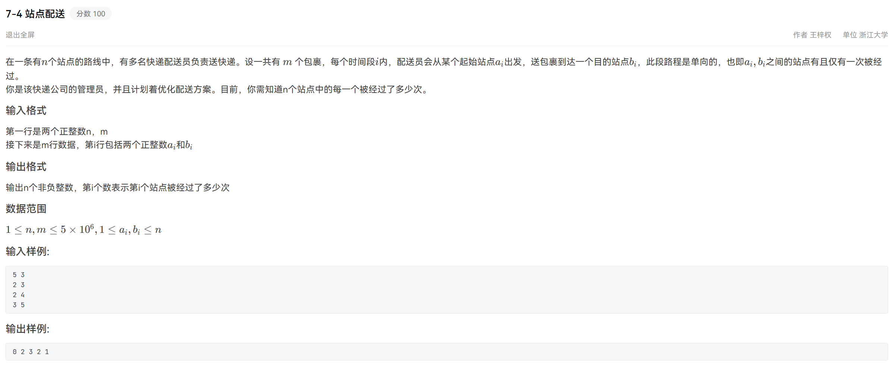

分析：**差分数组+前缀和**

差分数组 `diff` 表示相邻元素之间的变化量，即：`diff[i] = nums[i] − nums[i−1]`，从差分数组可以通过前缀和恢复原数组 `nums`

差分数组可以快速处理区间加减，若要对区间 `[left, right]` 上的值增加某个量 `x`，只需 `diff[left] += x; diff[right+1] -= x`

```java
import java.util.Scanner;

public class Main {
    public static void main(String[] args) {
        Scanner scanner = new Scanner(System.in);
        int n = scanner.nextInt(), m = scanner.nextInt();
        int[] diff = new int[n + 1]; // 差分数组
        for (int i = 0; i < m; i++) { // 读取每个包裹的范围，并更新差分数组
            int a = scanner.nextInt(), b = scanner.nextInt();
            int left = Math.min(a, b); // 计算左边界
            int right = Math.max(a, b); // 计算右边界
            diff[left] += 1; // 起点增加 1
            if (right + 1 <= n) {
                diff[right + 1] -= 1; // 终点+1位置减少 1
            }
        }
        for (int i = 1; i <= n; i++) { // 构建前缀和数组
            diff[i] += diff[i - 1];
        }
        for (int i = 1; i <= n; i++) { // 输出结果
            System.out.print(diff[i]);
            if (i < n) {
                System.out.print(" ");
            }
        }
        System.out.println();
    }
}
```

# *货仓管理(5)

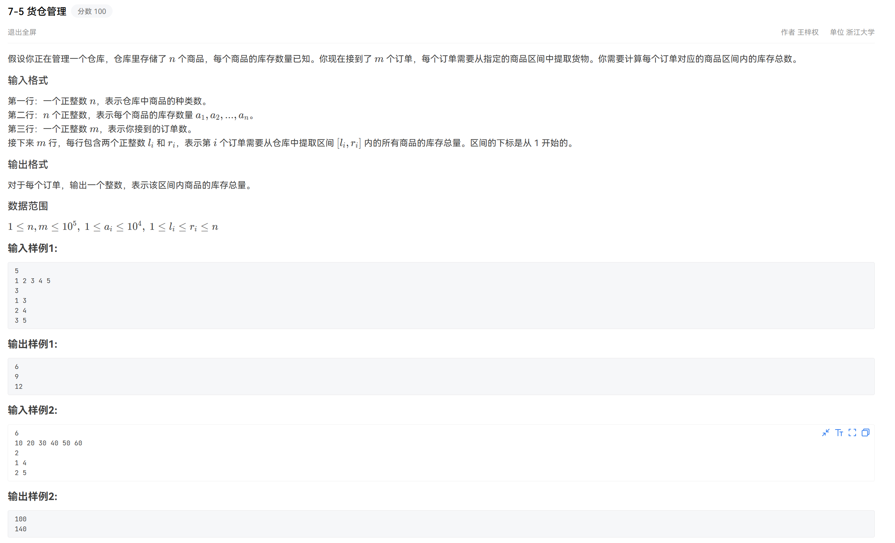

分析：将区间和转为求前缀和

```java
import java.util.Scanner;

public class Main{
    public static void main(String[] args){
        Scanner scanner = new Scanner(System.in);
        int n = scanner.nextInt();
        int[] a = new int[n + 1], prefix = new int[n + 1];;
        for (int i = 1; i <= n; i++) {
            a[i] = scanner.nextInt();
            prefix[i] = prefix[i - 1] + a[i]; // 计算前缀和
        }
        int m = scanner.nextInt();
        for (int i = 0; i < m; i++) { // 处理每个订单，快速计算区间和
            int left = scanner.nextInt(), right = scanner.nextInt();
            int res = prefix[right] - prefix[left - 1];
            System.out.println(res);
        }
    }
}
```

# *游戏任务选择?(6)

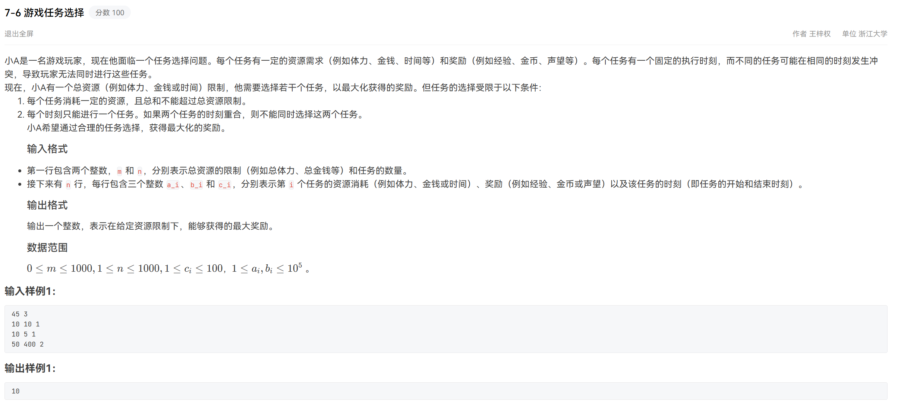

分析：多重目标和问题（多重背包问题），题目的输入有问题，但c++代码可以神奇ac

```java
#include <bits/stdc++.h>
using namespace std;

static const int MAXC = 100;  // c_i ≤ 100
int main(){
    int m,n; 
    cin >> m >> n;  // m: 总资源上限, n: 任务数
    vector<vector<pair<int,int>>> tasksByTime(MAXC+1); // tasksByTime[c] 存储所有 c_i = c 的任务 (a_i, b_i)
    int a,b,c;
    int maxC = 0; // 跟踪最大时间点
    for (int i=0; i<n; i++){
        cin >> a >> b >> c;
        tasksByTime[c].push_back({a,b});
        if (c > maxC) maxC=c;
    }
    vector<vector<int>> dp(maxC+1, vector<int>(m+1, 0)); // dp[i][w]: 在处理到时间点 i 时，消耗资源不超过 w 时的最大奖励
    for (int i=1; i<=maxC; i++){
        for (int w=0; w<=m; w++){
            dp[i][w] = dp[i-1][w]; // 不选该时间点的任何任务
        }
        for (auto &task : tasksByTime[i]){ // 尝试选当前时间点的一个任务
            int A=task.first; int B=task.second;
            for (int w=m; w>=A; w--){
                if (dp[i-1][w - A] + B > dp[i][w]) {
                    dp[i][w] = dp[i-1][w - A] + B;
                }
            }
        }
    }
    cout << dp[maxC][m] << "\n";
    return 0;
}
```

```java
import java.util.*;

public class Main {
    public static void main(String[] args) {
        Scanner scanner = new Scanner(System.in);
        int m = scanner.nextInt(), n = scanner.nextInt(); // 任务数
        Map<Integer, Map<Integer, Integer>> tasksByTime = new TreeMap<>(); // tasksByTime[c] 存储所有 c_i = c 的任务 <a_i, b_i>
        for (int i = 0; i < n; i++) {
            int a = scanner.nextInt(), b = scanner.nextInt(), c = scanner.nextInt();
            Map<Integer, Integer> tmpMap = tasksByTime.getOrDefault(c, new TreeMap<>());
            tmpMap.put(a, Math.max(b, tmpMap.getOrDefault(a, 0)));
            tasksByTime.put(c, tmpMap);
        }
        // 获取 tasksByTime 的 entrySet 并转换为 List，方便后面用下标访问
        List<Map.Entry<Integer, Map<Integer, Integer>>> entryList = new ArrayList<>(tasksByTime.entrySet());
        int t = entryList.size(); // 任务种类
        int[][] dp = new int[t + 1][m + 1]; // dp[i][w]: 在处理到时间点 i 时，消耗资源不超过 w 时的最大奖励
        for (int i = 1; i <= t; i++) {
            for (int w = 0; w <= m; w++) {
                dp[i][w] = dp[i - 1][w]; // 不选该时间点的任何任务
            }
            for (Map.Entry<Integer, Integer> task : entryList.get(i - 1).getValue().entrySet()) { // 尝试选当前时间点的一个任务
                int a = task.getKey(), b = task.getValue();
                for (int w = m; w >= a; w--) {
                    dp[i][w] = Math.max(dp[i][w], dp[i - 1][w - a] + b);
                }
            }
        }
        System.out.println(dp[t][m]);
    }
}
```


# 李华的幸运数(8)

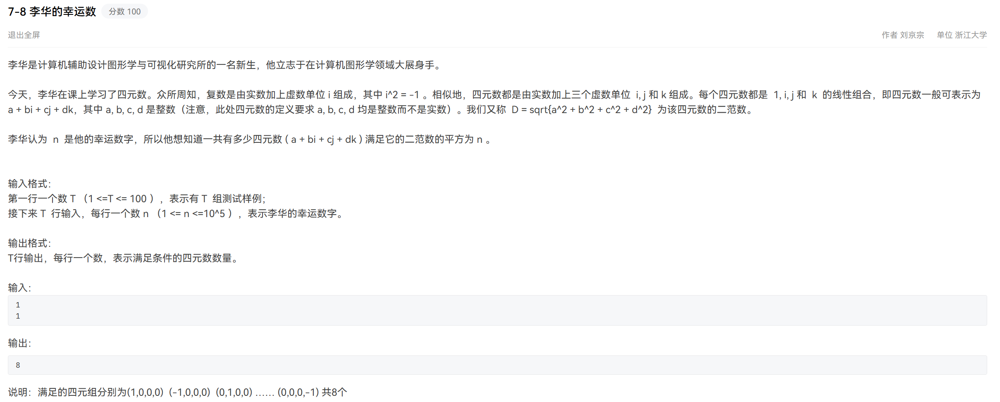

分析：数论：`n` 的因数中，不能被 `4` 整除的因数对应有效的四元数组合，每个有效因数贡献的组合数量为 `8`。

```java
import java.util.Scanner;

public class Main {
    public static void main(String[] args) {
        Scanner scanner = new Scanner(System.in);
        int T = scanner.nextInt();
        while (T-- > 0) {
            int n = scanner.nextInt();
            long sumDiv = 0;
            for (int i = 1; i * i <= n; i++) {
                if (n % i == 0) {
                    int d1 = i;
                    int d2 = n / i;
                    if (d1 % 4 != 0) sumDiv += d1;
                    if (d2 != d1 && d2 % 4 != 0) sumDiv += d2;
                }
            }
            System.out.println(8 * sumDiv);
        }
    }
}
```

# 王の宝库(9)

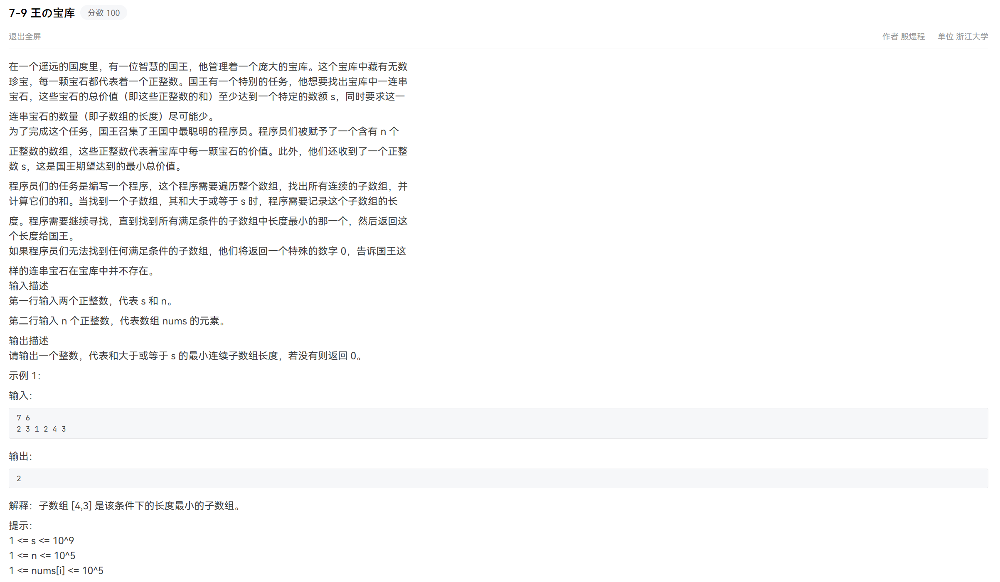

分析：滑动窗口求解最短连续子数组长度

```java
import java.util.Scanner;

public class Main {
    public static void main(String[] args) {
        Scanner scanner = new Scanner(System.in);
        long s = scanner.nextLong();
        int n = scanner.nextInt();
        long[] nums = new long[n];
        for (int i = 0; i < n; i++) {
            nums[i] = scanner.nextLong();
        }
        int left = 0, minLen = Integer.MAX_VALUE; // 滑动窗口双指针
        long curSum = 0;
        for (int right = 0; right < n; right++) {
            curSum += nums[right];
            while (curSum >= s) {
                minLen = Math.min(minLen, right - left + 1);
                curSum -= nums[left++];
            }
        }
        if (minLen == Integer.MAX_VALUE) {
            System.out.println(0);
        } else {
            System.out.println(minLen);
        }
    }
}
```

# 公平分割(10)

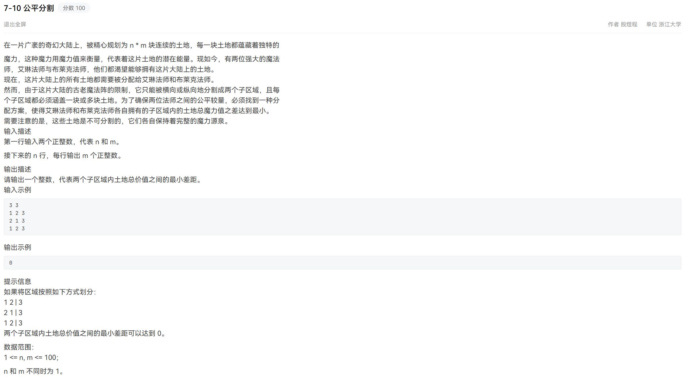

分析：二维前缀和求矩形元素和，遍历所有可能的横向和纵向切割，计算最小差值

```java
import java.util.Scanner;

public class Main {
    private static long[][] prefix; // 全局变量：前缀和数组
    
    public static long rectSum(int x1, int y1, int x2, int y2) { // 函数：计算指定矩形区域的和 (1-based 索引)
        return prefix[x2][y2] - prefix[x1 - 1][y2] - prefix[x2][y1 - 1] + prefix[x1 - 1][y1 - 1];
    }

    public static void main(String[] args) {
        Scanner scanner = new Scanner(System.in);
        int n = scanner.nextInt(), m = scanner.nextInt();
        int[][] grid = new int[n][m];
        for (int i = 0; i < n; i++) {
            for (int j = 0; j < m; j++) {
                grid[i][j] = scanner.nextInt();
            }
        }
        prefix = new long[n + 1][m + 1]; // 计算前缀和
        for (int i = 1; i <= n; i++) {
            for (int j = 1; j <= m; j++) {
                prefix[i][j] = prefix[i-1][j] + prefix[i][j-1] - prefix[i-1][j-1] + grid[i-1][j-1];
            }
        }
        long total = rectSum(1, 1, n, m); // 总矩阵的总和
        long ans = Long.MAX_VALUE;
        for (int col = 1; col < m; col++) { // 尝试纵向切割
            long leftSum = rectSum(1, 1, n, col);
            long rightSum = total - leftSum;
            long diff = Math.abs(leftSum - rightSum);
            ans = Math.min(ans, diff);
        }
        for (int row = 1; row < n; row++) { // 尝试横向切割
            long topSum = rectSum(1, 1, row, m);
            long bottomSum = total - topSum;
            long diff = Math.abs(topSum - bottomSum);
            ans = Math.min(ans, diff);
        }
        System.out.println(ans);
    }
}
```

# 小叶整顿职场(12)

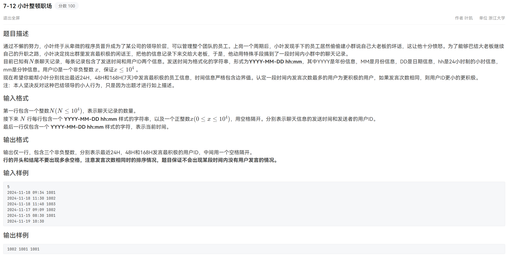

分析：日期处理，构建 `Record` 类统一存储聊天记录信息

* 先将任意时刻转化为到基准（公元0年）的分钟数
* 再统计指定时间范围内用户的发言次数，存入哈希表
* 最后在哈希表里查找发言次数最多、ID最小的用户

```java
import java.util.*;

public class Main {
    static class Record { // 定义聊天记录类
        int year, month, day, hour, minute, userID;

        public Record(int year, int month, int day, int hour, int minute, int userID) {
            this.year = year; this.month = month; this.day = day;
            this.hour = hour; this.minute = minute; this.userID = userID;
        }
    }

    // 计算从公元 0 年到指定日期的总分钟数
    public static int toMinutes(int year, int month, int day, int hour, int minute) {
        boolean isLeap = (year % 400 == 0) || (year % 4 == 0 && year % 100 != 0); // 检查是否是闰年
        int[] daysInMonth = {31, 28, 31, 30, 31, 30, 31, 31, 30, 31, 30, 31};
        if (isLeap) {
            daysInMonth[1] = 29; // 闰年二月为 29 天
        }
        int days = 0; // 计算从公元 0 年开始到当前年份的总天数
        for (int y = 1; y < year; y++) {
            days += (y % 400 == 0 || (y % 4 == 0 && y % 100 != 0)) ? 366 : 365;
        }
        for (int i = 0; i < month - 1; i++) { // 加上当前年份已过去的天数
            days += daysInMonth[i];
        }
        days += day - 1;
        return (days * 24 * 60) + (hour * 60) + minute; // 转换为分钟
    }

    // 找出发言次数最多且用户 ID 最小的用户
    public static int findMaxUser(Map<Integer, Integer> userCounts) {
        int maxCount = -1, bestUser = -1;
        for (Map.Entry<Integer, Integer> entry : userCounts.entrySet()) {
            int userID = entry.getKey(), count = entry.getValue();
            if (count > maxCount || (count == maxCount && userID < bestUser)) {
                maxCount = count;
                bestUser = userID;
            }
        }
        return bestUser;
    }

    public static void main(String[] args) {
        Scanner scanner = new Scanner(System.in);
        int n = scanner.nextInt();
        List<Record> records = new ArrayList<>(); // 聊天记录列表
        for (int i = 0; i < n; i++) {
            String date = scanner.next(); // 读取日期和时间，用户ID
            String time = scanner.next();
            int userID = scanner.nextInt();
            String[] dateParts = date.split("-"); // 分解日期
            int year = Integer.parseInt(dateParts[0]);
            int month = Integer.parseInt(dateParts[1]);
            int day = Integer.parseInt(dateParts[2]);
            String[] timeParts = time.split(":"); // 分解时间
            int hour = Integer.parseInt(timeParts[0]);
            int minute = Integer.parseInt(timeParts[1]);
            records.add(new Record(year, month, day, hour, minute, userID)); // 创建记录
        }
        // 当前时间的解析
        String currentDate = scanner.next();
        String currentTime = scanner.next();
        String[] currentDateParts = currentDate.split("-"); // 分解日期
        int currentYear = Integer.parseInt(currentDateParts[0]);
        int currentMonth = Integer.parseInt(currentDateParts[1]);
        int currentDay = Integer.parseInt(currentDateParts[2]);
        String[] currentTimeParts = currentTime.split(":"); // 分解时间
        int currentHour = Integer.parseInt(currentTimeParts[0]);
        int currentMinute = Integer.parseInt(currentTimeParts[1]);
        // 计算时间区间
        int currentTimeInMinutes = toMinutes(currentYear, currentMonth, currentDay, currentHour, currentMinute);
        int interval24 = currentTimeInMinutes - 24 * 60;
        int interval48 = currentTimeInMinutes - 48 * 60;
        int interval168 = currentTimeInMinutes - 168 * 60;
        // 统计用户发言次数
        Map<Integer, Integer> count24 = new HashMap<>();
        Map<Integer, Integer> count48 = new HashMap<>();
        Map<Integer, Integer> count168 = new HashMap<>();
        for (Record record : records) {
            int recordTimeInMinutes = toMinutes(record.year, record.month, record.day, record.hour, record.minute);
            if (recordTimeInMinutes <= currentTimeInMinutes && recordTimeInMinutes >= interval168) {
                count168.put(record.userID, count168.getOrDefault(record.userID, 0) + 1); // 在168h内发言
                if (recordTimeInMinutes >= interval48) { // 在48h内发言
                    count48.put(record.userID, count48.getOrDefault(record.userID, 0) + 1);
                    if (recordTimeInMinutes >= interval24) { // 在24h内发言
                        count24.put(record.userID, count24.getOrDefault(record.userID, 0) + 1);
                    }
                }
            }
        }
        // 找到三个区间内的最佳用户
        int best24 = findMaxUser(count24);
        int best48 = findMaxUser(count48);
        int best168 = findMaxUser(count168);
        System.out.println(best24 + " " + best48 + " " + best168);
    }
}
```

# *跳石头(20)

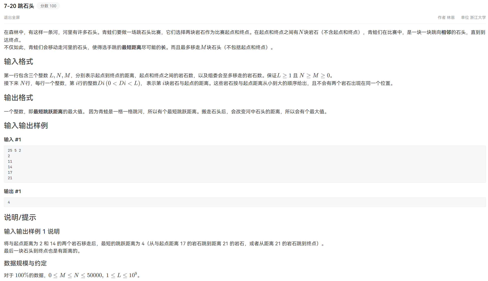

分析：最大化最小值：二分答案（红蓝染色法）+贪心验证

```java
import java.util.*;

public class Main {
    private static int L, N, M;
    private static int[] stones;
    
    // 贪心验证：判断是否可以在移除 M 个石头的情况下保证最小跳跃距离 >= d
    private static boolean canJump(int d) {
        int removed = 0;
        int prev = 0; // 上一次落点的石头索引
        for (int i = 1; i < stones.length; i++) {
            if (stones[i] - stones[prev] < d) { // 距离太近，需要移除这块石头
                removed++;
                if (removed > M) { // 超过移除限制
                    return false;
                }
            } else { // 距离达标，更新落点
                prev = i;
            }
        }
        return true; // 可以保证最小跳跃距离 >= d
    }

    // 二分答案（红蓝染色法）：最大化最小值 [left, right]
    private static int lastLowerBound() { // 求满足条件 canJump(d) 时最大的 d
        // 可能的最小答案是1，左边界可以从2开始（right最终指向left的左边，可以搜索到1）
        int left = 1, right = L; // 保险起见建议left从1开始
        while (left <= right) {
            int mid = left + (right - left) / 2;
            if (canJump(mid)) { // 满足条件，往右搜索（且为闭区间）
                left = mid + 1;
            } else { // 满足条件，往左搜索（且为闭区间）
                right = mid - 1;
            }
        }
        return right; // right == left - 1 且 right 为蓝色
    }

    // 二分答案（红蓝染色法）：最大化最小值 [left, right)
    private static int lastLowerBound2() { // 求满足条件 canJump(d) 时最大的 d
        // 可能的最小答案是1，最大答案是L，要往右延伸到 L + 1
        int left = 1, right = L + 1; // [left, right) = [1, L + 1)
        while (right - left > 1) {
            int mid = left + (right - left) / 2;
            if (canJump(mid)) { // 满足条件，往右搜索（且为闭区间）
                left = mid;
            } else { // 不满足条件，往左搜索（且为开区间）
                right = mid;
            }
        }
        return left; // left == right - 1, left 为闭区间
    }

    public static void main(String[] args) {
        Scanner scanner = new Scanner(System.in);
        L = scanner.nextInt(); N = scanner.nextInt(); M = scanner.nextInt();
        stones = new int[N + 2];
        stones[0] = 0; // 起点
        for (int i = 1; i <= N; i++) {
            stones[i] = scanner.nextInt();
        }
        stones[N + 1] = L; // 终点
        Arrays.sort(stones); // 排序石头位置
        int result = lastLowerBound2();
        System.out.println(result);
    }
}
```

# 杰哥的阿伟(24)

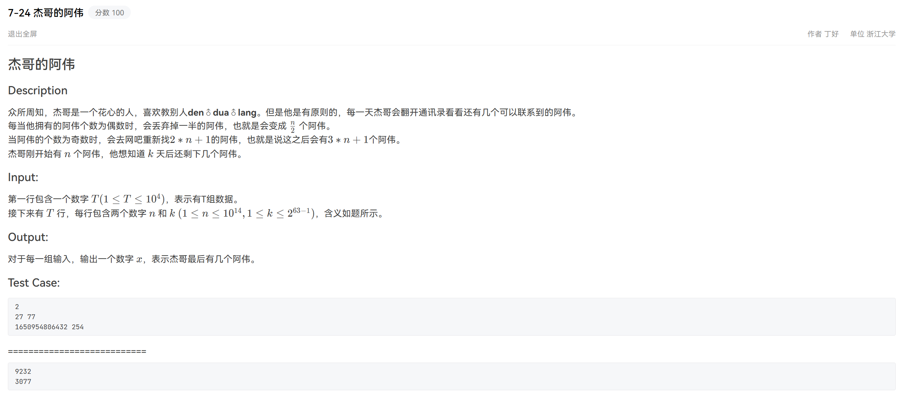

分析：Collatz 猜想：对于任意正整数 `n`，重复上述操作，总能收敛到 `n = 1`，后续操作会陷入周期为 `3` 的循环 `{1, 4, 2}`

```java
import java.util.Scanner;

public class Main {
    public static void main(String[] args) {
        Scanner scanner = new Scanner(System.in);
        int T = scanner.nextInt();
        while (T-- > 0) {
            long n = scanner.nextLong(), k = scanner.nextLong();
            while (k > 0 && n != 1) { // 模拟 Collatz-like 转换
                if ((n & 1) == 0) { // n % 2
                    n >>= 1; // n /= 2
                } else {
                    n = 3 * n + 1;
                }
                k--;
            }
            if (n == 1 && k > 0) { // 如果 n == 1，进入循环 {1, 4, 2}
                long r = k % 3;
                if (r == 0) n = 1;
                else if (r == 1) n = 4;
                else if (r == 2) n = 2;
            }
            System.out.println(n);
        }
    }
}
```

# 纸人(27)

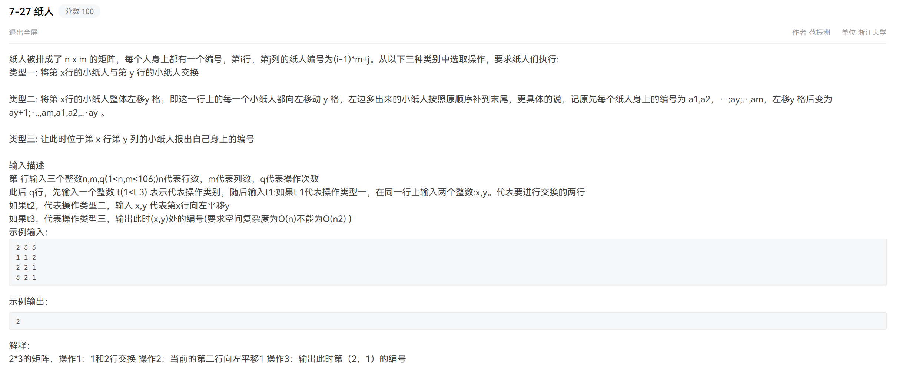

分析：初始矩阵为自然数的顺序排列，使用两个一维数组记录行映射和偏移量，注意输出时编号在 `0-based` 和 `1-based` 间的转换

```java
import java.util.*;

public class Main {
    public static void main(String[] args) {
        Scanner scanner = new Scanner(System.in);
        int n = scanner.nextInt(), m = scanner.nextInt(), q = scanner.nextInt();
        int[] rowid = new int[n + 1], shift = new int[n + 1]; // 初始化行映射和偏移数组
        for (int i = 1; i <= n; i++) {
            rowid[i] = i;
            shift[i] = 0;
        }
        while (q-- > 0) { // 处理每一个操作
            int t = scanner.nextInt();
            if (t == 1) { // 操作类型 1：交换两行
                int x = scanner.nextInt(), y = scanner.nextInt();
                int tempRow = rowid[x]; // 交换 rowid
                rowid[x] = rowid[y];
                rowid[y] = tempRow;
                int tempShift = shift[x]; // 交换 shift，因为左移信息与行绑定
                shift[x] = shift[y];
                shift[y] = tempShift;
            } else if (t == 2) { // 操作类型 2：某行左移
                int x = scanner.nextInt(), y = scanner.nextInt();
                shift[x] = (shift[x] + y) % m; // 更新 shift[x]
            } else if (t == 3) { // 操作类型 3：查询小纸人的编号
                int x = scanner.nextInt(), y = scanner.nextInt();
                int orig_c = ((y - 1) + shift[x]) % m; // 计算原始列编号 0-based index
                int ans = (rowid[x] - 1) * m + (orig_c + 1); // 1-based index
                System.out.println(ans);
            }
        }
    }
}
```

# 统计森林数量(28)

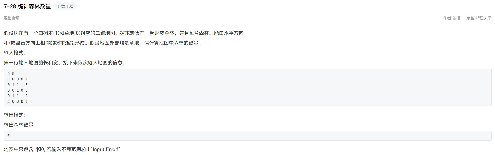

分析：dfs搜索出一片森林，同时标记访问，对图中的每个点尝试dfs，统计dfs的次数
```java
import java.util.*;

public class Main {
    private static int n, m;
    private static int[][] grid;
    private static boolean[][] visited;
    
    private static void dfs(int i, int j) {
        // 越界或已经访问过或当前点不是 1，则直接返回
        if (i < 0 || i >= n || j < 0 || j >= m || visited[i][j] || grid[i][j] != 1) {
            return;
        }
        visited[i][j] = true; // 标记当前点为已访问
        // 递归探索上下左右四个方向
        dfs(i + 1, j);
        dfs(i - 1, j);
        dfs(i, j + 1);
        dfs(i, j - 1);
    }
    
    public static void main(String[] args) {
        Scanner scanner = new Scanner(System.in);
        n = scanner.nextInt();
        m = scanner.nextInt();
        grid = new int[n][m];
        for (int i = 0; i < n; i++) {
            for (int j = 0; j < m; j++) {
                int x = scanner.nextInt();
                if (x != 0 && x != 1) {
                    System.out.println("Input Error!");
                    return;
                }
                grid[i][j] = x;
            }
        }
        visited = new boolean[n][m];
        int cnt = 0;
        for (int i = 0; i < n; i++) { // 遍历矩阵，启动 DFS
            for (int j = 0; j < m; j++) {
                if (!visited[i][j] && grid[i][j] == 1) { // 遇到一个新的森林块，计数 +1
                    cnt++;
                    dfs(i, j);
                }
            }
        }
        System.out.println(cnt);
    }
}
```

# *生成产品编号(29)

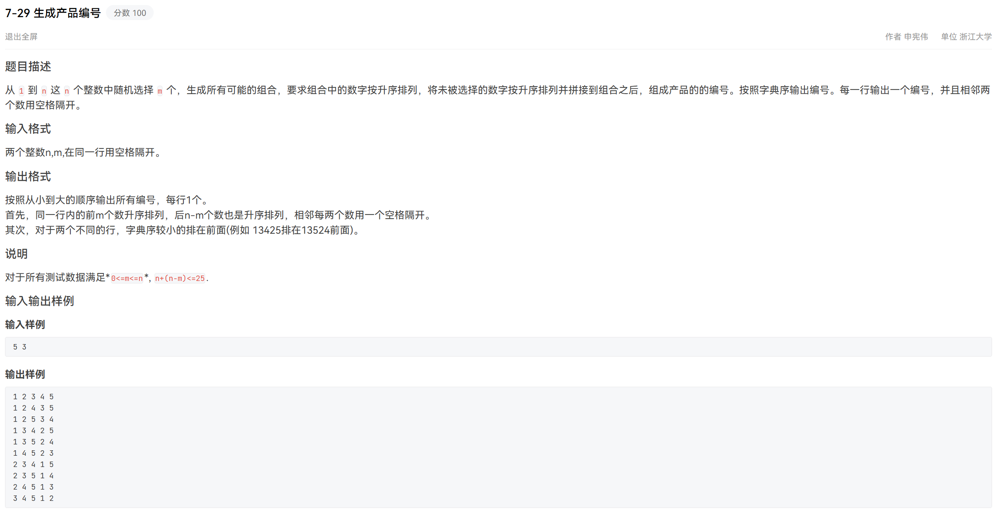

分析：利用集合的整数表示，枚举所有大小为 `k` 的子集。注意子集是 `0-indexd` 的，题中的输入输出是 `1-indexd`。此外，枚举出的子集默认按照二进制值升序排序（`234 < 125`），本题需要按照二进制位转为字符串后按字典序排序（`125 < 234`）。

```java
import java.util.*;

public class Main {    
    public static void main(String[] args) {
        Scanner scanner = new Scanner(System.in);
        int n = scanner.nextInt(), m = scanner.nextInt();
        List<List<Integer>> results = new ArrayList<>(); // 存储所有结果
        int comb = (1 << m) - 1; // 枚举{0,1,...,n-1}所有大小为m的子集
        while(comb < (1 << n)){
            List<Integer> select = new ArrayList<>(); // 存储选出数字
            List<Integer> remain = new ArrayList<>(); // 存储剩余数字
            for (int i = 0; i < n; i++) {
                if (((comb >> i) & 1) == 1) {
                    select.add(i + 1);
                } else {
                    remain.add(i + 1);
                }
            }
            select.addAll(remain);
            results.add(select);
            int x = comb & -comb; // 取出comb最低位的1
            int y = comb + x; // 将comb从最低位的1开始的连续的1置0
            comb = ((comb & ~y) / x >> 1) | y;
        }
        results.sort((list1, list2) -> { // 对 results 按字典序排序
            int size = Math.min(list1.size(), list2.size());
            for (int i = 0; i < size; i++) {
                int cmp = Integer.compare(list1.get(i), list2.get(i));
                if (cmp != 0) {
                    return cmp; // 如果找到不同的元素，返回比较结果
                }
            }
            return Integer.compare(list1.size(), list2.size()); // 如果前 n 个元素都相等，按列表长度排序
        });
        for (List<Integer> result : results) { // 输出排序后的结果
            for (int i = 0; i < result.size(); i++) {
                System.out.print(result.get(i));
                if (i < result.size() - 1) {
                    System.out.print(" ");
                }
            }
            System.out.println();
        }
    }
}
```

# 连续子序列(32)

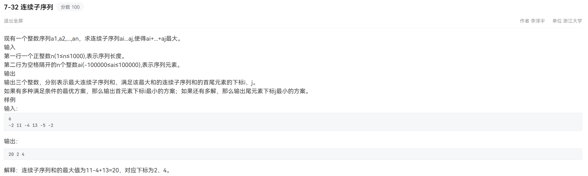

分析：滑动窗口，遍历过程中记录最大值

```java
import java.util.Scanner;

public class Main {
    public static void main(String[] args) {
        Scanner scanner = new Scanner(System.in);
        int n = scanner.nextInt();
        long[] a = new long[n + 1];
        for (int i = 1; i <= n; i++) {
            a[i] = scanner.nextLong();
        }
        long maxSum = Long.MIN_VALUE; // 最大子数组和
        long currentSum = 0; // 当前子数组和
        int maxI = 1, maxJ = 1; // 最大子数组的起点和终点
        int start = 1; // 当前子数组尝试的起点
        for (int end = 1; end <= n; end++) { // 遍历右边界
            if (currentSum < 0) { // 重置左边界
                currentSum = a[end];
                start = end;
            } else { // 继续累加
                currentSum += a[end];
            }
            if (currentSum > maxSum) { // 更新最大值
                maxSum = currentSum;
                maxI = start;
                maxJ = end;
            } // 顺序遍历时，已经在元素和相同时默认选择了 start 和 end 下标更小的子序列
            // else if (currentSum == maxSum) { // 相等时选择起点或终点更优的方案
            //     if (start < maxI || (start == maxI && end < maxJ)) {
            //         maxI = start;
            //         maxJ = end;
            //     }
            // }
        }
        System.out.println(maxSum + " " + maxI + " " + maxJ);
    }
}
```

# *硅片(33)

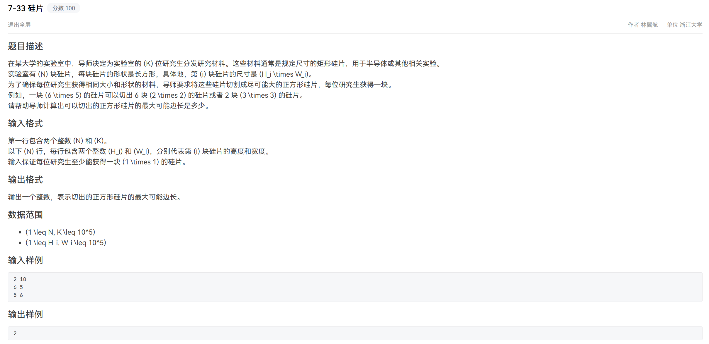

分析：最大化最小值：二分答案（红蓝染色法）+贪心验证

```java
import java.util.Scanner;

public class Main {
    private static int N, K, maxDim; // 二分的上界
    private static int[] H, W;
    
    // 贪心验证：判断给定边长是否能切出 K 个硅片
    private static boolean canCut(int side) {
        long total = 0; // 用 long 以防止溢出
        for (int i = 0; i < N; i++) {
            total += (long)(H[i] / side) * (W[i] / side); // 第i个硅片能切出的最大数量
            if (total >= K) {
                return true; // 提前剪枝
            }
        }
        return total >= K;
    }

    // 二分答案（红蓝染色法）：最大化最小值 [left, right]
    private static int lastLowerBound() { // 求满足条件 canCut(side) 时最大的 side
        // 可能的最小答案是1，左边界可以从2开始（right最终指向left的左边，可以搜索到1）
        int left = 1, right = maxDim; // 保险起见建议left从1开始
        while (left <= right) {
            int mid = left + (right - left) / 2;
            if (canCut(mid)) { // 满足条件，往右搜索（且为闭区间）
                left = mid + 1;
            } else { // 满足条件，往左搜索（且为闭区间）
                right = mid - 1;
            }
        }
        return right; // right == left - 1 且 right 为蓝色
    }

    // 二分答案（红蓝染色法）：最大化最小值 [left, right)
    private static int lastLowerBound2() { // 求满足条件 canCut(side) 时最大的 side
        // 可能的最小答案是1，最大答案是maxDim，要往右延伸到 maxDim + 1
        int left = 1, right = maxDim + 1; // [left, right) = [1, maxDim + 1)
        while (right - left > 1) {
            int mid = left + (right - left) / 2;
            if (canCut(mid)) { // 满足条件，往右搜索（且为闭区间）
                left = mid;
            } else { // 不满足条件，往左搜索（且为开区间）
                right = mid;
            }
        }
        return left; // left == right - 1, left 为闭区间
    }
    
    public static void main(String[] args) {
        Scanner scanner = new Scanner(System.in);
        N = scanner.nextInt(); K = scanner.nextInt();
        H = new int[N]; W = new int[N];
        for (int i = 0; i < N; i++) { // 输入每个矩形的高和宽，同时初始化上界
            H[i] = scanner.nextInt(); W[i] = scanner.nextInt();
            maxDim = Math.max(maxDim, Math.max(H[i], W[i]));
        }
        int ans = lastLowerBound2();
        System.out.println(ans);
    }
}
```

# *连通块中点的数量(37)

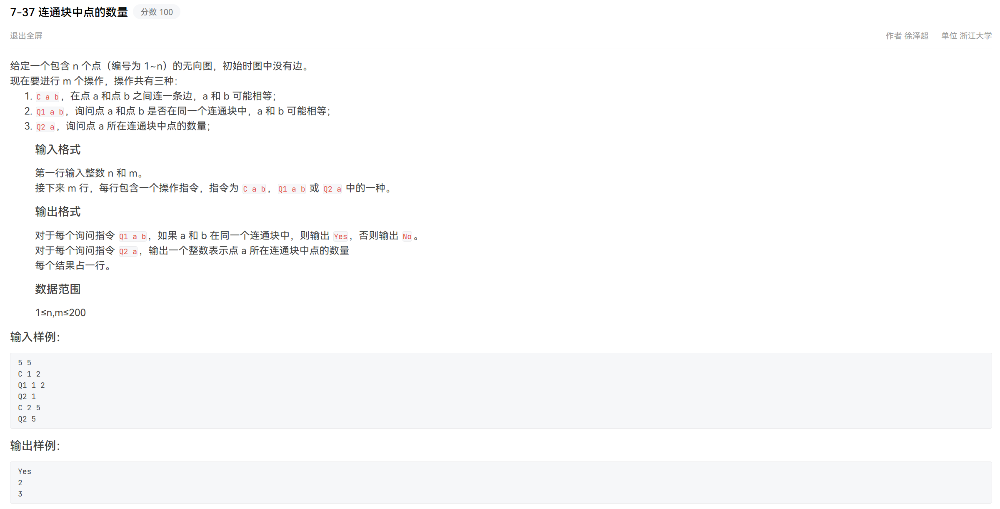

分析：并查集：注意连通块编号从 `1` 开始，而并查集的编号从 `0` 开始，因此查询、合并时下标都要 `-1`；也可将并查集容量设为 `n + 1`

```java
import java.util.Scanner;

public class Main {
    private static int[] parent; // 父节点
    private static int[] rank;   // 树的秩（高度）

    // 初始化并查集
    public static void init(int n) {
        parent = new int[n];
        rank = new int[n];
        for (int i = 0; i < n; i++) {
            parent[i] = i; // 每个节点的父节点初始化为自己
            rank[i] = 0;   // 初始时每棵树的高度为0
        }
    }

    // 查找某个元素的根节点，并进行路径压缩
    public static int find(int x) {
        if (parent[x] != x) { // 当前节点的父节点不是自己，则不是根节点
            parent[x] = find(parent[x]); // 路径压缩
        }
        return parent[x];
    }

    // 合并两个元素所在的集合
    public static void unite(int x, int y) {
        int rootX = find(x);
        int rootY = find(y);
        if (rootX == rootY) { // 已经在同一集合中，无需合并
            return;
        }
        if (rank[rootX] < rank[rootY]) { // 从rank小的向rank大的连边，避免退化
            parent[rootX] = rootY;
        } else {
            parent[rootY] = rootX;
            if (rank[rootX] == rank[rootY]) { // 高度相同的情况下，合并后要 rank += 1
                rank[rootX]++;
            }
        }
    }

    // 判断两个元素是否属于同一集合
    public static boolean same(int x, int y) {
        return find(x) == find(y); // 根节点相同则属于一个集合
    }

    // 动态计算某个节点所在集合的大小
    public static int size(int x, int n) {
        int rootX = find(x); // 找到节点 x 的根节点
        int count = 0;
        for (int i = 0; i < n; i++) { // 遍历所有节点
            if (find(i) == rootX) { // 判断是否与根节点相同
                count++;
            }
        }
        return count; // 返回属于该集合的节点数量
    }
    
    public static void main(String[] args) {
        Scanner scanner = new Scanner(System.in);
        int n = scanner.nextInt(), m = scanner.nextInt();
        // n++; // 也可将并查集容量设为 n + 1
        init(n); // 初始化并查集
        for (int i = 0; i < m; i++) {
            String operation = scanner.next();
            if (operation.equals("C")) { // 合并操作
                int a = scanner.nextInt(), b = scanner.nextInt();
                unite(a - 1, b - 1);
            } else if (operation.equals("Q1")) { // 查询是否在一个连通块中
                int a = scanner.nextInt(), b = scanner.nextInt();
                System.out.println(same(a - 1, b - 1) ? "Yes" : "No");
            } else if (operation.equals("Q2")) { // 查询该连通块的大小
                int a = scanner.nextInt();
                System.out.println(size(a - 1, n));
            }
        }
    }
}
```

# *城市紧急医疗物资配送路径优化(42)

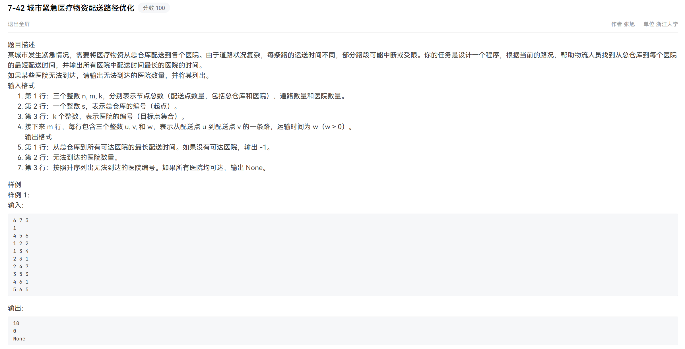

分析：Dijkstra算法求最短路径，邻接矩阵版本

```java
import java.util.*;

public class Main { // 存储方式：邻接矩阵
    private static final int INF = Integer.MAX_VALUE / 3;
    private static int n, m, k, s; // 顶点数和边数
    private static int[] hospitals; // 目标点集合
    private static int[] dis; // 起点到各个顶点的最短距离
    // private static int[] pre; // 记录最短路径的前驱节点
    private static boolean[] vis; // 记录顶点是否已访问
    private static int[][] adj; // 邻接矩阵，存储边权
    
    // 初始化图的顶点数和邻接矩阵
    public static void init() {
        Scanner scanner = new Scanner(System.in);
        n = scanner.nextInt(); m = scanner.nextInt(); k = scanner.nextInt(); s = scanner.nextInt();
        s--; // index: 1-based -> 0-based
        // n++; // 节点从1~n编号，若不转换下标要设n+1个
        hospitals = new int[k];
        for (int i = 0; i < k; i++) {
            hospitals[i] = scanner.nextInt();
            hospitals[i]--; // index: 1-based -> 0-based
        }
        dis = new int[n];
        Arrays.fill(dis, INF); // 初始化距离为无穷大
        // pre = new int[n];
        // Arrays.fill(pre, -1); // 初始化前驱数组为 -1
        vis = new boolean[n];
        Arrays.fill(vis, false); // 初始化为未访问
        adj = new int[n][n];
        for (int i = 0; i < n; i++){
            Arrays.fill(adj[i], INF); // 初始化为无穷大，表示不可达
            // adj[i][i] = 0; // 主对角线为0，会导致 pre[s] == s
        }
        for (int i = 0; i < m; i++) { // 为相应的[起点,终点]添加<边权值>
            int s = scanner.nextInt(); // 起点
            int t = scanner.nextInt(); // 终点
            int ew = scanner.nextInt(); // 边权
            adj[s - 1][t - 1] = ew; // index: 1-based -> 0-based
        }
    }
    
    // Dijkstra 算法（存储方式：邻接矩阵）
    public static void dijkstra(int s) {
        dis[s] = 0; // 从起点 s 开始递推
        while (true) {
            int v = -1;
            for (int u = 0; u < n; u++) { // 找到尚未使用的顶点中距离最小的顶点
                if (!vis[u] && (v == -1 || dis[u] < dis[v])) { // 防止 dis[-1] 越界
                    v = u;
                }
            }
            if (v == -1) { // 如果找不到这样的顶点，算法结束
                break;
            }
            vis[v] = true; // 标记该顶点为已访问
            for (int u = 0; u < n; u++) { // 更新从顶点 v 出发到相邻顶点的距离
                if (v != u && adj[v][u] != INF) { // 存在边 (v, u) 且不是自环
                    dis[u] = Math.min(dis[u], dis[v] + adj[v][u]);
                    // pre[u] = v; // 记录前驱节点
                }
            }
        }
    }
    
    // 获取从起点到目标点的最短路径
    // public static List<Integer> getPath(int target) {
    //     List<Integer> path = new ArrayList<>();
    //     for (int t = target; t != -1; t = pre[t]) {
    //         path.add(t);
    //     }
    //     Collections.reverse(path); // 逆序，得到从起点到目标点的路径
    //     return path;
    // }

    public static void main(String[] args) {
		init();
        dijkstra(s);
        List<Integer> unreachable = new ArrayList<>(); // 记录不可达的终点
        long maxTime = -1; // 求最大的最短路径时间
        for (int h : hospitals) {
            if (dis[h] == INF) {
                unreachable.add(h); // 无法到达的医院
            } else {
                maxTime = Math.max(maxTime, dis[h]);
            }
        }
        System.out.println(unreachable.size() == hospitals.length ? -1 : maxTime); // 最大最短路径时间
        System.out.println(unreachable.size()); // 不可达医院数量
        if (unreachable.isEmpty()) { // 若无不可达医院，则输出 None，否则输出不可达医院编号（升序）
            System.out.println("None");
        } else {
            Collections.sort(unreachable);
            for (int i = 0; i < unreachable.size(); i++) {
                System.out.print(unreachable.get(i) + 1); // index: 0-based -> 1-based
                if (i < unreachable.size() - 1) {
                    System.out.print(" ");
                }
            }
            System.out.println();
        }
    }
}
```

邻接表+优先队列优化版本：

```java
import java.util.*;

public class Main { // 存储方式：邻接表+优先队列（小顶堆）
    private static final int INF = Integer.MAX_VALUE / 3;
    private static int n, m, k, s; // 顶点数和边数
    private static int[] hospitals; // 目标点集合
    private static int[] dis; // 起点到各个顶点的最短距离
    // private static int[] pre; // 记录最短路径的前驱节点
    private static PriorityQueue<int[]> pq; // 优先队列取代 vis 数组
    private static List<List<Edge>> adjList; // 邻接表
    
    // 边的定义<终点，边权值>
    private static class Edge {
        int t, ew;

        Edge(int t, int ew) {
            this.t = t;
            this.ew = ew;
        }
    }
    
    // 初始化图的顶点数和邻接矩阵
    public static void init() {
        Scanner scanner = new Scanner(System.in);
        n = scanner.nextInt(); m = scanner.nextInt(); k = scanner.nextInt(); s = scanner.nextInt();
        s--; // index: 1-based -> 0-based
        // n++; // 节点从1~n编号，若不转换下标要设n+1个
        hospitals = new int[k];
        for (int i = 0; i < k; i++) {
            hospitals[i] = scanner.nextInt();
            hospitals[i]--; // index: 1-based -> 0-based
        }
        dis = new int[n];
        Arrays.fill(dis, INF); // 初始化距离为无穷大
        // pre = new int[n];
        // Arrays.fill(pre, -1); // 初始化前驱数组为 -1
        pq = new PriorityQueue<>(Comparator.comparingInt(o -> o[0])); // 优先队列，按最小距离排序（小顶堆）
        adjList = new ArrayList<>(); // 初始化邻接表
        for (int i = 0; i < n; i++) { // 为所有起点创建空列表
            adjList.add(new ArrayList<>());
        }
        for (int i = 0; i < m; i++) { // 为相应的[起点,终点]添加<边权值>
            int s = scanner.nextInt(); // 起点
            int t = scanner.nextInt(); // 终点
            int ew = scanner.nextInt(); // 边权
            adjList.get(s - 1).add(new Edge(t - 1, ew)); // index: 1-based -> 0-based
        }
    }
    
    // Dijkstra 算法（存储方式：邻接表+优先队列（小顶堆））
    public static void dijkstra(int s) {
        dis[s] = 0; // 从起点 s 开始递推
        pq.offer(new int[]{0, s}); // 维护每个顶点当前的最短距离(距离为 0，顶点为 s)
        while (!pq.isEmpty()) {
            int[] cur = pq.poll();
            int curDis = cur[0]; // 当前顶点的最短距离
            int curVet = cur[1]; // 当前顶点编号
            if (curDis > dis[curVet]){ // 如果当前距离大于已记录的距离，跳过（因为是松弛过的点）
                continue;
            }
            for (Edge edge : adjList.get(curVet)) { // 遍历当前顶点的所有邻接点
                int newDis = dis[curVet] + edge.ew;
                if (newDis < dis[edge.t]) { // 距离更短则更新，并放入优先队列
                    dis[edge.t] = newDis;
                    // pre[edge.t] = curVet; // 记录前驱节点
                    pq.offer(new int[]{newDis, edge.t});
                }
            }
        }
    }
    
    // 获取从起点到目标点的最短路径
    // public static List<Integer> getPath(int target) {
    //     List<Integer> path = new ArrayList<>();
    //     for (int t = target; t != -1; t = pre[t]) {
    //         path.add(t);
    //     }
    //     Collections.reverse(path); // 逆序，得到从起点到目标点的路径
    //     return path;
    // }

    public static void main(String[] args) {
		init();
        dijkstra(s);
        List<Integer> unreachable = new ArrayList<>(); // 记录不可达的终点
        long maxTime = -1; // 求最大的最短路径时间
        for (int h : hospitals) {
            if (dis[h] == INF) {
                unreachable.add(h); // 无法到达的医院
            } else {
                maxTime = Math.max(maxTime, dis[h]);
            }
        }
        System.out.println(unreachable.size() == hospitals.length ? -1 : maxTime); // 最大最短路径时间
        System.out.println(unreachable.size()); // 不可达医院数量
        if (unreachable.isEmpty()) { // 若无不可达医院，则输出 None，否则输出不可达医院编号（升序）
            System.out.println("None");
        } else {
            Collections.sort(unreachable);
            for (int i = 0; i < unreachable.size(); i++) {
                System.out.print(unreachable.get(i) + 1); // index: 0-based -> 1-based
                if (i < unreachable.size() - 1) {
                    System.out.print(" ");
                }
            }
            System.out.println();
        }
    }
}
```


# *最长连续子数组(44)

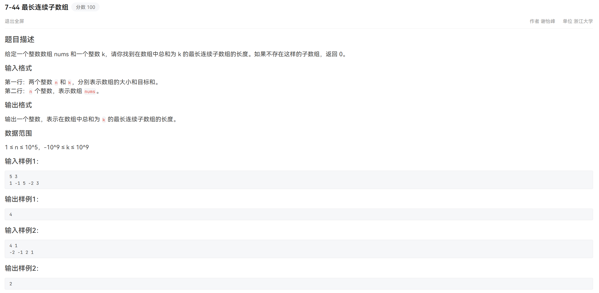

分析：哈希表+前缀和：**若两个位置的前缀和的差是 `k`，则这两者之间的子数组和为 `k`。使用哈希表记录前缀和（`key`）第一次出现的位置（`value`）**，这样可以快速定位到可能形成和为 `k` 的子数组起始位置。遍历数组时，维护当前的前缀和 `current_sum`，检查 `current_sum - k` 是否存在于哈希表中，遍历过程中同时更新答案。

```java
import java.util.HashMap;
import java.util.Scanner;

public class Main {
    public static void main(String[] args) {
        Scanner scanner = new Scanner(System.in);
        int n = scanner.nextInt();
        long k = scanner.nextLong();
        int[] nums = new int[n];
        for (int i = 0; i < n; i++) {
            nums[i] = scanner.nextInt();
        }
        HashMap<Long, Integer> prefixSumMap = new HashMap<>(); // 哈希表存储前缀和及其首次出现的下标
        prefixSumMap.put(0L, -1); // 初始化虚拟前缀和为 0 的位置 -1
        long currentSum = 0; // 当前前缀和
        int maxLength = 0;   // 记录最长子数组长度
        for (int i = 0; i < n; i++) {
            currentSum += nums[i];
            if (prefixSumMap.containsKey(currentSum - k)) { // 检查是否存在两个前缀和差为 k
                int prevIndex = prefixSumMap.get(currentSum - k);
                maxLength = Math.max(maxLength, i - prevIndex);
            }
            if (!prefixSumMap.containsKey(currentSum)) { // 如果当前前缀和未出现过，则记录其下标
                prefixSumMap.put(currentSum, i); // 仅第一次出现时记录下标，使得最长连续子数组的长度尽可能长
            }
        }
        System.out.println(maxLength);
    }
}
```

# *砍树(54)


分析：最大化最小值：二分答案（红蓝染色法）+贪心验证

```java
import java.util.Scanner;
import java.util.Arrays;

public class Main {
    private static int n, m, maxHeight; // 二分的上界
    private static int[] heights;
    
    // 贪心验证：检查当前锯片高度 h 是否能获得至少 m 米的木材
    public static boolean canCut(int h) {
        int total = 0;
        for (int height : heights) {
            if (height > h) {
                total += (height - h);
            }
            if (total >= m) {
                return true; // 剪枝
            }
        }
        return total >= m;
    }

    // 二分答案（红蓝染色法）：最大化最小值 [left, right]
    private static int lastLowerBound() { // 求满足条件 canCut(h) 时最大的 h
        // 可能的最小答案是0，左边界可以从1开始（right最终指向left的左边，可以搜索到1）
        int left = 0, right = maxHeight; // 保险起见建议left从0开始
        while (left <= right) {
            int mid = left + (right - left) / 2;
            if (canCut(mid)) { // 满足条件，往右搜索（且为闭区间）
                left = mid + 1;
            } else { // 满足条件，往左搜索（且为闭区间）
                right = mid - 1;
            }
        }
        return right; // right == left - 1 且 right 为蓝色
    }

    // 二分答案（红蓝染色法）：最大化最小值 [left, right)
    private static int lastLowerBound2() { // 求满足条件 canCut(h) 时最大的 h
        // 可能的最小答案是0，最大答案是maxHeight，要往右延伸到 maxHeight + 1
        int left = 0, right = maxHeight + 1; // [left, right) = [0, maxHeight + 1)
        while (right - left > 1) {
            int mid = left + (right - left) / 2;
            if (canCut(mid)) { // 满足条件，往右搜索（且为闭区间）
                left = mid;
            } else { // 不满足条件，往左搜索（且为开区间）
                right = mid;
            }
        }
        return left; // left == right - 1, left 为闭区间
    }
    
    public static void main(String[] args) {
        Scanner scanner = new Scanner(System.in);
        n = scanner.nextInt(); m = scanner.nextInt();
        heights = new int[n];
        for (int i = 0; i < n; i++) {
            heights[i] = scanner.nextInt();
            maxHeight = Math.max(maxHeight, heights[i]); // 同时初始化上界
        }
        int ans = lastLowerBound2();
        System.out.println(ans);
    }
}
```

# 仓库运输(67)

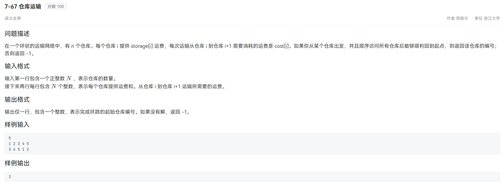

分析：贪心：从 `0` 开始遍历所有仓库，逐步累加 `remain`。当 `remain < 0` 时将下一个仓库 `i + 1` 设置为新的起点，重置 `remain`。

```java
import java.util.Scanner;

public class Main {
    public static void main(String[] args) {
        Scanner scanner = new Scanner(System.in);
        int N = scanner.nextInt();
        long[] storage = new long[N], cost = new long[N];
        for (int i = 0; i < N; i++) {
            storage[i] = scanner.nextLong();
        }
        for (int i = 0; i < N; i++) {
            cost[i] = scanner.nextLong();
        }
        long totalStorage = 0, totalCost = 0; // 计算总供给与总需求
        for (int i = 0; i < N; i++) {
            totalStorage += storage[i];
            totalCost += cost[i];
        }
        if (totalStorage < totalCost) { // 如果总供给小于总需求，无法完成环路
            System.out.println(-1);
            return;
        }
        int start = 0;
        long remain = 0;
        for (int i = 0; i < N; i++) { // 贪心算法寻找起点
            remain += (storage[i] - cost[i]);
            if (remain < 0) { // 从当前起点无法到达下一个仓库，重新设置起点
                start = i + 1;
                remain = 0;
            }
        }
        System.out.println(start);
    }
}
```