# 背包问题

## [目标和:0-1背包](https://leetcode.cn/problems/target-sum/)(494)

问题：给你一个非负整数数组 `nums` 和一个整数 `target` 。向数组中的每个整数前添加 `'+'` 或 `'-'` ，然后串联起所有整数，可以构造一个 **表达式** ：例如，`nums = [2, 1]` ，可以在 `2` 之前添加 `'+'` ，在 `1` 之前添加 `'-'` ，然后串联起来得到表达式 `"+2-1"` 。返回可以通过上述方法构造的、运算结果等于 `target` 的不同 **表达式** 的数目。

分析：记 `s` 为数组和，`p` 为正整数和，则有 `p - (s - p) = t`, `p = (s + t) / 2`，转化为容量恰好为 `capacity = (s + t) / 2`, `weight[i] = nums[i]` ，求方案数的 `0-1` 背包问题

```java
/* 一、递归搜索 + 保存计算结果 = 记忆化搜索 */
private int[] nums;
private int[][] cache;

private int dfs(int i, int c) {
    if (i < 1) {
        return c == 0 ? 1 : 0;  // 若容量恰好用完则有 1 种方案数，否则为 0
    }
    if (cache[i][c] != -1) {
        return cache[i][c];
    }
    if (c < nums[i - 1]) {  // 当前容量装不下物品 i
        return cache[i][c] = dfs(i - 1, c);
    } else {  // 当前容量可以装下物品 i
        return cache[i][c] = dfs(i - 1, c) + dfs(i - 1, c - nums[i - 1]);
    }
}

public int findTargetSumWays(int[] nums, int target) {
    for (int x : nums) {  // 计算 s + t
        target += x;
    }
    if (target < 0 || target % 2 == 1) { // s + t 不能是负数和奇数
        return 0;
    }
    target /= 2;  // 计算 capacity = (s + t) / 2
    int n = nums.length;
    this.nums = nums;
    cache = new int[n + 1][target + 1];
    for (int i = 0; i <= n; i++) {
        Arrays.fill(cache[i], -1);  // -1 表示没有访问过
    }
    return dfs(n, target);
}

/* 二、1:1 翻译成递推 */
public int findTargetSumWays2(int[] nums, int target) {
    for (int x : nums) {  // 计算 s + t
        target += x;
    }
    if (target < 0 || target % 2 == 1) {
        return 0;
    }
    target /= 2;  // 计算 (s + t) / 2
    int n = nums.length;
    int[][] dp = new int[n + 1][target + 1];  // 事实上，第0列为1（循环中完成），第0行剩余为0（默认）
    dp[0][0] = 1;  // 根据dfs定义，边界值为1当且仅当 i == 0 && c == 0（物品用完且容量用完）
    for (int i = 1; i <= n; i++) {
        for (int c = 0; c <= target; c++) {
            if (c < nums[i - 1]) {
                dp[i][c] = dp[i - 1][c];
            } else {
                dp[i][c] = dp[i - 1][c] + dp[i - 1][c - nums[i - 1]];
            }
        }
    }
    return dp[n][target];
}

/* 三、空间优化：两个数组（滚动数组） */
public int findTargetSumWays3(int[] nums, int target) {
    for (int x : nums) {  // 计算 s + t
        target += x;
    }
    if (target < 0 || target % 2 == 1) {
        return 0;
    }
    target /= 2;  // 计算 (s + t) / 2
    int n = nums.length;
    int[][] dp = new int[2][target + 1];
    dp[0][0] = 1;  // 根据dfs定义，边界值为1当且仅当 i == 0 && c == 0（物品用完且容量用完）
    for (int i = 1; i <= n; i++) {
        for (int c = 0; c <= target; c++) {
            if (c < nums[i - 1]) {
                dp[i % 2][c] = dp[(i - 1) % 2][c];
            } else {
                dp[i % 2][c] = dp[(i - 1) % 2][c] + dp[(i - 1) % 2][c - nums[i - 1]];
            }
        }
    }
    return dp[n % 2][target];
}

/* 四、空间优化：一个数组 */
public int findTargetSumWays4(int[] nums, int target) {
    for (int x : nums) {  // 计算 s + t
        target += x;
    }
    if (target < 0 || target % 2 == 1) {
        return 0;
    }
    target /= 2;  // 计算 (s + t) / 2
    int n = nums.length;
    int[] dp = new int[target + 1];
    dp[0] = 1;  // 根据dfs定义，边界值为1当且仅当 i == 0 && c == 0（物品用完且容量用完）
    for (int i = 1; i <= n; i++) {
        for (int c = target; c >= nums[i - 1]; c--) {
            dp[c] += dp[c - nums[i - 1]];
        }
    }
    return dp[target];
}
```

## [零钱兑换-完全背包](https://leetcode.cn/problems/coin-change/)(322)

问题：给你一个整数数组 `coins` ，表示不同面额的硬币；以及一个整数 `amount` ，表示总金额。计算并返回可以凑成总金额所需的 **最少硬币个数** 。如果没有任何一种硬币组合能组成总金额，返回 `-1` 。你可以认为每种硬币的数量是无限的。

分析：转化为容量恰好为 `capacity == amount`, `weight[i] = coins[i]`, `value[i] = 1` 求最小价值和的完全背包问题

```java
/* 一、递归搜索 + 保存计算结果 = 记忆化搜索 */
private int[] coins;
private int[][] cache;

private int dfs(int i, int c) {
    if (i < 1) {  // 硬币用完时，若容量==0则最少需要0个，若容量>0则最少需要无穷多个
        return c == 0 ? 0 : Integer.MAX_VALUE / 2;  // 除 2 是防止下面 + 1 溢出
    }
    if (cache[i][c] != -1) {
        return cache[i][c];
    }
    if (c < coins[i - 1]) {  // 当前容量装不下物品 i
        return cache[i][c] = dfs(i - 1, c);
    } else {  // 当前容量可以装下物品 i
        return cache[i][c] = Math.min(dfs(i - 1, c), dfs(i, c - coins[i - 1]) + 1);
    }
}

public int coinChange(int[] coins, int amount) {
    int n = coins.length;
    this.coins = coins;
    cache = new int[n + 1][amount + 1];
    for (int i = 0; i <= n; i++) {
        Arrays.fill(cache[i], -1);  // -1 表示没有访问过
    }
    int ans = dfs(n, amount);
    return ans != Integer.MAX_VALUE / 2 ? ans : -1;  // 若不为正无穷则是一个合法方案
}

/* 二、1:1 翻译成递推 */
public int coinChange2(int[] coins, int amount) {
    int n = coins.length;
    int[][] dp = new int[n + 1][amount + 1];  // 事实上，第0列为0（循环中完成），第0行剩余为正无穷
    for (int j = 1; j <= amount; j++) {  // 硬币用完时，若容量==0则最少需要0个，若容量>0则最少需要无穷多个
        dp[0][j] = Integer.MAX_VALUE / 2;  //  dp[0][0] = 0 （默认）
    }
    //  Arrays.fill(dp[0], Integer.MAX_VALUE / 2);  // 先初始化为正无穷
    //  dp[0][0] = 0;  // 再单独令 dp[0][0] = 0
    for (int i = 1; i <= n; i++) {
        for (int c = 0; c <= amount; c++) {
            if (c < coins[i - 1]) {
                dp[i][c] = dp[i - 1][c];
            } else {
                dp[i][c] = Math.min(dp[i - 1][c], dp[i][c - coins[i - 1]] + 1);
            }
        }
    }
    int ans = dp[n][amount];
    return ans != Integer.MAX_VALUE / 2 ? ans : -1;  // 若不为正无穷则是一个合法方案
}

/* 三、空间优化：两个数组（滚动数组） */
public int coinChange3(int[] coins, int amount) {
    int n = coins.length;
    int[][] dp = new int[2][amount + 1];  // 事实上，第0列为0（循环中完成），第0行剩余为正无穷
    for (int j = 1; j <= amount; j++) {  // 硬币用完时，若容量==0则最少需要0个，若容量>0则最少需要无穷多个
        dp[0][j] = Integer.MAX_VALUE / 2;  //  dp[0][0] = 0 （默认）
    }
    //  Arrays.fill(dp[0], Integer.MAX_VALUE / 2);  // 先初始化为正无穷
    //  dp[0][0] = 0;  // 再单独令 dp[0][0] = 0
    for (int i = 1; i <= n; i++) {
        for (int c = 0; c <= amount; c++) {
            if (c < coins[i - 1]) {
                dp[i % 2][c] = dp[(i - 1) % 2][c];
            } else {
                dp[i % 2][c] = Math.min(dp[(i - 1) % 2][c], dp[i % 2][c - coins[i - 1]] + 1);
            }
        }
    }
    int ans = dp[n % 2][amount];
    return ans != Integer.MAX_VALUE / 2 ? ans : -1;  // 若不为正无穷则是一个合法方案
}

/* 四、空间优化：一个数组 */
public int coinChange4(int[] coins, int amount) {
    int n = coins.length;
    int[] dp = new int[amount + 1];  // 事实上，第0列为0（循环中完成），第0行剩余为正无穷
    for (int j = 1; j <= amount; j++) {  // 硬币用完时，若容量==0则最少需要0个，若容量>0则最少需要无穷多个
        dp[j] = Integer.MAX_VALUE / 2;  //  dp[0] = 0 （默认）
    }
    //  Arrays.fill(dp, Integer.MAX_VALUE / 2);  // 先初始化为正无穷
    //  dp[0] = 0;  // 再单独令 dp[0] = 0
    for (int i = 1; i <= n; i++) {
        for (int c = coins[i - 1]; c <= amount; c++) {
            dp[c] = Math.min(dp[c], dp[c - coins[i - 1]] + 1);
        }
    }
    int ans = dp[amount];
    return ans != Integer.MAX_VALUE / 2 ? ans : -1;  // 若不为正无穷则是一个合法方案
}
```

## 大容量0-1背包

以 `0-1` 背包问题为例，当背包容量很大 `1 <= w`~i~`, v`~i~` <= 100` `1 <= capacity <= 10000` 时，使用原本的状态定义将 `capacity` 作为 `dp` 数组的第二维会有较高的时间复杂度，因此考虑交换状态与状态值，交换前后的状态定义如下：

* 交换前 `dp[i][j]`：前 `i` 个物品在**不超过重量** `j` 下的**最大价值和**

* 交换后 `dp[i][j]`：前 `i` 个物品在**价值和恰为** `j` 时的**最小总重量**

由于前 `0` 个物品中都不可选，初始值为 `dp[0][0] = 0, dp[0][1...v] = +∞`

* 当前操作：枚举第 `i` 个物品选或不选
* 子问题：价值和恰为 `j` 时，从前 `i` 个物品中选择的最小总重量
* 下一个子问题：
  * 不选：价值和恰为 `j` 时，从前 `i - 1` 个物品中选择的最小总重量
  * 选：价值和恰为 `j - v[i - 1]` 时，从前 `i - 1` 个物品中选择的最小总重量
* 怎么递归：不可选时直接继承；可选时比较选与不选取 `min`

注意：交换状态和状态值后答案不是 `dp[n][v]`，而是对应于满足 `dp[n][j] <= capacity` 的最大的 `j`

```java
public static int zeroOneKnapsack(int[] weight, int[] value, int capacity) {
    int n = weight.length, v = n * 100; // 计算 MAX_V = MAX_N * MAX_VI
    int[][] dp = new int[n + 1][v + 1];  // dp[i][j] 表示前 i 个物品在价值和恰为 j 时的最小总重量
    for (int j = 1; j <= v; j++) { dp[0][j] = Integer.MAX_VALUE / 2; } // 初始化：没有物品时，价值和>0非法
    //  for (int i = 0; i <= n; i++) { dp[i][0] = 0; } // 初始化：没有价值时，容量为0（一般在循环中完成）
    for (int i = 1; i <= n; i++) {  // 只拿前 i 件物品（注意 weight 和 value 的下标都为 i - 1）
        for (int j = 0; j <= v; j++) {  // 价值和恰为 j 时
            dp[i][j] = dp[i - 1][j];  // 不选，继承上一次的最小值
            if (value[i - 1] <= j) {  // 若能选，则比较选和不选的大小，并取最小者
                if (dp[i - 1][j - value[i - 1]] + weight[i - 1] < dp[i - 1][j]) {
                    dp[i][j] = dp[i - 1][j - value[i - 1]] + weight[i - 1];
                }
            }
        }
    }
    int res = 0;
    for(int j = 0; j <= v; j++){ // 答案是满足 dp[n][j] <= capacity 的最大的 j
        if(dp[n][j] <= capacity){
            res = j;
        }
    }
    return res;
}
```

## 超大完全背包

问题：有重量和价值分别为 `w[i], v[i]` 的 `n` 个物品。从中挑选总重量不超过 `W` 的物品，求所有挑选方案中价值总和的最大值。其中，`1 <= n <= 40, 1 <= w[i], v[i], W <= 10`^15^。

分析：**折半枚举**：由于最大重量 `W` 和最大价值 `V` 都是很大的数，因此 dp 求解的 `O(nW)` 或 `O(nV)` 复杂度很高。相比之下 `n` 比较小，利用这一特点设计算法。但挑选物品的方法共有 `2`^n^ 种，**无法枚举所有元素的组合，但是可以拆成两半后再枚举**。复杂度为 `O(n*2`^n/2^`)`

* 枚举前半部分所有子集计算 `(w1, v1)`，并存储到TreeMap中
* 接着去除前半段的 `(w1, v1)` 中低性价比（重量更高但是价值更低）的元素
* 枚举后半部分所有子集计算 `(w2, v2)`，目标是从存储到TreeMap的 `(w1, v1)` 中高效寻找 `max{v1 | w1 <= W - w2}`
  * 注：由于筛选后所有的 `w1[i] < w1[j]` 对应 `v1[i] < v1[j]`，因此查找最大的 `v1` 等价于查找最大的 `w1`。由于TreeMap是有序的，可以利用二分查找降低复杂度，或直接利用自带的API `TreeMap.floorEntry(t)`

```java
import java.util.*;

public static int superUnboundedKnapsack(int[] weights, int[] values, int capacity) {
    int n = weights.length; // 物品数量
    int n2 = n / 2; // 前半部分的物品数量
    TreeMap<Long, Long> weightValueMap = new TreeMap<>(); // 存储前半部分<重量, 价值>，TreeMap自动按重量升序
    for (int i = 0; i < (1 << n2); i++) { // 枚举前半部分所有组合（子集）
        long totalWeight = 0, totalValue = 0;
        for (int j = 0; j < n2; j++) {
            if ((i >> j & 1) == 1) {
                totalWeight += weights[j];
                totalValue += values[j];
            }
        }
        long currentMaxValue = weightValueMap.getOrDefault(totalWeight, 0L); // 如果相同重量，存储最大价值
        if (totalValue > currentMaxValue) {
            weightValueMap.put(totalWeight, totalValue);
        }
    }
    TreeMap<Long, Long> filteredWeightValueMap = new TreeMap<>(); // 去除低性价比的元素
    long maxValue = 0;
    for (Map.Entry<Long, Long> entry : weightValueMap.entrySet()) {
        if (entry.getValue() > maxValue) { // 由于已按重量升序排序，只需要遍历并保留更大价值的元素
            maxValue = entry.getValue();
            filteredWeightValueMap.put(entry.getKey(), entry.getValue());
        }
    }
    weightValueMap = filteredWeightValueMap;
    long res = 0;
    for (int i = 0; i < (1 << (n - n2)); i++) { // 枚举后半部分所有组合（子集）并求解
        long totalWeight = 0, totalValue = 0;
        for (int j = 0; j < (n - n2); j++) {
            if ((i >> j & 1) == 1) {
                totalWeight += weights[n2 + j];
                totalValue += values[n2 + j];
            }
        }
        if (totalWeight <= capacity) { // 找到capacity - totalWeight最大可行的重量对应的价值
            // TreeMap.floorEntry(t): 查找<=t的最大key对应的Map.Entry
            Map.Entry<Long, Long> entry = weightValueMap.floorEntry(capacity - totalWeight);
            if (entry != null) {
                res = Math.max(result, totalValue + entry.getValue());
            }
        }
    }
    return res;
}
```

## 多重部分和

问题：有 `n` 种不同大小的数字 `nums[i]`，每种各 `counts[i]` 个。判断是否可以从这些数字中选出若干，使得和为 `target`。

分析：显然第二种状态定义的方式更好，复杂度更低。一般用 dp 求 boolean 结果会浪费空间，同样的复杂度能存储更多信息。在本问题中，我们不仅求出是否能加和，同时计算出加和后当前数 `nums[i]` 剩余多少个，用同样的空间获取了更多的信息，以减少复杂度。

* `dp[i][j]`：用前 `i` 个数字是否能选出若干使得和为 `j`，即需要能用前 `i − 1` 种数字加和成 `j, j − nums[i - 1], ..., j − counts[i] * nums[i - 1]` 中的某一种，复杂度为 $$ O(target * \sum_{i} counts_{i}) $$
  * `dp[i][j] |= dp[i - 1][j - k * nums[i - 1]]`，其中 `0 <= k <= counts[i - 1], k * nums[i - 1] <= j`
* **`dp[i][j]`：用前 `i` 个数字选出若干使得和为 `j` 时，第 `i` 个数最多剩余的数量（不能则为 `-1`）**，复杂度为 `O(n * target)`
  * **若前 `i−1` 个数能加和出 `j`，第 `i` 个数就可以留下 `counts[i-1]` 个**。若 `dp[i-1][j] >= 0`，则 `dp[i][j] = counts[i-1]`
  * **若前`i`个数加和为`j-nums[i-1]`时第`i`个数还剩下`k` ，加和为`j`时就剩下`k-1`个**，即：
  * 若 `j < nums[i-1] || dp[i][j - nums[i-1]] <= 0`，则 `dp[i][j] = -1`，否则`dp[i][j] = dp[i][j - nums[i-1]] - 1`

```java
public static boolean multiPartialSum(int[] nums, int[] counts, int target) {
    int n = nums.length;
    int[][] dp = new int[n + 1][target + 1]; // 用前i个数字选出若干使得和为j时，第i个数最多剩余的数量（不能则为-1）
    dp[0][0] = 0; // 没有数字时，加和为0，合法
    for (int j = 1; j <= target; j++) { dp[0][j] = -1; } // 没有数字时，无法加和为 j(>=1)，非法
    for (int i = 1; i <= n; i++) {
        for (int j = 0; j <= target; j++) {
            if (dp[i - 1][j] >= 0) { // 若前 i−1 个数能加和出 j，第 i 个数就可以留下 counts[i-1] 个
                dp[i][j] = counts[i - 1];
            } else if (j < nums[i - 1] || dp[i][j - nums[i - 1]] <= 0) {
                dp[i][j] = -1;
            } else { // 若前 i 个数加和为 j-nums[i-1] 时第 i 个数还剩下 k，加和为 j 时就剩下 k-1 个
                dp[i][j] = dp[i][j - nums[i - 1]] - 1;
            }
        }
    }
    return dp[n][target] >= 0; // dp[n][target] != -1
}
```

# 线性DP

## [打家劫舍](https://leetcode.cn/problems/house-robber/)(198)

问题：你是一个专业的小偷，计划偷窃沿街的房屋。每间房内都藏有一定的现金，影响你偷窃的唯一制约因素就是相邻的房屋装有相互连通的防盗系统，**如果两间相邻的房屋在同一晚上被小偷闯入，系统会自动报警**。给定一个代表每个房屋存放金额的非负整数数组，计算你 **不触动警报装置的情况下** ，一夜之内能够偷窃到的最高金额。

分析：第一个房间号从 `1` 开始编号，预留出 `0` 的位置使得从 `i = 1` 开始循环时无需处理 `i - 1` 时的负数下标；但由于本题还可以递归到 `i - 2`，故需从 `i = 2` 开始循环，并对 `dp[1]` 初始化

 * 当前操作：枚举第 `i` 个房子选或不选
 * 子问题：从前 `i` 个房子中得到的最大金额和
 * 下一个子问题：
   * 不选 `i` ：从前 `i - 1` 个房子中得到的最大金额和
   * 选 `i`：从前 `i - 2` 个房子中得到的最大金额和
 * 怎么递归：不选时直接继承，选时加上当前物品价值，最后二者取 `max`

```java
/* 一、递归搜索 + 保存计算结果 = 记忆化搜索 */
private int[] nums, cache;

private int dfs(int i) { // dfs(i) 定义为从前 i 个房子中得到的最大金额和
    if (i <= 0) {  // 第一个房间号用 1 而不是 0 表示
        return 0;
    }
    if (cache[i] != -1) {  // 如果 dfs(i) 被计算过，则直接从 cache 数组中获取
        return cache[i];
    }
    return cache[i] = Math.max(dfs(i - 1), dfs(i - 2) + nums[i - 1]);  // 将每次新计算出的 dfs(i) 计入 cache 数组中
}

public int rob(int[] nums) {
    this.nums = nums;
    int n = nums.length;
    cache = new int[n + 1];
    Arrays.fill(cache, -1);  // 将 cache 数组初始化为 -1
    return dfs(n);
}

/* 二、1:1 翻译成迭代 */
public int rob2(int[] nums) {
    int n = nums.length;
    int[] dp = new int[n + 1]; // dp[i] 定义为从前 i 个房子中得到的最大金额和
    dp[1] = nums[0];  // 初始化
    for (int i = 2; i <= n; i++) {
        dp[i] = Math.max(dp[i - 1], dp[i - 2] + nums[i - 1]);
    }
    return dp[n];
}

/* 三、空间优化 */
public int rob3(int[] nums) {
    int n = nums.length;
    int dp0 = 0, dp1 = nums[0];  // 初始化
    for (int i = 2; i <= n; i++) {
        int newdp = Math.max(dp1, dp0 + nums[i - 1]);
        dp0 = dp1;
        dp1 = newdp;
    }
    return dp1;
}
```

## [最长公共子序列-LCS](https://leetcode.cn/problems/longest-common-subsequence/)(1143)

问题：给定两个字符串 `text1` 和 `text2`，返回这两个字符串的最长 **公共子序列** 的长度。如果不存在 **公共子序列** ，返回 `0` 。一个字符串的 **子序列** 是指这样一个新的字符串：它是由原字符串在不改变字符的相对顺序的情况下删除某些字符（也可以不删除任何字符）后组成的新字符串。例如，`"ace"` 是 `"abcde"` 的子序列，但 `"aec"` 不是 `"abcde"` 的子序列。两个字符串的 **公共子序列** 是这两个字符串所共同拥有的子序列。

分析：默认**子数组(`subarray`)与子串(`substring`)连续，子序列(`subsequence`)不连续**，**子序列本质就是 选或不选**，考虑最后一对字母 `s[i],t[j]`

 * 当前操作：考虑 `s[i]` 和 `t[j]` 选或不选
 * 子问题：`s[1...i]` 和 `t[1...j]` 的 `LCS` 长度
 * 下一个子问题：
   * 选 `s[i]`：`s[1...i-1]` 和 `t[1...j]` 的 `LCS` 长度
   * 选 `t[j]`：`s[1...i]`  和 `t[1...j-1]` 的 `LCS` 长度
   * 都选/都不选： `s[1...i-1]` 和 `t[1...j-1]` 的 `LCS` 长度
 * 怎么递归：
   * `s[i] == t[j]` 时，递归到 `3.3`（都选），并且 `dp` 值 `+1`
   * `s[i] != t[j]` 时，递归到 `3.1` 与 `3.2`，并取 `max`

```java
/* 一、递归搜索 + 保存计算结果 = 记忆化搜索 */
private char[] s, t;
private int[][] cache;

private int dfs(int i, int j) {  // 表示 s[1...i] 和 t[1...j] 的LCS长度
    if (i < 1 || j < 1) {  // 当有一个字符串遍历完时，已经不存在公共子序列
        return 0;
    }
    if (cache[i][j] != -1) {
        return cache[i][j];
    }
    if (s[i - 1] == t[j - 1]) {
        return cache[i][j] = dfs(i - 1, j - 1) + 1;
    } else {
        return cache[i][j] = Math.max(dfs(i - 1, j), dfs(i, j - 1));
    }
}

public int longestCommonSubsequence(String text1, String text2) {
    s = text1.toCharArray();
    t = text2.toCharArray();
    int m = s.length, n = t.length;
    cache = new int[m + 1][n + 1];
    for (int i = 0; i <= m; i++) {
        Arrays.fill(cache[i], -1);  // -1 表示没有访问过
    }
    return dfs(m, n);
}

/* 二、1:1 翻译成递推 */
public int longestCommonSubsequence2(String text1, String text2) {
    char[] s = text1.toCharArray(), t = text2.toCharArray();
    int m = s.length, n = t.length;
    // dp[i][j] 定义为 s[1...i] 和 t[1...j] 的 LCS 长度
    int[][] dp = new int[m + 1][n + 1];  // 边界条件的初始值默认为0
    for (int i = 1; i <= m; i++) {
        for (int j = 1; j <= n; j++) {
            if (s[i - 1] == t[j - 1]) {
                dp[i][j] = dp[i - 1][j - 1] + 1;
            } else {
                dp[i][j] = Math.max(dp[i - 1][j], dp[i][j - 1]);
            }
        }
    }
    return dp[m][n];
}

/* 三、空间优化：两个数组（滚动数组） */
public int longestCommonSubsequence3(String text1, String text2) {
    char[] s = text1.toCharArray(), t = text2.toCharArray();
    int m = s.length, n = t.length;
    int[][] dp = new int[2][n + 1];  // 边界条件的初始值默认为0
    for (int i = 1; i <= m; i++) {
        for (int j = 1; j <= n; j++) {
            if (s[i - 1] == t[j - 1]) {
                dp[i % 2][j] = dp[(i - 1) % 2][j - 1] + 1;
            } else {
                dp[i % 2][j] = Math.max(dp[(i - 1) % 2][j], dp[i % 2][j - 1]);
            }
        }
    }
    return dp[m % 2][n];
}

/* 四、空间优化：一个数组 */
public int longestCommonSubsequence4(String text1, String text2) {
    char[] s = text1.toCharArray(), t = text2.toCharArray();
    int m = s.length, n = t.length;
    int[] dp = new int[n + 1];  // 边界条件的初始值默认为0
    for (int i = 1; i <= m; i++) {
        for (int j = 1, pre = 0; j <= n; j++) {  // pre 存储左上角被覆盖的值 dp[i - 1][j - 1]
            int tmp = dp[j];  // 暂存当前的 dp[j] 会成为下一次循环的 dp[j - 1](pre)
            if (s[i - 1] == t[j - 1]) {
                dp[j] = pre + 1;
            } else {
                dp[j] = Math.max(dp[j], dp[j - 1]);
            }
            pre = tmp;  // 每次循环结束更新 pre
        }
    }
    return dp[n];
}
```

## [编辑距离](https://leetcode.cn/problems/edit-distance/)(72)

问题：给你两个单词 `word1` 和 `word2`， *请返回将 `word1` 转换成 `word2` 所使用的最少操作数* 。你可以对一个单词进行如下三种操作：

- 插入一个字符
- 删除一个字符
- 替换一个字符

分析：子序列本质就是 选或不选，考虑最后一对字母 `s[i], t[j]`

 * 当前操作：考虑 `s[i]` 和 `t[j]` 选或不选
 * 子问题：`s[1...i]` 到 `t[1...j]` 的最少操作数
 * 下一个子问题：
   * 删除操作-选 `s[i]`：`s[1...i-1]` 到 `t[1...j]` 的最少操作数
   * 插入操作-选 `t[j]`：`s[1...i]` 到 `t[1...j-1]` 的最少操作数
   * 替换操作-都选：`s[1...i-1]` 到 `t[1...j-1]` 的最少操作数
   * 无操作-都不选：`s[1...i-1]` 到 `t[1...j-1]` 的最少操作数
 * 怎么递归：
   * `s[i] == t[j]` 时，递归到 `3.4`（都不选）
   * `s[i] != t[j]` 时，递归到 `3.1`(删除)，`3.2`(插入)，`3.3`(替换)，并取 `min` 后 `+1`

```java
/* 一、递归搜索 + 保存计算结果 = 记忆化搜索 */
private char[] s, t;
private int[][] cache;

private int dfs(int i, int j) {  // 表示 s[1...i] 到 t[1...j] 的最少操作数
    if (i <= 0) {  // 当字符串 s 遍历完时，返回字符串 t 的长度 j 作为最小操作数
        return j;
    }
    if (j <= 0) {  // 当字符串 t 遍历完时，返回字符串 s 的长度 i 作为最小操作数
        return i;
    }
    if (cache[i][j] != -1) {
        return cache[i][j];
    }
    if (s[i - 1] == t[j - 1]) {  // s[i] == t[j] 时，无需操作，都不选递归到上一层
        return cache[i][j] = dfs(i - 1, j - 1);
    } else {  // s[i] != t[j] 时，比较三种操作的最小操作数，并加上本次操作+1
        return cache[i][j] = Math.min(Math.min(dfs(i - 1, j), dfs(i, j - 1)), dfs(i - 1, j - 1)) + 1;
    }
}

public int minDistance(String text1, String text2) {
    s = text1.toCharArray();
    t = text2.toCharArray();
    int m = s.length, n = t.length;
    cache = new int[m + 1][n + 1];
    for (int i = 0; i <= m; i++) {
        Arrays.fill(cache[i], -1);  // -1 表示没有访问过
    }
    return dfs(m, n);
}

/* 二、1:1 翻译成递推 */
public int minDistance2(String text1, String text2) {
    char[] s = text1.toCharArray(), t = text2.toCharArray();
    int m = s.length, n = t.length;
    int[][] dp = new int[m + 1][n + 1]; // dp[i][j] 表示 s[1...i] 到 t[1...j] 的最少操作数
    for (int j = 0; j <= n; j++) {  // 当字符串 s 遍历完时，返回字符串 t 的长度 j 作为最小操作数
        dp[0][j] = j;
    }
    //  for (int i = 0; i <= m; i++) { dp[i][0] = i; }  // 将第 0 列的初始化放入第一重循环中，更加节省时间
    for (int i = 1; i <= m; i++) {
        dp[i][0] = i;  // 当字符串 t 遍历完时，返回字符串 s 的长度 i 作为最小操作数
        for (int j = 1; j <= n; j++) {
            if (s[i - 1] == t[j - 1]) {
                dp[i][j] = dp[i - 1][j - 1];
            } else {
                dp[i][j] = Math.min(Math.min(dp[i - 1][j], dp[i][j - 1]), dp[i - 1][j - 1]) + 1;
            }
        }
    }
    return dp[m][n];
}

/* 三、空间优化：两个数组（滚动数组） */
public int minDistance3(String text1, String text2) {
    char[] s = text1.toCharArray(), t = text2.toCharArray();
    int m = s.length, n = t.length;
    int[][] dp = new int[2][n + 1];
    for (int j = 0; j <= n; j++) {  // 当字符串 s 遍历完时，返回字符串 t 的长度 j 作为最小操作数
        dp[0][j] = j;
    }
    //  for (int i = 0; i <= m; i++) { dp[i % 2][0] = i; }  // 将第 0 列的初始化放入第一重循环中，更加节省时间
    for (int i = 1; i <= m; i++) {
        dp[i % 2][0] = i;  // 当字符串 t 遍历完时，返回字符串 s 的长度 i 作为最小操作数
        for (int j = 1; j <= n; j++) {
            if (s[i - 1] == t[j - 1]) {
                dp[i % 2][j] = dp[(i - 1) % 2][j - 1];
            } else {
                dp[i % 2][j] = Math.min(Math.min(dp[(i - 1) % 2][j], dp[i % 2][j - 1]), dp[(i - 1) % 2][j - 1]) + 1;
            }
        }
    }
    return dp[m % 2][n];
}

/* 四、空间优化：一个数组 */
public int minDistance4(String text1, String text2) {
    char[] s = text1.toCharArray(), t = text2.toCharArray();
    int m = s.length, n = t.length;
    int[] dp = new int[n + 1];
    for (int j = 0; j <= n; j++) {  // 当字符串 s 遍历完时，返回字符串 t 的长度 j 作为最小操作数
        dp[j] = j;
    }
    //  for (int i = 0; i <= m; i++) { dp[0] = i; }  // 将第 0 列的初始化放入第一重循环中，更加节省时间
    for (int i = 1; i <= m; i++) {
        for (int j = 1, pre = dp[0]++; j <= n; j++) {  // pre 存储左上角被覆盖的值 dp[i - 1][j - 1], 初始化 dp[0] = i
            int tmp = dp[j];  // 暂存当前的 dp[j] 会成为下一次循环的 dp[j - 1](pre)
            if (s[i - 1] == t[j - 1]) {
                dp[j] = pre;
            } else {
                dp[j] = Math.min(Math.min(dp[j], dp[j - 1]), pre) + 1;
            }
            pre = tmp;  // 每次循环结束更新 pre
        }
    }
    return dp[n];
}
```

## [最长递增子序列-LIS](https://leetcode.cn/problems/longest-increasing-subsequence/)(300)

问题：给你一个整数数组 `nums` ，找到其中最长**严格递增**子序列的长度。**子序列** 是由数组派生而来的序列，删除（或不删除）数组中的元素而不改变其余元素的顺序。例如，`[3,6,2,7]` 是数组 `[0,3,1,6,2,2,7]` 的子序列。

解法1：若对 `nums` 数组排序去重，再与 `nums` 本身求[最长公共子序列](#[最长公共子序列-LCS](https://leetcode.cn/problems/longest-common-subsequence/)(1143)) `LCS`，即得到最长递增子序列 `LIS`。若非严格递增则无需去重

解法2：子序列本质上是数组的一个子集，故采用子集型回溯的方式思考

 * 思路1-选或不选：为了比较大小，还需要知道上一个选的数字的下标
 * 思路2-枚举选哪个：比较当前选的数字和下一个要选的数字，只需要知道当前所选数字的下标（优于思路1）

将原问题如下分解为子问题，最终答案为遍历各子问题并取 `max`

 * 当前操作：枚举 `j < i && nums[j] < nums[i]` 的数字 `nums[j]`
 * 子问题：以 `nums[i]` 结尾的 `LIS` 长度
 * 下一个子问题：以 `nums[j]` 结尾的 `LIS` 长度
 * 怎么递归：枚举所有满足要求的 `j` ，将其求 `max` 再 `+1`，得到当前子问题 `i` 的值

```java
/* 一、递归搜索 + 保存计算结果 = 记忆化搜索 */
private int[] nums, cache;

private int dfs(int i) { // 以 nums[i] 结尾的 LIS 长度
    if (cache[i] > 0) {
        return cache[i];
    }
    for (int j = 1; j < i; j++) {  // for循环保证了i递归到0时退出，因此无需写边界条件
        if (nums[j - 1] < nums[i - 1]) {
            cache[i] = Math.max(cache[i], dfs(j));  // 由于初始化为0，没有满足要求的j时恰好取max为0
        }
    }
    return ++cache[i];  // 算上第 i 个数 +1
}

public int lengthOfLIS(int[] nums) {
    this.nums = nums;
    int n = nums.length;
    cache = new int[n + 1];  // 本题可以初始化成 0，表示没有计算过
    int ans = 0;
    for (int i = 1; i <= n; i++) {
        ans = Math.max(ans, dfs(i));
    }
    return ans;
}

/* 若保持 Arrays.fill(cache, -1); 的初始化方式 */
private int dfs2(int i) {
    if (cache[i] != -1) {
        return cache[i];
    }
    int ans = 0;  // 定义每次递归的答案，默认为0
    for (int j = 1; j < i; j++) {  // for循环保证了i递归到0时退出，因此无需写边界条件
        if (nums[j - 1] < nums[i - 1]) {
            ans = Math.max(ans, dfs2(j));  // 不断更新 ans 为当前最大值
        }
    }
    return cache[i] = ++ans;  // 算上第 i 个数 +1
}

/* 二、1:1 翻译成递推 */
public int lengthOfLIS2(int[] nums) {
    int n = nums.length, ans = 0; 
    // dp[i] 定义为以 nums[i] 结尾的 LIS 长度
    int[] dp = new int[n + 1];  // 初始化为0，表示数组长度为0时LIS长度为0
    for (int i = 1; i <= n; i++) {
        for (int j = 1; j < i; j++) {
            if (nums[j - 1] < nums[i - 1]) { // 若非严格递增，改为 <=
                dp[i] = Math.max(dp[i], dp[j]);  // 不断更新 dp[i] 为目前遍历 dp[j] 的最大值
            }
        }
        ans = Math.max(ans, ++dp[i]);  // 不断更新 ans 为目前遍历 dp[i] 的最大值
    }
    return ans;
}

/* 三、选或不选的递推方法 */
public int lengthOfLIS3(int[] nums) {
    int n = nums.length;
    int[][] dp = new int[n + 1][n + 1];  // dp[i][pre] 表示第i个数字中比较了前pre个数字的LIS
    for (int i = 0; i < n; i++) {
        for (int pre = 0; pre < dp[i].length; pre++) {
            if (pre == n || nums[i] < nums[pre]) {
                dp[i + 1][pre] = Math.max(dp[i][i] + 1, dp[i][pre]);
            } else {
                dp[i + 1][pre] = dp[i][pre];
            }
        }
    }
    return dp[n][n];
}
```

解法3：交换 `dp` 数组状态与状态值，定义 `g[i]` 表示长度为 `i + 1` 的递增子序列 `IS` 的末尾元素**最小值**。定义为最小值，才更有机会扩展 `g[]` 的长度。由于没有重叠子问题，不是动态规划，而是**贪心**。

* 可以用反证法证明： **`g[]` 是严格递增**的
  * 推论1：一次只能更新一个位置
  * 推论2：更新的位置是**第一个 `>= nums[i]`** 的数的下标

算法：在 `g` 上用**二分查找**快速找到第一个 `>= nums[i]` 的下标 `j`，若 `j` 不存在，那么 `nums[i]` 直接加到 `j` 末尾；否则修改 `g[j]` 为 `nums[i]`

拓展：若非严格递增，则 `g[]` 也是非严格递增的，无需修改和 `nums[i]` 相同的 `g[j]`，而修改第一个 `> nums[i]` 的 `g[j]`，代码中将 `lowerBound()` 替换为 `upperBound()`

```java
private int lowerBound(Integer[] nums, int target) {
    /* 循环不变量：L-1始终为红色，R+1始终为蓝色
     * nums[left-1]  <  target 数组中 <target的染红色
     * nums[right+1] >= target 数组中>=target的染蓝色
     * */
    int left = 0, right = nums.length - 1;
    while (left <= right) { // 闭区间 [left, right] 不为空
        int mid = left + (right - left) / 2;
        if (nums[mid] < target) {  // 范围缩小到 [mid+1, right]
            left = mid + 1;
        } else { // 范围缩小到 [left, mid-1]
            right = mid - 1;
        }
    }
    return left;  // 或者 right + 1
}

/* 贪心 + 二分查找：额外空间 */
public int lengthOfLIS(int[] nums) {
    List<Integer> g = new ArrayList<>();  // g[i] 表示长度为 i + 1 的IS的末尾元素的最小值
    for (int x : nums) {
        int j = lowerBound(g.toArray(new Integer[g.size()]), x);
        if (j == g.size()) { // >=x 的 g[j] 不存在
            g.add(x);
        } else {
            g.set(j, x);
        }
    }
    return g.size();
}

private int lowerBound(int[] nums, int right, int target) {
    /* 循环不变量：L-1始终为红色，R+1始终为蓝色
     * nums[left-1]  <  target 数组中 <target的染红色
     * nums[right+1] >= target 数组中>=target的染蓝色
     * */
    int left = 0;
    while (left <= right) { // 闭区间 [left, right] 不为空
        int mid = left + (right - left) / 2;
        if (nums[mid] < target) {  // 范围缩小到 [mid+1, right]
            left = mid + 1;
        } else { // 范围缩小到 [left, mid-1]
            right = mid - 1;
        }
    }
    return left;  // 或者 right + 1
}

/* 贪心 + 二分查找：原地修改 */
public int lengthOfLIS2(int[] nums) {
    int ng = 0; // g 的长度
    for (int x : nums) {
        int j = lowerBound(nums, ng - 1, x);
        nums[j] = x;
        if (j == ng) { // >=x 的 g[j] 不存在
            ++ng;
        }
    }
    return ng;
}
```

# 计数DP

## 划分数

问题：有 `n` 个无区别的物品，将它们划分成不超过 `m` 组，求划分方法数模 `M` 的余数

状态定义：`dp[i][j]` 为 `j` 的 `i` 划分总数

状态转移：若考虑先取出 `k` 个，然后将剩下的 `j - k` 个分成 `i - 1` 份，即 $ dp[i][j]=\sum_{k=0}^{j} dp[i-1][j-k] $，会导致 `1+1+2` 和 `1+2+1` 重复计数。因此重新考虑 `j` 的 `i` 划分，设每个元素为 `a[k]`，即$ \sum_{k=1}^{i} a_k=j $，分两类情况转移：

* 存在 `a[k]‎  = = 0`：划分数等于去掉一个元素 `a[k] == 0` 的情况，即 `dp[i - 1][j]`
* 所有 `a[k] > 0`：划分数等于所有 `a[k] -‎ =  1` 的情况，即 `dp[i][j - i]`

这种划分方式保证了不会重复计算：首先这两种大类间互不冲突；其次对于类的内部，根据 `dp` 数组的定义 `dp[i - 1][j]` 和 `dp[i][j - i]` 都是不重复的，而对于它们的操作（增加划分次数，同时多加一个 `0`；不增加划分次数，每个值 `+1`）保证了这种不重复性。

```java
public static int partitionNumberDP(int n, int m, int M) {
    int[][] dp = new int[m + 1][n + 1];
    dp[0][0] = 1; // 初始化第0行：仅0划分成0有一种方法（不划分）
    for (int i = 1; i <= m; i++) {
        for (int j = 0; j <= n; j++) {
            if (j >= i) { // 两种情况的划分数求和
                dp[i][j] = (dp[i - 1][j] + dp[i][j - i]) % M;
            } else { // j < i 时有且仅有第二种情况成立
                dp[i][j] = dp[i - 1][j];
            }
        }
    }
    return dp[m][n];
}
```

## 多重集组合数

问题：有 `n` 种物品，第 `i` 种有 `nums[i]` 个，不同种类的物品可以互相区分但相同种类的无法区分，求取出 `m` 个的方案数模 `M` 的余数

状态定义：`dp[i][j]` 为从前 `i` 种物品中取出 `j` 个的方案（组合）总数

状态转移：为了从前 `i` 种物品中取出 `j` 个，可以从前 `i - 1` 种物品中取出 `j - k` 个，再从第 `i` 种物品中取出 `k` 个添加进来，即：
$$
dp[i][j]=\sum\limits_{k=0}^{min(j,nums[i-1])} dp[i-1][j-k] \\
= (\sum\limits_{k=0}^{min(j-1,nums[i-1])} dp[i-1][j-1-k]) + dp[i-1][j] - dp[i-1][j-1-nums[i-1]] \\
= dp[i][j-1] + dp[i-1][j] - dp[i-1][j-1-nums[i-1]]
$$

```java
public static void multisetCombinationCount(int n, int[] nums, int m, int M) {
    int[][] dp = new int[n + 1][m + 1];
    // dp[0][0] = 1; // 初始化第0行：仅0个物品取出0个有一种方法（不操作）
    for (int i = 0; i <= n; i++) { // 初始化第0列：所有物品都不取的情况只有一种方法
        dp[i][0] = 1;
    }
    for (int i = 1; i <= n; i++) { // 遍历所有物品
        for (int j = 1; j <= m; j++) { // 遍历组数
            if (j - 1 - nums[i - 1] >= 0) {
                dp[i][j] = (dp[i][j - 1] + dp[i - 1][j] - dp[i - 1][j - 1 - nums[i - 1]] + M) % M;
            } else {
                dp[i][j] = (dp[i][j - 1] + dp[i - 1][j]) % M;
            }
        }
    }
	return dp[n][m];
}
```

## 字符解密

问题：有一种错误的加密方式，分别将字符 `A ~ Z` 加密为 `1 ~ 26`，求一串密文共有多少种解密方式

分析：定义 `dp[i]` 是 `s[0…i]` 的所有解密数量，从后往前递归（从前往后递推）

* `s[i] == 0`: 单字符非法，需要判断组合是否合法
  * `s[i-1] == 1或2`: 仅能 `s[i-1]` 和 `s[i]` 组合，`dp[i] = dp[i-2]`
  * `s[i-1] != 1或2`: 非法组合，单字符也非法，`dp[i] = 0`
*  `s[i] != 0`: 单字符合法，额外考虑组合是否合法
  *  `s[i-1]` 和 `s[i]` 组合 `<=26`: 既能 `s[i-1]` 和 `s[i]` 组合，也能单字符，`dp[i] = dp[i-2] + dp[i-1]`
  * `s[i-1]` 和 `s[i]` 组合 `>26`: 非法组合，单字符合法，`dp[i] = dp[i-1]`

```java
public static int numDecodings(String s) {
    if (s == null || s.length() == 0 || s.charAt(0) == '0') { // 如果字符串为空或第一个字符是 '0'，直接返回 0
        return 0;
    }
    int n = s.length();
    int[] dp = new int[n + 1]; // 定义 dp 数组，dp[i] 表示 s[0...i-1] 的解码方式数
    dp[0] = 1; // 初始化 dp 数组，空字符串有一种解码方式（什么都不做）
    dp[1] = 1; // 第一个字符非 '0'，只有一种解码方式
    for (int i = 2; i <= n; i++) { // 动态规划计算 dp[i]
        char previous = s.charAt(i - 2), current = s.charAt(i - 1); // 获取前一个字符 s[i-2] 当前字符 s[i-1]
        if (current != '0') { // 当前字符非 '0'，可以作为单独的字母解码
            dp[i] += dp[i - 1]; // 由于初始值为0，等价于 dp[i] = dp[i - 1]
        }
        if (previous == '1' || (previous == '2' && current <= '6')) { // 检查两个字符是否可以组合成合法的字母
            dp[i] += dp[i - 2];
        }
    }
    return dp[n]; // 返回总解码方式数
}
```

# 状态机DP

## [买卖股票的最佳时机 II](https://leetcode.cn/problems/best-time-to-buy-and-sell-stock-ii/)(122)

问题：给你一个整数数组 `prices` ，其中 `prices[i]` 表示某支股票第 `i` 天的价格。在每一天，你可以决定是否购买和/或出售股票。你在任何时候 **最多** 只能持有 **一股** 股票。你也可以先购买，然后在 **同一天** 出售。返回 *你能获得的 **最大** 利润* 。

分析：

 * 当前操作：第 `i` 天未持有与持有的状态机图，共有如下四种操作
   * 未持有 `->` 未持有：`dp[i][0] = dp[i - 1`][0]
   * 未持有 `->`   持有：`dp[i][1] = dp[i - 1][0] - price[i]`
   * 持有 `->` 未持有：`dp[i][0] = dp[i - 1][1] + price[i]`
   * 持有 `->` 持有：`dp[i][1] = dp[i - 1][1]`
 * 子问题：到第 `i` 天结束时，未持有/持有股票的最大利润，分别定义为 `dp[i][0], dp[i][1]`
 * 下一个子问题：到第 `i - 1` 天结束时，未持有/未持有股票的最大利润，即 `dp[i - 1][0], dp[i - 1][1]`
 * 怎么递归：子问题的两个状态均可由下一个子问题的两种操作转移得来，取 `max` 即可
   * 有股票状态：买入股票，或保持持有股票，二者取 `max`
   * 无股票装填：卖出股票，或保持未持有股票，二者取 `max`

```java
/* 一、递归搜索 + 保存计算结果 = 记忆化搜索 */
private int[] prices;
private int[][] cache;

private int dfs(int i, int hold) { // 到第 i 天结束时，未持有/持有股票的最大利润
    if (i <= 0) {  // 若第0天未持有股票，最大利润为0；第0天不可能持有股票，最大利润为负无穷
        return hold == 1 ? Integer.MIN_VALUE : 0;
    }
    if (cache[i][hold] != -1) {
        return cache[i][hold];
    }
    if (hold == 1) { // 有股票状态：买入股票，或保持持有股票，二者取 max
        return cache[i][hold] = Math.max(dfs(i - 1, 0) - prices[i - 1], dfs(i - 1, 1));
    } else { // 无股票装填：卖出股票，或保持未持有股票，二者取 max
        return cache[i][hold] = Math.max(dfs(i - 1, 0), dfs(i - 1, 1) + prices[i - 1]);
    }
}

public int maxProfit(int[] prices) {
    this.prices = prices;
    int n = prices.length;
    cache = new int[n + 1][2];
    for (int i = 0; i <= n; i++)
        Arrays.fill(cache[i], -1); // -1 表示还没有计算过
    return dfs(n, 0);
}

/* 二、1:1 翻译成递推 */
public int maxProfit2(int[] prices) {
    int n = prices.length;
    int[][] dp = new int[n + 1][2]; // 到第 i 天结束时，未持有/持有股票的最大利润
    dp[0][1] = Integer.MIN_VALUE;  // 若第0天未持有股票，最大利润为0；第0天不可能持有股票，最大利润为负无穷
    for (int i = 1; i <= n; i++) {
        // 无股票装填：卖出股票，或保持未持有股票，二者取 max
        dp[i][0] = Math.max(dp[i - 1][0], dp[i - 1][1] + prices[i - 1]);
        // 有股票状态：买入股票，或保持持有股票，二者取 max
        dp[i][1] = Math.max(dp[i - 1][0] - prices[i - 1], dp[i - 1][1]);
    }
    return dp[n][0];
}

/* 三、空间优化 */
public int maxProfit3(int[] prices) {
    int n = prices.length;
    int dp0 = 0, dp1 = Integer.MIN_VALUE;  // 若第0天未持有股票，最大利润为0；第0天不可能持有股票，最大利润为负无穷
    for (int i = 1; i <= n; i++) {
        int new_dp0 = Math.max(dp0, dp1 + prices[i - 1]);
        dp1 = Math.max(dp0 - prices[i - 1], dp1);
        dp0 = new_dp0;
    }
    return dp0;
}
```

## [买卖股票的最佳时机含冷冻期](https://leetcode.cn/problems/best-time-to-buy-and-sell-stock-with-cooldown/)(309)

问题：给定一个整数数组`prices`，其中第 `prices[i]` 表示第 `*i*` 天的股票价格 。设计一个算法计算出最大利润。在满足以下约束条件下，你可以尽可能地完成更多的交易（多次买卖一支股票）:卖出股票后，你无法在第二天买入股票 (即冷冻期为 1 天)。**注意：**你不能同时参与多笔交易（你必须在再次购买前出售掉之前的股票）。

分析：由于有冷冻期，购买股票的前一天不能卖出，因此要 `dp[i][1]` 递归到 `dp[i - 2][0]`

 * 当前操作：第 `i` 天未持有与持有的状态机图，共有如下四种操作
   * 未持有 `->` 未持有：`dp[i][0] = dp[i - 1`][0]
   * 未持有 `-> ` 持有：`dp[i][1] = dp[i - 2][0] - price[i]`
   * 持有 `->` 未持有：`dp[i][0] = dp[i - 1][1] + price[i]`
   * 持有 `->` 持有：`dp[i][1] = dp[i - 1`][1]
 * 子问题：到第 `i` 天结束时，未持有/持有股票的最大利润，分别定义为 `dp[i][0], dp[i][1]`
 * 下一个子问题：到第 `i - 1` 天结束时，未持有/未持有股票的最大利润，即 `dp[i - 1][0], dp[i - 1`][1]
 * 怎么递归：子问题的两个状态均可由下一个子问题的两种操作转移得来，取 `max` 即可
   * 有股票状态：买入股票（注意冷冻期），或保持持有股票，二者取 `max`
   * 无股票状态：卖出股票，或保持未持有股票，二者取 `max`

```java
/* 一、递归搜索 + 保存计算结果 = 记忆化搜索 */
private int[] prices;
private int[][] cache;

private int dfs(int i, int hold) { // 到第 i 天结束时，未持有/持有股票的最大利润
    if (i < 1) {  // 若第0天未持有股票，最大利润为0；第0天不可能持有股票，最大利润为负无穷
        return hold == 1 ? Integer.MIN_VALUE : 0;
    }
    if (cache[i][hold] != -1) {
        return cache[i][hold];
    }
    if (hold == 1) { // 有股票状态：买入股票（注意冷冻期），或保持持有股票，二者取 max
        return cache[i][hold] = Math.max(dfs(i - 2, 0) - prices[i - 1], dfs(i - 1, 1));
    } else { // 无股票状态：卖出股票，或保持未持有股票，二者取 max
        return cache[i][hold] = Math.max(dfs(i - 1, 0), dfs(i - 1, 1) + prices[i - 1]);
    }
}

public int maxProfit(int[] prices) {
    this.prices = prices;
    int n = prices.length;
    cache = new int[n + 1][2];
    for (int i = 0; i <= n; i++)
        Arrays.fill(cache[i], -1); // -1 表示还没有计算过
    return dfs(n, 0);
}

/* 二、1:1 翻译成递推 */
public int maxProfit2(int[] prices) {
    int n = prices.length;
    int[][] dp = new int[n + 1][2]; // 到第 i 天结束时，未持有/持有股票的最大利润
    dp[0][1] = Integer.MIN_VALUE;  // 若第0天未持有股票，最大利润为0；第0天不可能持有股票，最大利润为负无穷
    dp[1][1] = -prices[0];  // 若第1天未持有股票，最大利润为0；若第1天持有股票，最大利润为 -prices[0]
    for (int i = 2; i <= n; i++) {
        // 无股票状态：卖出股票，或保持未持有股票，二者取 max
        dp[i][0] = Math.max(dp[i - 1][0], dp[i - 1][1] + prices[i - 1]);
        // 有股票状态：买入股票（注意冷冻期），或保持持有股票，二者取 max
        dp[i][1] = Math.max(dp[i - 2][0] - prices[i - 1], dp[i - 1][1]);
    }
    return dp[n][0];
}

/* 三、空间优化 */
public int maxProfit3(int[] prices) {
    int n = prices.length;
    int pre0 = 0, dp0 = 0, dp1 = Integer.MIN_VALUE;
    for (int i = 1; i <= n; i++) {
        int new_dp0 = Math.max(dp0, dp1 + prices[i - 1]);
        dp1 = Math.max(pre0 - prices[i - 1], dp1);  // dp0 改为 pre0，而 pre0 是上次更新前的 dp0 ，相当于 dp[i - 2][0]
        pre0 = dp0;
        dp0 = new_dp0;
    }
    return dp0;
}
```

## [买卖股票的最佳时机 IV](https://leetcode.cn/problems/best-time-to-buy-and-sell-stock-iv/)(188)

问题：给你一个整数数组 `prices` 和一个整数 `k` ，其中 `prices[i]` 是某支给定的股票在第 `i` 天的价格。设计一个算法来计算你所能获取的最大利润。你最多可以完成 `k` 笔交易。也就是说，你最多可以买 `k` 次，卖 `k` 次。**注意：**你不能同时参与多笔交易（你必须在再次购买前出售掉之前的股票）。

分析：既然有次数限制，就应当在递归的过程中记录次数，增加参数 `j` 表明至多完成 `j` 笔交易。那么转移方程在买入股票**或**卖出股票时，需要把交易次数 `-1`。因为**买入再卖出一个流程才算一次**，且有买入必然有卖出，因此在买入股票**或**卖出股票时任意改为 `j-1` 即可

 * 当前操作：第 `i` 天剩余交易次数为 j 时未持有与持有的状态机图，共有如下四种操作
   * 未持有 `->` 未持有：`dp[i][j][0] = dp[i - 1][j][0]`
   * 未持有 `->` 持有：`dp[i][j][1] = dp[i - 1][j - 1][0] - price[i]`  // 这里在买入时 `j--`
   * 持有 `->` 未持有：`dp[i][j][0] = dp[i - 1][j][1] + price[i]`  // 也可以在卖出时 `j--` 选其一即可
   * 持有 `->` 持有：`dp[i][j][1] = dp[i - 1][j][1]`
 * 子问题：到第 `i` 天结束时至多交易 `j` 次，未持有/持有股票的最大利润，分别定义为 `dp[i][j][0], dp[i][j][1]`
 * 下一个子问题：到第 `i - 1` 天结束时至多交易 `j` 或 `j - 1` 次，未持有/未持有股票的最大利润
 * 怎么递归：子问题的两个状态均可由下一个子问题的两种操作转移得来，取 `max` 即可
   * 有股票状态：买入股票（注意减少交易次数），或保持持有股票，二者取 `max`
   * 无股票装填：卖出股票，或保持未持有股票，二者取 `max`

```java
/* 一、递归搜索 + 保存计算结果 = 记忆化搜索 */
private int[] prices;
private int[][][] cache;

private int dfs(int i, int j, int hold) { // 到第 i 天结束时至多交易 j 次，未持有/持有股票的最大利润
    if (j < 0) {  // 若 j < 0 则不允许交易，初始化为负无穷；j == 0 时可以选择不交易，故需继续往下递归
        return Integer.MIN_VALUE / 2;  // 此时若 hold == 0 ，则可能会因为 - prices[i - 1] 向下溢出
    }
    if (i <= 0) {  // 此时一定有 j >= 0 ，因此只需判断 i 和 hold 的合法性
        return hold == 1 ? Integer.MIN_VALUE : 0;  // 若第0天未持有股票，最大利润为0；第0天不可能持有股票，最大利润为负无穷
    }
    if (cache[i][j][hold] != -1) {
        return cache[i][j][hold];
    }
    if (hold == 1) { // 有股票状态：买入股票（注意减少交易次数），或保持持有股票，二者取 max
        return cache[i][j][hold] = Math.max(dfs(i - 1, j - 1, 0) - prices[i - 1], dfs(i - 1, j, 1));
    } else { // 无股票装填：卖出股票，或保持未持有股票，二者取 max
        return cache[i][j][hold] = Math.max(dfs(i - 1, j, 0), dfs(i - 1, j, 1) + prices[i - 1]);
    }
}

public int maxProfit(int k, int[] prices) {
    this.prices = prices;
    int n = prices.length;
    cache = new int[n + 1][k + 1][2];
    for (int i = 0; i <= n; i++)
        for (int j = 0; j <= k; j++)
            Arrays.fill(cache[i][j], -1); // -1 表示还没有计算过
    return dfs(n, k, 0);
}

/* 二、1:1 翻译成递推 */
public int maxProfit2(int k, int[] prices) {
    int n = prices.length;
    int[][][] dp = new int[n + 1][k + 1][2]; // dp[i][j][]表示到第i天结束时至多交易j次，未持有/持有股票的最大利润
    for (int j = 0; j <= k; j++) {
        dp[0][j][1] = Integer.MIN_VALUE;  // 若第0天未持有股票，最大利润为0；第0天不可能持有股票，最大利润为负无穷
    }
    for (int i = 1; i <= n; i++) {
        dp[i][0][0] = Math.max(dp[i - 1][0][0], dp[i - 1][0][1] + prices[i - 1]);  // dp[i][j][0] 的特例
        dp[i][0][1] = dp[i - 1][0][1];  // dp[i][j][1] 的特例，注意j<0时不合法，故不考虑（取max时初始化为负无穷）
        for (int j = 1; j <= k; j++) {
            // 无股票装填：卖出股票，或保持未持有股票，二者取 max
            dp[i][j][0] = Math.max(dp[i - 1][j][0], dp[i - 1][j][1] + prices[i - 1]);
            // 有股票状态：买入股票（注意减少交易次数），或保持持有股票，二者取 max
            dp[i][j][1] = Math.max(dp[i - 1][j - 1][0] - prices[i - 1], dp[i - 1][j][1]);
        }
    }
    return dp[n][k][0];
}

/* 三、空间优化 */
public int maxProfit3(int k, int[] prices) {
    int n = prices.length;
    int[][] dp = new int[k + 1][2];
    for (int j = 0; j <= k; j++) {
        dp[j][1] = Integer.MIN_VALUE;  // 若第0天未持有股票，最大利润为0；第0天不可能持有股票，最大利润为负无穷
    }
    for (int i = 1; i <= n; i++) {
        dp[0][0] = Math.max(dp[0][0], dp[0][1] + prices[i - 1]);  // dp[j][0] 的特例
        for (int j = 1; j <= k; j++) {
            dp[j][0] = Math.max(dp[j][0], dp[j][1] + prices[i - 1]);  // dp[j][0] 需要用到上次 dp[j][1] 的结果，先计算
            dp[j][1] = Math.max(dp[j - 1][0] - prices[i - 1], dp[j][1]);
        }
    }
    return dp[k][0];
}
```

推广情况：只需初始化第一维为 `0` 的情况，第二维为 `0` 的情况可以在第一重循环中通过特殊化赋值
 * 至多 `k` 次：
   * `dp[0][0...k][0] = 0`
   * `dp[0][0...k][1] = Integer.MIN_VALUE / 2`
 * 恰好 `k` 次：
   * `dp[0][0][0] = 0`
   * `dp[0][1...k][0] = Integer.MIN_VALUE / 2`
   * `dp[0][0...k][1] = Integer.MIN_VALUE / 2`
 * 至少 `k` 次：至少 0 次等价于[无限次交易](#[买卖股票的最佳时机 II](https://leetcode.cn/problems/best-time-to-buy-and-sell-stock-ii/)(122))
   * `dp[0][0][0] = 0`
   * `dp[0][1...k][0] = Integer.MIN_VALUE / 2`
   * `dp[0][0...k][1] = Integer.MIN_VALUE / 2`

# 区间DP

## [最长回文子序列长-LPS](https://leetcode.cn/problems/longest-palindromic-subsequence/)(516)

问题：给你一个字符串 `s` ，找出其中最长的回文子序列，并返回该序列的长度。子序列定义为：不改变剩余字符顺序的情况下，删除某些字符或者不删除任何字符形成的一个序列。

解法1：求 `s` 和反转后 `t` 的[最长公共子序列](#[最长公共子序列-LCS](https://leetcode.cn/problems/longest-common-subsequence/)(1143)) `LCS`

```java
public int longestPalindromeSubseq(String s) {
    String t = new StringBuffer(s).reverse().toString();  // 利用StringBuffer.reverse()方法反转字符串
    return longestCommonSubsequence2(s, t);  // 调用求 LCS 的方法
}

public int longestCommonSubsequence2(String text1, String text2) { // 动态规划求LCS
    char[] s = text1.toCharArray(), t = text2.toCharArray();
    int m = s.length, n = t.length;
    // dp[i][j] 定义为 s[1...i] 和 t[1...j] 的 LCS 长度
    int[][] dp = new int[m + 1][n + 1];  // 边界条件的初始值默认为0
    for (int i = 1; i <= m; i++) {
        for (int j = 1; j <= n; j++) {
            if (s[i - 1] == t[j - 1]) {
                dp[i][j] = dp[i - 1][j - 1] + 1;
            } else {
                dp[i][j] = Math.max(dp[i - 1][j], dp[i][j - 1]);
            }
        }
    }
    return dp[m][n];
}
```

解法2：子序列本质上是选或不选：从两侧向内缩小问题规模

 * 当前操作：考虑 `s[i]` 和 `s[j]` 选或不选
 * 子问题：`s[i...j]` 的 `LPS` 长度
 * 下一个子问题：
   * 选 `s[i]`：`s[i+1...j]` 的 `LPS` 长度
   * 选 `s[j]`：`s[i...j-1]` 的 `LPS` 长度
   * 都选/都不选：`s[i+1...j-1]` 的 `LPS` 长度
 * 怎么递归：
   * `s[i] == s[j]` 时，递归到 `3.3`（都选），并且 `dp` 值 `+2`
   * `s[i] != s[j]` 时，递归到 `3.1` 与 `3.2`，并取 `max`

```java
/* 一、递归搜索 + 保存计算结果 = 记忆化搜索 */
private char[] s;
private int[][] cache;

private int dfs(int i, int j) { // s[i...j] 的 LPS 长度
    if (i > j) {  // 空串
        return 0;
    }
    if (i == j) {  // 只有一个字母
        return 1;
    }
    if (cache[i][j] != -1) {
        return cache[i][j];
    }
    if (s[i - 1] == s[j - 1]) {  // 都选
        return cache[i][j] = dfs(i + 1, j - 1) + 2;
    } else {  // 比较选 s[i] 或 s[j]
        return cache[i][j] = Math.max(dfs(i + 1, j), dfs(i, j - 1));
    }
}

public int longestPalindromeSubseq1(String S) {
    s = S.toCharArray();
    int n = s.length;
    cache = new int[n + 1][n + 1];
    for (int i = 0; i <= n; i++) {
        Arrays.fill(cache[i], -1); // -1 表示还没有计算过
    }
    return dfs(1, n);
}

/* 二、1:1 翻译成递推
 * 注意循环顺序：
 * dp[i][] 需要从 dp[i + 1][] 转移过来，所以 i 需要倒序枚举
 * dp[][j] 需要从 dp[][j - 1] 转移过来，所以 j 需要正序枚举
 * */
public int longestPalindromeSubseq2(String S) {
    char[] s = S.toCharArray();
    int n = s.length;
    // dp[i][j] 定义为 s[i...j] 的 LPS 长度
    int[][] dp = new int[n + 1][n + 1];  // 默认初始化为0，因此 i > j 时的初始化不用考虑
    //  dp[n][n] = 1;  // 若 i 从 n - 1 开始倒序枚举，则需要单独考虑 i == n 时的情况，此时只需初始化 dp[n][n] = 1
    for (int i = n; i >= 1; i--) {
        dp[i][i] = 1;  // 从小区间转移到大区间，i == j 时初始化为1，顺便初始化了 dp[n][n] = 1
        for (int j = i + 1; j <= n; j++) {  // 事实上，for循环保证了 j > i ，因此无需考虑 i > j 时的情况
            if (s[i - 1] == s[j - 1]) {
                dp[i][j] = dp[i + 1][j - 1] + 2;
            } else {
                dp[i][j] = Math.max(dp[i + 1][j], dp[i][j - 1]);
            }
        }
    }
    return dp[1][n];
}

/* 三、空间优化 */
public int longestPalindromeSubseq3(String S) {
    char[] s = S.toCharArray();
    int n = s.length;
    int[] dp = new int[n + 1];  // 默认初始化为0，因此 i > j 时的初始化不用考虑
    //  dp[n] = 1;  // 若 i 从 n - 1 开始倒序枚举，则需要单独考虑 i == n 时的情况，此时只需初始化 dp[n] = 1
    for (int i = n; i > 0; i--) {
        dp[i] = 1;  // 从小区间转移到大区间，i == j 时初始化为1，顺便初始化了 dp[n][n] = 1
        int pre = 0;  // dp[i + 1][i] = 0
        for (int j = i + 1; j <= n; j++) {  // 事实上，for循环保证了 j > i ，因此无需考虑 i > j 时的情况
            int tmp = dp[j];  // 本次的 dp[j] 会成为下一次的 dp[j - 1]
            if (s[i - 1] == s[j - 1]) {
                dp[j] = pre + 2;
            } else {
                dp[j] = Math.max(dp[j], dp[j - 1]);
            }
            pre = tmp;  // 更新 pre 值为 dp[i + 1][j - 1]
        }
    }
    return dp[n];
}
```

拓展：给定一个字符串 `s`，在任意位置插入任意字符使其成为回文串，则最少插入次数为 `n - lps`

## 分割回文串的最少次数

问题：给你一个字符串 `s` ，将其分割使得每个子串都是回文串，求最少的分割次数。

分析：定义 `dp[i]` 是 `s[0…i]` 的最少分割次数，从后往前递归（从前往后递推）

则有 `dp[i] = min{dp[j] | 0<=j<i && s[j+1…i]是回文串} + 1`，为此需要先判断 `s` 的每个子串是否为回文串

区间dp： `dp[i][j] = dp[i+1][j-1] && (s[i]==s[j]); dp[i][j] = True if (i>=j)`

## [多边形三角剖分的最低得分](https://leetcode.cn/problems/minimum-score-triangulation-of-polygon/)(1039)

问题：你有一个凸的 `n` 边形，其每个顶点都有一个整数值。给定一个整数数组 `values` ，其中 `values[i]` 是第 `i` 个顶点的值（即 **顺时针顺序** ）。假设将多边形 **剖分** 为 `n - 2` 个三角形。对于每个三角形，该三角形的值是顶点标记的**乘积**，三角剖分的分数是进行三角剖分后所有 `n - 2` 个三角形的值之和。返回 *多边形进行三角剖分后可以得到的最低分* 。

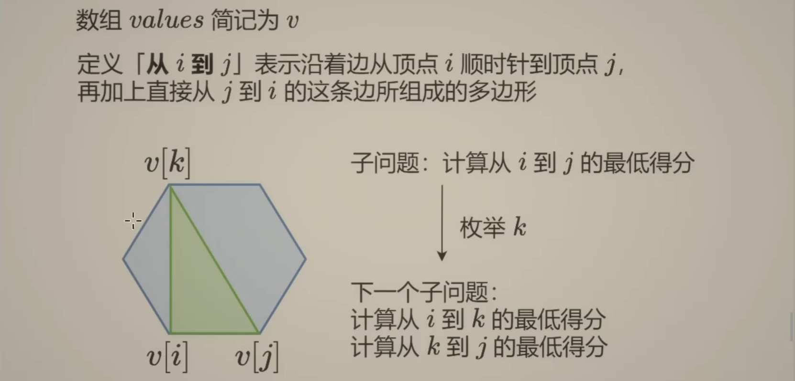

分析：采用枚举选哪个：分割成多个规模更小的子问题。定义**从 `i` 到 `j`** 表示沿着边从顶点 `i` 顺时针到顶点 `j` ，再加上从 `j` 到 `i` 这条边组成的多边形。定义 `dp[i][j]` 是**从 `i` 到 `j`** 这个多边形的最低得分

 * 当前操作：枚举**从 `i` 到 `j`** 这个多边形之间的中间顶点 `k`
 * 子问题：计算**从 `i` 到 `j`** 这个多边形的最低得分
 * 下一个子问题：计算**从 `i` 到 `k`** 这个多边形与**从 `k` 到 `j`** 这个多边形的最低得分

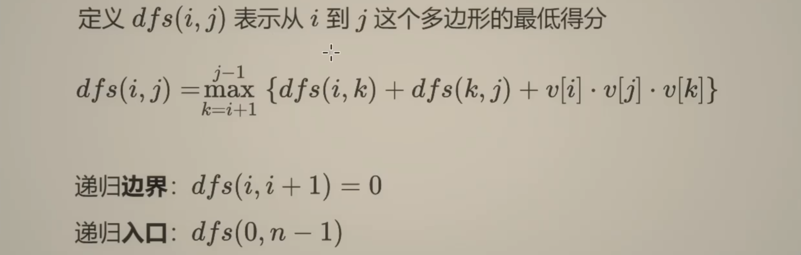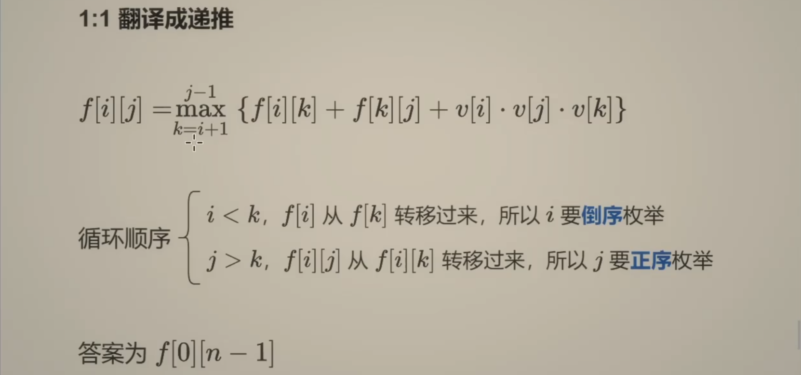

```java
/* 一、递归搜索 + 保存计算结果 = 记忆化搜索 */
private int[] values;
private int[][] cache;

private int dfs(int i, int j) { // 表示从 i 到 j 这个多边形的最低得分
    if (i + 1 == j) {  // 只有两个点，无法组成三角形
        return 0;
    }
    if (cache[i][j] != -1) {
        return cache[i][j];
    }
    int res = Integer.MAX_VALUE;
    for (int k = i + 1; k < j; k++) {  // 枚举从 i 到 j 这个多边形之间的中间顶点 k
        res = Math.min(res, dfs(i, k) + dfs(k, j) + values[i - 1] * values[k - 1] * values[j - 1]);  // 不断更新最小值
    }
    return cache[i][j] = res;
}

public int minScoreTriangulation(int[] values) {
    this.values = values;
    int n = values.length;
    cache = new int[n + 1][n + 1];
    for (int i = 0; i <= n; i++) {
        Arrays.fill(cache[i], -1);  // -1 表示没有访问过
    }
    return dfs(1, n);
}

/* 二、1:1 翻译成递推
 * 注意循环顺序：
 * dp[i][] 需要从 dp[k][] 转移过来，所以 i 需要倒序枚举
 * dp[][j] 需要从 dp[][k] 转移过来，所以 j 需要正序枚举
 * */
public int minScoreTriangulation2(int[] values) {
    int n = values.length;
    // dp[i][j] 定义为从 i 到 j 这个多边形的最低得分
    int[][] dp = new int[n + 1][n + 1];  // 默认初始化为0，因此 i + 1 == j 时的初始化不用考虑
    for (int i = n - 2; i >= 1; i--) {  // i == n - 2 时剩余三个点恰好能构成三角形
        for (int j = i + 2; j <= n; j++) {  // j 至少要与 i 隔 2 个单位，这样中间才能塞下 k
            dp[i][j] = Integer.MAX_VALUE;  // 为了后续不断取 min
            for (int k = i + 1; k <= j - 1; k++) {  // 枚举 k 时，i + 1 <= k <= j - 1
                dp[i][j] = Math.min(dp[i][j], dp[i][k] + dp[k][j] + values[i - 1] * values[k - 1] * values[j - 1]);
            }
        }
    }
    return dp[1][n];
}
```

## 取弹珠

问题：在一根管道中有偶数堆弹珠 `nums`，玩家 `0` 和玩家 `1` 轮流从管道的一端取走一堆弹珠（即只能从弹珠堆的头或尾取出）。两位玩家都会尽力让他们最后拿到的弹珠的总数量最大化。给定弹珠的堆数 `n` 和每堆弹珠的数量，由玩家 `0` 先手，请你输出最后可以拥有更多弹珠的玩家。题目保证弹珠的总数量为奇数，不会出现平局。

分析：先手必胜策略：由于堆数为偶数，且总和为奇数，因此可以按照偶数编号、奇数编号分为堆数相同、总和不同的两组。只需要先手选择总和更多的一组，则后手方只能选择另一组，此后先手方只需每次都选择本组，后手方每次只能选择另一组。

进阶：去除堆数为偶数，总和为奇数的条件限制，输出最后可以拥有更多弹珠的玩家（平局算1赢）

分析：区间dp：定义 `dp[i][j]` 是**剩余 `nums[i...j]` 的弹珠堆可选时，当前玩家在最优策略下和对方的最大数量差值**

初始化：`i > j, dp[i][j] = 0；i == j, dp[i][j] = nums[i - 1]`

状态转移方程：`i < j, dp[i][j] = max(nums[i - 1] - dp[i + 1][j], nums[j - 1] - dp[i][j - 1])`

最终判断 `dp[0][n-1]` 的正负性，得出获胜玩家或平局情况

```java
public static int maxDifference(int[] nums) {
    int n = nums.length;
    int[][] dp = new int[n + 1][n + 1];
    for (int i = 1; i <= n; i++) {
        dp[i][i] = nums[i - 1];
    }
    for (int len = 2; len <= n; len++) { // len 是区间长度
        for (int i = 1; i <= n - len + 1; i++) {
            int j = i + len - 1; // 区间的右端点
            // 当前玩家在最优策略下与对方的最大差值
            dp[i][j] = Math.max(nums[i - 1] - dp[i + 1][j], nums[j - 1] - dp[i][j - 1]);
        }
    }
    return dp[1][n] > 0 ? 0 : 1;
}
```

# 树形DP

## [二叉树的直径](https://leetcode.cn/problems/diameter-of-binary-tree/)(543)

问题：给你一棵二叉树的根节点，返回该树的 **直径** 。二叉树的 **直径** 是指树中任意两个节点之间最长路径的 **长度** 。这条路径可能经过也可能不经过根节点 `root` 。两节点之间路径的 **长度** 由它们之间边数表示。


分析：遍历二叉树，在计算最长链的同时，顺带把直径算出来

 * 在当前结点**拐弯**的直径长度 = (左子树最长链 + 1) + (右子树最长链 + 1)
 * 返回给父结点：以当前结点为根的子树的最长链 = `max`(左子树最长链 + 1, 右子树最长链 + 1)

```java
private int ans;

private int dfs(TreeNode node) {  // 返回值是以 node 为根的子树的最长链
    if (node == null) {
        return -1;  // 下面 +1 后，对于叶子节点就刚好是 0
    }
    int lLen = dfs(node.left) + 1;  // 左子树最长链 + 1
    int rLen = dfs(node.right) + 1;  // 右子树最长链 + 1
    ans = Math.max(ans, lLen + rLen);  // 两条链拼成路径
    return Math.max(lLen, rLen);  // 当前子树最大链长
}

public int diameterOfBinaryTree(TreeNode root) {
    dfs(root);
    return ans;
}
```

## [二叉树中的最大路径和](https://leetcode.cn/problems/binary-tree-maximum-path-sum/)(124)

问题：二叉树中的 **路径** 被定义为一条节点序列，序列中每对相邻节点之间都存在一条边。同一个节点在一条路径序列中 **至多出现一次** 。该路径 **至少包含一个** 节点，且不一定经过根节点。**路径和** 是路径中各节点值的总和。给你一个二叉树的根节点 `root` ，返回 **最大路径和** 

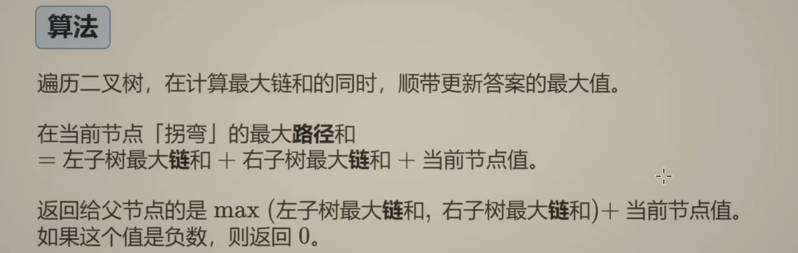

分析：遍历二叉树，在计算最大链和的同时，顺带更新答案（最大路径和）的最大值
 * 在当前结点**拐弯**的最大路径和 = 左子树最大链和 + 右子树最大链和 + 当前结点值
 * 返回给父结点：以当前结点为根的子树的最大链和 = `max`(左子树最大链和, 右子树最大链和) + 当前结点值
   * 如果值是负数，一定不能选，返回 `0`

```java
private int ans = Integer.MIN_VALUE;  // 要求最大值，且至少包含一个结点（可能为负数），故初始化为最小值

private int dfs(TreeNode node) {  // 返回值是以 node 为根的子树的最大链和
    if (node == null) {
        return 0;  // 没有节点，和为 0
    }
    int lVal = dfs(node.left);  // 左子树最大链和，且 lVal >= 0
    int rVal = dfs(node.right);  // 右子树最大链和，且 rVal >= 0
    // 由于至少包含一个结点，所以当前结点必选（即使为负数），左右子树为负数时可以不选（取max后返回0）
    ans = Math.max(ans, lVal + rVal + node.val);  // 两条链拼成路径
    // 此时当前结点已经计入答案，返回值是供父结点选择的，因此需要保证返回值至少为0（若某子树为负数则父结点不选）
    return Math.max(Math.max(lVal, rVal) + node.val, 0);  // 当前子树最大链和，如果是负数就不选（取max后返回0）
}

public int maxPathSum(TreeNode root) {
    dfs(root);
    return ans;
}
```

## [相邻字符不同的最长路径](https://leetcode.cn/problems/longest-path-with-different-adjacent-characters/)(2246)

问题：给你一棵 **树**（即一个连通、无向、无环图），根节点是节点 `0` ，这棵树由编号从 `0` 到 `n - 1` 的 `n` 个节点组成。用下标从 **0** 开始、长度为 `n` 的数组 `parent` 来表示这棵树，其中 `parent[i]` 是节点 `i` 的父节点，由于节点 `0` 是根节点，所以 `parent[0] == -1` 。另给你一个字符串 `s` ，长度也是 `n` ，其中 `s[i]` 表示分配给节点 `i` 的字符。请你找出路径上任意一对相邻节点都没有分配到相同字符的 **最长路径** ，并返回该路径的长度。

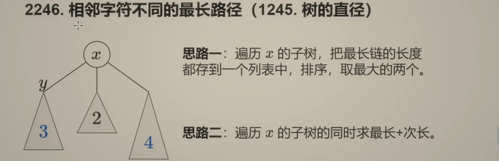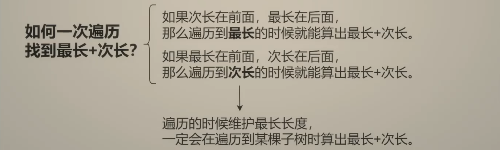

分析：邻居：如果两个结点有边相连（父结点与子结点），则其互为邻居。如果没有相邻节点的限制，那么本题求的就是树的直径上的点的个数，见 Q1245。

 * 思路一：遍历 `x` 的子树，把最长链的长度存入列表，排序并取最大的两个
 * 思路二：遍历 `x` 的子树同时求 最长 + 次长
   * 次长在前，最长在后：遍历到最长时可计算出 最长 + 次长
   * 最长在前，次长在后：遍历到次长时可计算出 最长 + 次长
   * 因此在遍历时维护最长路径长度，则一定会在遍历到某棵子树时算出 最长 + 次长

```java
List<List<Integer>> adj = new ArrayList<>();  // 类似邻接表， adj[i] 存储结点 i 的邻居（孩子）
String s;
private int ans;

private int dfs(int x) {  // 以 x 为根结点的最长链长
    int maxLen = 0;  // 初始化为0，如果for循环无孩子就直接return，因此实际是将叶子结点初始化为0（空结点需初始化为-1）
    for (int y : adj.get(x)) {  // 遍历 x 的所有邻居 y（孩子）
        int len = dfs(y) + 1;  // 计算 x 从当前子结点 y 出发的最长路径
        if (s.charAt(y) != s.charAt(x)) {  // 确保相邻的字符不同，否则 ans 与 maxLen 均不更新（相当于当前子结点 y 作废）
            ans = Math.max(ans, maxLen + len);  // 更新答案为 最长 + 当前 取max，一定能取到 最长 + 次长
            maxLen = Math.max(maxLen, len);  // 更新以 x 为根结点的最长链长
        }
    }
    return maxLen;  // 将最长链长返回给父结点
}

/* 若 x 的邻居包含父结点 */
private int dfs(int x, int parent) {  // 以 x 为根结点的最长链长
    int maxLen = 0;  // 初始化为0，如果for循环无孩子就直接return，因此实际是将叶子结点初始化为0（空结点需初始化为-1）
    for (int y : adj.get(x)) {  // 遍历 x 的所有邻居 y（孩子）
        if (y == parent) {  // 不需要遍历父结点
            continue;
        }
        int len = dfs(y, x) + 1;  // 计算 x 从当前子结点 y 出发的最长路径（x 是 y 的父结点）
        if (s.charAt(y) != s.charAt(x)) {  // 确保相邻的字符不同，否则 ans 与 maxLen 均不更新（相当于当前子结点 y 作废）
            ans = Math.max(ans, maxLen + len);  // 更新答案为 最长 + 当前 取max，一定能取到 最长 + 次长
            maxLen = Math.max(maxLen, len);  // 更新以 x 为根结点的最长链长
        }
    }
    return maxLen;  // 将最长链长返回给父结点
}

public int longestPath(int[] parent, String s) {  // parent[i] 存储结点 i 的父结点
    this.s = s;
    int n = parent.length;
    for (int i = 0; i <= n - 1; i++) {  // 初始化数组的第二维
        adj.add(new ArrayList<>());  // 第一维的初始化体现在不断 add 中
    }
    for (int i = 1; i <= n - 1; i++) {  // 0是根结点，故从1开始构造邻接表
        int father = parent[i];
        adj.get(father).add(i);
    }
    dfs(0);
    //  dfs(0, -1);
    return ans + 1;  // 路径上点的数量 = 边的数量 + 1
}
```

## [打家劫舍 III-树上最大独立集](https://leetcode.cn/problems/house-robber-iii/)(337)

问题：小偷又发现了一个新的可行窃的地区。这个地区只有一个入口，我们称之为 `root` 。除了 `root` 之外，每栋房子有且只有一个“父“房子与之相连。一番侦察之后，聪明的小偷意识到“这个地方的所有房屋的排列类似于一棵二叉树”。 如果 **两个直接相连的房子在同一天晚上被打劫** ，房屋将自动报警。给定二叉树的 `root` 。返回 ***在不触动警报的情况下** ，小偷能够盗取的最高金额* 。

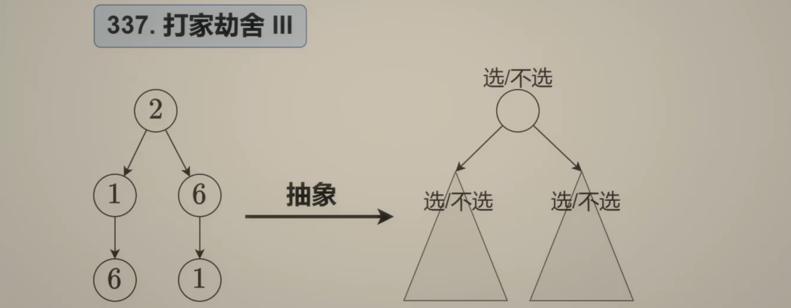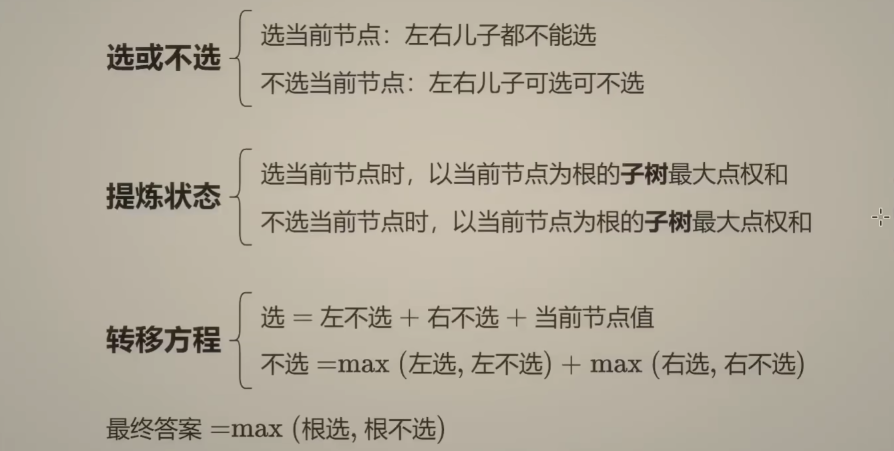

分析：最大独立集：从图（树）中选择尽量多的点，使这些点互不相邻（变形：最大点权和）

 * 当前操作：枚举每个结点选或不选
 * 子问题：选/不选，以当前结点为根的子树最大点权和
 * 下一个子问题：
   * 选当前结点：左右儿子都不选
   * 不选当前结点：左右儿子选/不选
 * 怎么递归：
   * 选当前结点：左儿子不选 + 右儿子不选 + 当前结点值
   * 不选当前结点：`max`(左儿子选/不选) + `max`(右儿子选/不选)

```java
private int[] dfs(TreeNode node) { // 表示以选/不选node时，以node为根的子树最大点权和
    if (node == null) {   // 没有节点，怎么选都是 0
        return new int[]{0, 0};
    }
    int[] left = dfs(node.left);  // 递归左子树
    int[] right = dfs(node.right);  // 递归右子树
    int rob = left[1] + right[1] + node.val;  // 选当前结点，左右儿子都不选
    int notRob = Math.max(left[0], left[1]) + Math.max(right[0], right[1]);  // 不选当前结点
    return new int[]{rob, notRob};  // 返回当前结点选与不选时，以当前结点为根的子树最大点权和
}

public int rob(TreeNode root) {
    int[] res = dfs(root);
    return Math.max(res[0], res[1]);  // 根节点选或不选的最大值即为答案
}
```

## [监控二叉树-树上最小支配集](https://leetcode.cn/problems/binary-tree-cameras/)(968)

问题：给定一个二叉树，我们在树的节点上安装摄像头。节点上的每个摄影头都可以监视**其父对象、自身及其直接子对象。**计算监控树的所有节点所需的最小摄像头数量。

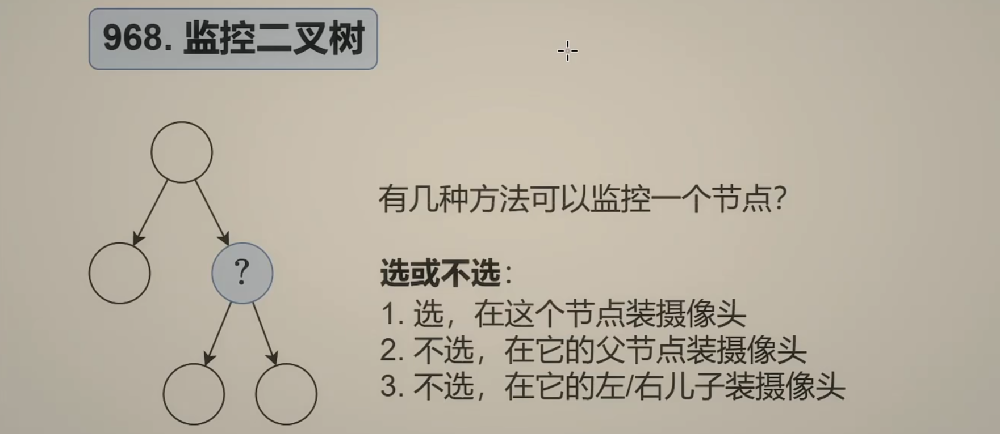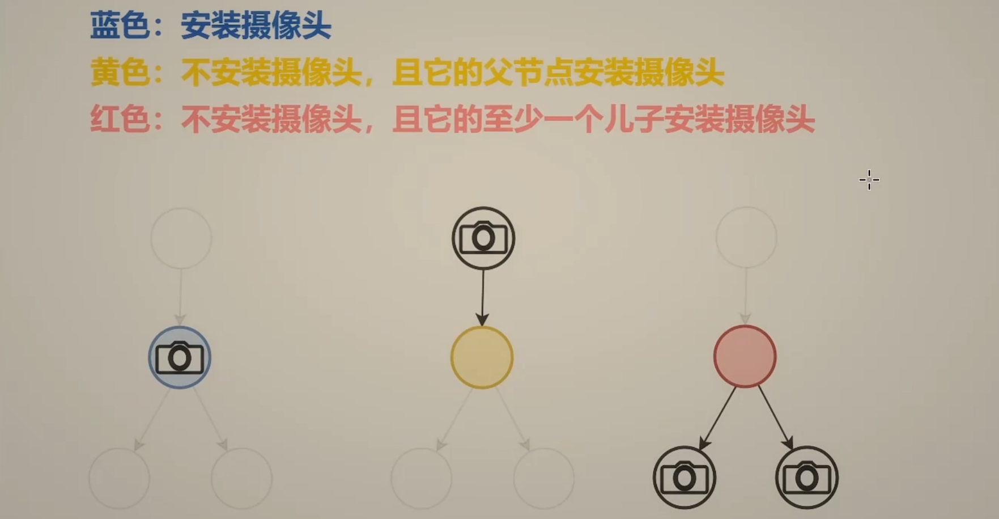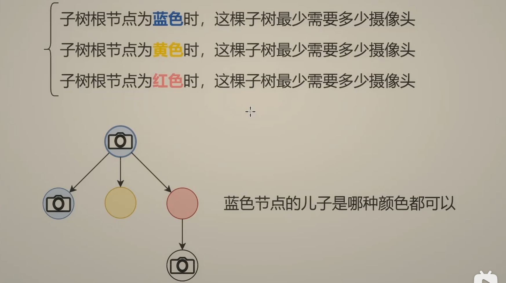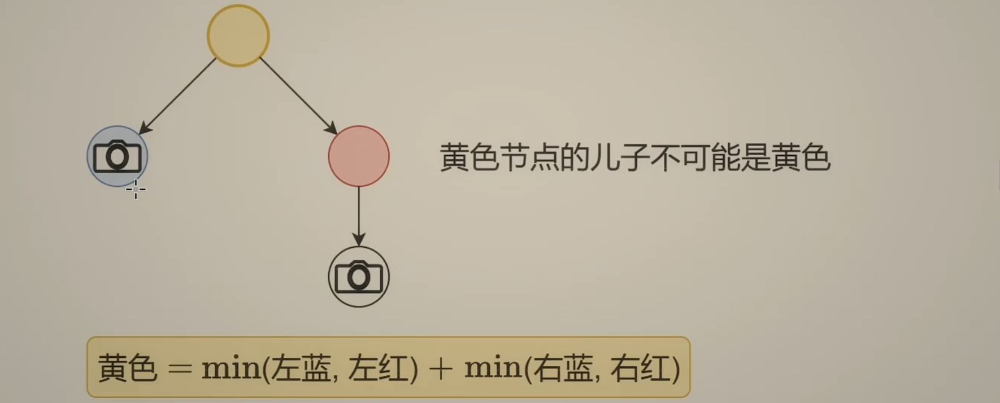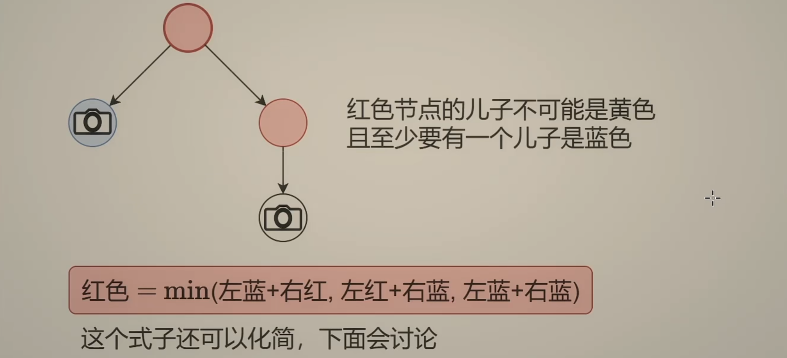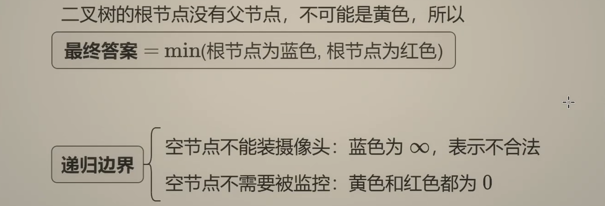

```java
private int[] dfs(TreeNode node) { // 返回蓝/黄/红三种方式监控node时，以node为根的子树最小监控数量
    if (node == null) {
        return new int[]{Integer.MAX_VALUE / 2, 0, 0}; // 除 2 防止加法溢出
    }
    int[] left = dfs(node.left);
    int[] right = dfs(node.right);
    int choose = Math.min(left[0], left[1]) + Math.min(right[0], right[1]) + 1; // 蓝，cost[node] = 1
    int byFa = Math.min(left[0], left[2]) + Math.min(right[0], right[2]); // 黄
    int byChildren = Math.min(Math.min(left[0] + right[2], left[2] + right[0]), left[0] + right[0]); //红
    return new int[]{choose, byFa, byChildren};
}

public int minCameraCover(TreeNode root) {
    int[] res = dfs(root);
    return Math.min(res[0], res[2]);
}
```

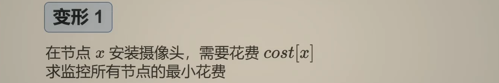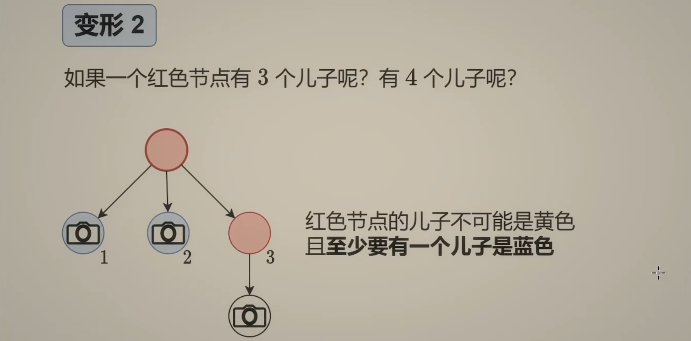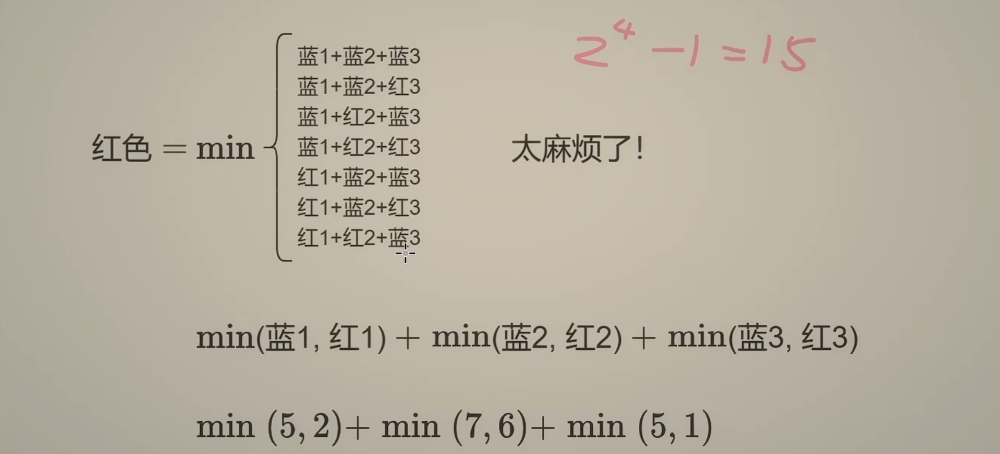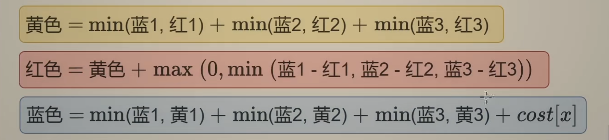

* 按照计算黄色的方式计算红色，只有在红色都比蓝色小的情况下是错误的（因为此时全部选择红色不合法），因此只需要修正这种情况即可。既然至少有一个蓝色儿子，就**把其中`蓝色 - 红色`最小得到儿子改成蓝色**，若本身就有`蓝色 <= 红色`则无需修改。
* 上述分析可知一定有`红色 >= 黄色`，因此计算蓝色的公式中取 `min` 时可不考虑红色

# 数位DP

## 整数区间数位的出现次数

问题：有两个正整数 `a, b`，求区间 `[a, b]` 的所有整数中，每个数码 `(0 ~ 9)` 出现了多少次

分析：**前缀和+数位dp**：满 `i` 位的所有数字中各数字出现次数 `dp[i]` 可分为**前 `i - 1` 位的贡献**和**第 `i` 位的贡献**

* 前 `i-1` 位的贡献为 `10 * dp[i-1]` 因为第 `i` 位 有 `10` 种选择因此前 `i-1` 位重复了 `10` 次
* 第 `i` 位的贡献为 `10`^(i-1)^ 因为第 `i` 位的每个数字会出现 `10`^(i-1)^ 次

例计算`3102`：⾸先计算 `dp[0]=0, dp[1]=1,  dp[2]=20, dp[3]=300, dp[4]=4000` 接着**从高位**第 `4` 位的 `3` **向低位**第 `1` 位的 `2` 计算

* 第 `4` 位取 `<3(=0,1,2)` 时前 `3` 位任意取值 `000~999`，对各数字贡献为 `3 * dp[3]`；第 `4` 位对小于 `3` 的数字也有贡献，为 `10`^3^
* 第 `4` 位取 `3` 时前 `3` 位取值 `000~102`，前 `3` 位的贡献不好计算，递归到后面处理；第 `4` 位对 `3` 的贡献为 `103(000~102)`
* 减去第 `4` 位对前导 `0` 的贡献，为 `10`^3^
* 此时剩余 `3000~3142` 的前 `3` 位贡献值未处理，递归到第 `3` 位进行处理，转化为求 `102`

注：由于 `a, b` 都是正整数，本题不考虑 `0` 的情况，代码将 `0` 归入前导 `0` 不会出错

```java
private static long[] mi; // 存储10的幂：1, 10, 100, 1000, ...
private static long[] dp; // 存储满 i 位的所有数字中各数字出现次数：0, 1, 20, 300, 4000, ...

private static int getLen(long x){ // 获取数字 x 的长度 len
    if (x == 0){
        return 1;
    }
    int len = 0;
    while (x > 0) {
        len++;
        x /= 10;
    }    
    return len;
}

private static long[] countDigitsUpTo(long x) { // 计算从 0 到 x 中每个数字（0~9）出现的次数（前缀和）
    long[] count = new long[10];
    int len = getLen(x);
    for (int i = len; i >= 1; i--) { // 从高位向低位遍历计算
        int num = (int)(x / mi[i - 1]); // 获取第i位数字
        for (int j = 0; j < 10; j++) { // 第i位<num时，前i-1位任意取值，有dp[i-1]种
            count[j] += dp[i - 1] * num;
        }
        for (int j = 0; j < num; j++) { // 第i位对<num的数也有贡献，有mi[i-1]种
            count[j] += mi[i - 1];
        }
        x -= mi[i - 1] * num; // x减去第i位后，还剩i-1位的值
        count[num] += x + 1; // 第i位取num时，有x+1种
        count[0] -= mi[i - 1]; // 减去第i位对前导0的贡献，有mi[i - 1]种
    }
    return count;
}

public static long[] countDigitsInRange(long a, long b) {
    int len = getLen(b); // b 的长度
    mi = new long[len];
    dp = new long[len];
    mi[0] = 1;
    for (int i = 1; i < len; i++) {
        dp[i] = dp[i - 1] * 10 + mi[i - 1];
        mi[i] = 10L * mi[i - 1];
    }
    long[] countA = countDigitsUpTo(a - 1); // 计算从 0 到 (a-1) 的每个数字出现的次数（前缀和）
    long[] countB = countDigitsUpTo(b); // 计算从 0 到 b 的每个数字出现的次数（前缀和）   
    long[] result = new long[10]; // 计算区间 [a, b] 内每个数字出现的次数
    for (int i = 0; i <= 9; i++) {
        result[i] = countB[i] - countA[i];
    }
    return result;
}
```

# 状态压缩DP

## [优美的排列](https://leetcode.cn/problems/beautiful-arrangement/)(526)

问题（**排列型1相邻无关**）：假设有从 1 到 n 的 n 个整数。用这些整数构造一个数组 `perm`（**下标从 1 开始**），只要满足下述条件 **之一** ，该数组就是一个 **优美的排列** ：`perm[i]` 能够被 `i` 整除或 `i` 能够被 `perm[i]` 整除。给你一个整数 `n` ，返回可以构造的 **优美排列数量**

分析：从全排列的思路出发，用一个集合 `S` 存储选过的数，不断枚举剩下的数，由于这些都是**和原问题相似的、规模更小的子问题**，所以可以用**递归**解决。上述过程中，会产生**重复子问题**，例如：

* 目前生成的排列是 `p = [2, 4, 1, ?, ?]`，现在递归到倒数第二个位置，那么 `S = {1, 2, 4}`
* 目前生成的排列是 `p = [4, 2, 1, ?, ?]`，现在递归到倒数第二个位置，那么 `S = {1, 2, 4}`

这样的重复子问题，是本题可以用 DP 优化的关键。我们并不关心前面的排列具体长啥样，**我们记录的是无序的集合，不是有序的列表**。

状态定义：`dfs(S)` 表示在之前选过的数的集合为 `S` 的情况下，剩余数字可以构造的优美排列的数量（集合 `S` 的大小加一就是 `i`）

状态转移方程：`dfs(S) = ∑j dfs(S∪{j})`，其中 `j = 1, 2, ⋯, n` 且 `j ∉ S` 且 `i` 和 `j` 一个可以整除另一个。

注意：代码实现时，用位运算实现集合操作。对于本题来说，二进制的最低位表示 `1`，次低位表示 `2`，依此类推

复杂度：回溯 `O(n*n!)`，记忆化搜索/动态规划 `O(n2`^n^`)`，把状态个数从 `O(n!)` 压缩到了 `O(2`^n^`)`，计算每个状态需要 `O(n)`

```java
/* 一、递归搜索 + 保存计算结果 = 记忆化搜索 */
private int n;
private int[] cache;

private int dfs(int S) {
    if (S == (1 << n) - 1) {
        return 1;
    }
    if (cache[S] != -1) { // 之前计算过
        return cache[S];
    }
    int res = 0;
    int i = Integer.bitCount(S) + 1; // S 是已经选过的集合，当前的位置 i 要在已选的数量上 +1
    for (int j = 1; j <= n; j++) {
        if ((S >> (j - 1) & 1) == 0 && (i % j == 0 || j % i == 0)) {
            res += dfs(S | (1 << (j - 1)));
        }
    }
    cache[S] = res; // 记忆化
    return res;
}

public int countArrangement(int n) {
    this.n = n;
	cache = new int[1 << n];
    Arrays.fill(cache, -1); // -1 表示没有计算过
    return dfs(0);
}
--------------------------------------------------------------------------------------------------------
private int n;
private int[] cache;

private int dfs(int S) { // 反过来，定义 dfs(S) 表示在可以选的数字集合为 S 的情况下，可以构造的优美排列的数量。
    if (S == 0) {
        return 1;
    }
    if (cache[S] != -1) { // 之前计算过
        return cache[S];
    }
    int res = 0;
    int i = Integer.bitCount(S); // S 是待选的集合，当前的位置 i 就是待选的数量（倒着填）
    for (int j = 1; j <= n; j++) {
        if ((S >> (j - 1) & 1) == 1 && (i % j == 0 || j % i == 0)) {
            res += dfs(S ^ (1 << (j - 1)));
        }
    }
    cache[S] = res; // 记忆化
    return res;
}

public int countArrangement(int n) {
    this.n = n;
	cache = new int[1 << n];
    Arrays.fill(cache, -1); // -1 表示没有计算过
    return dfs((1 << n) - 1);
}
--------------------------------------------------------------------------------------------------------
/* 二、1:1 翻译成递推 */
public int countArrangement(int n) {
    int[] dp = new int[1 << n];
    dp[0] = 1;
    for (int S = 1; S < 1 << n; S++) {
        int i = Integer.bitCount(S);
        for (int j = 1; j <= n; j++) {
            if ((S >> (j - 1) & 1) == 1 && (i % j == 0 || j % i == 0)) {
                dp[S] += dp[S ^ (1 << (j - 1))];
            }
        }
    }
    return dp[(1 << n) - 1];
}
```

## 旅行商问题(TSP)

问题（**排列型2相邻相关**）：给定一个 `n` 个顶点组成的带权有向图的距离矩阵 `d(i,j)`（`INF` 表示没有边）。要求从顶点 `0` 出发，经过每个顶点恰好一次后再回到顶点 `0`。问所经过的边的总权重的最小值是多少？其中 `2 <= n <= 15, 0 <= d(i, j) <= 1000`。

分析：TSP 问题是 NP-Hard 的，所有可能的路线共有 `(n - 1)!` 种，尝试使用 dp 解决：假设现在已经访问过的顶点的集合（起点 `0` 当作未访问过的顶点）为 `S`，当前所在的顶点为 `v`，用 **`dp[S][v]`  表示从 `v` 出发访问 `S` 剩余的所有顶点，最终回到顶点 `0` 的路径的权重总和的最小值**。由于从 `v` 出发可以移动到任意的一个节点 `u ∉ S`，因此有如下递推式：

`dp[V][0] = 0`，`dp[S][v] = min{dp[S∪{u}][u] + d(v, u) | u ∉ S}`

注：有一个下标是集合而不是普通整数，**对于集合可以把每一个元素的选取与否对应到一个二进制位置上**，从而把状态压缩成一个整数。

复杂度为 `O(2`^n^`⋅n`^2^`)`。对于不是整数的情况，很多时候很难确定一个合适的递推顺序，因此使用**记忆化搜索**可以避免这个问题。不过在本问题中，**对于任意两个整数 `i` 和 `j`，如果它们对应的集合满足 `S(i) ⊆ S(j)`，就有 `i ≤ j`，因此还可以将记忆化搜索改为递推dp**。

复杂度：回溯 `O(n*n!)`，记忆化搜索/动态规划 `O(n`^2^`2`^n^`)`，把状态个数从 `O(n!)` 压缩到了 `O(n2`^n^`)`，计算每个状态需要 `O(n)`

```java
/* 一、递归搜索 + 保存计算结果 = 记忆化搜索 */
private int[][] d;
private int[][] cache; // 记忆化搜索用的数组

// 已经访问过的节点集合为S，当前位置为v
private int dfs(int S, int v) { // 定义：从 v 出发访问 S 剩余的所有顶点，最终回到顶点 0 的路径的权重总和的最小值
    if (cache[S][v] != -1) {
        return cache[S][v];
    }
    if (S == (1 << n) - 1 && v == 0) { // 已经访问过所有节点并回到0号点
        return cache[S][v] = 0;
    }
    int res = Integer.MAX_VALUE / 3;
    for (int u = 0; u < n; u++) {
        if ((S >> u & 1) == 0) { // 如果u不在集合S中，可以移动到顶点u
            // 这里先假设(u,v)有边，如果实际没有边 d[v][u] = INF，肯定不会更新答案
            res = Math.min(res, dfs(S | 1 << u, u) + d[v][u]);
        }
    }
    return cache[S][v] = res;
}

private int tsp(int n, int[][] d) {
    this.d = d;
    cache = new int[1 << n][n];
    for (int S = 0; S < (1 << n); S++) {
        Arrays.fill(cache[S], -1);  // -1 表示没有访问过
    }
    return dfs(0, 0);
}

/* 二、1:1 翻译成递推 */
private int tsp2(int n, int[][] d) {
    int[][] dp = new int[1 << n][n];
    for (int S = 0; S < (1 << n); S++) { // 用足够大的值初始化数组
        Arrays.fill(dp[S], Integer.MAX_VALUE / 3);
    }
    dp[(1 << n) - 1][0] = 0; // 已经访问过所有节点并回到0号点
    for (int S = (1 << n) - 2; S >= 0; S--) {
        for (int v = 0; v < n; v++) {
            for (int u = 0; u < n; u++) {
                if ((S >> u & 1) == 0) { // 如果u不在集合S中，可以移动到顶点u
                    // 这里先假设(u,v)有边，如果实际没有边 d[v][u] = INF，肯定不会更新答案
                    dp[S][v] = Math.min(dp[S][v], dp[S | 1 << u][u] + d[v][u]);
                }
            }
        }
    }
    return dp[0][0];
}
```

## 铺砖问题

问题：给定 `n × m` 的格子，每个格子被染成了黑色或白色。现在要用 `1 × 2` 的砖块覆盖这些格子，要求块与块之间互不重叠，且覆盖了所有白色的格子，但不覆盖任意一个黑色格子。求有多少种覆盖方法，输出方案数对 `M` 取余后的结果。

分析：首先考虑 `dfs` 枚举所有的解：为了不重复统计，每次从左上方的空格开始放置，使用 `used` 数组来维护哪些格子已经被覆盖过。

复杂度：递归参数共有 `O(nm2`^nm^`)` 种可能/状态，计算每个状态需要 `O(1)`，且无法使用记忆化搜索，注意不是 `O(nm2`^n+m^`)`

```java
private static int n, m, M;
private static boolean[][] color; // false: 白, true: 黑
private static boolean[][] used;

static int dfs(int i, int j) {
    if (j == m) { // 到达一行末尾，递归下一行
        return dfs(i + 1, 0);
    }
    if (i == n) { // 已经覆盖了所有的空格，找到一种方法
        return 1;
    }
    if (used[i][j] || color[i][j]) { // 不需要在 (i, j) 上放置块
        return dfs(i, j + 1);
    }
    int res = 0; // 尝试两种放置方法
    used[i][j] = true; // 标记 (i, j) 为已用
    if (j + 1 < m && !used[i][j + 1] && !color[i][j + 1]) { // 横着放置
        used[i][j + 1] = true; // 标记 (i, j + 1) 为已用
        res += dfs(i, j + 1);
        used[i][j + 1] = false; // 恢复现场
    }
    if (i + 1 < n && !used[i + 1][j] && !color[i + 1][j]) { // 竖着放置
        used[i + 1][j] = true; // 标记 (i + 1, j) 为已用
        res += dfs(i, j + 1);
        used[i + 1][j] = false; // 恢复现场
    }
    used[i][j] = false; // 恢复现场
    return res % M;
}

public static int puZhuan(int n, int m, int M, boolean[] color) {
    this.n = n; this.m = m; this.M = M; this.color = color; // false: 白, true: 黑
    used = new boolean[n][m];
    Arrays.fill(used, false); // 初始化为 false
    return dfs(0, 0);
}
```

优化：对于 `used` 数组，每次不确定的元素只有 `m` 个（上面的一定是 `true`，下面的一定是 `false`，只有紧接着的 `m` 个可能被之前竖着放置覆盖了），从而可以把这 `m` 个格子通过状态压缩编码进行记忆化搜索

复杂度：记忆化搜索/动态规划  `O(nm2`^m^`)`，把状态个数从 `O(nm2`^nm^`)` 压缩到了 `O(n2`^m^`)`，计算每个状态需要 `O(m)`

```java
/* 一、递归搜索 + 保存计算结果 = 记忆化搜索 */
private int n, m, M;
private boolean[][] color; // false: 白, true: 黑
private int[][] cache; // 记忆化搜索用的数组（第一维存储i，第二维压缩存储used）

public int dfs(int i, int used) {
    if (i == n) { // 基准情况：所有行都处理完毕
        return used == 0 ? 1 : 0;
    }
    if (cache[i][used] != -1) { // 如果当前状态已经计算过，直接返回结果
        return cache[i][used];
    }
    int res = 0, j = 0;
    while (j < m && ((used >> j) & 1) != 0) { // 找到当前行中第一个未被占用且未被阻塞的位置
        j++;
    }
    if (j == m) { // 当前行所有位置都已被占用，移动到下一行
        res = dfs(i + 1, 0);
    } else {
        if (color[i][j]) { // 当前单元格被阻塞，跳过该位置
            res = dfs(i, used & ~(1 << j)) % M;
        } else {
            if (j + 1 < m && !color[i][j + 1] && ((used >> (j + 1)) & 1) == 0) { // 尝试水平放置砖块
                res += dfs(i, used | (1 << (j + 1)));
                res %= M;
            }
            if (i + 1 < n && !color[i + 1][j]) { // 尝试垂直放置砖块
                res += dfs(i + 1, used | (1 << j));
                res %= M;
            }
        }
    }
    return cache[i][used] = res % M; // 存储结果到记忆化表
}

public int puZhuan(int n, int m, int M, boolean[] color) {
    this.n = n; this.m = m; this.M = M; this.color = color; // false: 白, true: 黑
    cache = new int[n][1 << m];
    for (int i = 0; i < n; i++) { // 初始化记忆数组为-1
        Arrays.fill(cache[i], -1);
    }
    return dfs(0, 0);
}

/* 二、1:1 翻译成递推 */
import java.util.Arrays;

public class Test {
    @org.junit.jupiter.api.Test
    public void test() {
        int[][] grid = new int[][]{
                {0, 0, 0}, {0, -1, 0}, {0, 0, 0}
        };
        System.out.println(solve(3, 3, grid));
    }

    public int solve(int n, int m, int[][] grid) {
        int[][] dp = new int[2][1 << m];
        int[] now = {0};
        int[] next = {1};
        dp[now[0]][0] = 1;
        for (int i = 0; i < n; i++) { // 从上到下遍历行
            for (int j = 0; j < m; j++) { // 从左到右遍历某行
                for (int used = 0; used < (1 << m); used++) {   // 遍历各种状态
                    if (isOk(j, m, used) && grid[i][j] != -1) {
                        if (j + 1 < m && (used & (1 << (m - 1 - j - 1)))== 0 && grid[i][j + 1] == 0) { 
               				dp[next[0]][used | (1 << (m - 1 - j - 1))] += dp[now[0]][used]; // 横着
                        }
                        if (i + 1 < n && grid[i + 1][j] == 0) { // 竖着
               				dp[next[0]][used | (1 << (m - 1 - j))] += dp[now[0]][used];
                        }
                    } else {
               			dp[next[0]][used & ~(1 << (m - 1 - j))] += dp[now[0]][used];
                    }
                }
                swap(now, next);
                Arrays.fill(dp[next[0]], 0);
            }
            System.out.println(now[0] + " : " + next[0]);
        }
        return dp[now[0]][0];
    }

    public boolean isOk(int col, int m, int used) {
        int pos = (m - 1) - col;
        return (used & (1 << pos)) == 0;
    }

    public void swap(int[] now, int[] next) {
        int a = now[0];
        now[0] = next[0];
        next[0] = a;
    }
}
```

