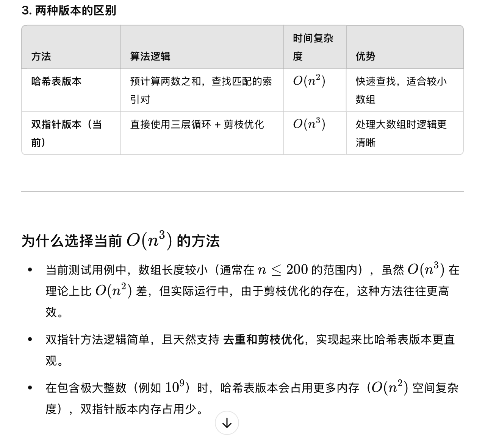
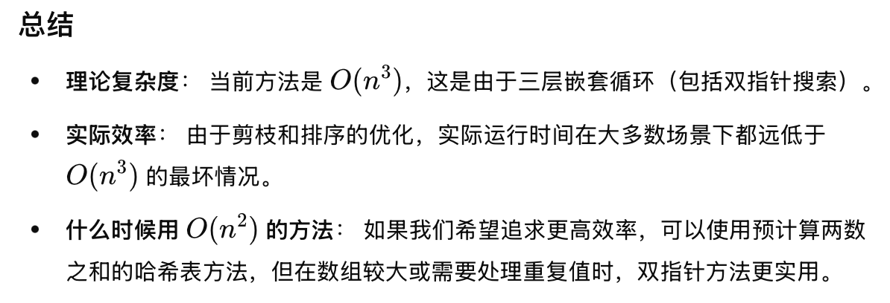

# 二分查找

## [二分查找](https://leetcode.cn/problems/binary-search/)(704)

问题：给定一个 `n` 个元素有序的（升序）整型数组 `nums` 和一个目标值 `target` ，如果目标值存在返回下标，否则返回 `-1`。

分析：二分查找 `[left, right]`

复杂度：`O(logn)` `O(1)`

```java
public int search(int[] nums, int target) {
    int left = 0, right = nums.length - 1;
    while(left <= right){
        int mid = (right - left) / 2 + left; // 防止溢出
        int num = nums[mid];
        if(num == target){
            return mid;
        }
        else if(num < target){
            left = mid + 1;
        }
        else if(num > target){
            right = mid - 1;
        }
    }
    return -1;
}
```

解法2：将问题转化为：查找第一个 `>= target` 的元素，如果不合法不是 `target` 表示不存在。

```java
public int search(int[] nums, int target) { // 求满足条件 C(x) >= target 时最小的 x
    // 满足条件时（蓝色）需要往左搜索，左开右闭；nums[n-1] 不一定满足，因此要往右延伸到 n（最终返回 n）
    int left = -1, right = nums.length; // (left, right] = (-1, n]
    while (right - left > 1) {
        int mid = left + (right - left) / 2;
        if (nums[mid] >= target) { // 满足条件，往左搜索（且为闭区间）
            right = mid;
        } else { // 不满足条件，往右搜索（且为开区间）
            left = mid;
        }
    }
    if (right == nums.length || nums[right] != target) { // 不合法（找到最后）或不等
        return -1;
    }
    return right; // right == left + 1, right 为闭区间
}
```

## [x 的平方根](https://leetcode.cn/problems/sqrtx/)(69)

问题：给你一个非负整数 `x` ，计算并返回 `x` 的 **算术平方根** 。由于返回类型是整数，结果只保留 **整数部分** ，小数部分将被 **舍去 。**

分析：二分查找 `[left, right]` 可能满足要求的 `mid`（平方不超过`x`），最后一个 `mid` 即为答案

复杂度：`O(logn)` `O(1)`

```java
public int mySqrt(int x) {
    int left = 0, right = x, ans = -1;
    while(left <= right){
        int mid = (right - left) / 2 + left; // 防止溢出
        if((long)mid * mid <= x){ // 可能满足要求
            ans = mid; // mid可能是答案，记录
            left = mid + 1; // 不断缩小查找范围
        }
        else{ // 一定不满足要求
            right = mid - 1;
        }
    }
    return ans;
}

public int mySqrt(int x) { // 根据红蓝染色法，不需要 ans 记录答案，最后 right 指向最后一个蓝色即为答案
    int left = 0, right = x;
    while(left <= right){
        int mid = (right - left) / 2 + left; // 防止溢出
        if((long)mid * mid <= x){ // 可能满足要求
            left = mid + 1; // 不断缩小查找范围
        }
        else{ // 一定不满足要求
            right = mid - 1;
        }
    }
    return right;
}
```

解法2：左开右闭区间

```java
public int mySqrt(int x) { // 求满足条件 C(y) = y * y <= x 时最大的 y
    // 满足条件时（蓝色）需要往右搜索，左闭右开；nums[0] 一定满足
    int left = 0, right = x / 2 + 2; // [left, right) = [0, x/2 + 2) // 优化时考虑特例 0, 1, 2
    while (right - left > 1) {
        int mid = left + (right - left) / 2;
        if ((long)mid * mid <= x) { // 满足条件，往右搜索（且为闭区间）
            left = mid;
        } else { // 不满足条件，往左搜索（且为开区间）
            right = mid;
        }
    }
    return left; // left == right - 1, left 为闭区间
}
```

解法3：利用 `lowerBound` 归一化解法，转化为返回最后一个 `<= target` 的元素：`lowerBound(target + 1) - 1`

复杂度：`O(logn)` `O(1)`

```java
private int lowerBound(long target) { // 返回 nums 中第一个平方 >= target 的元素
    int left = 0, right = (int)(target / 2); // 优化：取一半再平方一定大于本身
    while (left <= right) { // 闭区间 [left, right] 不为空
        int mid = left + (right - left) / 2;
        if ((long)mid * mid < target) {  // 范围缩小到 [mid + 1, right]
            left = mid + 1;
        } else { // 范围缩小到 [left, mid - 1]
            right = mid - 1;
        }
    }
    return left;  // 或者 right + 1
}

public int mySqrt(int x) {
    return lowerBound((long)x + 1) - 1; // 2 ^ 31 - 1 = 2147483647 为int类型最大值，+1后要转为long
}
```

## [在排序数组中查找元素的第一个和最后一个位置](https://leetcode.cn/problems/find-first-and-last-position-of-element-in-sorted-array/)(34)

问题：给你一个按照非递减顺序排列的整数数组 `nums`，和一个目标值 `target`。请你找出给定目标值在数组中的开始位置和结束位置。如果数组中不存在目标值 `target`，返回 `[-1, -1]`。

分析：将问题转化为：查找第一个 `>= target` 的元素，如果不是 `target` 表示不存在，否则已经找到了开始位置，且结束位置一定存在。设计 `lowerBound` 函数，使用二分查找返回 `nums` 中第一个 `>= target` 的元素下标，具体如下：

* **红蓝染色法：将不满足要求的**（`< target`）**染红色**（置 `left` 左边），**满足要求的**（`>= target`）**染蓝色**（置 `right` 右边）
  * `[0, left - 1]`：已经染红色，即均不满足要求
  * `[right + 1, nums.length - 1]`：已经染蓝色，即均满足要求
  * `[left, right]`：待染色，即可能满足要求也可能不满足
* **循环不变量：`left - 1` 始终为红色，`right + 1` 始终为蓝色**
  * 终止时：`left` 指向第一个蓝色，`right` 指向最后一个红色，且 `left == right + 1`，返回 `left`
  * 若不存在满足要求的元素（全部为红色）：返回 `left` 实际上返回了数组长度 `nums.length`
* 问题拓展：利用 `lowerBound(int[] nums, int target)` 完成 `4` 种二分查找的要求
  * 返回第一个 `>= target` 的元素下标：`lowerBound(nums, target)`
  * 返回第一个 `> target` 的元素下标：`lowerBound(nums, target + 1)`
  * 返回最后一个 `< target` 的元素下标：`lowerBound(nums, target) - 1`
  * 返回最后一个 `<= target` 的元素下标：`lowerBound(nums, target + 1) - 1`
  * 注意：最后一个 `>[=]` 及第一个 `<[=]` 没有意义，因为升序数组的最后一个数一定最大，第一个数一定最小，只需判断最后一个数是否 `>[=]`，第一个数是否 `<[=]` 即可

复杂度：`O(logn)` `O(1)`

```java
private int lowerBound(int[] nums, int target) { // 返回 nums 中第一个 >= target 的元素下标
    int left = 0, right = nums.length - 1;
    while (left <= right) { // 闭区间 [left, right] 不为空
        int mid = left + (right - left) / 2;
        if (nums[mid] < target) {  // 范围缩小到 [mid + 1, right]
            left = mid + 1;
        } else { // 范围缩小到 [left, mid - 1]
            right = mid - 1;
        }
    }
    return left;  // 或者 right + 1
}

public int[] searchRange(int[] nums, int target) {
    int start = lowerBound(nums, target);  // 对应 >=8 即找到第一个蓝色
    if (start == nums.length || nums[start] != target) {  // 空数组 或 查找失败（找到最后或找到不等）
        return new int[]{-1, -1};
    }
    int end = lowerBound(nums, target + 1) - 1;  // 对应 <=8 如果 start 存在，那么 end 必定存在
    return new int[]{start, end};
}
```

解法2：将问题转化为：查找第一个 `>= target` 的元素，最后一个 `<= target` 的元素，如果不是 `target` 表示不存在。

```java
private int lowerBound(int[] nums, int target) { // 求满足条件 C(x) >= target 时最小的 x
    // 满足条件时（蓝色）需要往左搜索，左开右闭；nums[n-1] 不一定满足，因此要往右延伸到 n（最终返回 n）
    int left = -1, right = nums.length; // (left, right] = (-1, n]
    while (right - left > 1) {
        int mid = left + (right - left) / 2;
        if (nums[mid] >= target) { // 满足条件，往左搜索（且为闭区间）
            right = mid;
        } else { // 不满足条件，往右搜索（且为开区间）
            left = mid;
        }
    }
    return right; // right == left + 1, right 为闭区间
}

private int lastLowerBound(int[] nums, int target) { // 求满足条件 C(x) <= target 时最大的 x
    // 满足条件时（蓝色）需要往右搜索，左闭右开；nums[0] 不一定满足，因此要往左延伸到 -1（最终返回 -1）
    int left = -1, right = nums.length; // [left, right) = [-1, n)
    while (right - left > 1) {
        int mid = left + (right - left) / 2;
        if (nums[mid] <= target) { // 满足条件，往右搜索（且为闭区间）
            left = mid;
        } else { // 不满足条件，往左搜索（且为开区间）
            right = mid;
        }
    }
    return left; // left == right - 1, left 为闭区间
}

public int[] searchRange(int[] nums, int target) {
    int start = lowerBound(nums, target);  // 对应 >= target 即找到第一个蓝色
    int end = lastLowerBound(nums, target);  // 对应 <= target 即找到最后一个蓝色
    if (start == nums.length || end == -1 || nums[start] != nums[end]) { // 不合法（含空数组、找到最后）或不等
        return new int[]{-1, -1};
    }
    return new int[]{start, end};
}
```

## [寻找峰值](https://leetcode.cn/problems/find-peak-element/)(162)

问题：峰值元素是指其值严格大于左右相邻值的元素。给你一个整数数组 `nums`，找到峰值元素并返回其索引。数组可能包含多个峰值，返回 **任何一个峰值** 所在位置即可。你可以假设 `nums[-1] = nums[n] = -∞` 。对于所有有效的 `i` 都有 `nums[i] != nums[i + 1]`

分析：**红蓝染色法：红色表示目标峰顶左侧，蓝色表示目标峰顶及右侧，转化为找出第一个蓝色**

注意：目标峰顶不是第一个峰顶，而是使用二分法判断合法峰顶时步骤最少的那个。事实上，就是二分结束后的第一个蓝色节点。

* 思路为不断地缩小范围，并最终找到其中的一个峰值。由于**相邻元素不等**，且**数组必定有峰**，可以使用二分快速缩小范围。即每次二分后，可以通过比较大小确定某个半区内至少有一个解。

复杂度：`O(logn)` `O(1)`

```java
public int findPeakElement(int[] nums) {
    int left = 0, right = nums.length - 2;  // 根据定义，最右侧必然是蓝色，二分范围为[0, n-2]
    while (left <= right) {
        int mid = left + (right - left) / 2;
        if (nums[mid] > nums[mid + 1]) {  // 大于说明M是峰顶或在峰顶右侧，染蓝色
            right = mid - 1;
        } else {  // 小于说明M向右爬坡可以到达峰顶（右边一定存在一个峰顶），左边舍弃，染红色
            left = mid + 1;
        }
    }
    return left;  // 或者 right + 1
}
```

解法2：左开右闭区间

```java
public int findPeakElement(int[] nums) { // 求满足条件 C(x) 时最小的 x
    // 满足条件时（蓝色）需要往左搜索，左开右闭；nums[n-1] 一定满足(n >= 1)
    int left = -1, right = nums.length - 1; // (left, right] = (-1, n-1]
    while (right - left > 1) {
        int mid = left + (right - left) / 2;
        // C(x): 若当前值 nums[x] 大于下一个数，说明要么 x 是峰顶，要么前面还有更大的峰顶，因此染蓝色
        if (nums[mid] > nums[mid + 1]) { // 满足条件，往左搜索（且为闭区间）
            right = mid;
        } else { // 不满足条件，往右搜索（且为开区间）
            left = mid;
        }
    }
    return right; // right == left + 1, right 为闭区间
}
```

## [寻找旋转排序数组中的最小值](https://leetcode.cn/problems/find-minimum-in-rotated-sorted-array/)(153)

问题：已知一个长度为 `n` 的数组，预先按照升序排列，经由 `1` 到 `n` 次 **旋转** 后，得到输入数组。注意，数组 `[a[0], a[1], a[2], ..., a[n-1]]` **旋转一次** 的结果为数组 `[a[n-1], a[0], a[1], a[2], ..., a[n-2]]` 。给你一个元素值 **互不相同** 的数组 `nums` ，它原来是一个升序排列的数组，并按上述情形进行了多次旋转。请你找出并返回数组中的 **最小元素** 。

分析：**红蓝染色法：红色表示最小值左侧，蓝色表示最小值及其右侧，转化为找出第一个蓝色。**设 `x = nums[mid]` 是现在二分取到的数。我们需要判断 `x` 和数组最小值的位置关系，谁在左边，谁在右边？把 `x` 与最后一个数 `nums[n − 1]` 比大小：

* 如果 `x > nums[n − 1]`，那么可以推出以下结论：
  * `nums` 一定被分成左右两个递增段；
  * 第一段的所有元素均大于第二段的所有元素；
  * `x` 在第一段。
  * 最小值在第二段。
  * 所以 **`x` 一定在最小值的左边（染红色）**
* 如果 `x ≤ nums[n − 1]`，那么 `x` 一定在第二段。（或者 `nums` 就是递增数组，此时只有一段。）
  * **x 要么是最小值，要么在最小值右边（染蓝色）**

所以，**只需要比较 `x` 和 `nums[n − 1]` 的大小关系，就间接地知道了 `x` 和数组最小值的位置关系**，从而不断地缩小数组最小值所在位置的范围，二分找到数组最小值。

复杂度：`O(logn)` `O(1)`

```java
public int findMin(int[] nums) {
    int left = 0, right = nums.length - 2;  // 根据定义，最右侧必然是蓝色，二分范围为[0, n-2]
    while (left <= right) {
        int mid = left + (right - left) / 2;
        if (nums[mid] <= nums[nums.length - 1]) {  // 若小于最后一个数，则两种情况下都在最小值及其右侧，染蓝色
            right = mid - 1;
        } else {  // 若大于最后一个数，则一定是分段且在最小值左侧，染红色
            left = mid + 1;
        }
    }
    return nums[left];  // 或者 nums[right + 1]
}
```

解法2：左开右闭区间

```java
public int findMin(int[] nums) { // 求满足条件 C(x) 时最小的 x
    // 满足条件时（蓝色）需要往左搜索，左开右闭；nums[n-1] 一定满足(n >= 1)
    int left = -1, right = nums.length - 1; // (left, right] = (-1, n-1]
    while (right - left > 1) {
        int mid = left + (right - left) / 2;
        // C(x): 若当前值 nums[x] 小于最后一个数，则两种情况下都在最小值及其右侧，染蓝色
        if (nums[mid] <= nums[nums.length - 1]) { // 满足条件，往左搜索（且为闭区间）
            right = mid;
        } else { // 不满足条件，往右搜索（且为开区间）
            left = mid;
        }
    }
    return nums[right]; // right == left + 1, right 为闭区间
}
```

## [搜索旋转排序数组](https://leetcode.cn/problems/search-in-rotated-sorted-array/)(33)

问题：整数数组 `nums` 按升序排列，数组中的值 **互不相同** 。在传递给函数之前，`nums` 在预先未知的某个下标 `k`（`0 <= k < nums.length`）上进行了 **旋转**，使数组变为 `[nums[k], nums[k+1], ..., nums[n-1], nums[0], nums[1], ..., nums[k-1]]`（下标 **从 0 开始** 计数）。给你 **旋转后** 的数组 `nums` 和一个整数 `target` ，如果 `nums` 中存在这个目标值 `target` ，则返回它的下标，否则返回 `-1` 。

分析：把某个数 `x` 与最后一个数 `nums[n − 1]` 比大小：

* 如果 `x > nums[n − 1]`，那么可以推出以下结论：
  * `nums` 一定被分成左右两个递增段；
  * 第一段的所有元素均大于第二段的所有元素；
  * `x` 在第一段。
* 如果 `x ≤ nums[n − 1]`，那么 `x` 一定在第二段。（或者 `nums` 就是递增数组，此时只有一段。）

**红蓝染色法：红色表示 `target` 左侧，蓝色表示 `target` 及其右侧，转化为找出第一个蓝色。**设 `x = nums[mid]` 是我们现在二分取到的数。现在需要判断 `x` 和 `target` 的位置关系，谁在左边，谁在右边？

* 如果 `x` 和 `target` 在不同的递增段：
  * 如果 target 在第一段（左），x 在第二段（右），说明 x 在 target 右边；
  * 如果 target 在第二段（右），x 在第一段（左），说明 x 在 target 左边。
* 如果 `x` 和 `target` 在相同的递增段：
  * 比较 `x` 和 `target` 的大小即可。

下面只讨论 `x` 在 `target` 右边，或者等于 `target` 的情况（染蓝色）。其余情况 `x` 一定在 `target` 左边（染红色）。

* 如果 `x > nums[n − 1]`，说明 `x` 在第一段中，那么 `target` 也必须在第一段中且必须 `x >= target`。
* 如果 `x ≤ nums[n − 1]`，说明 `x` 在第二段中（或者 `nums` 只有一段），那么 `target` 可以在第一段，也可以在第二段。
  * 如果 `target` 在第一段，那么 `x` 一定在 `target` 右边。
  * 如果 `target` 在第二段，那么必须 `x >= target`。

**先比较 `x, target` 和 `nums[n − 1]` 的大小关系即可得到二者位于哪一段，位于不同段时位置关系显然可知，位于同一段时比较 `x` 和 `target` 的大小即可得到位置关系**。根据这两种情况，去判断 `x` 和 `target` 的位置关系，从而不断地缩小 `target` 所在位置的范围，二分找到 `target`。

复杂度：`O(logn)` `O(1)`

```java
private boolean isBlue(int[] nums, int target, int x) {
    // C(x): 若当前值 nums[x] 在 target 及其右边，则染蓝色（若不存在则先将 target 插入适当位置）
    int end = nums[nums.length - 1];
    if (nums[x] > end) { // 二分位置在左端
        return target > end && nums[x] >= target;  // target与其在同一段且小于
    } else { // 二分位置在右端
        return target > end || nums[x] >= target;  // 只要target在左端，或者虽在右端但小于
    }
}

public int search(int[] nums, int target) {
    int left = 0, right = nums.length - 2;  // 根据定义，最右侧必然是蓝色，二分范围为[0, n-2]
    while (left <= right) {
        int mid = left + (right - left) / 2;
        if (isBlue(nums, target, mid)) {  // 染蓝色
            right = mid - 1;
        } else {  // 染红色
            left = mid + 1;
        }
    }
    if (left == nums.length || nums[left] != target) {  // 空数组 或 查找失败（找到最后或找到不等）
        return -1;
    }
    return left;  // 或者 right + 1
}
```

解法2：左开右闭区间

```java
public int search(int[] nums, int target) { // 求满足条件 C(x) 时最小的 x
    // 满足条件时（蓝色）需要往左搜索，左开右闭；nums[n-1] 一定满足(n >= 1)
    // 注：即使 target 不在 nums[] 中，一定可以找到最右边之前的某个位置插入，因此最右边的 nums[n-1] 一定满足
    int left = -1, right = nums.length - 1; // (left, right] = (-1, n-1]
    while (right - left > 1) {
        int mid = left + (right - left) / 2;
        if (isBlue(nums, target, mid)) { // 满足条件，往左搜索（且为闭区间）
            right = mid;
        } else { // 不满足条件，往右搜索（且为开区间）
            left = mid;
        }
    }
    if (nums[right] != target) { // 不合法（含空数组、找到最后）或不等
        return -1; // right == nums.length 可以表示不合法（含空数组、找到最后），本题不需要
    }
    return right; // right == left + 1, right 为闭区间
}
```

解法3：两次二分查找

* 先由 [`findMin`](#[寻找旋转排序数组中的最小值](https://leetcode.cn/problems/find-minimum-in-rotated-sorted-array/)(153)) 寻找旋转排序数组中的最小值 `index`，再通过比较 `target` 与 `nums[n - 1]` 确定其在哪一段

* 最后在左端 `[0, index - 1]` 或右端 `[index, nums.length - 1]` 中二分查找即可

# 双指针

## [两数之和 II - 输入有序数组](https://leetcode.cn/problems/two-sum-ii-input-array-is-sorted/)(167)

问题：给你一个下标从 **1** 开始的整数数组 `numbers` ，该数组已按 **非递减顺序排列** ，请你从数组中找出满足相加之和等于目标数 `target` 的两个数。如果设这两个数分别是 `numbers[index1]` 和 `numbers[index2]` ，则 `1 <= index1 < index2 <= numbers.length` 。以长度为 2 的整数数组 `[index1, index2]` 的形式返回这两个整数的下标 `index1` 和 `index2`。你可以假设每个输入 **只对应唯一的答案** ，而且你 **不可以** 重复使用相同的元素。你所设计的解决方案必须只使用常量级的额外空间。

分析：相向双指针，`left` 指向最小值，`right` 指向最大值，每次计算双指针指向的元素和 `s = numbers[left] + numbers[right]`

* 若 `s > target`，由于 `left` 是当前待选元素的最小值，表明所有元素和 `right` 相加都大于 `target`，故 `right--`
* 若 `s < target`，由于 `right` 是当前待选元素的最大值，表明所有元素和 `left` 相加都小于 `target`，故 `left`
* 若 `s == target`，表明找到唯一解，直接返回双指针下标（注意 `+1`）

复杂度：`O(n)` `O(1)`

* 本算法每比较一次即可判断 `numbers[left]` 或 `numbers[right]` 与其他所有元素相加与 `target` 的大小关系，即**只花费了 `O(1)` 的时间获取了 `O(n)` 的信息**，因此将暴力搜索的复杂度由 `O(n`^2^`)` 优化为了 `O(n)`

```java
public int[] twoSum(int[] numbers, int target) {
    int left = 0, right = numbers.length - 1;  // 题目为有序数组，可以使用相向双指针
    for (;;) { // left < right
        int s = numbers[left] + numbers[right];
        if (s == target){
            return new int[]{left + 1, right + 1};  // 注意下标+1
        }
        if (s > target){  // 表明所有元素和 right 相加都大于 target，排除最大值
            right--;
        }
        else{  // 表明所有元素和 left 相加都小于 target，排除最小值
            left++;
        }
    }
}
```

## [三数之和](https://leetcode.cn/problems/3sum/)(15)

问题：给你一个整数数组 `nums` ，判断是否存在三元组 `[nums[i], nums[j], nums[k]]` 满足 `i != j`、`i != k` 且 `j != k` ，同时还满足 `nums[i] + nums[j] + nums[k] == 0` 。请你返回所有和为 `0` 且不重复的三元组。**注意：**答案中不可以包含重复的三元组。

分析：枚举 `i`，将问题转化为两数之和为 `nums[i]`，为了使用相向双指针，需要先对 `nums` 排序

* **顺序不重要，那么就规定一个顺序 `i < j < k`，保证不重复**（否则有 `6` 种顺序）
* 不包含重复三元组：如果当前 `nums[i]` 和上一个数 `nums[i - 1]` 相同，直接跳过 `continue`（每找到一个三元组，需要对 `j` 和 `k` 做同样的检查与跳过操作）
* 优化1：若 `nums[i] + nums[i + 1] + nums[i + 2] > 0`，表明当前 `nums[i]` 和后续最小的两个值加起来都大于目标值 `0`，那么后续 `i, j, k` 的枚举只会越来越大，故已不存在满足要求的三元组，直接退出循环返回答案
* 优化2：若 `nums[i] + nums[n - 2] + nums[n - 1] < 0`，表明当前  `nums[i]` 和后续最大的两个值加起来都小于目标值 `0`，那么无论 `j, k` 怎么取值都会小于 `0`，故当前 `i` 值太小，可直接 `continue` 枚举下一个 `i`

复杂度： `O(n`^2^`)` `O(1)`

```java
public List<List<Integer>> threeSum(int[] nums) {
    Arrays.sort(nums);  // 顺序不重要，那么就规定一个顺序 i < j < k
    List<List<Integer>> ans = new ArrayList<List<Integer>>();  // 定义二维动态数组作为最终答案
    int n = nums.length;
    for (int i = 0; i < n - 2; i++) { // 需要留两个位置给 j,k 故枚举到 n-2
        int x = nums[i];
        if (i > 0 && x == nums[i - 1]){ // 针对i跳过重复的三元组
            continue;
        }
        if (x + nums[i + 1] + nums[i + 2] > 0){ // 优化一
            break;
        }
        if (x + nums[n - 2] + nums[n - 1] < 0){ // 优化二
            continue;
        }
        int j = i + 1, k = n - 1;  // 定义双指针从两端向中间移动
        while (j < k) {
            int s = x + nums[j] + nums[k];
            if (s > 0){  // 右指针向左移动
                k--;
            }
            else if (s < 0){  // 左指针向右移动
                j++;
            }
            else {
                // ans.add(List.of(x, nums[j], nums[k]));  // List.of()方法需要JDK9及以上版本
                List<Integer> sanyuan = new ArrayList<Integer>();
                sanyuan.add(x);
                sanyuan.add(nums[j]);
                sanyuan.add(nums[k]);
                ans.add(sanyuan);
                for (++j; j < k && nums[j] == nums[j - 1]; j++); // 先往后走一步，再针对j跳过重复的三元组
                for (--k; k > j && nums[k] == nums[k + 1]; k--); // 先往前走一步，再针对k跳过重复的三元组
            }
        }
    }
    return ans;
}
```

## [最接近的三数之和](https://leetcode.cn/problems/3sum-closest/)(16)

问题：给你一个长度为 `n` 的整数数组 `nums` 和 一个目标值 `target`。请你从 `nums` 中选出三个整数，使它们的和与 `target` 最接近。

返回这三个数的和。假定每组输入只存在恰好一个解。

分析：排序后，枚举 `nums[i]` 作为第一个数，问题转化为找到另外两个数，使得这三个数的和与 `target` 最接近，使用**相向双指针**

设 `s=nums[i]+nums[j]+nums[k]`，为了判断 `s` 是不是与 `target` 最近的数，还需用一个变量 `minDiff` 维护 `∣s−target∣` 的最小值

* 若 `s > target`，那么如果 `s − target < minDiff`，说明找到了一个与 `target` 更近的数，更新 `minDiff` 为 `s − target`，更新答案为 `s`。然后和三数之和一样，把 `k` 减一。
* 若 `s < target`，那么如果 `target − s < minDiff`，说明找到了一个与 `target` 更近的数，更新 `minDiff` 为 `target − s`，更新答案为 `s`。然后和三数之和一样，把 `j` 加一。
* 若 `s == target`，那么答案就是 `s`，直接返回 `s`。

注意：

* **顺序不重要，那么就规定一个顺序 `i < j < k`，保证不重复**（否则有 `6` 种顺序）
* 优化3：如果当前 `nums[i]` 和上一个数 `nums[i - 1]` 相同，直接跳过 `continue`（每找到一个三元组，需要对 `j` 和 `k` 做同样的检查与跳过操作）
* 优化1：若 `nums[i] + nums[i + 1] + nums[i + 2] > target`，表明当前 `nums[i]` 和后续最小的两个值加起来都大于目标值 `target`，那么后续 `i, j, k` 的枚举只会越来越大，故当前三元组为最后一个需要判断的，接着退出循环返回答案
* 优化2：若 `nums[i] + nums[n - 2] + nums[n - 1] < target`，表明当前  `nums[i]` 和后续最大的两个值加起来都小于目标值 `target`，那么无论 `j, k` 怎么取值都会小于当前值，故当前三元组是最接近 `target` 的，判断后直接 `continue` 枚举下一个 `i`

复杂度： `O(n`^2^`)` `O(1)`

```java
public int threeSumClosest(int[] nums, int target) {
    Arrays.sort(nums);  // 顺序不重要，那么就规定一个顺序 i < j < k
    int ans = 0, n = nums.length;
    int minDiff = Integer.MAX_VALUE; // 为了判断最接近的数，用一个变量 minDiff 维护∣s−target∣的最小值
    for (int i = 0; i < n - 2; i++) { // 需要留两个位置给 j,k 故枚举到 n-2
        int x = nums[i];
        if (i > 0 && x == nums[i - 1]) { // 针对i跳过重复的三元组
            continue; // 优化三
        }
        // 优化一
        int s = x + nums[i + 1] + nums[i + 2];
        if (s > target) { // 后面无论怎么选，选出的三个数的和不会比 s 还小
            if (s - target < minDiff) {
                ans = s; // 由于下面直接 break，这里无需更新 minDiff
            }
            break;
        }
        // 优化二
        s = x + nums[n - 2] + nums[n - 1];
        if (s < target) { // x 加上后面任意两个数都不超过 s，所以下面的双指针就不需要跑了
            if (target - s < minDiff) {
                minDiff = target - s;
                ans = s;
            }
            continue;
        }
        // 双指针
        int j = i + 1, k = n - 1;  // 定义双指针从两端向中间移动
        while (j < k) {
            s = x + nums[j] + nums[k];
            if (s == target) { // 直接找到最优解
                return target;
            }
            if (s > target) {  // 右指针向左移动
                if (s - target < minDiff) { // s 与 target 更近
                    minDiff = s - target;
                    ans = s;
                }
                // k--; // 也可以不优化
                for (--k; k > j && nums[k] == nums[k + 1]; k--); // 先往前走一步，再针对k跳过重复的三元组
            } else { // s < target 左指针向右移动
                if (target - s < minDiff) { // s 与 target 更近
                    minDiff = target - s;
                    ans = s;
                }
                // j++; // 也可以不优化
                for (++j; j < k && nums[j] == nums[j - 1]; j++); // 先往后走一步，再针对j跳过重复的三元组
            }
        }
    }
    return ans;
}
```

## [四数之和](https://leetcode.cn/problems/4sum/)(18)

问题：给你一个由 `n` 个整数组成的数组 `nums` ，和一个目标值 `target` 。请你找出并返回满足下述全部条件且**不重复**的四元组 `[nums[a], nums[b], nums[c], nums[d]]` （若两个四元组元素一一对应，则认为两个四元组重复）：你可以按 **任意顺序** 返回答案 。

分析：排序后，枚举 `nums[a]` 作为第一个数，枚举 `nums[b]` 作为第二个数，问题转化为找到另外两个数，使得这四个数的和等于 `target`，使用**相向双指针**

复杂度： `O(n`^3^`)` `O(1)`

```java
public List<List<Integer>> fourSum(int[] nums, int target) {
    Arrays.sort(nums);  // 顺序不重要，那么就规定一个顺序 i < j < k
    List<List<Integer>> ans = new ArrayList<>();  // 定义二维动态数组作为最终答案
    int n = nums.length;
    for (int a = 0; a < n - 3; a++) { // 枚举第一个数
        long x = nums[a]; // 使用 long 避免溢出
        if (a > 0 && x == nums[a - 1]) continue; // 跳过重复数字
        if (x + nums[a + 1] + nums[a + 2] + nums[a + 3] > target) break; // 优化一
        if (x + nums[n - 3] + nums[n - 2] + nums[n - 1] < target) continue; // 优化二
        for (int b = a + 1; b < n - 2; b++) { // 枚举第二个数
            long y = nums[b];
            if (b > a + 1 && y == nums[b - 1]) continue; // 跳过重复数字
            if (x + y + nums[b + 1] + nums[b + 2] > target) break; // 优化一
            if (x + y + nums[n - 2] + nums[n - 1] < target) continue; // 优化二
            int c = b + 1;
            int d = n - 1;
            while (c < d) { // 双指针枚举第三个数和第四个数
                long s = x + y + nums[c] + nums[d]; // 四数之和
                if (s > target) d--;  // 右指针向左移动
                else if (s < target) c++;  // 左指针向右移动
                else { // s == target
                    ans.add(List.of((int) x, (int) y, nums[c], nums[d]));
                    for (c++; c < d && nums[c] == nums[c - 1]; c++) ; // 跳过重复数字
                    for (d--; d > c && nums[d] == nums[d + 1]; d--) ; // 跳过重复数字
                }
            }
        }
    }
    return ans;
}
```





## [删除有序数组中的重复项](https://leetcode.cn/problems/remove-duplicates-from-sorted-array/)(26)

问题：给你一个 **非严格递增排列** 的数组 `nums` ，请你**[ 原地](http://baike.baidu.com/item/原地算法)** 删除重复出现的元素，使每个元素 **只出现一次** ，返回删除后数组的新长度。元素的 **相对顺序** 应该保持 **一致** 。然后返回 `nums` 中唯一元素的个数。更改数组 `nums` ，使 `nums` 的前 `k` 个元素包含唯一元素，并按照它们最初在 `nums` 中出现的顺序排列。`nums` 的其余元素与 `nums` 的大小不重要。

分析：双指针，`slow` 指向新数组位置，`fast` 指向原数组的非重复元素，将 `fast` 指向的元素复制到 `slow` 指向的元素

复杂度：`O(n)` `O(1)`

```java
public int removeDuplicates(int[] nums) {
    int slow = 1, fast = 1, n = nums.length;
    if (n == 0) {
        return 0;
    }
    while (fast < n) {
        if (nums[fast] != nums[fast - 1]) { // 不重复，将fast指向的元素复制到slow指向的元素
            nums[slow++] = nums[fast++];
        } else { // 跳过重复元素
            fast++;
        }
    }
    return slow;
}
```

## [移除元素](https://leetcode.cn/problems/remove-element/)(27)

问题：给你一个数组 `nums` 和一个值 `val`，你需要 **[原地](https://baike.baidu.com/item/原地算法)** 移除所有数值等于 `val` 的元素。元素的顺序可能发生改变。返回 `nums` 中与 `val` 不同的元素的数量。

分析：双指针，`left` 从左向右指向 `val`，`right` 从右向左指向 `!= val`，不断将 `val` 交换至数组尾部

复杂度：`O(n)` `O(1)`

```java
public int removeElement(int[] nums, int val) {
    int l = 0; // 从左向右指向为val的数
    int r = nums.length - 1; // 从右向左指向不为val的数
    while(l <= r){ // l==r也要判断是否为val
        if(nums[l] == val){ // 交换实现删除
            int tmp = nums[l];
            nums[l] = nums[r];
            nums[r] = tmp;
            r--;
        }else{
            l++; // 交换后l不变，以免交换到val
        }
    }
    return l;
}
```

## [盛最多水的容器](https://leetcode.cn/problems/container-with-most-water/)(11)

问题：给定一个长度为 `n` 的整数数组 `height` 。有 `n` 条垂线，第 `i` 条线的两个端点是 `(i, 0)` 和 `(i, height[i])` 。找出其中的两条线，使得它们与 `x` 轴共同构成的容器可以容纳最多的水。返回容器可以储存的最大水量。

分析：双指针分别指向两端，每次移动 `height` 较小的指针，变大时说明有可能增大面积，记出现过的最大面积为 `res`

复杂度：`O(n)` `O(1)`

```java
public int maxArea(int[] height) {
    int left = 0, right = height.length - 1, res = 0;
    int tmpRes = 0;
    while(left < right) { // 每次移动高度较小的指针，直至变大，因为这样才有可能增大面积
        if(height[left] < height[right]){
            tmpRes = (right - left) * height[left++];
        }else{
            tmpRes = (right - left) * height[right--];
        }
        res = Math.max(res, tmpRes); // 更新当前最大面积
    }
    return res;
}
```

## [接雨水](https://leetcode.cn/problems/trapping-rain-water/)(42)

问题：给定 `n` 个非负整数表示每个宽度为 `1` 的柱子的高度图，计算按此排列的柱子，下雨之后能接多少雨水。


分析：将题目转化为一排宽度为 `1` 的空木桶：`装水体积 - 石头体积`

解法1：前后缀分解，使用 `preMax[i]` 和 `sufMax[i]` 记录前后缀最大值，再计算 `Math.min(preMax[i], sufMax[i]) - height[i]`

复杂度：`O(n)` `O(n)`

```java
public int trap(int[] height) {
    int n = height.length;
    int[] preMax = new int[n]; // preMax[i] 表示从 height[0] 到 height[i] 的最大值
    preMax[0] = height[0];
    for (int i = 1; i < n; i++) {
        preMax[i] = Math.max(preMax[i - 1], height[i]);
    }
    int[] sufMax = new int[n]; // sufMax[i] 表示从 height[i] 到 height[n-1] 的最大值
    sufMax[n - 1] = height[n - 1];
    for (int i = n - 2; i >= 0; i--) {
        sufMax[i] = Math.max(sufMax[i + 1], height[i]);
    }
    int ans = 0;
    for (int i = 0; i < n; i++) {
        ans += Math.min(preMax[i], sufMax[i]) - height[i]; // 累加每个水桶能接多少水
    }
    return ans;
}
```

解法2：相向双指针，并使用 `preMax` 和 `sufMax` 记录前缀最大值和后缀最大值，利用以下性质优化：

* 若 `preMax < sufMax`，那么 `left` 指向的木桶的容量就是 `preMax`，计算完 `preMax - height[left]` 后 `left++`
* 若 `preMax >= sufMax`，那么 `right` 指向的木桶的容量就是 `sufMax`，计算完 `sufMax - height[right]` 后 `right--`

复杂度：`O(n)` `O(1)`

```java
public int trap(int[] height) {
    int ans = 0, left = 0, right = height.length - 1, preMax = 0, sufMax = 0;
    while (left <= right) {  // 双指针必在最高点相遇，此时木桶里塞满了石头，故可写作 l < r
        preMax = Math.max(preMax, height[left]); // 前缀最大值，随着左指针 left 的移动而更新
        sufMax = Math.max(sufMax, height[right]); // 后缀最大值，随着右指针 right 的移动而更新
        ans += preMax < sufMax ? preMax - height[left++] : sufMax - height[right--]; // 空木桶容量由双指针的最小值确定，每次可确定出较小桶的容量
    }
    return ans;
}
```

解法3：单调栈：**找上一个更大元素，在找的过程中填坑。**（横着计算）

时间复杂度：`O(n)`，虽然二重循环，但站在每个元素的视角看，这个元素在二重循环中最多入栈出栈各一次，因此循环次数之和是 `n`
空间复杂度：`O(min(n,U))`，其中 `U = max(height) − min(height) + 1`。注意栈中没有重复元素，在 `height` 值域很小的情况下，空间复杂度主要取决于 `height` 的值域范围。

```java
public int trap(int[] height) {
    int ans = 0;
    Deque<Integer> st = new ArrayDeque<>();
    for (int i = 0; i < height.length; i++) {
        while (!st.isEmpty() && height[i] >= height[st.peek()]) { // 等号可以让栈中没有重复元素，优化空间
            int bottomH = height[st.pop()]; // 底部元素（栈顶元素）
            if (st.isEmpty()) {
                break;
            }
            int left = st.peek(); // 左侧元素（弹出栈顶后的下一个元素）
            int dh = Math.min(height[left], height[i]) - bottomH; // 面积的高
            ans += dh * (i - left - 1);
        }
        st.push(i); // 当前元素入栈
    }
    return ans;
}
```

## 接雨水-最大蓄水池

问题：在接雨水模型中，求最大蓄水池（连续的储水空间）的蓄水量，并输出最大蓄水池的左右边界

分析：首先使用前后缀分解（解法1）或相向双指针（解法2）计算每个木桶左右的最大高度，从而计算出每个木桶的储水量（原问题）

接着搜索不含 `0` 的最大连续子数组，同时需要记录左右边界，以及辅助标记 `flag` 记录是否能储水（以判断进入左边界还是出右边界）

```java
public int[] maxPool(int[] height) {
    int left = 0, right = height.length - 1, preMax = 0, sufMax = 0;
    int[] water = new int[height.length];
    while (left <= right) {  // 双指针必在最高点相遇，此时木桶里塞满了石头，故可写作 l < r
        preMax = Math.max(preMax, height[left]); // 前缀最大值，随着左指针 left 的移动而更新
        sufMax = Math.max(sufMax, height[right]); // 后缀最大值，随着右指针 right 的移动而更新
        if (preMax < sufMax) { // 空木桶容量由双指针的最小值确定，每次可确定出较小桶的容量
            water[left] = preMax - height[left++];
        } else {
            water[right] = sufMax - height[right--];
        }
    }
    
    int ans = 0; // 寻找 water[] 中不含 0 的最大连续子数组
    boolean flag = false; // false 表示在间隙中，true 表示在蓄水池中
    int maxSum = 0; left = 0; right = 0; // 存储最大连续子数组的和，左边界，右边界
    int currentSum = 0, start = 0; // 存储当前子数组的和，起始位置（只需要起始位置记录左边界，右边界为当前遍历的i值）
    for (int i = 0; i < water.length; i++) {
        if (water[i] != 0) { // 加入当前元素
            currentSum += water[i];
            if (currentSum > maxSum) { // 更新最大和，以及左右边界
                maxSum = currentSum;
                left = start;
                right = i;
            }
        } else { // 遇到0，重置当前和，更新起始位置为下一个元素
            currentSum = 0;
            start = i + 1;
        }
    }
    return new int[]{maxSum, left, right}; // 返回最大和及左右边界
}
```

# 滑动窗口

## [长度最小的子数组](https://leetcode.cn/problems/minimum-size-subarray-sum/)(209)

问题：给定一个含有 `n` 个正整数的数组和一个正整数 `target` **。**找出该数组中满足其总和大于等于 `target` 的长度最小的 **子数组**

`[numsl, numsl+1, ..., numsr-1, numsr]` ，并返回其长度**。**如果不存在符合条件的子数组，返回 `0` 。

分析：滑动窗口，从左向右枚举 `right`，不断移除 `left` 直至不满足，记出现过的最小长度为 `ans`

复杂度：`O(n)` `O(1)`

```java
public int minSubArrayLen(int target, int[] nums) {
    int n = nums.length, ans = n + 1, s = 0, left = 0;
    for (int right = 0; right < n; right++) { // 枚举右端点
        s += nums[right];
        while (s >= target) { // 从满足要求不断变为不满足，即单调性，双指针的使用条件
            ans = Math.min(ans, right - left + 1);
            s -= nums[left++]; // 不断移除左端点直至不满足
        }
    }
    return ans <= n ? ans : 0;
}
```

## [乘积小于 K 的子数组](https://leetcode.cn/problems/subarray-product-less-than-k/)(713)

问题：给你一个整数数组 `nums` 和一个整数 `k` ，请你返回子数组内所有元素的乘积严格小于 `k` 的连续子数组的数目。

分析：滑动窗口，从左向右枚举 `right`，不断移除 `left` 直至满足，累加计算当前右端点的连续子数组数量为 `ans`

复杂度：`O(n)` `O(1)`

```java
public int numSubarrayProductLessThanK(int[] nums, int k) {
    if (k <= 1){
        return 0;
    }
    int n = nums.length, ans = 0, prod = 1, left = 0;
    for (int right = 0; right < n; right++) {  // 枚举右端点
        prod *= nums[right];
        while (prod >= k) // 从不满足要求不断变为满足，即单调性，双指针的使用条件
            prod /= nums[left++];  // 不断移除左端点直至满足
        ans += right - left + 1; // 计算当前右端点的连续子数组数量
    }
    return ans;
}
```

## [无重复字符的最长子串](https://leetcode.cn/problems/longest-substring-without-repeating-characters/)(3)

问题：给定一个字符串 `s` ，请你找出其中不含有重复字符的 **最长 子串** 的长度。

分析：滑动窗口：**依次递增地枚举子串的起始位置，那么子串的结束位置也是递增的**

* 利用 `set` 检查重复字符，枚举 `left`，同时每次枚举将 `left - 1` 位置的字符移出 `set`

* 每次枚举 `left`，若 `set` 不重复则不断移动 `right`，并将这些不重复元素加入 `set`，记出现过的最大长度为 `ans`

复杂度：`O(n)` `O(n)`

```java
public int lengthOfLongestSubstring(String s) {
    Set<Character> set = new HashSet<>();  // 集合，记录每个字符是否出现过（也可使用哈希表）
    int n = s.length();
    int right = -1, ans = 0;  // 右指针，初始值为 -1，相当于我们在字符串的左边界的左侧，还没有开始移动
    for (int left = 0; left < n; left++) {
        if (left != 0) {  // 左指针向右移动一格，移除一个字符
            set.remove(s.charAt(left - 1));
        }
        while (right + 1 < n && !set.contains(s.charAt(right + 1))) {  // 不断地移动右指针
            set.add(s.charAt(right + 1));
            right++;
        }
        ans = Math.max(ans, right - left + 1);  // 第 left 到 right 个字符是一个极长的无重复字符子串
    }
    return ans;
}
```

解法2：滑动窗口，从左向右枚举 `right`，不断移除 `left` 直至满足，记出现过的最大长度为 `ans`

* 由于字符 `s` 的种类是`ASCII` 字符，故可以用数组 `cnt[128]` 替代哈希表/集合，优化空间复杂度

复杂度：`O(n)` `O(1)`

```java
public int lengthOfLongestSubstring(String S) {
    char[] s = S.toCharArray(); // 转换成 char[] 加快效率（忽略带来的空间消耗）
    int n = s.length, ans = 0, left = 0;
    int[] cnt = new int[128]; // 也可以用 HashMap<Character, Integer>，这里为了优化空间复杂度用的数组
    for (int right = 0; right < n; right++) {  // 枚举右端点
        char c = s[right];
        cnt[c]++;
        while (cnt[c] > 1) { // 从不满足要求不断变为满足，即单调性，双指针的使用条件
            --cnt[s[left++]];  // 不断移除左端点直至满足(cnt[c]==1)
        }
        ans = Math.max(ans, right - left + 1);
    }
    return ans;
}
```

# 贪心思想

## [分发饼干](https://leetcode.cn/problems/assign-cookies/)(455)

问题：对每个孩子 `i`，都有一个胃口值 `g[i]`，这是能让孩子们满足胃口的饼干的最小尺寸；并且每块饼干 `j`，都有一个尺寸 `s[j]` 。如果 `s[j] >= g[i]`，我们可以将这个饼干 `j` 分配给孩子 `i` ，这个孩子会得到满足。目标是满足尽可能多的孩子，并输出这个最大数值。

分析：贪心，先对 `g[]` 和 `s[]` 排序，选择满足 `s[j] >= g[i]` 的最小 `j` 值

复杂度：`O(nlogn)` `O(1)`

```java
public int findContentChildren(int[] g, int[] s) {
    Arrays.sort(g);
    Arrays.sort(s);
    int m = g.length, n = s.length;
    int res = 0; // 存放结果
    for(int j = 0; j < n && res < m; j++){ // 遍历饼干
        if(s[j] >= g[res]){ // 第i块饼干可以满足第res个孩子的胃口
            res++;
        }
    }
    return res;
}
```

## [摆动序列](https://leetcode.cn/problems/wiggle-subsequence/)(376)

问题：如果连续数字之间的差严格地在正数和负数之间交替，则数字序列称为 **摆动序列 。**第一个差（如果存在的话）可能是正数或负数。仅有一个元素或者含两个不等元素的序列也视作摆动序列。**子序列** 可以通过从原始序列中删除一些（也可以不删除）元素来获得，剩下的元素保持其原始顺序。给你一个整数数组 `nums` ，返回 `nums` 中作为 **摆动序列** 的 **最长子序列的长度** 。

分析：用 `pre` 和 `cur` 分别保存前一个和当前的差值，满足 `pre <= 0 && cur > 0 || pre >= 0 && cur < 0` 即找到一个摆动点

复杂度：`O(n)` `O(1)`

```java
public int wiggleMaxLength(int[] nums) {
    if(nums.length == 1){
        return nums.length;
    }
    int res = 1;
    int pre = 0; // 保存前一个峰值是正还是负
    int cur = 0; // 保存当前差值
    for(int i = 0; i < nums.length - 1; i++){
        cur = nums[i + 1] - nums[i];
        if(pre <= 0 && cur > 0 || pre >= 0 && cur < 0){ // 注意pre需要取等号
            res++;
            pre = cur;
        }
    }
    return res;
}
```

## [跳跃游戏](https://leetcode.cn/problems/jump-game/)(55)

问题：给你一个非负整数数组 `nums` ，你最初位于数组的 **第一个下标** 。数组中的每个元素代表你在该位置可以跳跃的最大长度。判断你是否能够到达最后一个下标，如果可以，返回 `true` ；否则，返回 `false` 。

分析：不断更新当前能达到的最远距离 `Math.max(max, i + nums[i])`，若 `max < i` 则无法到达

复杂度：`O(n)` `O(1)`

```java
public boolean canJump(int[] nums) {
    int max = 0;
    for(int i = 0; i < nums.length; i++){
        if(i <= max){ // 当前最远能跳到max，故能跳到i
            max = Math.max(max, i + nums[i]);
        }else{ // max < i，跳不到i
            return false;
        }
    }
    return true;
}
```

## [跳跃游戏 II](https://leetcode.cn/problems/jump-game-ii/)(45)

问题：给定一个长度为 `n` 的 **0 索引**整数数组 `nums`。初始位置为 `nums[0]`。每个元素 `nums[i]` 表示从索引 `i` 向前跳转的最大长度。换句话说，如果你在 `nums[i]` 处，你可以跳转到任意 `nums[i + j]` 处，返回到达 `nums[n - 1]` 的最小跳跃次数。

分析：不断更新当前**区间**能达到的最远距离 `Math.max(max, i + nums[i])`，并选择最大值作为下一个区间右端 `end = max`

复杂度：`O(n)` `O(1)`

```java
public int jump(int[] nums) {
    int res = 0;
    int end = 0; // 当前遍历的区间右端
    int max = 0; // 当前能跳到的最大下标
    for(int i = 0; i < nums.length - 1; i++){ // 最后一个数字没有意义，因为不需要再往后跳了
        max = Math.max(max, i + nums[i]); // 更新当前区间能跳到的最大值
        if(i == end){ // 当前区间结束，跳到下一个区间
            end = max;
            res++;
        }
    }
    return res;
}
```

## [任务调度器](https://leetcode.cn/problems/task-scheduler/)(621)

问题：给你一个用字符数组 `tasks` 表示的 CPU 需要执行的任务列表，用字母 A 到 Z 表示，以及一个冷却时间 `n`。每个周期或时间间隔允许完成一项任务。任务可以按任何顺序完成，但有一个限制：两个 **相同种类** 的任务之间必须有长度为 `n` 的冷却时间。返回完成所有任务所需要的 **最短时间间隔** 。

分析：贪心：先处理次数最多的任务，如果出现冷却，一定是次数最多的若干任务在等待（可能多种）。其他任务总能找到恰当的顺序

复杂度：`O(n)` `O(1)`

```java
public int leastInterval(char[] tasks, int n) {
    int arr[] = new int[26];
    for(int i = 0; i < tasks.length; i++){ // 统计各种任务出现的次数
        arr[tasks[i] - 'A']++;
    }
    int max = 0;
    for(int i = 0; i < 26; i++){ // 先找出出现次数做多的字母
        max = Math.max(max, arr[i]);
    }
    int k = 0; // 出现次数最多的种类有多种，假设 k 种
    for(int i = 0; i < 26; i++){ // 再找出其他次数一样多的字母
        if(arr[i] == max){
            k++;
        }
    }
    max = Math.max((n + 1) * (max - 1) + k, tasks.length); // 间隔够插/不够插即为列表长度
    return max;
}
```

## [无重叠区间](https://leetcode.cn/problems/non-overlapping-intervals/)(435)

问题：给定一个区间的集合 `intervals` ，其中 `intervals[i] = [starti, endi]` 。返回 *需要移除区间的最小数量，使剩余区间互不重叠* 。**注意** 只在一点上接触的区间是 **不重叠的**。

分析：转化问题：保存数量最多的不重叠区间。贪心：按照每个区间的**结束时间**升序排序，一定能得到最多的不重叠区间

复杂度：`O(nlogn)` `O(1)`

```java
public int eraseOverlapIntervals(int[][] intervals) {
    Arrays.sort(intervals, new Comparator<int[]>(){
        public int compare(int[] a, int[] b){ // 按照每个区间的结束时间进行排序（升序）
            return a[1] - b[1];
        }
    });
    // Arrays.sort(intervals, (a, b) -> a[1] - b[1]);
    int i = 0; // 初始化第一个区间的索引
    int count = 1; // 非重叠区间的计数
    for (int j = 1; j < intervals.length; j++) { // 遍历所有区间
        if (intervals[j][0] >= intervals[i][1]) { // 当前区间的开始时间>=前一个区间的结束时间，不重叠
            count++; // 增加非重叠区间的计数
            i = j;  // 更新 i 为当前区间的索引
        }
    }
    return intervals.length - count; // 返回需要移除的区间数量
}
```

## [分发糖果](https://leetcode.cn/problems/candy/)(135)

问题：`n` 个孩子站成一排。给你一个整数数组 `ratings` 表示每个孩子的评分。你需要按照以下要求，给这些孩子分发糖果：

- 每个孩子至少分配到 `1` 个糖果。
- 相邻两个孩子评分更高的孩子会获得更多的糖果。

请你给每个孩子分发糖果，计算并返回需要准备的 **最少糖果数目** 。

分析：贪心：定义和左边比较的**左规则**、和右边比较的**右规则**，可以证明取最大值即可同时满足左规则与右规则

* 左规则：当 `ratings[i − 1] < ratings[i]` 时，`i` 号学生的糖果数量将比 `i − 1` 号孩子的糖果数量多。
* 右规则：当 `ratings[i] > ratings[i + 1]` 时，`i` 号学生的糖果数量将比 `i + 1` 号孩子的糖果数量多。

复杂度：`O(n)` `O(n)`

```java
public int candy(int[] ratings) {
    int left[] = new int[ratings.length], right[] = new int[ratings.length];
    left[0] = 1;
    for(int i = 1; i < ratings.length; i++){ // 填充左规则
        if(ratings[i] > ratings[i - 1]){
            left[i] = left[i - 1] + 1;
        }else{
            left[i] = 1;
        }
    }
    right[ratings.length - 1] = 1; // 计算右规则时只需要用单个变量记录当前位置的右规则，同时计算答案即可
    for(int i = ratings.length - 2; i >= 0; i--){ // 填充右规则
        if(ratings[i] > ratings[i + 1]){
            right[i] = right[i + 1] + 1;
        }else{
            right[i] = 1;
        }
    }
    int res = 0;
    for(int i = 0; i < ratings.length; i++){ // 同时满足左规则与右规则，即取最大值即可
        int max = Math.max(left[i], right[i]);
        res += max;
    }
    return res;
}
```
