# Java常用API

## List & Set

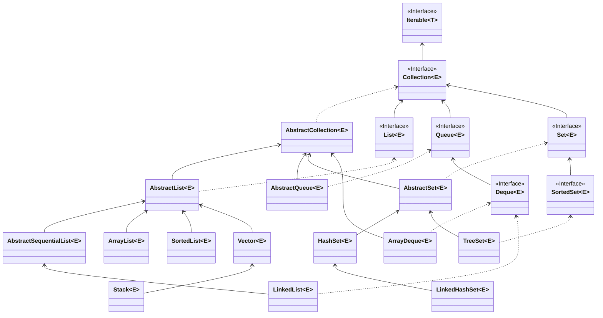
```mermaid
classDiagram
direction BT
class AbstractCollection~E~
class AbstractList~E~
class AbstractQueue~E~
class AbstractSequentialList~E~
class AbstractSet~E~
class ArrayDeque~E~
class ArrayList~E~
class Collection~E~ {
<<Interface>>

}
class Deque~E~ {
<<Interface>>

}
class HashSet~E~
class Iterable~T~ {
<<Interface>>

}
class LinkedHashSet~E~
class LinkedList~E~
class List~E~ {
<<Interface>>

}
class Queue~E~ {
<<Interface>>

}
class Set~E~ {
<<Interface>>

}
class SortedList~E~
class SortedSet~E~ {
<<Interface>>

}
class Stack~E~
class TreeSet~E~
class Vector~E~

AbstractCollection~E~  ..>  Collection~E~ 
AbstractList~E~  -->  AbstractCollection~E~ 
AbstractList~E~  ..>  List~E~ 
AbstractQueue~E~  -->  AbstractCollection~E~ 
AbstractQueue~E~  ..>  Queue~E~ 
AbstractSequentialList~E~  -->  AbstractList~E~ 
AbstractSet~E~  -->  AbstractCollection~E~ 
AbstractSet~E~  ..>  Set~E~ 
ArrayDeque~E~  -->  AbstractCollection~E~ 
ArrayDeque~E~  ..>  Deque~E~ 
ArrayList~E~  -->  AbstractList~E~ 
Collection~E~  -->  Iterable~T~ 
Deque~E~  -->  Queue~E~ 
HashSet~E~  -->  AbstractSet~E~ 
LinkedHashSet~E~  -->  HashSet~E~ 
LinkedList~E~  -->  AbstractSequentialList~E~ 
LinkedList~E~  ..>  Deque~E~ 
List~E~  -->  Collection~E~ 
Queue~E~  -->  Collection~E~ 
Set~E~  -->  Collection~E~ 
SortedList~E~  -->  AbstractList~E~ 
SortedSet~E~  -->  Set~E~ 
Stack~E~  -->  Vector~E~ 
TreeSet~E~  -->  AbstractSet~E~ 
TreeSet~E~  ..>  SortedSet~E~ 
Vector~E~  -->  AbstractList~E~ 
```

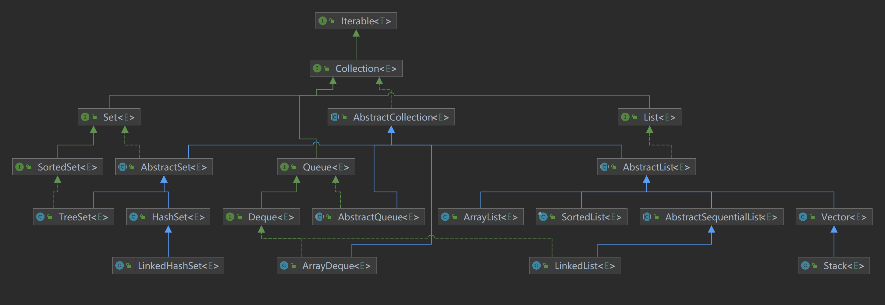

```java
import java.util.ArrayList;
import java.util.List;

public class ListExample {
    public static void arrayListTest(int n, int[] parent){
        List<List<Integer>> list = new ArrayList<>();  // 二维动态数组
        for (int i = 0; i < n; i++) {  // 初始化数组的第二维
            list.add(new ArrayList<>());  // 第一维的初始化体现在不断 add 中
        }
        for (int i = 1; i < n; i++) {  // 由于第一维是列表，需要用 list.get() 方法访问
            list.get(parent[i]).add(i);  // 第二维是列表，用 add 方法增添元素
        }

        List<Integer>[] arrayList = new ArrayList[n];  // 定义长为 n 的一维数组，每个元素为列表 List<Integer>
        for (int i = 0; i < n; i++) {  // 初始化一维数组
            arrayList[i] = new ArrayList<>();  // 对数组的每个元素（相当于第二维）进行初始化
        }
        for (int i = 1; i < n; i++) {  // 由于第一维是数组，可以直接用下标 arrayList[i] 方法访问
            arrayList[parent[i]].add(i);  // 第二维是列表，用 add 方法增添元素
        }
    }
    
    public static void main(String[] args) {
        List<String> list = new ArrayList<>(); // 创建一个ArrayList
        // 1.添加元素
        list.add("苹果");
        list.add("香蕉");
        list.add("橘子");
        list.add(1, "草莓"); // 在索引1位置插入"草莓"
        // 2.删除元素
        list.remove("香蕉");
        System.out.println("删除后的列表:");
        list.forEach(System.out::println);
        // 3.修改元素
        list.set(2, "菠萝");
        System.out.println("修改后的列表:");
        list.forEach(System.out::println);
        // 4.获取元素
        String firstFruit = list.get(0);
        System.out.println("第一个元素: " + firstFruit);
        // 4.判断是否包含某元素
        boolean hasApple = list.contains("苹果");
        System.out.println("是否包含苹果: " + hasApple);
        // 遍历元素
        System.out.println("列表元素:");
        for (String fruit : list) {
            System.out.println(fruit);
        }
        // 获取列表大小
        int size = list.size();
        System.out.println("列表大小: " + size);
        // 清空列表
        list.clear();
        System.out.println("清空后的列表是否为空: " + list.isEmpty());
    }
}
```

```java
import java.util.HashSet;
import java.util.Set;

public class SetExample {
    public static void main(String[] args) {
        Set<String> set = new HashSet<>(); // 创建一个HashSet实例
        // 1.添加元素
        set.add("猫");
        set.add("狗");
        set.add("鸟");
        set.add("狗"); // 重复元素，不会添加
        // 2.移除元素
        set.remove("鸟");
        System.out.println("移除鸟后: " + set);
        // 4.检查元素是否存在
        boolean containsCat = set.contains("猫");
        System.out.println("集合中包含猫吗? " + containsCat);
        // 遍历集合
        System.out.println("遍历集合:");
        for (String animal : set) {
            System.out.println(animal);
        }
    }
}
```

## Map

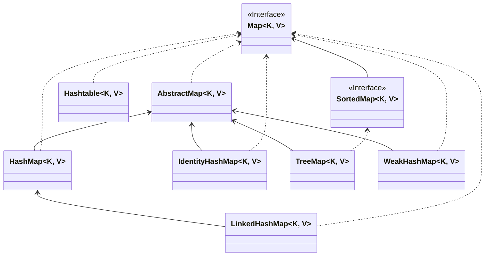
```mermaid
classDiagram
direction BT
class AbstractMap~K, V~
class HashMap~K, V~
class Hashtable~K, V~
class IdentityHashMap~K, V~
class LinkedHashMap~K, V~
class Map~K, V~ {
<<Interface>>

}
class SortedMap~K, V~ {
<<Interface>>

}
class TreeMap~K, V~
class WeakHashMap~K, V~

AbstractMap~K, V~  ..>  Map~K, V~ 
HashMap~K, V~  -->  AbstractMap~K, V~ 
HashMap~K, V~  ..>  Map~K, V~ 
Hashtable~K, V~  ..>  Map~K, V~ 
IdentityHashMap~K, V~  -->  AbstractMap~K, V~ 
IdentityHashMap~K, V~  ..>  Map~K, V~ 
LinkedHashMap~K, V~  -->  HashMap~K, V~ 
LinkedHashMap~K, V~  ..>  Map~K, V~ 
SortedMap~K, V~  -->  Map~K, V~ 
TreeMap~K, V~  -->  AbstractMap~K, V~ 
TreeMap~K, V~  ..>  SortedMap~K, V~ 
WeakHashMap~K, V~  -->  AbstractMap~K, V~ 
WeakHashMap~K, V~  ..>  Map~K, V~ 

```

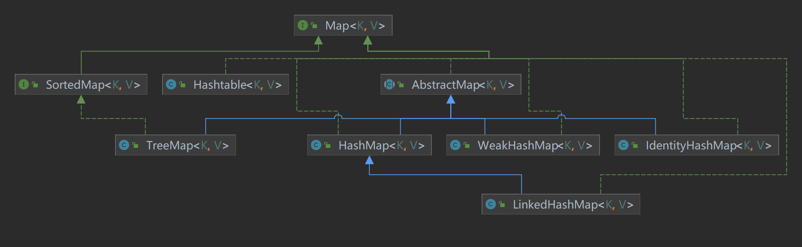

```java
import java.util.HashMap;
import java.util.Map;

public class MapExample {
    public static void main(String[] args) {
        Map<String, Integer> map = new HashMap<>(); // 创建一个HashMap实例
        // 1.3.添加键值对
        map.put("苹果", 3);
        map.put("香蕉", 5);
        map.put("橘子", 2);
        map.put("香蕉", 4); // 键重复，值会被更
        // 2.移除键值对
        map.remove("橘子");
        System.out.println("移除橘子后: " + map);
        // 4.获取值
        int bananaCount = map.get("香蕉");
        System.out.println("香蕉的数量: " + bananaCount);
        // 4.检查键是否存在
        boolean containsApple = map.containsKey("苹果");
        System.out.println("Map中包含苹果吗? " + containsApple);
        // 4.检查值是否存在
        boolean containsValue2 = map.containsValue(2);
        System.out.println("Map中包含值2吗? " + containsValue2);
--------------------------------------------------------------------------------------------------------
        // 遍历Map（常见的四种方法）
        Iterator<Map.Entry<String, Integer>> iterator = map.entrySet().iterator();
        while (iterator.hasNext()) { // 使用 Iterator 和 entrySet() 遍历
            Map.Entry<String, Integer> entry = iterator.next();
            System.out.println("水果: " + entry.getKey() + ", 数量: " + entry.getValue());
        }
--------------------------------------------------------------------------------------------------------
        for (Map.Entry<String, Integer> entry : map.entrySet()) { // 使用entrySet()和增强型for循环遍历
            System.out.println("水果: " + entry.getKey() + ", 数量: " + entry.getValue());
        }
--------------------------------------------------------------------------------------------------------
        for (String key : map.keySet()) { // 使用keySet()和增强型for循环遍历
            Integer value = map.get(key);
            System.out.println("水果: " + key + ", 数量: " + value);
        }
--------------------------------------------------------------------------------------------------------
        for (Integer value : map.values()) { // 使用values()和增强型for循环遍历
            System.out.println("数量: " + value);
        }
--------------------------------------------------------------------------------------------------------
    }
}
```

## Deque & ArrayDeque

### 双端队列介绍

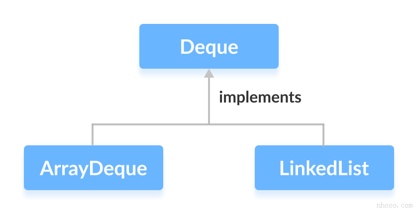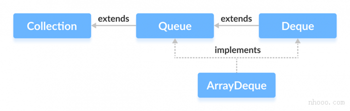

`Deque` 接口定义了访问双端队列两端元素的方法。 提供了插入，移除和检查元素的方法。 这些方法中的每一种都以两种形式存在：

* 一种在操作失败时抛出异常：`add() remove() get()`
* 另一种返回特殊值（ `null`或`false` ） ，专门设计用于容量限制的`Deque`实现：`offer() poll() peek()`

### 作为双端队列

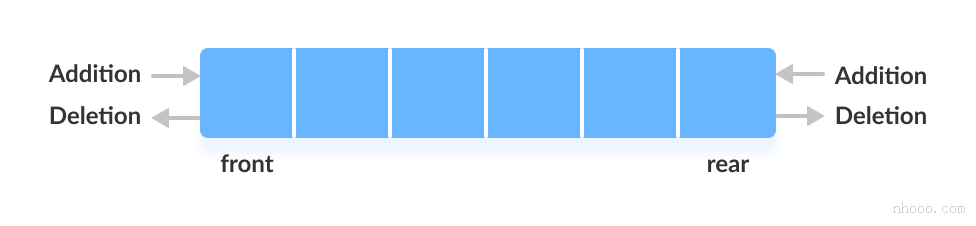

元素在双端队列的**队头/队尾添加**并从**队头/队尾删除**

* 插入：`addFirst() addLast() offerFirst() offerLast()`
* 删除：`removeFirst() removeLast() pollFirst() pollLast()`
* 取值：`getFirst() getLast() peekFirst() peekLast()`

### 作为队列

元素在双端队列的**队尾添加**并从**队头删除**

* 插入：[`add(e)`](https://www.runoob.com/manual/jdk11api/java.base/java/util/Deque.html#add(E)) [`addLast(e)`](https://www.runoob.com/manual/jdk11api/java.base/java/util/Deque.html#addLast(E)) ==[`offer(e)`](https://www.runoob.com/manual/jdk11api/java.base/java/util/Deque.html#offer(E))== [`offerLast(e)`](https://www.runoob.com/manual/jdk11api/java.base/java/util/Deque.html#offerLast(E))
* 删除：[`remove()`](https://www.runoob.com/manual/jdk11api/java.base/java/util/Deque.html#remove()) [`removeFirst()`](https://www.runoob.com/manual/jdk11api/java.base/java/util/Deque.html#removeFirst()) ==[`poll()`](https://www.runoob.com/manual/jdk11api/java.base/java/util/Deque.html#poll())== [`pollFirst()`](https://www.runoob.com/manual/jdk11api/java.base/java/util/Deque.html#pollFirst())
* 取值：[`element()`](https://www.runoob.com/manual/jdk11api/java.base/java/util/Deque.html#element()) [`getFirst()`](https://www.runoob.com/manual/jdk11api/java.base/java/util/Deque.html#getFirst()) ==[`peek()`](https://www.runoob.com/manual/jdk11api/java.base/java/util/Deque.html#peek())== [`peekFirst()`](https://www.runoob.com/manual/jdk11api/java.base/java/util/Deque.html#peekFirst())

### 作为堆栈

元素将从双端队列的**队头推出并弹出**。建议 `Deque` 用作堆栈而不是[Stack类](https://www.cainiaojc.com/java/java-stack.html)。因为Stack的方法是同步的，ArrayDeque类比Stack类快。

* 插入：==[`push(e)`](https://www.runoob.com/manual/jdk11api/java.base/java/util/Deque.html#push(E))== [`addFirst(e)`](https://www.runoob.com/manual/jdk11api/java.base/java/util/Deque.html#addFirst(E))
* 删除：==[`pop()`](https://www.runoob.com/manual/jdk11api/java.base/java/util/Deque.html#pop())== [`removeFirst()`](https://www.runoob.com/manual/jdk11api/java.base/java/util/Deque.html#removeFirst())
* 取值：==[`peek()`](https://www.runoob.com/manual/jdk11api/java.base/java/util/Deque.html#peek())== [`getFirst()`](https://www.runoob.com/manual/jdk11api/java.base/java/util/Deque.html#getFirst())

### 遍历

- iterator() - 返回可用于遍历ArrayDeque双端队列的迭代器
- descendingIterator() -返回一个迭代器，该迭代器可用于以相反顺序遍历ArrayDeque双端队列

```java
import java.util.ArrayDeque;
import java.util.Iterator;

public class Main {
    public static void main(String[] args) {
        ArrayDeque<String> animals= new ArrayDeque<>();
        animals.add("Dog");
        animals.add("Cat");
        animals.add("Horse");
--------------------------------------------------------------------------------------------------------
        System.out.print("ArrayDeque: ");
        Iterator<String> iterate = animals.iterator(); // 使用iterator()
        while(iterate.hasNext()) {
            System.out.print(iterate.next());
            System.out.print(", ");
        }
--------------------------------------------------------------------------------------------------------
        System.out.print("\n反向ArrayDeque: ");
        Iterator<String> desIterate = animals.descendingIterator(); // 使用descendingIterator()
        while(desIterate.hasNext()) {
            System.out.print(desIterate.next());
            System.out.print(", ");
        }
--------------------------------------------------------------------------------------------------------
    }
}
```

### 其他

与[`List`](https://www.runoob.com/manual/jdk11api/java.base/java/util/List.html)接口不同，`Deque` 接口不支持对元素的索引访问。虽然严格要求`Deque`实现禁止插入null元素，但强烈建议他们这样做。 

ArrayDeque和[Java的LinkedList都](https://www.cainiaojc.com/java/java-linkedlist.html)实现了Deque接口。但是，它们之间存在一些差异：

- LinkedList支持空元素，而ArrayDeque不支持。
- 链表中的每个节点都包含到其他节点的链接。这就是LinkedList比ArrayDeque需要更多存储空间的原因。
- 如果要实现队列或双端队列数据结构，则ArrayDeque可能比LinkedList快。

## 自定义排序

### 自然排序：类内部实现Comparable接口+重写compareTo()方法

`Comparable` 接口用于定义对象的自然排序。要使用 `Comparable`，需要在自定义类中实现该接口，并重写 `compareTo` 方法。

* **定义**：`Comparable` 接口用于定义对象的**自然排序**。
* **实现方式**：类内部实现 `Comparable` 接口，并重写 `compareTo` 方法。
* **用途**：当你希望某个类的实例具有一个**默认的排序方式**时使用。例如，字符串按字典顺序，整数按数值大小排序。
* **限制**：只能定义**一种**自然排序方式。

即使一个类内部实现了 `Comparable` 接口并重写了 `compareTo` 方法来定义其**自然排序**，这并不意味着类的排序顺序已经固定。你仍然可以在类外部使用 `Comparator` 接口来定义和应用多种不同的排序规则。`Comparable` 和 `Comparator` 是互补的，各自适用于不同场景。

```java
import java.util.Arrays;

class Person implements Comparable<Person> {
    String name;
    int age;

    Person(String name, int age) {
        this.name = name;
        this.age = age;
    }
    
    @Override
    public int compareTo(Person other) { // 实现 compareTo 方法，按年龄升序排序
        return Integer.compare(this.age, other.age);
    }

    @Override
    public String toString() { // 重写 toString 方法，便于输出
        return this.name + ": " + this.age;
    }
}

public class ComparableExample {
    public static void main(String[] args) {
        Person[] people = {
            new Person("Alice", 30),
            new Person("Bob", 25),
            new Person("Charlie", 35)
        };
        Arrays.sort(people); // 使用 Arrays.sort 对数组进行排序
    }
}
```

### 类外部创建实现Comparator接口的新排序器类(匿名内部类+Lambda表达式)

`Comparator` 接口用于定义对象的自定义排序，可以在类外部定义多个不同的排序逻辑。`Comparator` 提供了更大的灵活性，适用于需要多种排序方式的场景。

* **定义**：`Comparator` 接口用于定义对象的**自定义排序**，可以有多种不同的排序规则。
* **实现方式**：类外部实现 `Comparator` 接口，通常作为**匿名内部类**、独立类或使用 **Lambda 表达式**。
* **用途**：当你需要根据不同的标准对同一类的对象进行多种排序时使用。
* **优势**：灵活，允许**多个**排序逻辑共存。

xxxxxxxxxx34 1import java.util.Scanner;2​3public class Main {4    public static void main(String[] args) {5        Scanner scanner = new Scanner(System.in);6        int N = scanner.nextInt();7        long[] storage = new long[N], cost = new long[N];8        for (int i = 0; i < N; i++) {9            storage[i] = scanner.nextLong();10        }11        for (int i = 0; i < N; i++) {12            cost[i] = scanner.nextLong();13        }14        long totalStorage = 0, totalCost = 0; // 计算总供给与总需求15        for (int i = 0; i < N; i++) {16            totalStorage += storage[i];17            totalCost += cost[i];18        }19        if (totalStorage < totalCost) { // 如果总供给小于总需求，无法完成环路20            System.out.println(-1);21            return;22        }23        int start = 0;24        long remain = 0;25        for (int i = 0; i < N; i++) { // 贪心算法寻找起点26            remain += (storage[i] - cost[i]);27            if (remain < 0) { // 从当前起点无法到达下一个仓库，重新设置起点28                start = i + 1;29                remain = 0;30            }31        }32        System.out.println(start);33    }34}java

方法二：**匿名内部类**允许我们在需要时即时定义 `Comparator`，而无需单独创建一个实现类。这使得代码更加简洁和可读。

方法三：**Lambda 表达式**是 Java 8 引入的一种简洁表示匿名函数的方式，能够显著简化代码，尤其是**实现函数式接口**时。

方法三优化：使用**方法引用**和 `Comparator` 的**静态方法**进一步简化

```java
import java.util.Arrays;
import java.util.Comparator;

class Person {
    String name;
    int age;

    Person(String name, int age) {
        this.name = name;
        this.age = age;
    }

    @Override
    public String toString() { // 重写 toString 方法，便于输出
        return this.name + ": " + this.age;
    }
}
--------------------------------------------------------------------------------------------------------
// 方法一：类外部创建新排序器类，实现 Comparator 接口
class NameComparator implements Comparator<Person> { // 按姓名升序排序的 Comparator
    @Override
    public int compare(Person p1, Person p2) {
        return p1.name.compareTo(p2.name);
    }
}

class AgeDescendingComparator implements Comparator<Person> { // 按年龄降序排序的 Comparator
    @Override
    public int compare(Person p1, Person p2) {
        return Integer.compare(p2.age, p1.age);
    }
}

public class ComparatorExample {
    public static void main(String[] args) {
        Person[] people = {
            new Person("Alice", 30),
            new Person("Bob", 25),
            new Person("Charlie", 35)
        };
        Arrays.sort(people, new NameComparator()); // 使用 NameComparator 按姓名排序
        Arrays.sort(people, new AgeDescendingComparator()); // 使用 AgeDescendingComparator 按年龄降序排序
--------------------------------------------------------------------------------------------------------
        // 方法二：传入实现 Comparator 接口的匿名内部类
        Arrays.sort(people, new Comparator<Person>() { // 使用匿名内部类按姓名升序排序
            @Override
            public int compare(Person p1, Person p2) {
                return p1.name.compareTo(p2.name);
            }
        });
        Arrays.sort(people, new Comparator<Person>() { // 使用匿名内部类按年龄降序排序
            @Override
            public int compare(Person p1, Person p2) {
                return Integer.compare(p2.age, p1.age);
            }
        });
--------------------------------------------------------------------------------------------------------
        // 方法三：传入实现函数式接口 Comparator 的 Lambda 表达式
        Arrays.sort(people, (p1, p2) -> p1.name.compareTo(p2.name)); // 使用 Lambda 表达式按姓名升序排序
        Arrays.sort(people, (p1, p2) -> Integer.compare(p2.age, p1.age)); // 使用 Lambda 表达式按年龄降序排序
--------------------------------------------------------------------------------------------------------
        // 方法三优化：使用方法引用和 Comparator 的静态方法进一步简化
        Arrays.sort(people, Comparator.comparing(person -> person.name)); // 姓名升序
        Arrays.sort(people, Comparator.comparingInt((Person person) -> person.age).reversed()); //年龄降序
--------------------------------------------------------------------------------------------------------
    }
}
```

### Arrays.sort()与Collections.sort()

`Arrays.sort()`用于对数组进行排序，支持对基本数据类型（如 `int[]`、`double[]`）和对象数组进行排序。`Collections.sort()` 用于对 `List` 接口的实现类（如 `ArrayList`、`LinkedList`）进行排序。二者都可以进行**自然排序**（实现 `Comparable`），也都可以进行**自定义排序**（传入 `Comparator`）。`Collections.sort()` 两个主要的重载方法：

* `Collections.sort(List<T> list)`：根据元素的自然顺序排序（前提是实现 `Comparable`）。
* `Collections.sort(List<T> list, Comparator<? super T> c)`：根据传入的 `Comparator` 进行排序。

从 Java 8 开始，`List` 接口本身提供了一个 `sort` 方法，功能类似于 `Collections.sort()`，但更为简洁：

* `list.sort()`：根据元素的自然顺序排序（前提是实现 `Comparable`）。
* `list.sort(Comparator<? super T> c)`：根据传入的 `Comparator` 进行排序。

### 使用TreeSet进行排序

`TreeSet` 是一种基于红黑树实现的 `Set`，它会自动对元素进行排序。元素的排序依据可以是自然顺序或提供的 `Comparator`。本质上还是前两种排序思想，区别在于**不是显示调用排序函数，而是预先定义排序规则后，在后续加入元素时自动排序**。

```java
import java.util.Comparator;
import java.util.Set;
import java.util.TreeSet;

class Student implements Comparable<Student> {
    String name;
    int age;

    Student(String name, int age) {
        this.name = name;
        this.age = age;
    }
--------------------------------------------------------------------------------------------------------
    @Override // 方法一：类内部实现 Comparable 接口 + 重写 compareTo() 方法
    public int compareTo(Student other) { // 自然排序（按姓名字典顺序）
        return this.name.compareTo(other.name);
    }

    @Override
    public String toString() {
        return this.name + " (" + this.age + "岁)";
    }
}

public class TreeSetSortExample {
    public static void main(String[] args) {
        Set<Student> studentsByName = new TreeSet<>();
        studentsByName.add(new Student("Alice", 22)); // 向 TreeSet 中添加元素时自动使用自然排序
        studentsByName.add(new Student("Bob", 20));
        studentsByName.add(new Student("Charlie", 23));
--------------------------------------------------------------------------------------------------------
        // 方法二：定义 TreeSet 时向其构造方法传入实现 Comparator 接口的新比较器类（外部类、匿名内部类、Lambda表达式）
        Set<Student> studentsByAge = new TreeSet<>(new Comparator<Student>() { // 以最经典的匿名内部类为例
            @Override
            public int compare(Student s1, Student s2) {
                return Integer.compare(s1.age, s2.age);
            }
        });
        studentsByAge.add(new Student("Alice", 22)); // 向 TreeSet 中添加元素时自动使用自定义排序
        studentsByAge.add(new Student("Bob", 20));
        studentsByAge.add(new Student("Charlie", 23));
    }
}
```

## PriorityQueue

`PriorityQueue` 实现了 `Queue` 接口，基于优先级堆（通常是二叉堆）实现。与普通队列不同，`PriorityQueue` 中的元素按照其优先级顺序进行排序，而不是按照插入顺序。默认情况下，优先级最高的元素是最小的（基于自然顺序的**小顶堆**），但也可以自定义比较器。类似使用 `TreeSet` 进行排序，**预先定义排序规则后，在后续加入元素时保证小顶堆/大顶堆特性，是一种弱化的有序状态，而非严格排序**

```java
import java.util.PriorityQueue;

class Person implements Comparable<Person> {
    String name;
    int age;

    Person(String name, int age) {
        this.name = name;
        this.age = age;
    }
--------------------------------------------------------------------------------------------------------
    @Override
    public int compareTo(Person other) { // 方法一：类内部实现 Comparable 接口 + 重写 compareTo() 方法
        return Integer.compare(this.age, other.age); // 按年龄升序排序
    }

    @Override
    public String toString() { // 重写 toString 方法，便于输出
        return this.name + ": " + this.age;
    }
}

public class PriorityQueueExample {
    public static void main(String[] args) {
        PriorityQueue<Person> pq = new PriorityQueue<>();
        pq.offer(new Person("Alice", 30)); // 向 PriorityQueue 中添加元素时自动保证小顶堆
        pq.offer(new Person("Bob", 25));
        pq.offer(new Person("Charlie", 35));
        while (!pq.isEmpty()) { // 小顶堆保证按年龄升序移除并输出元素
            Person person = pq.poll(); // 移除并返回堆顶元素
            System.out.println(person);
        }
--------------------------------------------------------------------------------------------------------
        // 方法二：定义 TreeSet 时向其构造方法传入实现 Comparator 接口的新比较器类（外部类、匿名内部类、Lambda表达式）
        PriorityQueue<Person> pQ = new PriorityQueue<>(new Comparator<Person>() { // 以最经典的匿名内部类为例
            @Override
            public int compare(Person p1, Person p2) { // 按姓名字典序逆序排序
                return p2.name.compareTo(p1.name);
            }
        });
        pQ.offer(new Person("Alice", 30)); // 向 TreeSet 中添加元素时自动保证自定义的小顶堆/大顶堆
        pQ.offer(new Person("Bob", 25));
        pQ.offer(new Person("Charlie", 35));
        while (!pQ.isEmpty()) { // 大顶堆保证按姓名字典序逆序移除并输出元素
            Person person = pQ.poll(); // 移除并返回堆顶元素
            System.out.println(person);
        }
    }
}
```

# [常见简单算法](常见简单算法.md)

## 排序

## 二分查找

### 二分查找指定元素（元素不重复，闭区间模板）

问题：给定一个 `n` 个元素有序的（升序）整型数组 `nums` 和一个目标值 `target` ，如果目标值存在返回下标，否则返回 `-1`。

分析：二分查找 `[left, right]`

复杂度：`O(logn)` `O(1)`

```java
public static int search(int[] nums, int target) {
    int left = 0, right = nums.length - 1;
    while(left <= right){ // 在 [left, right] 内查找
        int mid = (right - left) / 2 + left; // 防止溢出
        int num = nums[mid];
        if(num == target){
            return mid;
        }
        else if(num < target){
            left = mid + 1;
        }
        else if(num > target){
            right = mid - 1;
        }
    }
    return -1;
}
```

### 二分查找第一个满足要求的元素（元素重复，lowerBound模板）

问题：给你一个按照非递减顺序排列的整数数组 `nums`，和一个目标值 `target`。找出第一个 `>= target` 的元素，并返回下标。如果数组中不存在满足要求的元素，返回数组的长度。

分析：设计 `lowerBound` 函数，使用二分查找返回 `nums` 中第一个 `>= target` 的元素下标，具体如下：

* **红蓝染色法：将不满足要求的**（`< target`）**染红色**（置 `left` 左边），**满足要求的**（`>= target`）**染蓝色**（置 `right` 右边）
  * `[0, left - 1]`：已经染红色，即均不满足要求
  * `[right + 1, nums.length - 1]`：已经染蓝色，即均满足要求
  * `[left, right]`：待染色，即可能满足要求也可能不满足
* **循环不变量：`left - 1` 始终为红色，`right + 1` 始终为蓝色**
  * 终止时：`left` 指向第一个蓝色，`right` 指向最后一个红色，且 `left == right + 1`，返回 `left`
  * 若不存在满足要求的元素（全部为红色）：返回 `left` 实际上返回了数组长度 `nums.length`
* 问题拓展：利用 `lowerBound(int[] nums, int target)` 完成 `4` 种二分查找的要求
  * 返回第一个 `>= target` 的元素下标：`lowerBound(nums, target)`
  * 返回第一个 `> target` 的元素下标：`lowerBound(nums, target + 1)`
  * 返回最后一个 `< target` 的元素下标：`lowerBound(nums, target) - 1`
  * 返回最后一个 `<= target` 的元素下标：`lowerBound(nums, target + 1) - 1`
  * 注意：最后一个 `>[=]` 及第一个 `<[=]` 没有意义，因为升序数组的最后一个数一定最大，第一个数一定最小，只需判断最后一个数是否 `>[=]`，第一个数是否 `<[=]` 即可

复杂度：`O(logn)` `O(1)`

```java
public static int lowerBound(int[] nums, int target) { // 返回 nums 中第一个 >= target 的元素下标
    int left = 0, right = nums.length - 1;
    while (left <= right) { // 闭区间 [left, right] 不为空
        int mid = left + (right - left) / 2;
        if (nums[mid] < target) {  // 范围缩小到 [mid + 1, right]
            left = mid + 1;
        } else { // 范围缩小到 [left, mid - 1]
            right = mid - 1;
        }
    }
    return left;  // 或者 right + 1
}
```

### 红蓝染色法：最小化最大值 (left, right]

分析：最小化最大值要求满足条件时（蓝色）需要往左搜索，左开右闭。若右闭区间端点不一定满足，还需要往右延伸。

```java
private static int lowerBound(int[] nums, int target) { // 求满足条件 C(x) >= target 时最小的 x
    // nums[n-1] 不一定满足，因此要往右延伸到 n（最终返回 n）
    int left = -1, right = nums.length; // (left, right] = (-1, n]
    while (right - left > 1) {
        int mid = left + (right - left) / 2;
        if (nums[mid] >= target) { // 满足条件，往左搜索（且为闭区间）
            right = mid;
        } else { // 不满足条件，往右搜索（且为开区间）
            left = mid;
        }
    }
    return right; // right == left + 1, right 为闭区间
}
```

### 红蓝染色法：最大化最小值 [left, right)

分析：最大化最小值要求满足条件时（蓝色）需要往右搜索，左闭右开。若左闭区间端点不一定满足，还需要往左延伸。

```java
private static int lastLowerBound(int[] nums, int target) { // 求满足条件 C(x) <= target 时最大的 x
    // nums[0] 不一定满足，因此要往左延伸到 -1（最终返回 -1）
    int left = -1, right = nums.length; // [left, right) = [-1, n)
    while (right - left > 1) {
        int mid = left + (right - left) / 2;
        if (nums[mid] <= target) { // 满足条件，往右搜索（且为闭区间）
            left = mid;
        } else { // 不满足条件，往左搜索（且为开区间）
            right = mid;
        }
    }
    return left; // left == right - 1, left 为闭区间
}
```

### 连续区间浮点数

分析：以最大化最小值为例，连续区间浮点数需要重复循环，直到解的范围足够小

```java
private static final double INF = Double.MAX_VALUE / 3; // 实际上这样定义时需要1100次循环，可根据问题缩小INF

private static boolean C(double x, double target) { // C(x): x <= target
    return x <= target;
}

private static void lastLowerBound(double target) {
    double left = 0, right = INF; // [left, right) = [0, INF)
    for (int i = 0; i < 100; i++) { // 重复循环，直到解的范围足够小
        double mid = left + (right - left) / 2;
        if (C(mid, target)) { // 满足条件，往右搜索（且为闭区间）
            left = mid;
        } else { // 不满足条件，往左搜索（且为开区间）
            right = mid;
        }
    }
    // left 是最后一个满足条件的值，而 right 是第一个不满足条件的值（为什么不输出 left ?）
    System.out.printf("%.2f\n", Math.floor(right * 100) / 100); // 向下取整到小数点后两位
    System.out.printf("%.2f\n", right); // 四舍五入保留两位小数
}
```

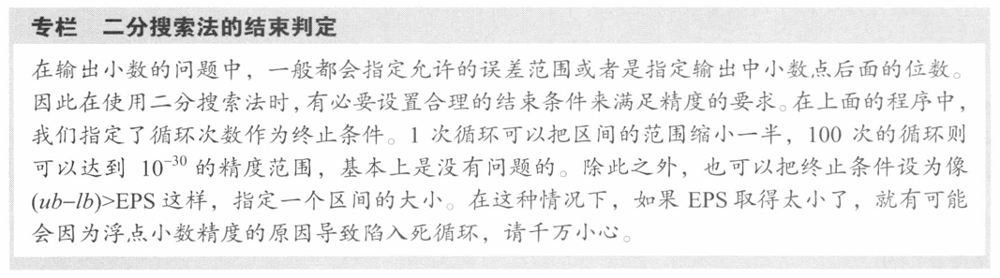

# [常见数据结构](常见数据结构.md)

## 堆

**小顶堆**最重要的性质是：**子节点 >= 父节点**。此外，树的节点是从上到下、从左到右紧凑排列的。

* 插入操作：首先在堆的末尾插入，然后不断与父节点交换直至没有大小颠倒
* 删除操作：首先把最后一个节点复制到根节点（并删除），然后不断向下交换（每次选择较小的子结点）直至没有大小颠倒
* 查询操作：

```java
private static int n; // 最大容量
private static int size; // 当前堆的大小
private static int[] heap; // 存储堆元素的数组

// 初始化堆
public static void init(int n){
    this.n = n;
    size = 0;
    heap = new int[n];
}

// 插入操作：push(x)
public static void push(int x) {
    int i = size++; // 自己节点的编号
    while (i > 0) { // 上浮操作
        int p = (i - 1) / 2; // 父亲节点的编号
        if (heap[p] <= x) break; // 如果父节点已没有大小顺序问题，则退出
        heap[i] = heap[p]; // 把父亲节点的数值放下来，而把自己提上去
        i = p;
    }
    heap[i] = x; // 将值放在最终位置
}

// 弹出堆顶元素：pop()
public static int pop() {
    if (size == 0) throw new IllegalStateException("Heap is empty");
    int res = heap[0]; // 取出最小值（堆顶元素）
    int x = heap[--size]; // 拿到最后一个元素并减少堆的大小
    int i = 0; // 下沉操作，从根开始向下交换
    while (i * 2 + 1 < size) {
        int l = i * 2 + 1, r = i * 2 + 2;
        if (r < size && heap[r] < heap[l]) l = r; // 比较左右孩子的值，选择较小者
        if (heap[a] >= x) break; // 如果已经没有大小顺序问题，则退出
        heap[i] = heap[a]; // 把孩子的数值提上来
        i = a;
    }
    heap[i] = x; // 将x放在最终位置
    return res; // 返回堆顶元
}
```

## 二叉搜索树

二叉搜索树能够高效管理数的集合，对任意节点满足：**左子树上所有节点 < 当前节点 < 右子树上所有节点**

* 插入操作：查找目标值应该在的位置，创建新节点插入
* 删除操作：分三种情况讨论
  * 若删除节点没有左儿子：把右儿子提上去
  * 若删除节点的左儿子没有右儿子：把左儿子提上去
  * 其他情况：把左儿子的子孙中最大的节点提到删除节点上
* 查询操作：从根节点开始，若目标值小于当前值递归左子树，否则递归右子树，直至查询到目标值或查询到空节点

数组构建：

```java
private static int n; // 数组最大容量
private static int size;    // 当前树的大小
private static int[] tree;  // 用于存储树节点的数组

public static void init(int n) {
    this.n = n;
    size = 0;
    tree = new int[n];
    Arrays.fill(tree, Integer.MIN_VALUE); // 初始化所有节点为空
}

// 插入值 x
public static void insert(int x) {
    int i = 0; // 从根节点开始
    while (i < n) {
        if (tree[i] == Integer.MIN_VALUE) { // 如果当前节点为空，插入值
            tree[i] = x;
            size++;
            return;
        } else if (x < tree[i]) { // 移动到左子节点
            i = 2 * i + 1;
        } else if (x > tree[i]) { // 移动到右子节点
            i = 2 * i + 2;
        } else { // 如果值已存在，直接返回
            return;
        }
    }
    System.out.println("无法插入，树已满");
}

// 查找值 x
public static boolean find(int x) {
    int i = 0; // 从根节点开始
    while (i < n && tree[i] != Integer.MIN_VALUE) {
        if (x == tree[i]) { // 找到节点
            return true;
        } else if (x < tree[i]) { // 移动到左子节点
            i = 2 * i + 1;
        } else { // 移动到右子节点
            i = 2 * i + 2;
        }
    }
    return false; // 未找到
}

// 删除值 x
public void remove(int x) {
    int i = 0; // 从根节点开始查找
    while (i < n && tree[i] != Integer.MIN_VALUE) {
        if (x == tree[i]) {
            deleteNode(i); // 调用删除逻辑
            size--;
            return;
        } else if (x < tree[i]) { // 移动到左子节点
            i = 2 * i + 1;
        } else { // 移动到右子节点
            i = 2 * i + 2;
        }
    }
    System.out.println("节点 " + x + " 不存在");
}

// 删除节点逻辑
private void deleteNode(int i) {
    if (leftChild(i) == Integer.MIN_VALUE) { // 1. 没有左儿子：将右儿子提上去
        tree[i] = rightChild(i);
        clearNode(rightChildIndex(i));
    } else if (rightChild(leftChildIndex(i)) == Integer.MIN_VALUE) { // 2. 左儿子没有右儿子：将左儿子提上去
        tree[i] = leftChild(i);
        clearNode(leftChildIndex(i));
    } else { // 3. 左右子树都存在：找到左子树的最大节点替换当前节点
        int maxIndex = findMax(leftChildIndex(i));
        tree[i] = tree[maxIndex];
        deleteNode(maxIndex); // 递归删除左子树最大节点
    }
}

// 查找左子树中的最大节点
private int findMax(int i) {
    while (rightChild(i) != Integer.MIN_VALUE) {
        i = rightChildIndex(i);
    }
    return i;
}

// 清空某个节点
private void clearNode(int i) {
    if (i < n) {
        tree[i] = Integer.MIN_VALUE;
    }
}

// 获取左子节点的值
private int leftChild(int i) {
    int leftIndex = 2 * i + 1;
    return leftIndex < n ? tree[leftIndex] : Integer.MIN_VALUE;
}

// 获取右子节点的值
private int rightChild(int i) {
    int rightIndex = 2 * i + 2;
    return rightIndex < n ? tree[rightIndex] : Integer.MIN_VALUE;
}

// 左子节点索引
private int leftChildIndex(int i) {
    return 2 * i + 1;
}

// 右子节点索引
private int rightChildIndex(int i) {
    return 2 * i + 2;
}
```

节点构建：

```java
class Node {
    int val; // 节点的值
    Node lch, rch; // 左孩子和右孩子指针

    public Node(int val) {
        this.val = val;
        this.lch = this.rch = null;
    }
}

// 插入节点
public static Node insert(Node p, int x) {
    if (p == null) { // 创建一个新节点并返回
        return new Node(x);
    } else {
        if (x < p.val) { // 递归插入到左子树
            p.lch = insert(p.lch, x);
        } else { // 递归插入到右子树
            p.rch = insert(p.rch, x);
        }
        return p;
    }
}

// 查找节点
public static boolean find(Node p, int x) {
    if (p == null) { // 空树，返回 false
        return false;
    } else if (x == p.val) { // 找到节点
        return true;
    } else if (x < p.val) { // 在左子树中查找
        return find(p.lch, x);
    } else { // 在右子树中查找
        return find(p.rch, x);
    }
}

// 删除节点
public Node remove(Node p, int x) {
    if (p == null) return null; // 空树返回
    if (x < p.val) { // 在左子树中删除
        p.lch = remove(p.lch, x);
    } else if (x > p.val) { // 在右子树中删除
        p.rch = remove(p.rch, x);
    } else { // 找到目标节点，进行删除操作
        if (p.lch == null) { // 1. 没有左儿子，直接将右儿子提上去
            return p.rch;
        } else if (p.lch.rch == null) { // 2. 左儿子没有右儿子，将左儿子提上去
            Node leftChild = p.lch;
            leftChild.rch = p.rch; // 右子树接到左儿子的右节点上
            return leftChild;
        }
        Node maxNode = findMax(p.lch); // 3. 找到左子树的最大节点替换当前节点
        p.val = maxNode.val; // 将左子树最大节点的值替换到当前节点
        p.lch = remove(p.lch, maxNode.val); // 从左子树中删除最大节点
    }
    return p;
}

// 查找左子树的最大节点
private Node findMax(Node p) {
    while (p.rch != null) {
        p = p.rch;
    }
    return p;
}
```

## 并查集

并查集是用来**管理元素分组情况**的数据结构，虽然可以进行合并操作，但是无法进行分割操作：

* 查询元素 `a` 和元素 `b` 是否属于同一组
* 合并元素 `a` 和元素 `b` 所在的组

为了避免退化、提高查找效率，有两种优化方式：

* 记录每棵树的高度 `rank`，合并时从 `rank` 小的向 `rank` 大的连边（大的作为根节点）
* 路径压缩：将所查询的节点，以及查询过程中向上经过的节点，都改为直接连到根节点上（直接修改父节点为根节点）

```java
private static int[] parent; // 父节点
private static int[] rank;   // 树的秩（高度）

// 初始化并查集
public static void init(int n) {
    parent = new int[n];
    rank = new int[n];
    for (int i = 0; i < n; i++) {
        parent[i] = i; // 每个节点的父节点初始化为自己
        rank[i] = 0;   // 初始时每棵树的高度为0
    }
}

// 查找某个元素的根节点，并进行路径压缩
public static int find(int x) {
    if (parent[x] != x) { // 当前节点的父节点不是自己，则不是根节点
        parent[x] = find(parent[x]); // 路径压缩
    }
    return parent[x]; // return x;
}

// 合并两个元素所在的集合
public static void unite(int x, int y) {
    int rootX = find(x);
    int rootY = find(y);
    if (rootX == rootY) { // 已经在同一集合中，无需合并
        return;
    }
    if (rank[rootX] < rank[rootY]) { // 从rank小的向rank大的连边，避免退化
        parent[rootX] = rootY;
    } else {
        parent[rootY] = rootX;
        if (rank[rootX] == rank[rootY]) { // 高度相同的情况下，合并后要 rank += 1
            rank[rootX]++;
        }
    }
}

// 判断两个元素是否属于同一集合
public static boolean same(int x, int y) {
    return find(x) == find(y); // 根节点相同则属于一个集合
}

// 动态计算某个节点所在集合的大小
public static int size(int x, int n) {
    int rootX = find(x); // 找到节点 x 的根节点
    int count = 0;
    for (int i = 0; i < n; i++) { // 遍历所有节点
        if (find(i) == rootX) { // 判断是否与根节点相同
            count++;
        }
    }
    return count; // 返回属于该集合的节点数量
}
```

## 线段树

线段树擅长处理区间，是一棵完美二叉树。根节点维护整个区间，每个子节点维护父节点区间二等分后的一个。基于线段树的RMQ：

* 给定 `s` 和 `t`，求 `a[s], a[s+1], ..., a[t]` 的最小值（**维护区间特性**）
* 给定 `i` 和 `x`，**修改元素值** `a[i] = x`

```java
private static int n;
private static int[] dat; // 存储线段树的全局数组

// 初始化线段树
public static void init(int n_) {
    n = 1;
    while (n < n_) n *= 2; // 将元素个数扩展到大于等于 n_ 的最小2的幂
    dat = new int[2 * n - 1];
    Arrays.fill(dat, Integer.MAX_VALUE); // 初始化所有值为 Integer.MAX_VALUE
}

// 更新第 k 个值 (0-indexed) 为 a
public static void update(int k, int a) {
    k += n - 1; // 定位到叶子节点
    dat[k] = a;
    while (k > 0) { // 从下面的叶子节点开始向上不断更新
        k = (k - 1) / 2; // 定位到父节点
        dat[k] = Math.min(dat[k * 2 + 1], dat[k * 2 + 2]); // 更新为左右儿子值的较小者
    }
}

// 求 [a, b) 的最小值，k 是当前节点，表示的区间是 [l, r)
public static int query(int a, int b, int k, int l, int r) { // 外部调用时，使用 query(a, b, 0, 0, n)
    if (r <= a || b <= l) { // 如果 [a, b) 和 [l, r) 不相交，返回 Integer.MAX_VALUE
        return Integer.MAX_VALUE;
    }
    if (a <= l && r <= b) { // 如果 [a, b) 完全包含 [l, r)，返回当前节点的值
        return dat[k];
    }
    int vl = query(a, b, k * 2 + 1, l, (l + r) / 2);
    int vr = query(a, b, k * 2 + 2, (l + r) / 2, r);
    return Math.min(vl, vr); // 否则递归处理，并返回两个子节点的较小值
}
```

## 树状数组

树状数组对于一个初始值全为 `0` 的数列 `a[1], a[2], ..., a[n]`：

* 给定 `i`，**计算前缀和** `a[1] + a[2] + ... + a[i]`
* 给定 `i` 和 `x`，**增加元素值** `a[i] += x`

```java
private static int n;
private static int[] bit;

// 初始化树状数组
public static void init(){
    bit = new int[n + 1]; // 索引从1开始
}

// 计算前缀和 [1, i]
public static int sum(int i) {
    int s = 0;
    while (i > 0) { // 从 i 开始，直到变成 0
        s += bit[i]; // 不断把当前位置 i 的值加到结果 s 中
        i -= i & -i; // 移动到上一个区间（i&-i得到i二进制的最后一个1）
    }
    return s;
}

// 在位置 i 增加值 x
public static void add(int i, int x) {
    while (i <= n) { // 从 i 开始，直到达到 n
        bit[i] += x; // 不断把当前位置 i 的值增加 x
        i += i & -i; // 移动到下一个区间（i&-i得到i二进制的最后一个1）
    }
}
```

## 分桶法与平方分割

分桶法是把一排物品或者平面分成桶，每个桶分别维护内部的信息。其中，平方分割把 `n` 个元素每 `√n` 个分在一个桶内进行维护，使得对区间操作的复杂度降低至 `O(√n)`。线段树与平方分割功能相似，有着更低的复杂度 `O(logn)`。基于平方分割的RMQ：

* 给定 `s` 和 `t`，求 `a[s], a[s+1], ..., a[t]` 的最小值（**维护区间特性**）
* 给定 `i` 和 `x`，**修改元素值** `a[i] = x`

```java
private int n;
private int[] nums;
private int bucketSize; // 桶的大小
private int numBuckets; // 桶的数量（最后一个桶不一定是满的）
private int[] bucketMin; // 预处理的桶数据（每个桶存一个最小值）

// 预处理：计算每个桶的最小值
private void init() {
    bucketSize = (int) Math.sqrt(n); // 向下取整
    numBuckets = (n + bucketSize - 1) / bucketSize; // 向上取整
    bucketMin = new int[numBuckets];
    Arrays.fill(bucketMin, Integer.MAX_VALUE / 3);
    for (int i = 0; i < n; i++) {
        bucketMin[i / bucketSize] = Math.min(bucketMin[i / bucketSize], nums[i]);
    }
}

// 更新操作：将 nums[index] 更新为 newValue
public void update(int index, int newValue) {
    nums[index] = newValue; // 更新 nums 数组中的元素
    int bucketIndex = index / bucketSize; // 计算所在桶的编号、起止位置
    int bucketStart = bucketIndex * bucketSize;
    int bucketEnd = Math.min(bucketStart + bucketSize, nums.length);
    bucketMin[bucketIndex] = Integer.MAX_VALUE / 3; // 重新计算所在桶的最小值
    for (int i = bucketStart; i < bucketEnd; i++) {
        bucketMin[bucketIndex] = Math.min(bucketMin[bucketIndex], nums[i]);
    }
}

// 查询区间 [left, right] 的最小值
public int query(int left, int right) {
    int min = Integer.MAX_VALUE / 3;
    while (left <= right && left % bucketSize != 0) { // 处理左边跨桶部分
        min = Math.min(min, nums[left]);
        left++;
    }
    while (left + bucketSize <= right) { // 处理完全位于桶内的部分
        min = Math.min(min, bucketMin[left / bucketSize]);
        left += bucketSize;
    }
    while (left <= right) { // 处理右边跨桶部分
        min = Math.min(min, nums[left]);
        left++;
    }
    return min;
}

public int sqrtDecompositionRMQ(int[] nums, int i, int v, int l, int r) {
    n = nums.length;
    this.nums = nums;
    init(); // 初始化与预处理桶
    update(i, v); // 先更新
    return query(l, r); // 再查询
}
```

**K-th Number (POJ 2104)** ：给定的数组 `nums` 与查询 `(i, j, k)`，找出子数组 `a[i], a[i+1], ..., a[j]` 中排序后的第 `k` 个数。

```java
private int n, m; // m 是 sortedUnique 数组的长度
private int[] nums;
// private int[] sortedNums; // 排序后的数组副本，作为后续二分查找的值
private int[] sortedUnique; // 还可以将 sortedNums 去重，进一步优化
private int bucketSize; // 桶的大小
private int numBuckets; // 桶的数量（最后一个桶不一定是满的）
private List<Integer>[] sortedBuckets; // 预处理的桶数据（每个桶存桶内排序的数据）

// 预处理：计算每个桶的排序数据
private void init() {
    bucketSize = (int) Math.sqrt(n); // 向下取整
    numBuckets = (n + bucketSize - 1) / bucketSize; // 向上取整
    sortedBuckets = new ArrayList[numBuckets];
    for (int i = 0; i < numBuckets; i++) { // 初始化所有桶
        sortedBuckets[i] = new ArrayList<>();
    }
    for (int i = 0; i < n; i++) { // 将数组元素加入对应的桶
        sortedBuckets[i / bucketSize].add(nums[i]);
    }
    for (int i = 0; i < numBuckets; i++) { // 对每个桶内的元素进行排序
        Collections.sort(sortedBuckets[i]);
    }
}

// 在已排序的列表 list 中查找 <= value 的元素个数
private int upperBound(List<Integer> list, int value) {
    int left = -1, right = list.size(); // [left, right)，第0个数不一定满足要求，因此向左延伸到-1
    while (right - left > 1) {
        int mid = left + (right - left) / 2;
        if (list.get(mid) <= value) {
            left = mid;
        } else {
            right = mid;
        }
    }
    return left + 1; // 满足要求的元素个数 = 最后一个满足要求的元素下标 + 1
}

// 计算在 [left, right] 范围内 <= value 的元素个数
private int countLessOrEqual(int left, int right, int value) {
    int count = 0, startBucket = left / bucketSize, endBucket = right / bucketSize;
    for (int b = startBucket; b <= endBucket; b++) { // 遍历所有涉及的桶
        int bucketStart = b * bucketSize, bucketEnd = Math.min((b + 1) * bucketSize - 1, n - 1);
        if (bucketStart >= left && bucketEnd <= right) { // 桶完全包含在查询范围内，使用预处理的排序桶计数
            count += upperBound(sortedBuckets[b], value);
        } else { // 桶部分包含在查询范围内，逐一遍历元素进行计数
            int actualStart = Math.max(left, bucketStart), actualEnd = Math.min(right, bucketEnd);
            for (int i = actualStart; i <= actualEnd; i++) {
                if (nums[i] <= value) {
                    count++;
                }
            }
        }
    }
    return count;
}

// 查询区间 [left, right] 的第 k 小数
public int query(int left, int right, int k) {
    int low = 0, high = m - 1; // 二分查找 sortedNums/sortedUnique 中使得 cnt < k 的最小的数 [low, high]
    while (low <= high) {
        int mid = low + (high - low) / 2;
        int cnt = countLessOrEqual(left, right, sortedUnique[mid]);
        if (cnt < k) {
            low = mid + 1;
        } else {
            high = mid - 1;
        }
    }
    return sortedUnique[low]; // 返回第一个使得 cnt >= k 的数
}

// 初始化数组和预处理
public int kthNumber(int[] nums, int i, int j, int k) {
    n = nums.length;
    this.nums = nums;
    // this.sortedNums = nums.clone(); // 复制数组用于全局排序
    this.sortedUnique = Arrays.stream(nums.clone()).distinct().toArray(); // 还可以通过去重进一步优化
    m = sortedUnique.length;
    Arrays.sort(this.sortedUnique); // 对 sortedNums/sortedUnique 进行全局排序，作为后续二分查找的值
    init();
    return query(i, j, k);
}
```

本题还可以使用线段树实现，由于每个节点维护一个数组，实际上是区域树

## 字典树

字典树（Trie），又称前缀树，是一种树形数据结构，常用于高效地存储和检索字符串集合。它特别适用于处理大量字符串数据，支持快速的插入、搜索和前缀匹配操作。字典树是一种多叉树，每个节点代表一个字符。根节点通常为空（不存储任何字符）。从根节点到某个节点的路径所经过的字符序列，代表一个字符串的前缀或整个字符串。字典树的主要特点包括：

* **节点表示字符**：每个节点存储一个字符。每个节点通常包含以下几个部分：
  * **字符（char）**：节点存储的字符。
  * **子节点（children）**：指向子节点的指针或引用，通常使用数组、链表或哈希表实现。
  * **是否为结束标志（isEnd）**：布尔值，标识是否有字符串在此节点结束。
* **路径表示字符串**：从根到某个节点的路径表示一个字符串的前缀。
* **共享前缀**：具有相同前缀的字符串共享相同的路径部分，从而节省空间。

字典树的主要操作：

* **插入（Insertion）**：将一个字符串插入到字典树中，从根节点开始，逐字符检查是否存在对应的子节点，若不存在则创建新的节点，直到字符串的所有字符都被插入，最后将最后一个节点标记为结束节点。
* **搜索（Search）**：查找一个字符串是否存在于字典树中，从根节点开始，逐字符遍历对应的子节点，如果所有字符都找到且最后一个节点被标记为结束节点，则返回 `true`，否则返回 `false`。
* **前缀匹配（Prefix Matching）**：查找是否存在以某个前缀开头的字符串，从根节点开始，逐字符遍历对应的子节点，如果所有前缀字符都找到，则返回`true`，表示存在以该前缀开头的字符串。
* **删除（Deletion）**：删除一个字符串，首先需要确认字符串存在于字典树中，然后从叶子节点开始逐层删除不再被其他字符串使用的节点。对于还需要被使用的节点，只需将结束标记置为 `false` 即可（注意此时不能删除节点，否则会删除当前前缀的所有字符串）

```java
import java.util.HashMap;
import java.util.Map;

public class Trie {
    class TrieNode { // 定义字典树的每个节点
        private char c; // 每个节点存储的字符
        private boolean isEnd; // 标识是否为单词的结尾
        private Map<Character, TrieNode> children; // 子节点

        public TrieNode() { // 根节点不存储字符
            this.children = new HashMap<>();
        }

        public TrieNode(char c) {
            this.c = c;
            this.children = new HashMap<>();
        }
		// Getters and Setters
        public char getChar() {return c;}
        public void setChar(char c) {this.c = c;}
        public boolean isEnd() {return isEnd;}
        public void setEnd(boolean isEnd) {this.isEnd = isEnd;}
        public Map<Character, TrieNode> getChildren() {return children;}
        public void setChildren(Map<Character, TrieNode> children) {this.children = children;}
    }

    private TrieNode root;

    public Trie() {
        root = new TrieNode(); // 根节点不存储字符
    }

    // 1.插入（Insertion）
    public void insert(String word) {
        TrieNode node = root;
        for (char c : word.toCharArray()) {
            node.getChildren().putIfAbsent(c, new TrieNode(c)); // 如果当前字符的子节点不存在，则创建新的子节点
            node = node.getChildren().get(c); // 移动到子节点
        }
        node.setEnd(true); // 将最后一个节点标记为结束节点
    }

    private TrieNode searchNode(String word) { // 查找并返回word在字典树中的最后一个节点
        TrieNode node = root;
        for (char c : word.toCharArray()) {
            if (node.getChildren().containsKey(c)) { // 如果当前字符的子节点存在
                node = node.getChildren().get(c); // 移动到子节点
            } else { // 如果当前字符的子节点不存在，查找失败
                return null;
            }
        }
        return node;
    }
    
    // 2.搜索（Search）
    public boolean search(String word) {
        TrieNode node = searchNode(word);
        return node != null && node.isEnd(); // 如果所有字符都找到且最后一个节点被标记为结束节点，则搜索成功
    }

    // 3.前缀匹配（Prefix Matching）：检查是否存在以prefix为前缀的单词
    public boolean startsWith(String prefix) {
        TrieNode node = searchNode(prefix);
        return node != null; // 如果所有前缀字符都找到，则匹配成功
    }

    // 递归删除word（后序遍历），current为当前遍历到的节点，index为当前要删的位置
    private boolean delete(TrieNode current, String word, int index) {
        if (index == word.length()) { // 基础情况：已经遍历完单词的所有字符
            if (!current.isEnd()) { // 如果当前节点不是单词的结束节点，说明单词不存在
                return false;
            }
            current.setEnd(false); // 标记当前节点不再是单词的结束节点
            // 注意不能直接return true; 否则会删除以word为前缀的所有字符串
            return current.getChildren().isEmpty(); // 如果当前节点没有子节点，返回 true 表示可以删除此节点
            // 如果有子节点，返回false，表示不能删除该节点，因为它还被其他单词使用
        }
        
        char c = word.charAt(index); // 获取当前要删除的字符
        TrieNode node = current.getChildren().get(c); // 获取当前字符对应的子节点
        if (node == null) { // 如果子节点不存在，说明单词不存在，返回 false
            return false;
        }
        
        boolean shouldDeleteCurrentNode = delete(node, word, index + 1); // 递归调用删除下一个字符
        if (shouldDeleteCurrentNode) { // 如果子节点可以被删除
            current.getChildren().remove(c); // 删除子节点
            // 如果当前节点没有其他子节点且不是单词的结束节点，返回 true 表示可以删除此节点
            return current.getChildren().isEmpty() && !current.isEnd();
        }
        return false; // 否则，返回 false，表示不能删除当前节点
    }

    // 4.删除（Deletion）：用于外部调用，启动递归过程
    public boolean delete(String word) {
        return delete(root, word, 0);
    }
    
    private void printAllWords(TrieNode node, StringBuilder prefix) { // 递归打印（dfs）
        if (node.isEnd()) { // 如果当前节点是单词的结束节点，打印当前构建的前缀
            System.out.println(prefix.toString());
        }
        for (Map.Entry<Character, TrieNode> entry : node.getChildren().entrySet()) { // 遍历所有子节点
            prefix.append(entry.getKey()); // 将当前字符添加到前缀中
            printAllWords(entry.getValue(), prefix); // 递归调用打印子树
            prefix.deleteCharAt(prefix.length() - 1); // 回溯（恢复现场），移除最后添加的字符
        }
    }
    
    public void printAllWords() { // 打印所有单词：外部调用，启动递归过程
        printAllWords(root, new StringBuilder());
    }
    
    public static void main(String[] args) {
        Trie trie = new Trie();
        trie.insert("apple");
        trie.insert("app");
        trie.insert("ape");
        trie.insert("bat");
        trie.insert("bath");
        trie.insert("baton");
        System.out.println("Search 'app': " + trie.search("app")); // true
        System.out.println("Search 'apple': " + trie.search("apple")); // true
        System.out.println("Search 'apples': " + trie.search("apples")); // false
        System.out.println("StartsWith 'ap': " + trie.startsWith("ap")); // true
        System.out.println("StartsWith 'ba': " + trie.startsWith("ba")); // true
        System.out.println("StartsWith 'baton': " + trie.startsWith("baton")); // true
        System.out.println("StartsWith 'batonh': " + trie.startsWith("batonh")); // false
        System.out.println("\nAll words in Trie:");
        trie.printAllWords();
        trie.delete("bat"); // 删除单词
        System.out.println("\nAfter deleting 'bat':");
        trie.printAllWords();
    }
}
```

使用数组代替 `HashMap`：在字符集较小（如仅包含26个小写字母）的情况下，可以使用固定大小的数组代替`HashMap`，以提高性能和减少内存开销。

```java
class TrieNode {
    private TrieNode[] children;
    private boolean isEnd;

    public TrieNode() {
        children = new TrieNode[26]; // 仅适用于小写字母a-z
    }
} // 其他方法省略
```

压缩字典树是一种改进的字典树，其主要特点是：

- **路径压缩**：将单分支的路径合并为一个节点，节点存储整个字符串片段而不是单个字符。
- **减少节点数量**：通过合并路径，显著减少了树的高度和节点数量，优化了空间利用率。
- **提高查询效率**：减少了需要遍历的节点数量，从而提高了查询效率。

```java
class RadixTreeNode {
    private String label; // 节点存储的字符串片段
    private boolean isEnd; // 是否为单词的结束
    private Map<Character, RadixTreeNode> children; // 子节点映射

    public RadixTreeNode(String label) {
        this.label = label;
        this.isEnd = false;
        this.children = new HashMap<>();
    }
} // 其他方法省略
```

使用静态内部类的完整实现如下：

```java
import java.util.HashMap;
import java.util.Map;

public class RadixTree { // RadixTree 类实现了压缩字典树（Radix Tree）的所有基本操作。
    public static class RadixTreeNode {
        String label; // 节点存储的字符串片段
        boolean isEnd; // 是否为单词的结束
        Map<Character, RadixTreeNode> children; // 子节点映射

        public RadixTreeNode(String label) {
            this.label = label;
            this.isEnd = false;
            this.children = new HashMap<>();
        }
    }

    private static RadixTreeNode root = new RadixTreeNode("");; // 初始化压缩字典树的根节点。

    private static int commonPrefixLength(String str1, String str2) { // 计算str1和str2的公共前缀长度
        int minLength = Math.min(str1.length(), str2.length());
        int i = 0;
        while (i < minLength && str1.charAt(i) == str2.charAt(i)) {
            i++;
        }
        return i;
    }

    // 递归插入方法，将单词插入到当前节点的子树中。node 当前节点，word 剩余要插入的单词部分
    private static void insert(RadixTreeNode node, String word) {
        for (Map.Entry<Character, RadixTreeNode> entry : node.children.entrySet()) {
            RadixTreeNode child = entry.getValue();
            String label = child.label;
            int commonPrefixLength = commonPrefixLength(word, label);
            if (commonPrefixLength > 0) { // 如果存在公共前缀
                if (commonPrefixLength < label.length()) { // 如果公共前缀小于当前节点的标签长度，需要分割节点
                    // 创建一个新的子节点，标签为剩余部分
                    RadixTreeNode newChild = new RadixTreeNode(label.substring(commonPrefixLength));
                    newChild.children = child.children; // 继承子节点
                    newChild.isEnd = child.isEnd; // 继承isEnd标志
                    child.label = label.substring(0, commonPrefixLength); // 更新当前子节点的标签为公共前缀
                    child.children = new HashMap<>(); // 清空原有子节点
                    child.children.put(newChild.label.charAt(0), newChild); // 添加新的子节点
                    child.isEnd = false; // 当前节点不再是单词结束
                    if (commonPrefixLength == word.length()) { // 如果插入的单词与公共前缀相同，标记为单词结束
                        child.isEnd = true;
                        return;
                    }
                    String remainingWord = word.substring(commonPrefixLength); // 继续插入剩余部分
                    insert(child, remainingWord);
                    return;
                }
                if (commonPrefixLength == word.length()) { // 如果公共前缀等于当前节点的标签长度
                    child.isEnd = true; // 完全匹配，标记为单词结束
                    return;
                }
                String remainingWord = word.substring(commonPrefixLength); // 继续插入剩余部分
                insert(child, remainingWord);
                return;
            }
        }
        RadixTreeNode newNode = new RadixTreeNode(word); // 没有匹配的前缀，直接添加新的子节点
        newNode.isEnd = true;
        node.children.put(word.charAt(0), newNode);
    }

    public static void insert(String word) { // 插入一个单词到压缩字典树中。
        insert(root, word);
    }

    // 递归搜索方法，在当前节点的子树中搜索单词。node 当前节点，word 剩余要搜索的单词部分
    private static boolean search(RadixTreeNode node, String word) {
        for (RadixTreeNode child : node.children.values()) {
            String label = child.label;
            if (word.startsWith(label)) {
                if (word.length() == label.length()) {
                    return child.isEnd;
                }
                return search(child, word.substring(label.length()));
            } else if (label.startsWith(word)) { // 单词不完整，无法匹配
                return false;
            }
        }
        return false;
    }

    public static boolean search(String word) { // 搜索一个单词是否存在于压缩字典树中。
        return search(root, word);
    }

    // 递归前缀匹配方法，在当前节点的子树中查找前缀。node 当前节点，prefix 剩余要匹配的前缀部分
    private static boolean startsWith(RadixTreeNode node, String prefix) {
        for (RadixTreeNode child : node.children.values()) {
            String label = child.label;
            if (prefix.startsWith(label)) {
                if (prefix.length() == label.length()) { // 前缀完全匹配
                    return true;
                }
                return startsWith(child, prefix.substring(label.length())); // 继续匹配剩余部分
            } else if (label.startsWith(prefix)) { // 前缀是标签的前缀，存在以该前缀开头的单词
                return true;
            }
        }
        return false;
    }

    public static boolean startsWith(String prefix) { // 检查是否存在以前缀prefix的单词
        return startsWith(root, prefix);
    }

    // 递归删除方法，从当前节点的子树中删除单词。node 当前节点，word 剩余要删除的单词部分
    private static boolean delete(RadixTreeNode node, String word) {
        for (Map.Entry<Character, RadixTreeNode> entry : node.children.entrySet()) {
            RadixTreeNode child = entry.getValue();
            String label = child.label;
            if (word.startsWith(label)) {
                if (word.length() == label.length()) {
                    if (!child.isEnd) { // 单词不存在
                        return false;
                    }
                    child.isEnd = false; // 取消单词结束标志
                    if (child.children.isEmpty()) { // 如果没有子节点，直接删除
                        node.children.remove(entry.getKey());
                    } else if (child.children.size() == 1 && !child.isEnd) { // 如果只有一个子节点且不是单词结束，合并节点
                        Map.Entry<Character, RadixTreeNode> childEntry = child.children.entrySet().iterator().next();
                        RadixTreeNode grandChild = childEntry.getValue();
                        child.label += grandChild.label; // 合并标签
                        child.isEnd = grandChild.isEnd; // 继承isEnd标志
                        child.children = grandChild.children; // 继承子节点
                    }
                    return true;
                }
                return delete(child, word.substring(label.length())); // 继续删除剩余部分
            } else if (label.startsWith(word)) { // 单词不存在
                return false;
            }
        }
        return false; // 单词不存在
    }

    public static boolean delete(String word) { // 删除一个单词从压缩字典树中。
        return delete(root, word);
    }

    // 递归打印方法，遍历当前节点的子树并打印所有单词。node 当前节点，prefix 当前构建的前缀
    private static void printAllWords(RadixTreeNode node, StringBuilder prefix) {
        if (node.isEnd) { // 当前节点是单词结束，打印前缀
            System.out.println(prefix.toString());
        }
        for (RadixTreeNode child : node.children.values()) {
            int lengthBefore = prefix.length(); // 记录当前前缀长度
            prefix.append(child.label); // 添加子节点的标签到前缀
            printAllWords(child, prefix); // 递归打印子节点
            prefix.setLength(lengthBefore); // 回溯，移除添加的部分
        }
    }

    public static void printAllWords() { // 打印压缩字典树中所有的单词。
        printAllWords(root, new StringBuilder());
    }
    
    public static void main(String[] args) {
        insert("apple");
        insert("app");
        insert("ape");
        insert("bat");
        insert("bath");
        insert("baton");
        System.out.println("Search 'app': " + search("app")); // true
        System.out.println("Search 'apple': " + search("apple")); // true
        System.out.println("Search 'apples': " + search("apples")); // false
        System.out.println("StartsWith 'ap': " + startsWith("ap")); // true
        System.out.println("StartsWith 'ba': " + startsWith("ba")); // true
        System.out.println("StartsWith 'baton': " + startsWith("baton")); // true
        System.out.println("StartsWith 'batonh': " + startsWith("batonh")); // false
        System.out.println("\nAll words in Radix Tree:"); // 打印所有单词
        printAllWords();
        delete("bat"); // 删除单词 'bat'
        System.out.println("\nAfter deleting 'bat':");
        printAllWords();
    }
}
```

# [链表](链表.md)

# [二叉树](二叉树.md)

## 递归三问

递归：从原问题出发，把问题不断分解成更小的子问题【递】；到达边界条件后，子问题把计算结果逐级返给上一级【归】，借助栈实现

* 原问题：计算整棵树的最大深度
* 子问题：计算左右子树的最大深度

编写递归函数时，需要考虑以下三个方面：

* 函数定义：对以 `root` 为根节点的子树，返回其最大深度
* **边界条件**：空节点返回深度 `0`
* 转移关系（**非边界条件逻辑**）：先递归到左子树、右子树，再计算并返回当前节点的最大深度 `Math.max(lDepth, rDepth) + 1`

# [回溯](回溯.md)

## 回溯三问

回溯有一个**增量构造答案**的过程，这个过程通常用递归实现

* 当前操作（每一步操作）：枚举 `path[i]`，递归参数 `i` 含义为 `>= i` 的部分还需要枚举
* 子问题：构造字符串 `>= i` 的部分
* 下一个子问题：构造字符串 `>= i + 1` 的部分

## 恢复现场

探索搜索树的每一条可能路径需要“回溯”，即撤回部分已有路径并替换为新的路径继续探索，也称“恢复现场”

方法1：**仅创建空列表** `List<Integer> path = new ArrayList<>();`

每次递归是添加元素，因此需要手动删除。程序中使用 `add()` 和 `remove()` 维护 `path` 列表即可

方法2：**初始化空数组/列表** `int[] path = new int[n]`

每次递归是替换元素，因此会直接覆盖。程序中直接使用 `path[i] = num` 覆盖递归的第 `i` 次即可

## 时间复杂度

通用公式：**路径长度**×**搜索树的叶子数**（一般按最长路径算，且有重复节点，所以是一种偏大的估计方法）

* 这种计算方式路径长度和加入答案的时间复杂度是加法关系，即 **max(路径长度，答案长度)×搜索树的叶子数**
  * 例如组合型回溯：`O(k) + O(k) = O(k)`
  * 例如排列型回溯-N皇后：`O(n) + O(n`^2^`) = o(n`^2^`)`

精确方法：直接统计**搜索树的所有节点个数，即递归次数**

* 子集型回溯：`O(n2`^n^`)` 递归次数为一个满二叉树的节点个数 `O(2`^n^`)` 次（等比数列和），加上复制 `path` 需要 `O(n)` 的时间
  * 满二叉树的最下层节点数量级也是 `O(2`^n^`)`，其中的每个节点复制都要花费 `O(n)`
* 组合型回溯：`O(k*C(n,k))` 路径长度`k ×` 叶子个数，这种计算方式复制 `path` 需要 `O(k)` 的时间可以合并在路径长度中
  * 搜索树不是满二叉树且没有规律性，因此不方便直接统计搜索树的所有节点个数
* 排列型回溯：`O(n*n!)` 搜索树中的节点个数为 `⌊e⋅n!⌋`
  * 每个非叶节点要花费 `O(n)` 的时间遍历 `onPath` 数组，每个叶结点也要花费 `O(n)` 的时间复制 `path` 数组

推广：对于分叉 `>=2` 的树，`O(节点总数)=O(叶子个数)=O(f(n))`（可以按等比数列计算证明非叶子节点与叶子节点数量是一个量级）

## 子集型回溯

子集型回溯：`n` 个元素的集合有 `2`^n^ 个子集，**不考虑顺序，那么就规定一个严格递增的顺序**

解法1：输入视角：选或不选

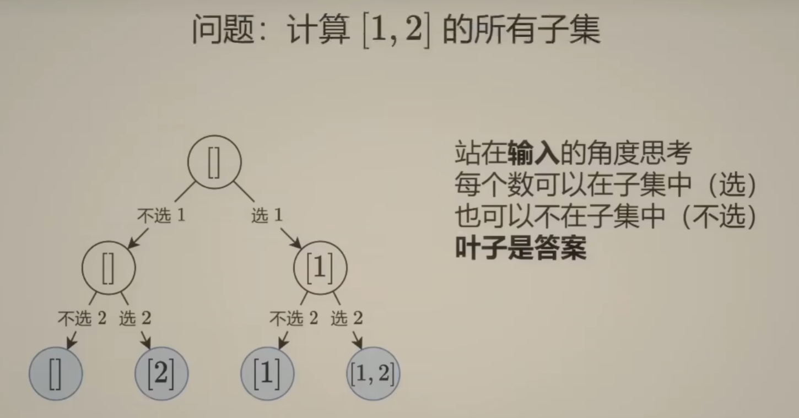

* 当前操作：枚举第 `i` 个数选或不选
* 子问题：从下标 `>= i` 的数字中构造子集
* 下一个子问题：从下标 `>= i + 1` 的数字中构造子集

```java
private final List<List<Integer>> ans = new ArrayList<>();
private final List<Integer> path = new ArrayList<>();
private int[] nums;

private void dfs(int i) {  // 子问题：从下标 >=i 的数字中构造子集
    if (i == nums.length) { // 边界条件：递归 n 次后得到一个子集作为答案
        ans.add(new ArrayList<>(path));  // 固定答案
        return;
    }
    dfs(i + 1);  // 不选 nums[i]
    path.add(nums[i]);
    dfs(i + 1);  // 选 nums[i]
    path.remove(path.size() - 1);  // 恢复现场
}
```

解法2：答案视角：枚举下一个数选哪个

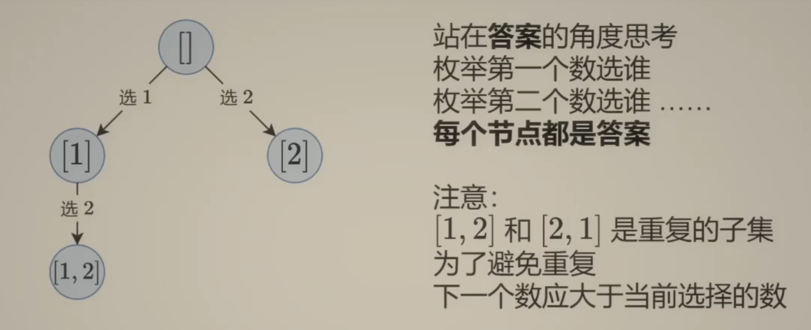

* 当前操作：枚举一个下标 `j > i` 的数字，加入 `path`
  * 由于不重复，即不考虑顺序，那么就规定一个严格递增的顺序，每次枚举必须有 `j > i`
* 子问题：从下标 `>= i` 的数字中构造子集
* 下一个子问题：从下标 `>= j + 1` 的数字中构造子集

```java
private void dfs2(int i) {  // 子问题：从下标 >=i 的数字中构造子集
    ans.add(new ArrayList<>(path));  // 递归到的每个节点都是答案
    // if (i == nums.length) { return; }  // for循环保证了i递归到 nums.length 时无代码可执行，自动返回
    for (int j = i; j < nums.length; j++) {  // 不考虑顺序，就规定一个顺序j>=i，枚举选择的数字
        path.add(nums[j]);
        dfs2(j + 1);  // 下一个子问题：从下标>=j+1的数字中构造子集
        path.remove(path.size() - 1);  // 恢复现场
    }
}
```

## 组合型回溯

组合型回溯：`C(n,k)`，仅需在**子集型回溯上增加一个判断逻辑**，并可以通过**剪枝优化**（下面以答案视角为例）

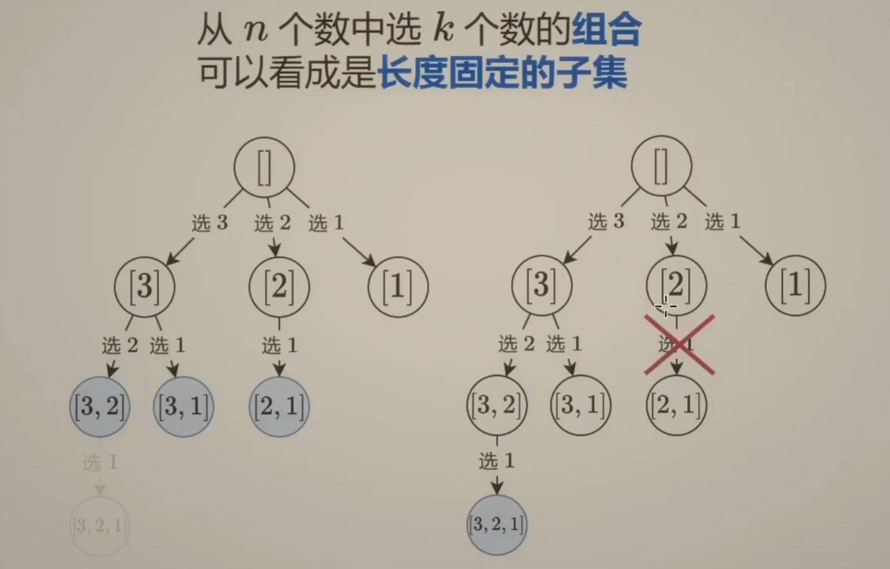

剪枝：设 `path` 长度为 `m`，那么还需要选 `d = k - m` 个数，设当前需要从 `[1,i]` 这 `i` 个数中选，若 `i < d` 最后必然无法选出 `k` 个数

注意：倒序枚举使得剪枝判断条件 `i < d` 简单易懂，正序枚举条件为 `n - i + 1 < d`

解法1：输入视角：选或不选

```java
private final List<List<Integer>> ans = new ArrayList<>();
private final List<Integer> path = new ArrayList<>();
// private int[] nums; // 本题是从[1,n]中选k个数字，所以nums其实就是[1,n]

private void dfs(int i) {  // 表示接下来可在 [1...i] 的范围内枚举
    int d = k - path.size();  // 还要选 d 个数
    if (d == 0) {
        ans.add(new ArrayList<>(path));
        return;
    }
    if (i > d) {  // i == d 时 [1...i] 必须全选，否则长度将达不到k
        dfs(i - 1);
    }
    path.add(i);
    dfs(i - 1);
    path.remove(path.size() - 1);  // 恢复现场
}
```

解法2：答案视角：枚举下一个数选哪个

```java
public void dfs2(int i) {  // 表示接下来可在 [1...j] 的范围内枚举
    int d = k - path.size();  // 还要选 d 个数
    if (d == 0) {
        ans.add(new ArrayList<>(path));
        return;
    }
    //  if (i < d) { return; }  // 剪枝，合并到for循环中
    for (int j = i; j >= d; j--) {  // j == d 时 [1...j] 必须全选，否则长度将达不到k
        path.add(j);
        dfs2(j - 1);
        path.remove(path.size() - 1);  // 恢复现场
    }
}
```

## 排列型回溯

排列型回溯：`A(n,k)`，相较于子集/组合型回溯**关注元素的顺序**，需要**对使用过的元素进行额外记录并恢复现场**

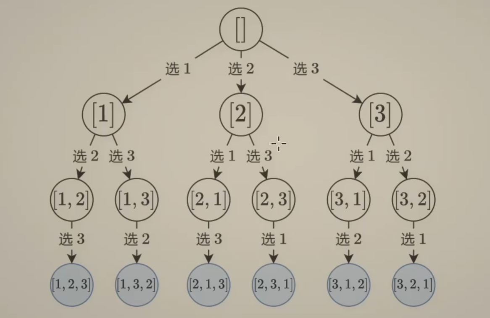

方法1：数组 `path` 记录路径上的数字（已选），设置**集合 `s` 记录剩余未选数字**（可将 `s` 设为递归参数，自动恢复现场）

* 当前操作：从 `s` 中枚举 `path[i]` 要填的数字 `x`
* 子问题：构造排列 `>= i` 的部分，剩余未选数字集合为 `s`
* 下一个子问题：构造排列 `>= i + 1` 的部分，剩余未选数字集合为 `s - {x}`

```java
private final List<List<Integer>> ans = new ArrayList<>();
private final List<Integer> path = new ArrayList<>();
private int[] nums;

private void dfs(int i, Set<Integer> s) { // Set 也可以换成 List
    if (i == nums.length) {
        ans.add(new ArrayList<>(path));
        return;
    }
    for (Integer num : s) {
        path.add(num);
        Set<Integer> s1 = new HashSet<>(s); // 不能在遍历时修改，需要拷贝一份
        s1.remove(num); // 去掉本次遍历的数字后，作为递归参数传入下一次递归
        dfs(i + 1, s1);
        path.remove(num);
    }
}

public List<List<Integer>> permute(int[] nums) {
    this.nums = nums;
    Set<Integer> set = Arrays.stream(nums).boxed().collect(Collectors.toSet()); // 逐个加入即可
    dfs(0, set);
    return ans;
}
```

方法2：设置一个辅助数组 `boolean[] onPath` 来**标记各元素是否访问过**

由于两种方法并无本质区别，且一般情况下方法2更简单效率更高，因此后续只考虑方法2的代码：

```java
private final List<List<Integer>> ans = new ArrayList<>();
private final List<Integer> path = new ArrayList<>();
private boolean[] onPath;
private int[] nums;

private void dfs(int i) {
    if (i == nums.length) {
        ans.add(new ArrayList<>(path));
        return;
    }
    for (int j = 0; j < nums.length; j++) {  // 因为是排列型不是组合型，因此 j 从 0 开始而不是从 i 开始枚举
        if (!onPath[j]) {
            onPath[j] = true;  // 打上标记
            path.add(nums[j]);
            dfs(i + 1);
            onPath[j] = false;  // 恢复现场
            path.remove(path.size() - 1);
        }
    }
}
```

## 总结

* 子集型回溯：`n` 个元素的集合有 `2`^n^ 个子集，**不考虑顺序，那么就规定一个严格递增的顺序**
* 组合型回溯：`C(n,k)`，仅需在**子集型回溯上增加一个判断逻辑**，并可以通过**剪枝优化**
* 排列型回溯：`A(n,k)`，相较于子集/组合型回溯**关注元素的顺序**，需要**对使用过的元素进行额外记录并恢复现场**
* 对于**子集型回溯**和**组合型回溯**，有**选或不选**，**枚举选哪个**两种思路，**本质上是两种不同视角对应的搜索树**

* 对于**排列型回溯**，有**集合记录**，**访问数组**两种方法，**本质上都是对使用过的元素进行额外记录**
* 对于 `path` 列表的**恢复现场**，未初始化需手动加入和删除，**初始化长度后可自动覆盖**
* 对于时间复杂度，通用公式为 **max(路径长度，答案长度)×搜索树的叶子数**，精确方法直接统计**搜索树的所有节点个数，即递归次数**

# [动态规划](动态规划.md)

## 思考方式

启发思路：回溯的思考方式：入参和返回值，递归到哪里，递归边界和入口

* 输入视角——选或不选：`0-1` 背包 完全背包
* 答案视角——枚举选哪个

动态规划核心：**状态定义（`dfs / dp`数组的含义） 状态转移方程**

* 当前操作：枚举第 `i` 个房子选或不选
 * 子问题（状态定义）：从前 `i` 个房子中得到的最大金额和
 * 下一个子问题：
   * 不选 `i` ：从前 `i - 1` 个房子中得到的最大金额和
   * 选 `i`：从前 `i - 2` 个房子中得到的最大金额和
 * 怎么递归（状态转移方程）：不选时直接继承，选时加上当前物品价值，最后二者取 `max`

**动态规划 `dp` 等价于广度优先搜索 `bfs`，回溯等价于深度优先搜索 `dfs`**，动态规划本质上是回溯的逆向思考方式，**通过缓存中间变量以空间换时间**（记忆化搜索后的回溯与动态规划具有相同的时间复杂度）。动态规划相比回溯的难点在于：**回溯自顶向下思考，递归边界设置较为简单，动态规划需要从各种复杂的初始条件开始自底向上递推**。

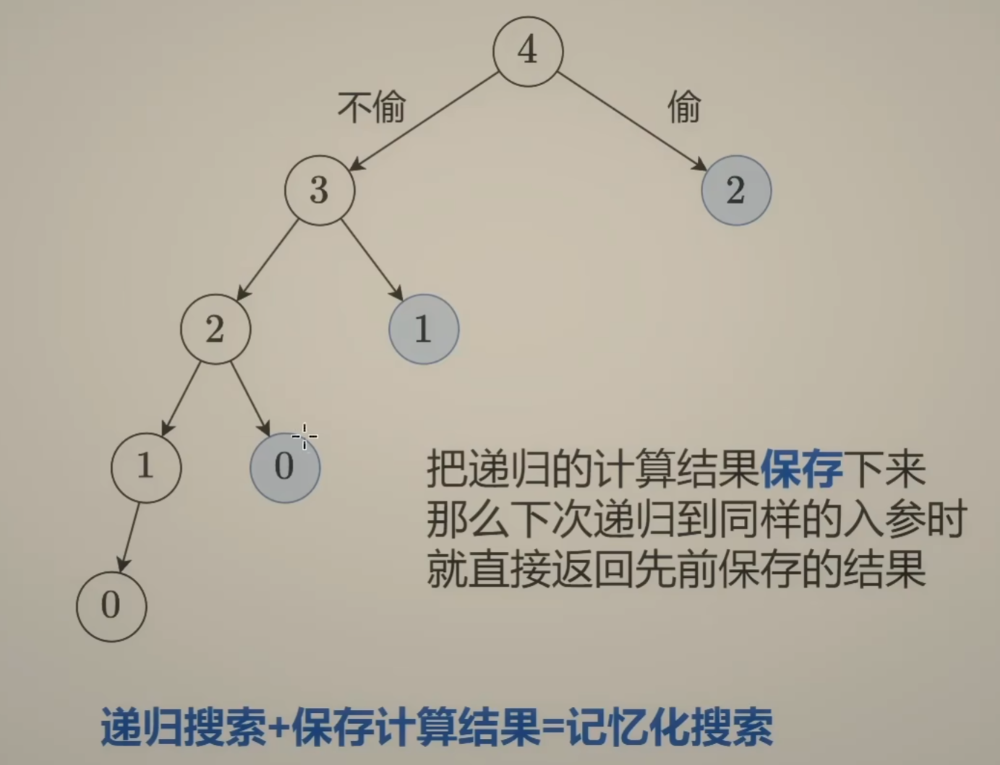

优化过程：

* 回溯（自顶向下）
* 记忆化搜索（自顶向下）
  * 回溯的搜索树中，递归参数 `i` 相同的节点对应的计算值相同（相同子问题），可以把递归的计算结果保存下来，实现记忆化搜索
  * 时间复杂度：**状态个数 * 单个状态的计算时间**
* 递推，即动态规划（自底向上）
  * 已知搜索树中节点【归】的逻辑，便无需【递】的过程，直接自底向上递推（特殊处理负数下标）
* 滚动数组（空间优化）

回溯 `1:1` 翻译成递推：

* `dfs -> dp`数组
  * `dfs` 和 `dp` 数组的含义表示从一些元素中算出的结果，而不是从一个元素算出的结果
* 递归 `->` 循环
* 递归边界 `->` 数组初始值（注意下标的一一对应与出现负数下标）
  * `dfs` 边界条件与 `dp` 初始值一一对应，并且一般取决于实际问题的含义，递归时需要根据数组下标的越界情况提前对 `dp` 初始化

时间复杂度（记忆化搜索/动态规划）：由于**每个状态只会计算一次**，动态规划的时间复杂度 = **状态个数 × 单个状态的计算时间**。

## 背包问题

### 0-1背包

`0-1`背包问题：每个物品只有一件，`capacity`: 背包容量，`w[i]`: 第 `i` 个物品的体积，`v[i]`: 第 `i` 个物品的价值，`return`: 所选物品体积不超过 `<= capacity` 的前提下，所能得到的最大价值和

* 当前操作：枚举第 `i` 个物品选或不选
* 子问题：剩余容量为 `j` 时，从前 `i` 个物品中得到的最大价值和
* 下一个子问题：
  * 不选：剩余容量为 `j` 时，从前 `i - 1` 个物品中得到的最大价值和
  * 选：剩余容量为 `j - w[i - 1]` 时，从前 `i - 1` 个物品中得到的最大价值和
* 怎么递归：不可选时直接继承；可选时比较选与不选取 `max`

```java
public static int zeroOneKnapsack(int[] weight, int[] value, int capacity) {
    int n = weight.length;
    int[][] dp = new int[n + 1][capacity + 1];  // dp[i][j] 表示前 i 个物品在不超过容量 j 下的最大价值和
    //  for (int j = 0; j <= capacity; j++) { dp[0][j] = 0; } // 初始化：没有物品时，价值和为0（Java数组自动初始化0）
    //  for (int i = 0; i <= n; i++) { dp[i][0] = 0; } // 初始化：没有容量时，价值和为0（一般在循环中完成）
    for (int i = 1; i <= n; i++) {  // 只拿前 i 件物品（注意 weight 和 value 的下标都为 i - 1）
        for (int j = 0; j <= capacity; j++) {  // 容量为 j 时
            dp[i][j] = dp[i - 1][j];  // 不选，继承上一次的最大值
            if (weight[i - 1] <= j) {  // 若能选，则比较选和不选的大小，并取最大者
                if (dp[i - 1][j - weight[i - 1]] + value[i - 1] > dp[i - 1][j]) {
                    dp[i][j] = dp[i - 1][j - weight[i - 1]] + value[i - 1];
                }
            }
        }
    }
    return dp[n][capacity];
}
```

### 完全背包

完全背包问题：每种物品可以无限次重复选，`capacity`: 背包容量，`w[i]`: 第 `i` 个物品的体积，`v[i]`: 第 `i` 个物品的价值，`return`: 所选物品体积不超过 `<= capacity` 的前提下，所能得到的最大价值和

* 当前操作：枚举第 `i` 个物品选一个或不选
* 子问题：剩余容量为 `j` 时，从前 `i` 种物品中得到的最大价值和
* 下一个子问题：
  * 不选：剩余容量为 `j` 时，从前 `i - 1` 个物品中得到的最大价值和
  * 选：剩余容量为 `j - w[i - 1]` 时，从前 `i` 个物品中得到的最大价值和
* 怎么递归：不可选时直接继承；可选时比较选与不选取 `max`

```java
public static int unboundedKnapsack(int[] weight, int[] value, int capacity) {
    int n = weight.length;
    int[][] dp = new int[n + 1][capacity + 1];  // dp[i][j] 表示前 i 个物品在不超过容量 j 下的最大价值和
    //  for (int j = 0; j <= capacity; j++) { dp[0][j] = 0; } // 初始化：没有物品时，价值和为0（Java数组自动初始化0）
    //  for (int i = 0; i <= n; i++) { dp[i][0] = 0; } // 初始化：没有容量时，价值和为0（一般在循环中完成）
    for (int i = 1; i <= n; i++) {  // 只拿前 i 件物品（注意 weight 和 value 的下标都为 i - 1）
        for (int j = 0; j <= capacity; j++) {  // 容量为 j 时
            dp[i][j] = dp[i - 1][j];  // 不选，继承上一次的最大值
            if (weight[i - 1] <= j) {  // 若能选，则比较选和不选的大小，并取最大者
                if (dp[i][j - weight[i - 1]] + value[i - 1] > dp[i - 1][j]) {
                    dp[i][j] = dp[i][j - weight[i - 1]] + value[i - 1];
                }
            }
        }
    }
    return dp[n][capacity];
}
```

### 问题变形

以完全背包问题为例，`0-1` 背包问题只需将第二个 `i` 改为 `i - 1` 即可：

* 求方案数：`dp[i][j] = dp[i - 1][j] + dp[i][Math.max(j - w[i - 1], 0)]`
  * 至多 `<= capacity`: `dp[0][0...c] = 1`
  * 恰好 `== capacity`: `dp[0][0] = 1, dp[0][1...c] = 0`
  * 至少 `>= capacity`: `dp[0][0] = 1, dp[0][1...c] = 0`
* 求最大价值和：`dp[i][j] = Math.max(dp[i - 1][j], dp[i][Math.max(j - w[i - 1], 0)] + v[i - 1])`
  * 至多 `<= capacity`: `dp[0][0...c] = 0`
  * 恰好 `== capacity`: `dp[0][0] = 0, dp[0][1...c] = Integer.MIN_VALUE / 2`
* 求最小价值和：`dp[i][j] = Math.min(dp[i - 1][j], dp[i][Math.max(j - w[i - 1], 0)] + v[i - 1])`
  * 恰好 `== capacity`: `dp[0][0] = 0, dp[0][1...c] = Integer.MAX_VALUE / 2`
  * 至少 `>= capacity`: `dp[0][0] = 0, dp[0][1...c] = Integer.MAX_VALUE / 2`

注：以上递推公式通过 `Math.max(j - w[i - 1], 0)` 把所有 `<= 0` 的状态都合并成一个状态 `0`，再将非法初始值设为 `dp[0][1...c] = Integer.MIN_VALUE / 2`，最后反向取最值 `Math.max(dp[i - 1][j], ...)`，将递推公式整合为一个式子

注：以上三种情况仅需初始化第 `0` 行 `dp[0][j]`，第 `0` 列的剩余元素无需初始化，会在递推中计算得到

### 交换状态与状态值

线性`DP`-最长递增子序列（贪心+二分）：为了优化时间复杂度，可以考虑交换状态与状态值

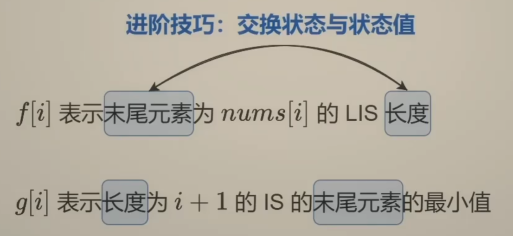

以 `0-1` 背包问题为例，当背包容量很大 `1 <= w`~i~`, v`~i~` <= 100` `1 <= capacity <= 10000` 时，使用原本的状态定义将 `capacity` 作为 `dp` 数组的第二维会有较高的时间复杂度，因此考虑交换状态与状态值，交换前后的状态定义如下：

* 交换前 `dp[i][j]`：前 `i` 个物品在**不超过重量** `j` 下的**最大价值和**

* 交换后 `dp[i][j]`：前 `i` 个物品在**价值和恰为** `j` 时的**最小总重量**

由于前 `0` 个物品中都不可选，初始值为 `dp[0][0] = 0, dp[0][1...v] = +∞`

* 当前操作：枚举第 `i` 个物品选或不选
* 子问题：价值和恰为 `j` 时，从前 `i` 个物品中选择的最小总重量
* 下一个子问题：
  * 不选：价值和恰为 `j` 时，从前 `i - 1` 个物品中选择的最小总重量
  * 选：价值和恰为 `j - v[i - 1]` 时，从前 `i - 1` 个物品中选择的最小总重量
* 怎么递归：不可选时直接继承；可选时比较选与不选取 `min`

注意：交换状态和状态值后答案不是 `dp[n][v]`，而是对应于满足 `dp[n][j] <= capacity` 的最大的 `j`

```java
public static int zeroOneKnapsack(int[] weight, int[] value, int capacity) {
    int n = weight.length, v = n * 100; // 计算 MAX_V = MAX_N * MAX_VI
    int[][] dp = new int[n + 1][v + 1];  // dp[i][j] 表示前 i 个物品在价值和恰为 j 时的最小总重量
    for (int j = 1; j <= v; j++) { dp[0][j] = Integer.MAX_VALUE / 2; } // 初始化：没有物品时，价值和>0非法
    //  for (int i = 0; i <= n; i++) { dp[i][0] = 0; } // 初始化：没有价值时，容量为0（一般在循环中完成）
    for (int i = 1; i <= n; i++) {  // 只拿前 i 件物品（注意 weight 和 value 的下标都为 i - 1）
        for (int j = 0; j <= v; j++) {  // 价值和恰为 j 时
            dp[i][j] = dp[i - 1][j];  // 不选，继承上一次的最小值
            if (value[i - 1] <= j) {  // 若能选，则比较选和不选的大小，并取最小者
                if (dp[i - 1][j - value[i - 1]] + weight[i - 1] < dp[i - 1][j]) {
                    dp[i][j] = dp[i - 1][j - value[i - 1]] + weight[i - 1];
                }
            }
        }
    }
    int res = 0;
    for(int j = 0; j <= v; j++){ // 答案是满足 dp[n][j] <= capacity 的最大的 j
        if(dp[n][j] <= capacity){
            res = j;
        }
    }
    return res;
}
```

### 注意下标

* 定义 `dp` 数组时，由于是自底向上递推，一种经典风格是从 `1` 开始编号，预留出 `0` 的位置，使得从 `i = 1` 开始循环时无需处理 `i - 1` 时的负数下标。另一方面，从 `1` 开始编号符合认知习惯，且预留出的 `0` 位置往往也具有实际含义，增加了可读性和可理解性。
  * `int[] dp = new int[n + 1];`
  * `for (int i = 1; i <= n; i++){ dp[i] = Math.max(dp[i - 1], dp[i - 1] + nums[i - 1]);}`
  * `return dp[n];`
* 若仅需递归到 `i - 1`，对 `dp[0]` 初始化（默认是 `0`），循环 `1...n` 即可，最后返回 `dp[n]`。若需递归到 `n - 2`，则需对 `dp[0], dp[1]` 初始化（默认是 `0`），循环 `2...n` ，最后返回 `dp[n]`。
  * `int[] dp = new int[n + 1];`
  * `dp[1] = nums[0];`
  * `for (int i = 2; i <= n; i++){ dp[i] = Math.max(dp[i - 1], dp[i - 2] + nums[i - 1]);}`
  * `return dp[n];`

* 若为二维数组，一般需要对第 `0` 行和第 `0` 列初始化，其中对第 `0` 列的初始化可以隐含在循环中，即第二重 `j` 循环 `1...n`。这是因为多数情况下 `dp[i][]` 会递归到 `dp[i - 1][]`，而 `dp[][j]` 递归到 `dp[][j - w[i - 1]]` 需要满足实际意义，即 `weight[i - 1] <= j` 的条件下才可递归（把所有 `<= 0` 的状态都合并成一个状态 `0`），避免了下标为负数的情况
  * `int[][] dp = new int[n + 1][m + 1];`
  * `for (int j = 0; j <= m; j++) { dp[0][j] = 0; }`
  * `for (int i = 1; i <= n; i++){ for (int j = 0; j <= m; j++) {...} }` 
  * `return dp[n][m];`
* 注意 `weight[]` 和 `value[]` 的下标仍然是从 `0` 开始的，因此访问时下标为 `i - 1` 而不是 `i`

### 空间优化

* 滚动数组：每时每刻只有两个数组中的元素参与状态转移，因此只需两个数组（不断覆盖），故将所有和 `i` 相关的下标 `% 2` 即可

* 一个数组：去掉第一维（物品维度），保留第二维（背包维度），特定转移顺序下可以倒序（左）或正序（右）递推。注意第二重循环枚举背包容量时仅需从 `w[i - 1]` 开始，因为前面背包容量太小（`c < w[i - 1]`）无法更新值

倒序：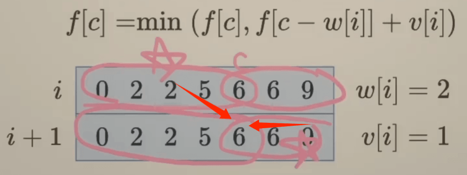 正序：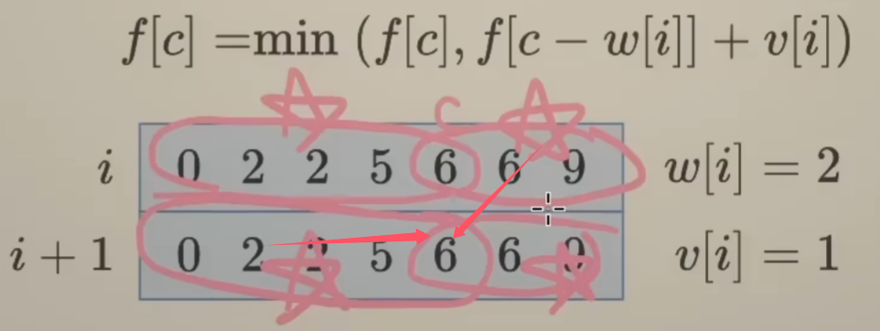

## 线性DP

线性DP：一般是在数组的前缀/后缀上转移

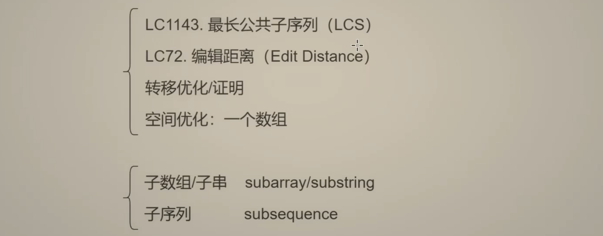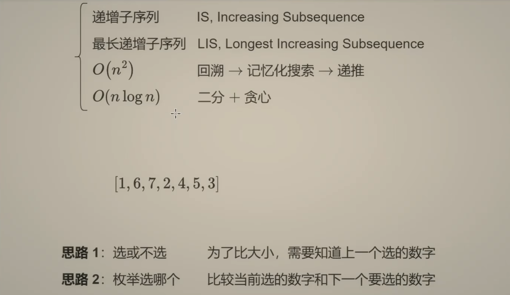

## 状态机DP

买卖股票问题：

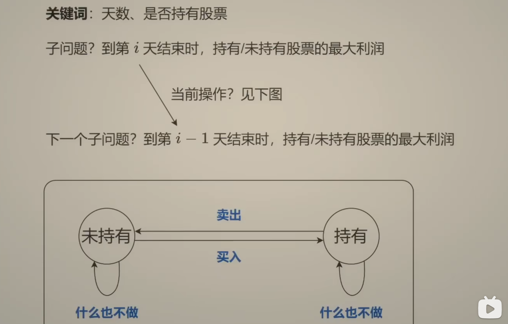

思考子问题、下一个子问题、当前操作（状态机图）

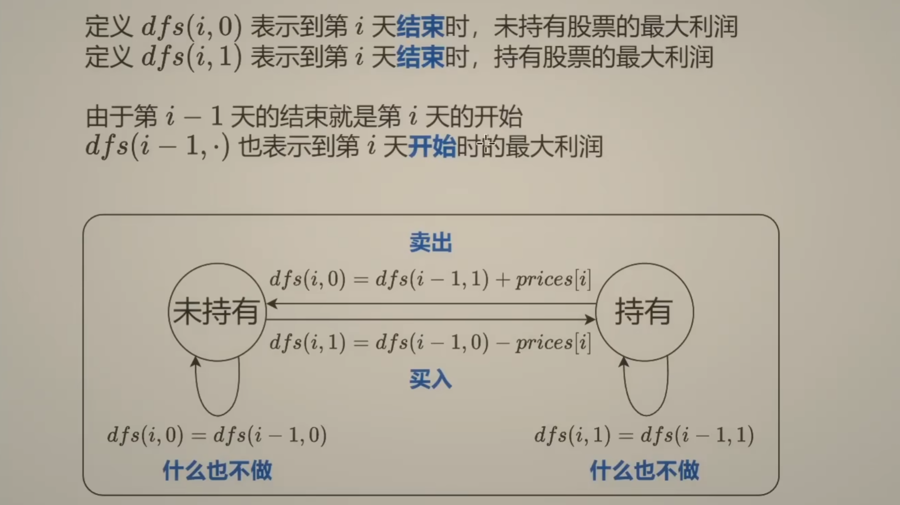

定义状态 `dfs(i,0), dfs(i,1)`，推导状态转移方程，有等价关系：第 `dfs(i-1,*)` 表示第 `i - 1` 天结束，第  `i` 天开始时的最大利润

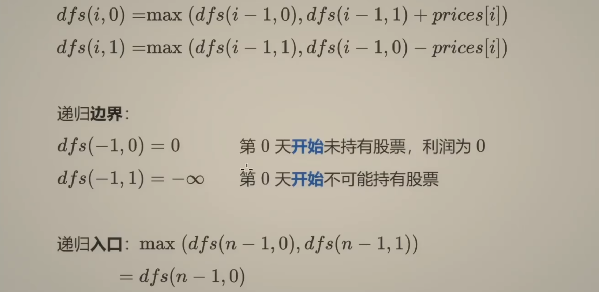

根据等价关系，`dfs(-1,*)` 表示第 `-1` 天结束，第 `0` 天开始的最大利润，而第 `0` 天不可能持有股票，故 `dfs(-1,1)=-∞`，后面取 `max` 时就一定会从一个合法的状态转移过来。若把 `dfs(0,*)` 当作递归边界，但需要保证 `prices[]` 数组非空（即能取到 `prices[0]`），而 `dfs(-1,*)` 不必保证，故适用性更广

注意，这里递归入口为 `dfs(n-1,0)`，而按照本文档的规范写法应为 `dfs(n,0)`，也就是为了后续 `dp` 考虑插入一个状态。因此，题目中的第 `0` 天相当于规范写法的第 `1` 天，上述的递归边界到 `dfs(-1,*)` 应为 `dfs(0,*)`，不推荐写法的 `dfs(0,*)` 其实是 `dfs(1,*)`。同时，状态转移方程中的 `prices[i]` 应为 `prices[i - 1]`

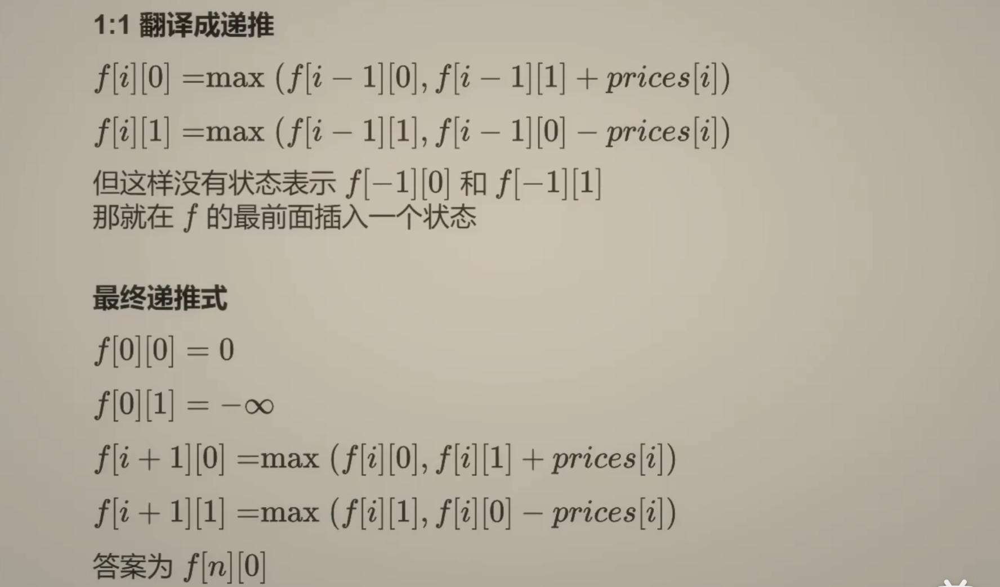

这里 `dp` 时插入了状态 `dp[0][]`，但本文档的规范写法对于当前操作始终使用 `dp[i][j]`，而不会使用图中避免 `i - 1` 的写法

买卖股票问题拓展：

* 冷冻期：购买股票的前一天不能卖出，因此要 `dp[i][1]` 递归到 `dp[i - 2][0]`。由于需要递归到 `i - 2`，因此循环变量取值是 `for (int i = 2; i <= n; i++)`，需要对 `i = 0` 和 `i = 1` 时初始化 `dp[0][1] = -∞;` `dp[1][1] = -prices[0];`
* 交易次数限制：至多/至少/恰好完成 `k` 次交易

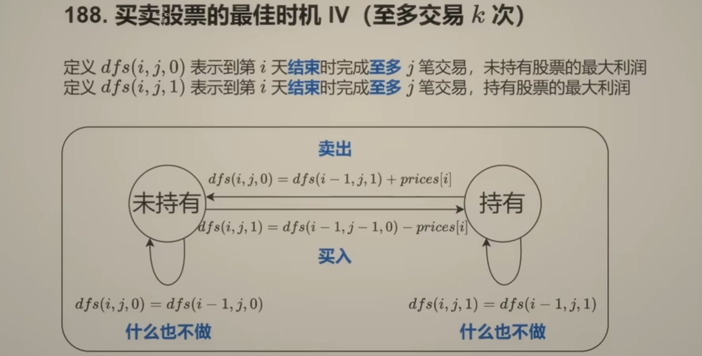

既然有次数限制，就应当在递归的过程中记录次数，增加参数 `j` 表明至多完成 `j` 笔交易。那么转移方程在买入股票**或**卖出股票时，需要把交易次数 `-1`。因为**买入再卖出一个流程才算一次**，且有买入必然有卖出，因此在买入股票**或**卖出股票时任意改为 `j - 1` 即可

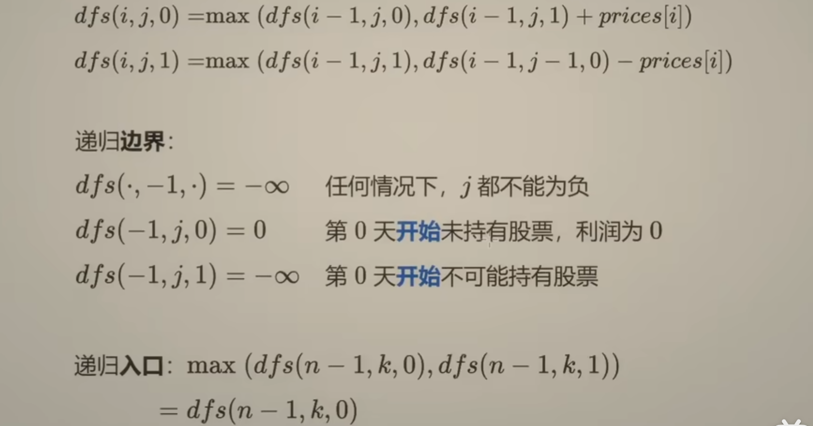

注意：`j = 0` 是合法的，因为根据定义，它表示没有发生交易

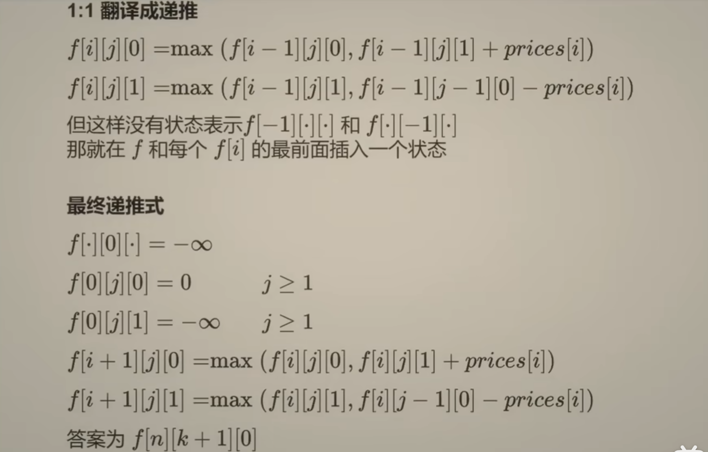

按照本文档的规范写法，动态规划与递归的下标一一对应，即不额外为了下标插入状态。图中插入状态导致 `dp[][0][]=-∞`，我们不插入还保留上述 `dfs` 时 `j = 0` 的合法状态，但由于需要递归到 `j - 1`，因此循环变量取值是 `for (int j = 1; j <= k; j++)`，并对 `dp[i][0][0]` `dp[i][0][1]` 初始化（`j = 0` 时的特例，参考状态转移方程完成即可）。最后，`dp[0][j][0]` 和 `dp[0][j][1]` 含义同上，即第 `0` 天不可能持有股票，利润为 `0`。

注意：图中第二维度共有 `k + 2` 个状态，可以理解为本身 `j` 代表的具有实际含义的下标有 `k + 1` 个 `[0...k]`，而为了能够递归到 `j - 1`，于是再插入一个状态变成 `k + 2` 个，遍历时也加一变成 `[1...k+1]`。而第一维的第 `0` 天不具有实际含义，故无需再插入一个状态。总之，这种写法若有 `p` 个实际意义的状态，且递归时需要递归到 `i - q`，则需要插入 `q` 个状态，共 `p + q` 个。多数情况下，`p = n - 1, q = 1 or 2`

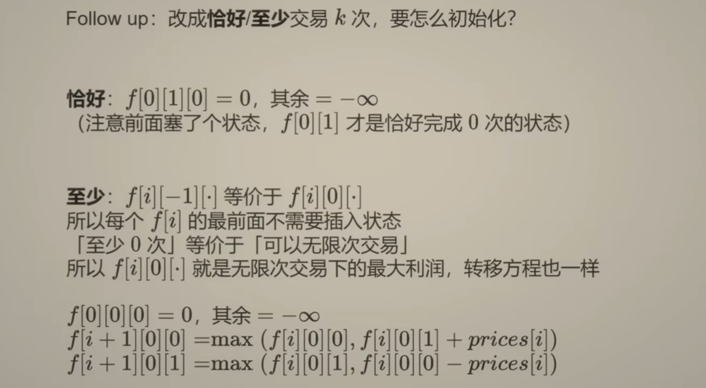

推广情况：只需初始化第一维为 `0` 的情况，第二维为 `0` 的情况可以在第一重循环中通过特殊化赋值（我们不考虑对 `j` 插入状态）

 * 至多 `k` 次：
   * `dp[0][0...k][0] = 0`
   * `dp[0][0...k][1] = Integer.MIN_VALUE / 2`
 * 恰好 `k` 次：
   * `dp[0][0][0] = 0`
   * `dp[0][1...k][0] = Integer.MIN_VALUE / 2`
   * `dp[0][0...k][1] = Integer.MIN_VALUE / 2`
 * 至少 `k` 次：至少 0 次等价于无限次交易
   * `dp[0][0][0] = 0`
   * `dp[0][1...k][0] = Integer.MIN_VALUE / 2`
   * `dp[0][0...k][1] = Integer.MIN_VALUE / 2`

## 区间DP

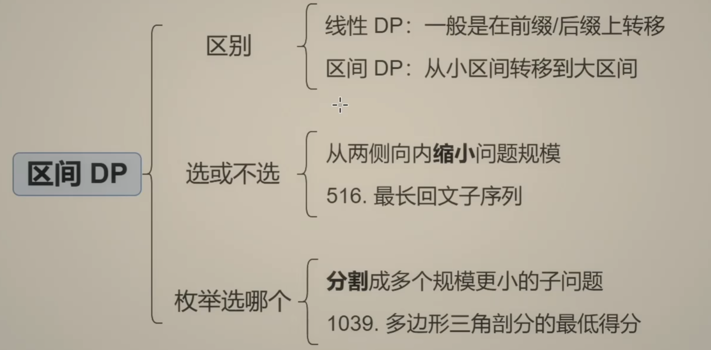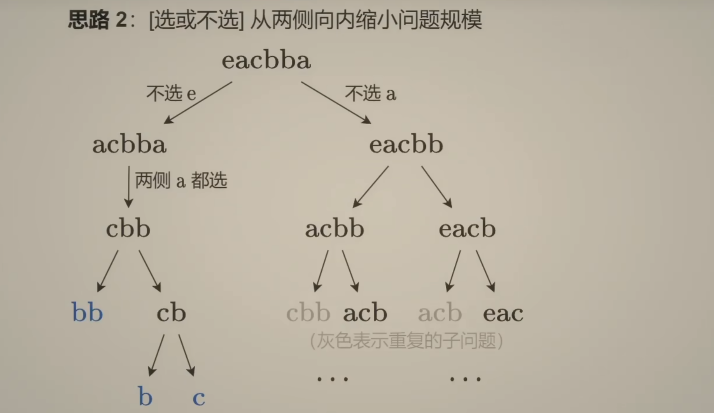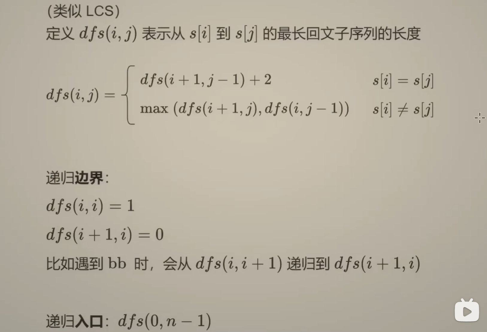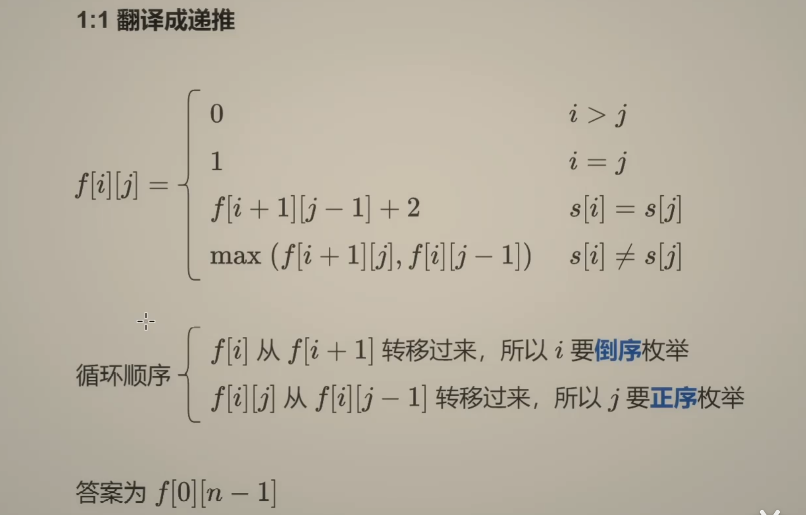


## 树形DP

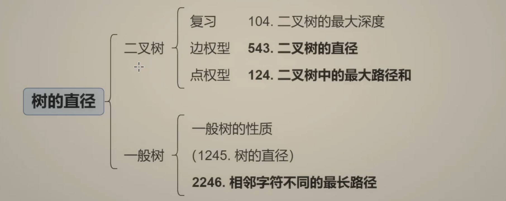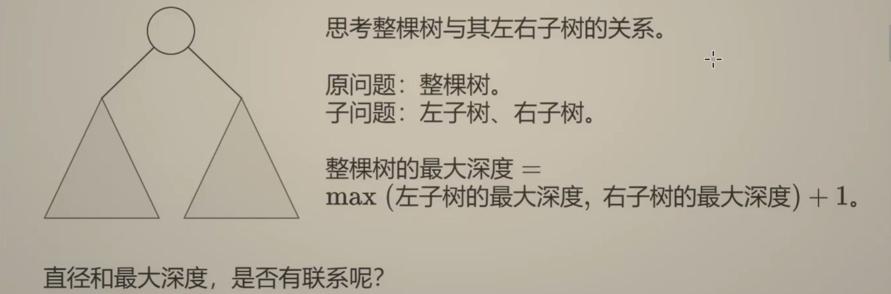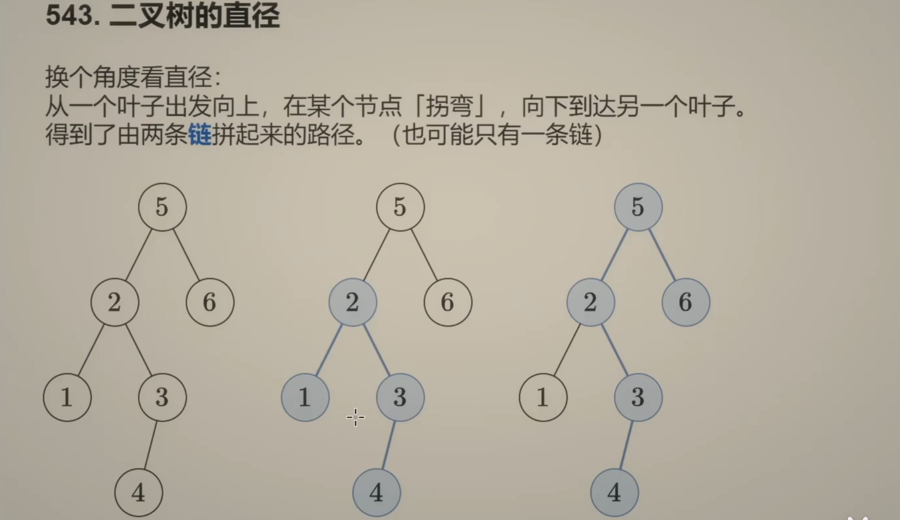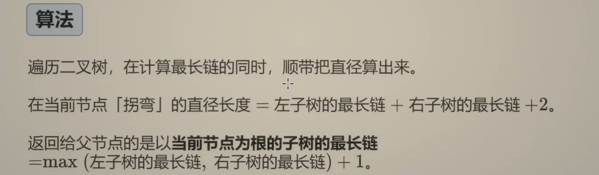

树上最大独立集/树上最小支配集：

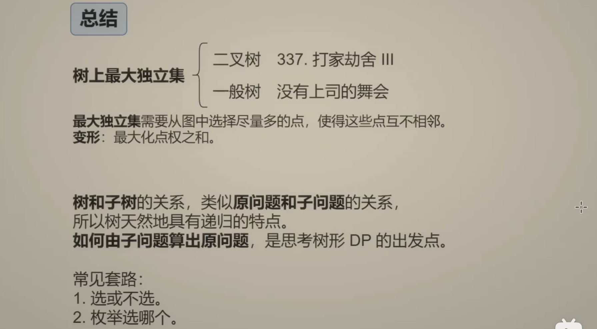

## 状态压缩DP

### 排列型 ① 相邻无关

暴力做法是枚举所有排列，对每个排列计算和题目有关的值，时间复杂度（通常来说）是 `O(n!)`。可以解决 `n ≤ 10` 的问题。状压 DP 可以把时间复杂度（通常来说）优化至 `O(n2`^n^`)`。可以解决 `n ≤ 20` 的问题。一般有两种定义方式：

* 定义 `dp[S]` 表示已经排列好的元素（下标）集合为 `S` 时，和题目有关的最优值。通过枚举当前位置要填的元素（下标）来转移。
* 定义 `dp[S]` 表示可以选的元素（下标）集合为 `S` 时，和题目有关的最优值。通过枚举当前位置要填的元素（下标）来转移。

### 排列型 ② 相邻相关

一般定义 `dp[S][i]` 表示未选（或者已选）的集合为 `S`，且上一个填的元素（下标）为 `i` 时，和题目有关的最优值。通过枚举当前位置要填的元素（下标）来转移。时间复杂度（通常来说）是 `O(n`^2^`2`^n^`)`。

# 图论

## 图的存储

### 邻接矩阵

**邻接矩阵**：适用于稠密图（顶点多边多），访问任意两点之间的权值快。

```java
import java.util.Arrays;

public class AdjacencyMatrixGraph {
    private static final int INF = Integer.MAX_VALUE / 3;
    private static int V; // 顶点数
    private static int E; // 边数
    private static int[] vw1; // 点权1
    private static int[] vw2; // 点权2
    private static int[][] adj1; // 邻接矩阵，存储边权1
    private static int[][] adj2; // 邻接矩阵，存储边权2

    // 初始化图
    public static void init(int V_, int E_, int[] vw1_, int[] vw2_, int[][] edges_) {
        V = V_;
        E = E_;
        // 初始化顶点权值
        vw1 = new int[V];
        vw2 = new int[V];
        System.arraycopy(vw1_, 0, vw1, 0, V); // 复制点权1
        System.arraycopy(vw2_, 0, vw2, 0, V); // 复制点权2
        // 初始化邻接矩阵
        adj1 = new int[V][V];
        adj2 = new int[V][V];
        for (int i = 0; i < V; i++){
            Arrays.fill(adj1[i], INF); // 初始化为无穷大，表示不可达
            adj1[i][i] = 0; // 主对角线为0
            Arrays.fill(adj2[i], INF);
            adj2[i][i] = 0;
        }
        for (int[] edge : edges_) {
            int s = edge[0]; // 起点
            int t = edge[1]; // 终点
            int ew1 = edge[2]; // 边权1
            int ew2 = edge[3]; // 边权2
            adj1[s][t] = ew1;
            adj2[s][t] = ew2;
            // adj1[t][s] = ew1; // 无向图
            // adj2[t][s] = ew2;
        }
    }

    // 打印图
    public static void printGraph() {
        System.out.println("Vertex Weights 1: " + java.util.Arrays.toString(vw1));
        System.out.println("Vertex Weights 2: " + java.util.Arrays.toString(vw2));
        System.out.println("Edge Weights 1:");
        for (int[] row : adj1) {
            System.out.println(java.util.Arrays.toString(row));
        }
        System.out.println("Edge Weights 2:");
        for (int[] row : adj2) {
            System.out.println(java.util.Arrays.toString(row));
        }
    }

    public static void main(String[] args) {
        int V_ = 4, E_ = 5;
        int[] vw1_ = {10, 20, 30, 40}; // 点权1
        int[] vw2_ = {50, 60, 70, 80}; // 点权2
        int[][] edges_ = {
                {0, 1, 3, 8}, // 边 0 -> 1，权值 3, 8
                {0, 2, 5, 2}, // 边 0 -> 2，权值 5, 2
                {1, 2, 1, 6}, // 边 1 -> 2，权值 1, 6
                {1, 3, 7, 4}, // 边 1 -> 3，权值 7, 4
                {2, 3, 2, 3}  // 边 2 -> 3，权值 2, 3
        };
        init(V_, E_, vw1_, vw2_, edges_); // 初始化图
        printGraph(); // 打印图
    }
}
```

### 邻接表

**邻接表**：适用于稀疏图（顶点多边少），高效存储邻接信息。

```java
import java.util.ArrayList;
import java.util.List;

public class AdjacencyListGraph {
    private static int V; // 顶点数
  	private static int E; // 边数
    private static int[] vw1; // 点权1
    private static int[] vw2; // 点权2
    private static List<List<Edge>> adjList; // 邻接表

    // 边的定义<终点，边权值>
    private static class Edge {
        int t; // 终点
        int ew1; // 边权1
        int ew2; // 边权2

        Edge(int t, int ew1, int ew2) {
            this.t = t;
            this.ew1 = ew1;
            this.ew2 = ew2;
        }

        @Override
        public String toString() {
            return "(" + t + ", " + ew1 + ", " + ew2 + ")";
        }
    }

    // 初始化图
    public static void init(int V_, int E_, int[] vw1_, int[] vw2_, int[][] edges_) {
        V = V_;
        E = E_;
        // 初始化顶点权值
        vw1 = new int[V];
        vw2 = new int[V];
        System.arraycopy(vw1_, 0, vw1, 0, V); // 复制点权1
        System.arraycopy(vw2_, 0, vw2, 0, V); // 复制点权2
        // 初始化邻接表
        adjList = new ArrayList<>();
        for (int i = 0; i < V; i++) { // 为所有起点创建空列表
            adjList.add(new ArrayList<>());
        }
        for (int[] edge : edges_) { // 为相应的起点添加<终点，边权值>
            int s = edge[0]; // 起点
            int t = edge[1]; // 终点
            int ew1 = edge[2]; // 边权1
            int ew2 = edge[3]; // 边权2
            adjList.get(s).add(new Edge(t, ew1, ew2));
          	// adjList.get(t).add(new Edge(s, ew1, ew2)); // 无向图
        }
    }

    // 打印图
    public static void printGraph() {
        System.out.println("Vertex Weights 1: " + java.util.Arrays.toString(vw1));
        System.out.println("Vertex Weights 2: " + java.util.Arrays.toString(vw2));
        System.out.println("Adjacency List:");
        for (int i = 0; i < V; i++) {
            System.out.print("Vertex " + i + ": ");
            for (Edge edge : adjList.get(i)) {
                System.out.print(edge + " ");
            }
            System.out.println();
        }
    }

    public static void main(String[] args) {
        int V_ = 4, E_ = 5;
      	int[] vw1_ = {10, 20, 30, 40}; // 点权1
        int[] vw2_ = {50, 60, 70, 80}; // 点权2
        int[][] edges_ = {
            {0, 1, 3, 8}, // 边 0 -> 1，权值 3, 8
            {0, 2, 5, 2}, // 边 0 -> 2，权值 5, 2
            {1, 2, 1, 6}, // 边 1 -> 2，权值 1, 6
            {1, 3, 7, 4}, // 边 1 -> 3，权值 7, 4
            {2, 3, 2, 3}  // 边 2 -> 3，权值 2, 3
        };
        init(V_, E_, vw1_, vw2_, edges_); // 初始化图
        printGraph(); // 打印图
    }
}
```

### 边集数组

**边集数组**：适用于边为核心的操作（如排序、筛选），方便处理边权值。

```java
import java.util.ArrayList;
import java.util.List;

public class EdgeListGraph {
    private static int V; // 顶点数
  	private static int E; // 边数
    private static int[] vw1; // 点权1
    private static int[] vw2; // 点权2
    private static List<Edge> edgeList; // 边集数组

    // 边的定义<起点，终点，边权值>
    private static class Edge {
        int s; // 起点
        int t; // 终点
        int ew1; // 边权1
        int ew2; // 边权2

        Edge(int s, int t, int ew1, int ew2) {
            this.s = s;
            this.t = t;
            this.ew1 = ew1;
            this.ew2 = ew2;
        }

        @Override
        public String toString() {
            return "(" + s + " -> " + t + ", " + ew1 + ", " + ew2 + ")";
        }
    }

    // 初始化图
    public static void init(int V_, int E_, int[] vw1_, int[] vw2_, int[][] edges_) {
        V = V_;
      	E = E_;
        // 初始化顶点权值
        vw1 = new int[V];
        vw2 = new int[V];
        System.arraycopy(vw1_, 0, vw1, 0, V); // 复制点权1
        System.arraycopy(vw2_, 0, vw2, 0, V); // 复制点权2
        // 初始化边集数组
        edgeList = new ArrayList<>();
        for (int[] edge : edges_) { // 直接添加<起点，终点，边权值>
          	int s = edge[0]; // 起点
            int t = edge[1]; // 终点
            int ew1 = edge[2]; // 边权1
            int ew2 = edge[3]; // 边权2
            edgeList.add(new Edge(s, t, ew1, ew2));
          	// edgeList.add(new Edge(t, s, ew1, ew2)); // 无向图
        }
    }

    // 打印图
    public static void printGraph() {
        System.out.println("Vertex Weights 1: " + java.util.Arrays.toString(vw1));
        System.out.println("Vertex Weights 2: " + java.util.Arrays.toString(vw2));
        System.out.println("Edge List:");
        for (Edge edge : edgeList) {
            System.out.println(edge);
        }
    }

    public static void main(String[] args) {
        int V_ = 4, E_ = 5;
      	int[] vw1_ = {10, 20, 30, 40}; // 点权1
        int[] vw2_ = {50, 60, 70, 80}; // 点权2
        int[][] edges_ = {
            {0, 1, 3, 8}, // 边 0 -> 1，权值 3, 8
            {0, 2, 5, 2}, // 边 0 -> 2，权值 5, 2
            {1, 2, 1, 6}, // 边 1 -> 2，权值 1, 6
            {1, 3, 7, 4}, // 边 1 -> 3，权值 7, 4
            {2, 3, 2, 3}  // 边 2 -> 3，权值 2, 3
        };
        init(V_, E_, vw1_, vw2_, edges_); // 初始化图
        printGraph(); // 打印图
    }
}
```

## 最短路问题

### Bellman-Ford算法

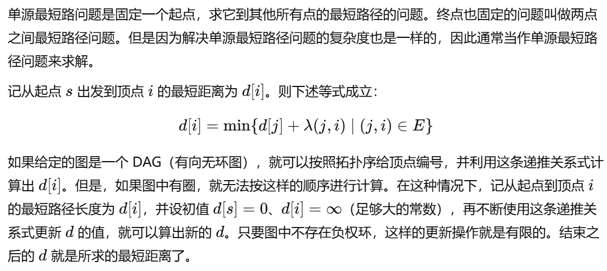

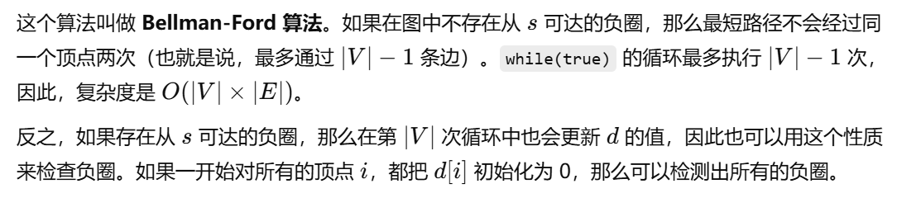

```java
import java.util.ArrayList;
import java.util.Arrays;
import java.util.Collections;
import java.util.List;

public class BellmanFord { // 存储方式：边集数组
    private static final int INF = Integer.MAX_VALUE / 3;
    private static int V, E; // 顶点数和边数
    private static int[] dis; // 最短距离数组
    private static int[] pre; // 记录最短路径的前驱节点
    private static List<Edge> edgeList; // 边集数组

    // 边的定义<起点，终点，边权值>
    private static class Edge {
        int s, t, ew;

        Edge(int s, int t, int ew) {
            this.s = s;
            this.t = t;
            this.ew = ew;
        }
    }

    // 初始化图的顶点和边
    public static void init(int V_, int E_, int[][] edges_) {
        V = V_;
        E = E_;
        dis = new int[V];
        Arrays.fill(dis, INF); // 初始化距离为无穷大
        pre = new int[V];
        Arrays.fill(pre, -1); // 初始化前驱数组为 -1
        edgeList = new ArrayList<>();
        for (int[] edge : edges_) {
            edgeList.add(new Edge(edge[0], edge[1], edge[2]));
        }
    }

    // 计算从起点到所有节点的最短路径
    public static void bellmanFord(int s) {
        // Arrays.fill(dis, INF); // 初始化距离为无穷大
        dis[s] = 0;
        while (true) {
            boolean updated = false;
            for (Edge edge : edgeList) {
                if (dis[edge.s] != INF && dis[edge.t] > dis[edge.s] + edge.ew) {
                    dis[edge.t] = dis[edge.s] + edge.ew;
                    pre[edge.t] = edge.s; // 记录前驱节点
                    updated = true;
                }
            }
            if (!updated){ // 如果没有更新则退出循环
                break;
            }
        }
    }

    // 获取从起点到目标点的最短路径
    public static List<Integer> getPath(int target) {
        List<Integer> path = new ArrayList<>();
        for (int t = target; t != -1; t = pre[t]) {
            path.add(t);
        }
        Collections.reverse(path); // 逆序，得到从起点到目标点的路径
        return path;
    }

    // 检测是否存在负权回路
    public static boolean findNegativeCycle() {
        Arrays.fill(dis, 0); // 初始化距离数组为 0
        for (int i = 0; i < V; i++) { // 进行 V 次松弛操作
            boolean updated = false;
            for (Edge edge : edgeList) {
                if (dis[edge.s] != INF && dis[edge.t] > dis[edge.s] + edge.ew) {
                    dis[edge.t] = dis[edge.s] + edge.ew;
                    updated = true;
                    if (i == V - 1) { // 如果在第 V 次迭代仍然更新，则存在负权回路
                        return true;
                    }
                }
            }
            if (!updated){ // 如果没有更新则提前退出
                break;
            }
        }
        return false; // 不存在负权回路
    }

    public static void main(String[] args) {
        int V_ = 4, E_ = 5;
        int[][] edges_ = {
                {0, 1, 3}, // 边 0 -> 1，权值 3
                {0, 2, 5}, // 边 0 -> 2，权值 5
                {1, 2, 1}, // 边 1 -> 2，权值 1
                {1, 3, 7}, // 边 1 -> 3，权值 7
                {2, 3, 2}  // 边 2 -> 3，权值 2
        };
        init(V_, E_, edges_); // 初始化图
        bellmanFord(0); // 从顶点0开始的最短路径
        System.out.println("dis[]: " + Arrays.toString(dis));
        System.out.println("pre[]: " + Arrays.toString(pre));
        List<Integer> path = getPath(3); // 求 0 到 3 的最短路径
        System.out.println("path[]: " + path);
        boolean hasNegativeCycle = findNegativeCycle();
        System.out.println("Graph contains negative cycle: " + hasNegativeCycle);
    }
}
```

### Dijkstra算法

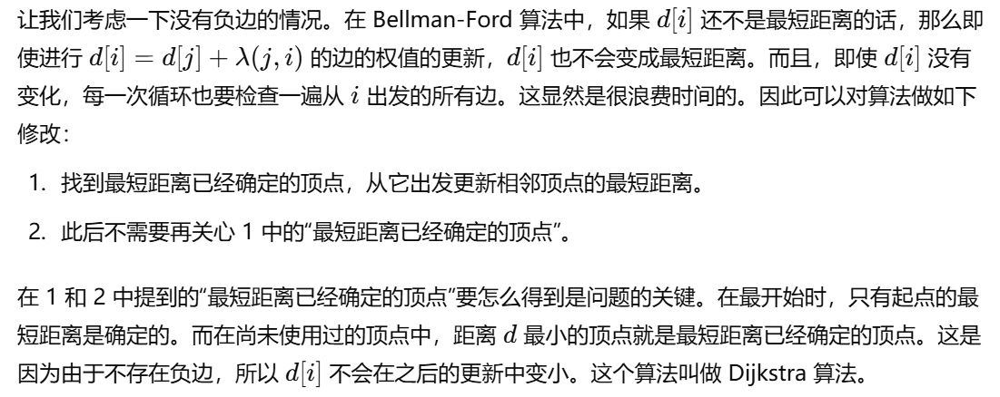

```java
import java.util.ArrayList;
import java.util.Arrays;
import java.util.Collections;
import java.util.List;

public class Dijkstra { // 存储方式：邻接矩阵
    private static final int INF = Integer.MAX_VALUE / 3;
    private static int V, E; // 顶点数和边数
    private static int[] dis; // 起点到各个顶点的最短距离
    private static int[] pre; // 记录最短路径的前驱节点
    private static boolean[] vis; // 记录顶点是否已访问
    private static int[][] adj; // 邻接矩阵，存储边权

    // 初始化图的顶点数和邻接矩阵
    public static void init(int V_, int E_, int[][] edges_) {
        V = V_;
        E = E_;
        dis = new int[V];
        Arrays.fill(dis, INF); // 初始化距离为无穷大
        pre = new int[V];
        Arrays.fill(pre, -1); // 初始化前驱数组为 -1
        vis = new boolean[V];
        Arrays.fill(vis, false); // 初始化为未访问
        adj = new int[V][V];
        for (int i = 0; i < V; i++){
            Arrays.fill(adj[i], INF); // 初始化为无穷大，表示不可达
            adj[i][i] = 0; // 主对角线为0，会导致 pre[s] == s
        }
        for (int[] edge : edges_) { // 为相应的[起点,终点]添加<边权值>
            int s = edge[0]; // 起点
            int t = edge[1]; // 终点
            int ew = edge[2]; // 边权
            adj[s][t] = ew;
            // adj[t][s] = ew; // 无向图
        }
    }

    // Dijkstra 算法
    public static void dijkstra(int s) {
        // Arrays.fill(dis, INF); // 初始化距离为无穷大
        // Arrays.fill(pre, -1); // 初始化前驱数组为 -1
        // Arrays.fill(vis, false); // 初始化为未访问
        dis[s] = 0; // 从起点 s 开始递推
        while (true) {
            int v = -1;
            for (int u = 0; u < V; u++) { // 找到尚未使用的顶点中距离最小的顶点
                if (!vis[u] && (v == -1 || dis[u] < dis[v])) { // 防止 dis[-1] 越界
                    v = u;
                }
            }
            if (v == -1) { // 如果找不到这样的顶点，算法结束
                break;
            }
            vis[v] = true; // 标记该顶点为已访问
            for (int u = 0; u < V; u++) { // 更新从顶点 v 出发到相邻顶点的距离
                if (v != u && adj[v][u] != INF) { // 存在边 (v, u) 且不是自环
                    dis[u] = Math.min(dis[u], dis[v] + adj[v][u]);
                    pre[u] = v; // 记录前驱节点
                }
            }
        }
    }

    // 获取从起点到目标点的最短路径
    public static List<Integer> getPath(int target) {
        List<Integer> path = new ArrayList<>();
        for (int t = target; t != -1; t = pre[t]) {
            path.add(t);
        }
        Collections.reverse(path); // 逆序，得到从起点到目标点的路径
        return path;
    }

    public static void main(String[] args) {
        int V_ = 4, E_ = 5;
        int[][] edges_ = {
                {0, 1, 3}, // 边 0 -> 1，权值 3
                {0, 2, 5}, // 边 0 -> 2，权值 5
                {1, 2, 1}, // 边 1 -> 2，权值 1
                {1, 3, 7}, // 边 1 -> 3，权值 7
                {2, 3, 2}  // 边 2 -> 3，权值 2
        };
        init(V_, E_, edges_); // 初始化图
        dijkstra(0); // 求顶点0的最短路径
        System.out.println("dis[]: " + Arrays.toString(dis));
        System.out.println("pre[]: " + Arrays.toString(pre));
        List<Integer> path = getPath(3); // 求 0 到 3 的最短路径
        System.out.println("path[]: " + path);
    }
}
```

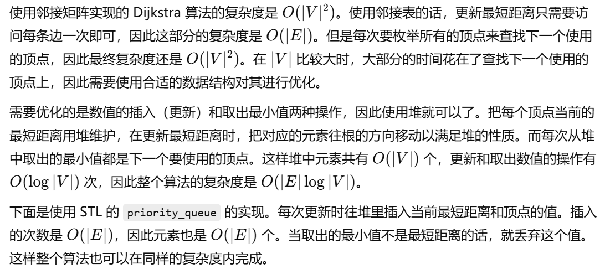

```java
import java.util.*;

public class DijkstraOptimized { // 存储方式：邻接表+优先队列（小顶堆）
    private static final int INF = Integer.MAX_VALUE;
    private static int V, E; // 顶点数和边数
    private static int[] dis; // 起点到各个顶点的最短距离
    private static int[] pre; // 记录最短路径的前驱节点
    private static PriorityQueue<int[]> pq; // 优先队列取代 vis 数组
    private static List<List<Edge>> adjList; // 邻接表

    // 边的定义<终点，边权值>
    private static class Edge {
        int t, ew;

        Edge(int t, int ew) {
            this.t = t;
            this.ew = ew;
        }
    }

    // 初始化图
    public static void init(int V_, int E_, int[][] edges_) {
        V = V_;
        E = E_;
        dis = new int[V];
        Arrays.fill(dis, INF); // 初始化距离数组
        pre = new int[V];
        Arrays.fill(pre, -1); // 初始化前驱数组为 -1
        pq = new PriorityQueue<>(Comparator.comparingInt(o -> o[0])); // 优先队列，按最小距离排序（小顶堆）
        adjList = new ArrayList<>(); // 初始化邻接表
        for (int i = 0; i < V; i++) { // 为所有起点创建空列表
            adjList.add(new ArrayList<>());
        }
        for (int[] edge : edges_) { // 为相应的起点添加<终点，边权值>
            int s = edge[0]; // 起点
            int t = edge[1]; // 终点
            int ew = edge[2]; // 边权
            adjList.get(s).add(new Edge(t, ew));
            // adjList.get(t).add(new Edge(s, ew)); // 无向图
        }
    }

    // 使用优先队列优化的 Dijkstra 算法
    public static void dijkstra(int s) {
        // Arrays.fill(dis, INF); // 初始化距离数组
        // Arrays.fill(pre, -1); // 初始化前驱数组为 -1
        dis[s] = 0;
        pq.offer(new int[]{0, s}); // 维护每个顶点当前的最短距离(距离为 0，顶点为 s)
        while (!pq.isEmpty()) {
            int[] cur = pq.poll();
            int curDis = cur[0]; // 当前顶点的最短距离
            int curVet = cur[1]; // 当前顶点编号
            if (curDis > dis[curVet]){ // 如果当前距离大于已记录的距离，跳过（因为是松弛过的点）
                continue;
            }
            for (Edge edge : adjList.get(curVet)) { // 遍历当前顶点的所有邻接点
                int newDis = dis[curVet] + edge.ew;
                if (newDis < dis[edge.t]) { // 距离更短则更新，并放入优先队列
                    dis[edge.t] = newDis;
                    pre[edge.t] = curVet; // 记录前驱节点
                    pq.offer(new int[]{newDis, edge.t});
                }
            }
        }
    }

    // 获取从起点到目标点的最短路径
    public static List<Integer> getPath(int target) {
        List<Integer> path = new ArrayList<>();
        for (int t = target; t != -1; t = pre[t]) {
            path.add(t);
        }
        Collections.reverse(path); // 逆序，得到从起点到目标点的路径
        return path;
    }

    public static void main(String[] args) {
        int V_ = 4, E_ = 5;
        int[][] edges_ = {
                {0, 1, 3}, // 边 0 -> 1，权值 3
                {0, 2, 5}, // 边 0 -> 2，权值 5
                {1, 2, 1}, // 边 1 -> 2，权值 1
                {1, 3, 7}, // 边 1 -> 3，权值 7
                {2, 3, 2}  // 边 2 -> 3，权值 2
        };
        init(V_, E_, edges_); // 初始化图
        dijkstra(0); // 求顶点0的最短路径
        System.out.println("dis[]: " + Arrays.toString(dis));
        System.out.println("pre[]: " + Arrays.toString(pre));
        List<Integer> path = getPath(3); // 求 0 到 3 的最短路径
        System.out.println("path[]: " + path);
    }
}
```

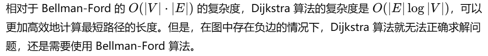

### Floyd-Warshall算法

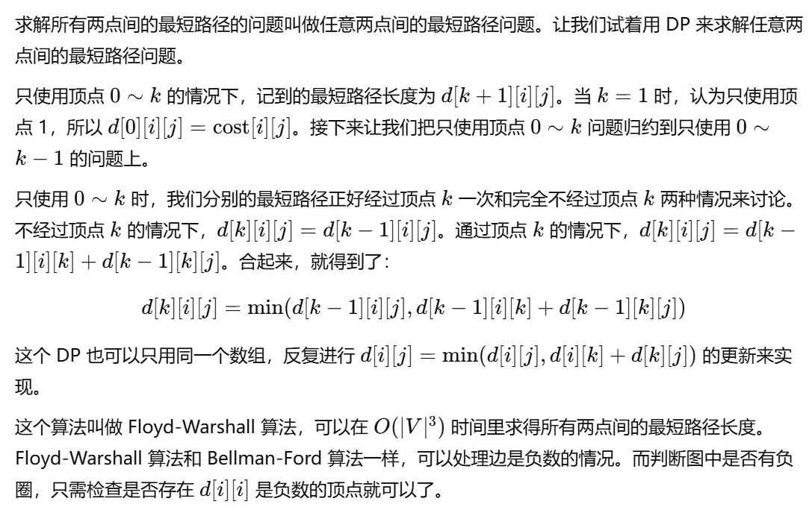

```java
import java.util.ArrayList;
import java.util.Arrays;
import java.util.Collections;
import java.util.List;

public class FloydWarshall {
    private static final int INF = Integer.MAX_VALUE / 3;
    private static int V, E; // 顶点数和边数
    private static int[][] dis; // 最短路径的距离矩阵
    private static int[][] pre; // 记录最短路径的前驱节点
    private static int[][] adj; // 邻接矩阵，存储边权

    // 初始化图的顶点数和邻接矩阵
    public static void init(int V_, int E_, int[][] edges_) {
        V = V_;
        E = E_;
        dis = new int[V][V];
        pre = new int[V][V];
        adj = new int[V][V];
        for (int i = 0; i < V; i++) {
            // Arrays.fill(dis[i], INF);
            Arrays.fill(pre[i], -1); // 初始化前驱数组为 -1
            Arrays.fill(adj[i], INF);
            adj[i][i] = 0; // 自环的权值为 0
        }
        for (int[] edge : edges_) { // 为相应的起点添加 <终点，边权值>
            int s = edge[0]; // 起点
            int t = edge[1]; // 终点
            int ew = edge[2]; // 边权
            adj[s][t] = ew;
            // adj[t][s] = ew; // 无向图
        }
        for (int i = 0; i < V; i++) { // 初始化 dis 为邻接矩阵 adj
            for (int j = 0; j < V; j++) {
                dis[i][j] = adj[i][j];
                if (adj[i][j] != INF && i != j) { // 存在边 (i, j) 且不是自环
                    pre[i][j] = i; // 需要初始化 pre 为直接前驱：如果 i -> j 有边，j 前驱设置为起点 i
                }
            }
        }
    }

    // Floyd-Warshall 算法
    public static void floydWarshall() {
        for (int k = 0; k < V; k++) { // 中间点
            for (int i = 0; i < V; i++) { // 起点
                for (int j = 0; j < V; j++) { // 终点
                    if (dis[i][k] != INF && dis[k][j] != INF && dis[i][j] > dis[i][k] + dis[k][j]) {
                        dis[i][j] = dis[i][k] + dis[k][j];
                        pre[i][j] = pre[k][j]; // 更新前驱为通过 k 到达 j 的前驱
                    }
                }
            }
        }
    }

    // 获取从起点到目标点的最短路径
    public static List<Integer> getPath(int s, int target) {
        List<Integer> path = new ArrayList<>();
        for (int t = target; t != -1; t = pre[s][t]) {
            path.add(t);
        }
        Collections.reverse(path); // 逆序，得到从起点到目标点的路径
        return path;
    }

    public static List<Integer> getPath2(int s, int target) {
        List<Integer> path = new ArrayList<>();
        if (dis[s][target] == INF) { // 无法到达目标点
            return path;
        }
        for (int t = target; t != s; t = pre[s][t]) {
            if (t == -1) { // 如果路径断裂，返回空路径
                return new ArrayList<>();
            }
            path.add(t);
        }
        path.add(s);
        Collections.reverse(path); // 逆序，得到从起点到目标点的路径
        return path;
    }

    public static void main(String[] args) {
        int V_ = 4, E_ = 5;
        int[][] edges_ = {
                {0, 1, 3}, // 边 0 -> 1，权值 3
                {0, 2, 5}, // 边 0 -> 2，权值 5
                {1, 2, 1}, // 边 1 -> 2，权值 1
                {1, 3, 7}, // 边 1 -> 3，权值 7
                {2, 3, 2}  // 边 2 -> 3，权值 2
        };
        init(V_, E_, edges_);
        floydWarshall();
        System.out.println("dis[][]:");
        for (int i = 0; i < V; i++) {
            System.out.println(Arrays.toString(dis[i]));
        }
        System.out.println("pre[][]:");
        for (int i = 0; i < V; i++) {
            System.out.println(Arrays.toString(pre[i]));
        }
        List<Integer> path = getPath(0, 3); // 求 0 到 3 的最短路径
        System.out.println("path[] : " + path);
    }
}
```

### 路径还原

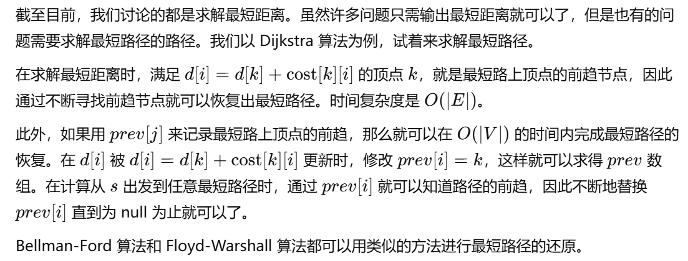

```java
import java.util.ArrayList;
import java.util.Arrays;
import java.util.Collections;
import java.util.List;

public class Dijkstra { // 存储方式：邻接矩阵
    private static final int INF = Integer.MAX_VALUE / 3;
    private static int V, E; // 顶点数和边数
    private static int[] dis; // 起点到各个顶点的最短距离
    private static int[] pre; // 记录最短路径的前驱节点
    private static boolean[] vis; // 记录顶点是否已访问
    private static int[][] adj; // 邻接矩阵，存储边权

    // 初始化图的顶点数和邻接矩阵
    public static void init(int V_, int E_, int[][] edges_) {
        V = V_;
        E = E_;
        dis = new int[V];
        Arrays.fill(dis, INF); // 初始化距离为无穷大
        pre = new int[V];
        Arrays.fill(pre, -1); // 初始化前驱数组为 -1
        vis = new boolean[V];
        Arrays.fill(vis, false); // 初始化为未访问
        adj = new int[V][V];
        for (int i = 0; i < V; i++){
            Arrays.fill(adj[i], INF); // 初始化为无穷大，表示不可达
            adj[i][i] = 0; // 主对角线为0，会导致 pre[s] == s
        }
        for (int[] edge : edges_) { // 为相应的起点添加<终点，边权值>
            int s = edge[0]; // 起点
            int t = edge[1]; // 终点
            int ew = edge[2]; // 边权
            adj[s][t] = ew;
            // adj[t][s] = ew; // 无向图
        }
    }

    // Dijkstra 算法
    public static void dijkstra(int s) {
        // Arrays.fill(dis, INF); // 初始化距离为无穷大
        // Arrays.fill(pre, -1); // 初始化前驱数组为 -1
        // Arrays.fill(vis, false); // 初始化为未访问
        dis[s] = 0; // 从起点 s 开始递推
        while (true) {
            int v = -1;
            for (int u = 0; u < V; u++) { // 找到尚未使用的顶点中距离最小的顶点
                if (!vis[u] && (v == -1 || dis[u] < dis[v])) { // 防止 dis[-1] 越界
                    v = u;
                }
            }
            if (v == -1) { // 如果找不到这样的顶点，算法结束
                break;
            }
            vis[v] = true; // 标记该顶点为已访问
            for (int u = 0; u < V; u++) { // 更新从顶点 v 出发到相邻顶点的距离
                if (v != u && adj[v][u] != INF) { // 存在边 (v, u) 且不是自环
                    dis[u] = Math.min(dis[u], dis[v] + adj[v][u]);
                    pre[u] = v; // 记录前驱节点
                }
            }
        }
    }

    // 获取从起点到目标点的最短路径
    public static List<Integer> getPath(int target) {
        List<Integer> path = new ArrayList<>();
        for (int t = target; t != -1; t = pre[t]) {
            path.add(t);
        }
        Collections.reverse(path); // 逆序，得到从起点到目标点的路径
        return path;
    }

    public static void main(String[] args) {
        int V_ = 4, E_ = 5;
        int[][] edges_ = {
                {0, 1, 3}, // 边 0 -> 1，权值 3
                {0, 2, 5}, // 边 0 -> 2，权值 5
                {1, 2, 1}, // 边 1 -> 2，权值 1
                {1, 3, 7}, // 边 1 -> 3，权值 7
                {2, 3, 2}  // 边 2 -> 3，权值 2
        };
        init(V_, E_, edges_); // 初始化图
        dijkstra(0); // 求顶点0的最短路径
        System.out.println("dis[]: " + Arrays.toString(dis));
        System.out.println("pre[]: " + Arrays.toString(pre));
        List<Integer> path = getPath(3); // 求 0 到 3 的最短路径
        System.out.println("path[]: " + path);
    }
}
```

## 最小生成树

### Prim算法

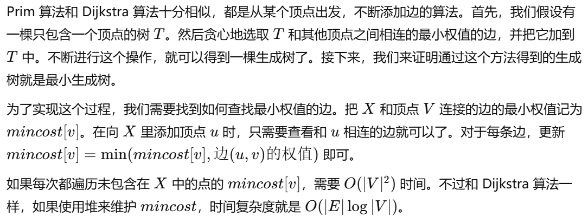

```java
import java.util.Arrays;

public class Prim { // 存储方式：邻接矩阵
    private static final int INF = Integer.MAX_VALUE / 3;
    private static int V, E; // 顶点数和边数
    private static int[] minEw; // 从集合 X 到达每个顶点的最小权值
    private static boolean[] vis; // 标记顶点是否已经加入集合 X
    private static int[][] adj; // 邻接矩阵，存储边权

    // 初始化图（邻接矩阵）
    public static void init(int V_, int E_, int[][] edges_) {
        V = V_;
        E = E_;
        minEw = new int[V];
        Arrays.fill(minEw, INF); // 初始化最小权值数组
        vis = new boolean[V];
        Arrays.fill(vis, false); // 初始化所有顶点未访问
        adj = new int[V][V];
        for (int i = 0; i < V; i++){
            Arrays.fill(adj[i], INF); // 初始化为无穷大，表示不可达
            adj[i][i] = 0; // 主对角线为0，会导致 minEw 全为0
        }
        for (int[] edge : edges_) { // 为相应的起点添加<终点，边权值>
            int s = edge[0]; // 起点
            int t = edge[1]; // 终点
            int ew = edge[2]; // 边权
            adj[s][t] = ew;
            // adj[t][s] = ew; // 无向图
        }
    }

    // Prim 算法
    public static int prim() {
        // Arrays.fill(minEw, INF); // 初始化最小权值数组
        // Arrays.fill(vis, false); // 初始化所有顶点未访问
        minEw[0] = 0; // 从顶点 0 开始
        int res = 0; // 最小生成树的总权值
        while (true) {
            int v = -1;
            for (int u = 0; u < V; u++) { // 找到尚未使用的顶点中，连接集合 X 的边权值最小的顶点
                if (!vis[u] && (v == -1 || minEw[u] < minEw[v])) {
                    v = u;
                }
            }
            if (v == -1) { // 如果无法找到这样的顶点，算法结束
                break;
            }
            vis[v] = true; // 将顶点 v 加入集合 X
            res += minEw[v]; // 累加最小权值
            for (int u = 0; u < V; u++) { // 更新 minEw 数组
                if (v != u && adj[v][u] != INF) {
                    minEw[u] = Math.min(minEw[u], adj[v][u]);
                }
            }
        }
        return res; // 返回最小生成树的总权值
    }

    public static void main(String[] args) {
        int V_ = 4, E_ = 5;
        int[][] edges_ = {
                {0, 1, 3}, // 边 0 -> 1，权值 3
                {0, 2, 5}, // 边 0 -> 2，权值 5
                {1, 2, 1}, // 边 1 -> 2，权值 1
                {1, 3, 7}, // 边 1 -> 3，权值 7
                {2, 3, 2}  // 边 2 -> 3，权值 2
        };
        init(V_, E_, edges_); // 初始化图
        int mstWeight = prim();
        System.out.println("Minimum spanning tree total weight: " + mstWeight);
        System.out.println("minEw[]: " + Arrays.toString(minEw));
    }
}
```

### Kruskal算法

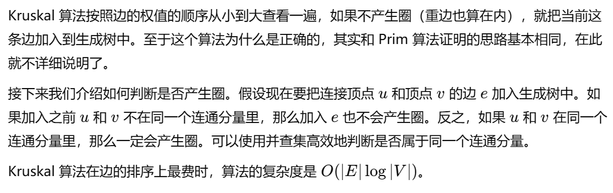

```java
import java.util.ArrayList;
import java.util.Collections;
import java.util.List;

public class Kruskal { // 存储方式：边集数组
    private static int V, E; // 顶点数和边数
    private static List<Edge> edgeList; // 边集数组

    // 边的定义<起点，终点，边权值>
    private static class Edge implements Comparable<Edge> {
        int s, t, ew;

        Edge(int s, int t, int ew) {
            this.s = s;
            this.t = t;
            this.ew = ew;
        }

        @Override
        public int compareTo(Edge other) { // 按边权（升序）排序
            return Integer.compare(this.ew, other.ew);
        }
    }

    // 初始化图
    public static void init(int V_, int E_, int[][] edges_) {
        V = V_;
        E = E_;
        edgeList = new ArrayList<>();
        for (int[] edge : edges_) { // 直接添加<起点，终点，边权值>
            int s = edge[0]; // 起点
            int t = edge[1]; // 终点
            int ew = edge[2]; // 边权1
            edgeList.add(new Edge(s, t, ew));
            // edgeList.add(new Edge(t, s, ew)); // 无向图
        }
        Collections.sort(edgeList); // 按边权排序
        initUnionFind(V); // 初始化并查集
    }

    // 并查集
    private static int[] parent; // 父节点
    private static int[] rank;   // 树的秩（高度）

    // 初始化并查集
    public static void initUnionFind(int n) {
        parent = new int[n];
        rank = new int[n];
        for (int i = 0; i < n; i++) {
            parent[i] = i; // 每个节点的父节点初始化为自己
            rank[i] = 0;   // 初始时每棵树的高度为0
        }
    }

    // 查找某个元素的根节点，并进行路径压缩
    public static int find(int x) {
        if (parent[x] != x) { // 当前节点的父节点不是自己，则不是根节点
            parent[x] = find(parent[x]); // 路径压缩
        }
        return parent[x];
    }

    // 合并两个元素所在的集合
    public static void unite(int x, int y) {
        int rootX = find(x);
        int rootY = find(y);
        if (rootX == rootY) { // 已经在同一集合中，无需合并
            return;
        }
        if (rank[rootX] < rank[rootY]) { // 从rank小的向rank大的连边，避免退化
            parent[rootX] = rootY;
        } else {
            parent[rootY] = rootX;
            if (rank[rootX] == rank[rootY]) { // 高度相同的情况下，合并后要 rank += 1
                rank[rootX]++;
            }
        }
    }

    // 判断两个元素是否属于同一集合
    public static boolean same(int x, int y) {
        return find(x) == find(y); // 根节点相同则属于一个集合
    }

    // Kruskal 算法
    public static int kruskal() {
        // Arrays.sort(edges); // 按边权排序
        // initUnionFind(V); // 初始化并查集
        int res = 0;
        for (Edge edge : edgeList) {
            if (!same(edge.s, edge.t)) { // 如果两个顶点不在同一集合中
                unite(edge.s, edge.t); // 合并两个并查集
                res += edge.ew; // 累加边权
            }
        }
        return res; // 返回最小生成树的权值总和
    }

    public static void main(String[] args) {
        int V_ = 4, E_ = 5;
        int[][] edges_ = {
                {0, 1, 3}, // 边 0 -> 1，权值 3
                {0, 2, 5}, // 边 0 -> 2，权值 5
                {1, 2, 1}, // 边 1 -> 2，权值 1
                {1, 3, 7}, // 边 1 -> 3，权值 7
                {2, 3, 2}  // 边 2 -> 3，权值 2
        };
        init(V_, E_, edges_); // 初始化图
        int mstWeight = kruskal();
        System.out.println("Minimum spanning tree total weight: " + mstWeight);
    }
}
```

# [位运算&数学](位运算&数学.md)

## 集合的整数表示

### 集合运算

集合 `{0, 1, ..., n - 1}` 的子集 `S` 可以用对应的二进制位编码成整数：$$ f(S) = \sum_{i \in S} 2^i $$

* 空集 ∅ → `0`
* 只含有第 `i` 个元素的集合 `{i}` → `1 << i`
* 含有全部 `n` 个元素的集合 `{0, 1, ..., n - 1}` → `(1 << n) - 1`
* 判断第 `i` 个元素是否属于集合 `S` → `if (S >> i & 1)`
* 向集合 `S` 中加入第 `i` 个元素 `S ∪ {i}` → `S | 1 << i`
* 从集合 `S` 中去除第 `i` 个元素 `S \ {i}` → `S & ~(1 << i)` 或 `S ^ (1 << i)`
  * 注：不能使用 `S - (1 << i)`，考虑 `i` 不属于 `S` 的情况
* 集合 `S` 和 `T` 的并集 `S ∪ T` → `S | T`
* 集合 `S` 和 `T` 的交集 `S ∩ T` → `S & T`

### 枚举所有子集

```java
for (int S = 0; S < (1 << n); S++) { // 初始化子集为空集，升序枚举
    // 对子集 S 的处理
}
```

### 枚举某个集合sup的子集

```java
int sub = sup; // 初始化子集为全集，降序枚举
do {
    // 对子集 sub 的处理
    sub = (sub - 1) & sup; // 降序枚举下一个子集
} while (sub != sup); // 处理完 0 之后会有 -1 & sup = sup
```

### 枚举所有大小为k的子集

```java
int comb = (1 << k) - 1; // 初始化子集为 k 个 1，升序枚举
while (comb < (1 << n)) {
    // 这里进行针对组合的处理
    int x = comb & -comb; // 取出 comb 最低位的 1
    int y = comb + x; // 将 comb 从最低位的 1 开始的连续的 1 置 0
    // z = (comb & ~y) 取出最低位 1 开始的连续区间
    // z / x 将 z 不断右移直至最低位为 1，再 >> 1 减少一个 1
    comb = (((comb & ~y) / x) >> 1) | y; // 计算y时进了一位1，上一步又少了一个1，故得到comb下一个“含k个1的”二进制列
}
```

## 数论

### 素数

素性测试：尝试从 `2` 到 `sqrt(n)` 的所有整数来检查 `n` 是否有因子

```java
public static boolean isPrime(int n) {
    if (n <= 1) return false; // 1是例外
    for (int i = 2; i * i <= n; i++) {
        if (n % i == 0) return false; // 如果能被因数整除，则不是素数
    }
    return true;
}
```

埃氏筛：使用埃氏筛法来标记 `0` 到 `n` 范围内的所有素数。通过标记合数来实现效率更高的素数检测。

```java
static final int MAX_N = 1000;
static boolean[] isPrime = new boolean[MAX_N + 1]; // 素数标记数组
static int[] prime = new int[MAX_N]; // 存储素数

public static int sieve(int n) { // 返回n以内的素数个数
    int p = 0; // 素数计数
    for (int i = 0; i <= n; i++) isPrime[i] = true; // 初始化所有数为素数
    isPrime[0] = isPrime[1] = false;
    for (int i = 2; i <= n; i++) {
        if (isPrime[i]) {
            prime[p++] = i; // 记录素数
            for (int j = 2 * i; j <= n; j += i) { // 筛[2, n]，标记i的倍数为合数
                isPrime[j] = false;
            }
        }
    }
    return p; // 返回素数个数
}
```

区间筛：在给定区间 `[a, b)` 内找到所有素数。它首先标记小素数，然后在较大区间内标记合数，即**用 `[2, √b)` 筛 `[a, b)`**。

```java
static final int MAX_L = 1000000; // 区间最大长度
static final int MAX_SQRT_B = 1000; // b的平方根
static boolean[] isPrime = new boolean[MAX_L]; // [a, b)素数标记，isPrime[j - a] == true 等价于 j 是素数
static boolean[] isPrimeSmall = new boolean[MAX_SQRT_B]; // [2, √b)素数标记

public static void segmentSieve(long a, long b) { // 对区间[a, b)内的整数执行筛法
    for (int i = 0; (long)i * i < b; i++) isPrimeSmall[i] = true; // 初始化[2, √b)为素数
    // isPrime[0] = isPrime[1] = false; // 0 和 1 是否为素数不重要
    for (int i = 0; i < b - a; i++) isPrime[i] = true; // 初始化[a, b)为素数
    for (int i = 2; (long)i * i < b; i++) {
        if (isPrimeSmall[i]) {
            for (int j = 2 * i; (long)j * j < b; j += i) { // 筛[2, √b)
                isPrimeSmall[j] = false;
            }
            for (long j = Math.max(2L, (a + i - 1) / i) * i; j < b; j += i) { // 筛[a, b)
                isPrime[(int)(j - a)] = false; // isPrime[j - a] == true 等价于 j 是素数
            }
        }
    }
}
```

### 最大公约数

注：默认 `a > b`，若不是，第一次迭代/递归后会交换 `a` 和 `b` 的位置使得 `a > b`

```java
public static int gcd(int a, int b) {
    return (b == 0) ? a : gcd(b, a % b);
}

public static int gcd(int a, int b) {
    while (b != 0) {
        int temp = b;
        b = a % b;
        a = temp;
    }
    return a;
}
```

### 快速幂

正整数快速幂：

```java
public static long pow(long x, long n){
    long res = 1;
    while(n > 0){
        if((n & 1) == 1){ // 取最低位的值，并判断是否为1
            res *= x;
        }
        x *= x;
        n = n >> 1; // 右移一位 n %= 2
    }
    return res;
}

public static long pow(long x, long n, long mod){
    long res = 1;
    while(n > 0){
        if((n & 1) == 1){ // 取最低位的值，并判断是否为1
            res = res * x % mod;
        }
        x = x * x % mod;
        n = n >> 1; // 右移一位 n %= 2
    }
    return res;
}
```

矩阵快速幂：

```java
// 计算矩阵乘法 A * B
public static List<List<Integer>> mul(List<List<Integer>> A, List<List<Integer>> B, int M) { 
    int rows = A.size(), cols = B.get(0).size(), commonDim = B.size();
    List<List<Integer>> C = new ArrayList<>(rows); // 初始化结果矩阵 C
    for (int i = 0; i < rows; i++) {
        List<Integer> row = new ArrayList<>(cols);
        for (int j = 0; j < cols; j++) {
            row.add(0);
        }
        C.add(row);
    }
    for (int i = 0; i < rows; i++) { // 矩阵乘法计算，枚举顺序 i, j, k
        for (int j = 0; j < cols; j++) {
            for (int k = 0; k < commonDim; k++) {
                int value = (C.get(i).get(j) + A.get(i).get(k) * B.get(k).get(j)) % M;
                C.get(i).set(j, value); // C[i][j] = (C[i][j] + A[i][k] * B[k][j]) % M
            }
        }
    }
    return C;
}

// 矩阵快速幂：计算矩阵 A 的 n 次幂
public static List<List<Integer>> pow(List<List<Integer>> A, long n) {
    int size = A.size();
    List<List<Integer>> B = new ArrayList<>(size); // 初始化单位矩阵 B
    for (int i = 0; i < size; i++) {
        List<Integer> row = new ArrayList<>(size);
        for (int j = 0; j < size; j++) {
            row.add(i == j ? 1 : 0);
        }
        B.add(row);
    }   
    while (n > 0) {
        if ((n & 1) == 1) { // 取最低位的值，并判断是否为1
            B = mul(B, A);
        }
        A = mul(A, A);
        n >>= 1; // 右移一位 n %= 2
    }
    return B;
}
```
